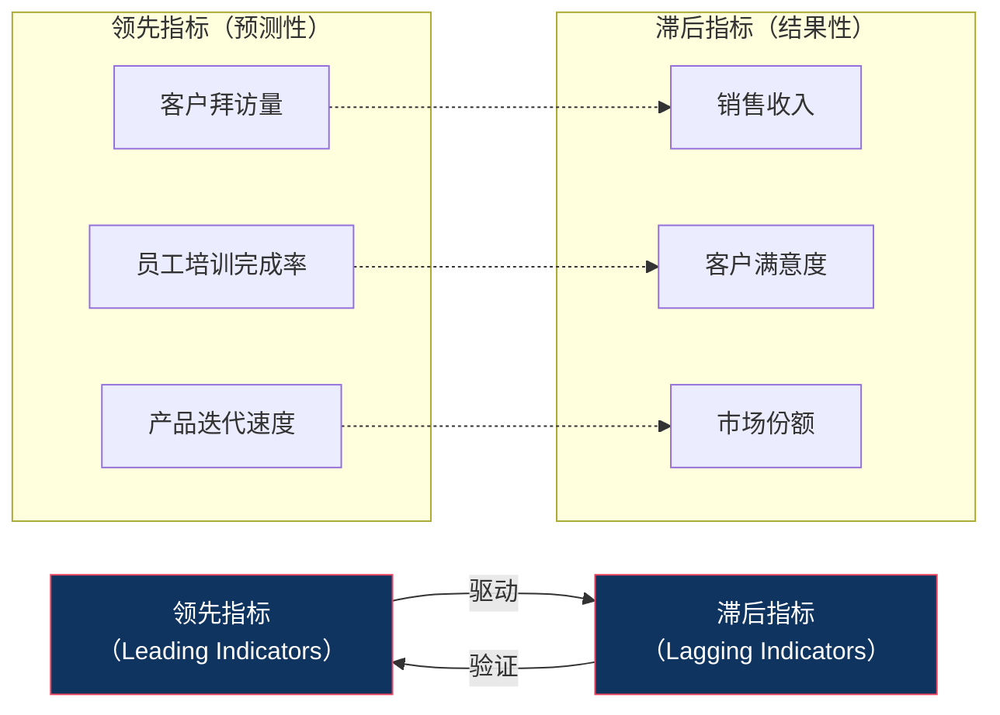
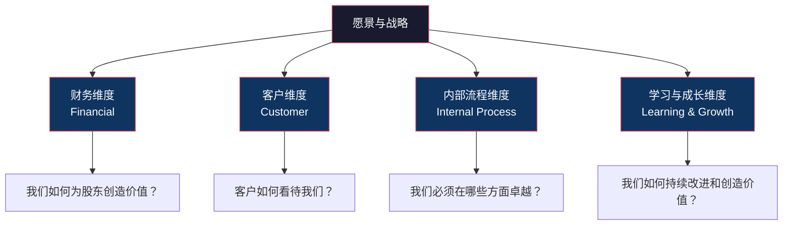
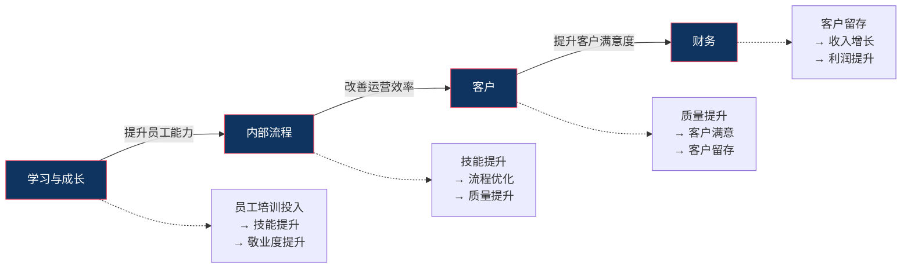
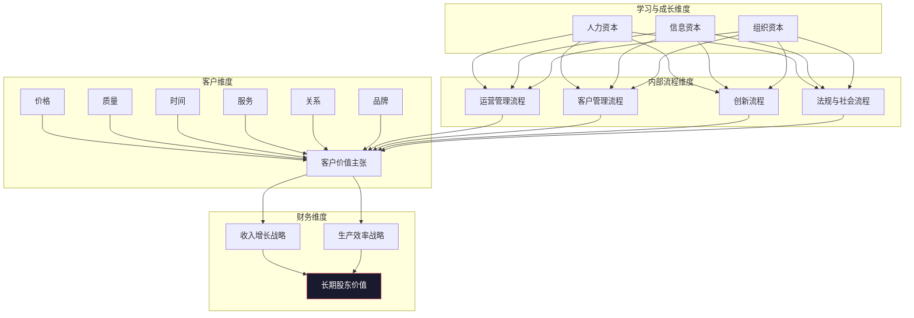

# KPI与BSC：经典工具的新用

## 核心命题

> [!IMPORTANT] 核心命题
> KPI 和 BSC 并非"过时工具"，而是被许多人用错了。问题不在于指标本身，而在于指标管理的方式。好的 KPI 体系是战略沟通的工具，坏的 KPI 体系是数字游戏。

## 一、KPI 的本质：从战略到指标

### 1.1 KPI 的定义

**KPI（Key Performance Indicator，关键绩效指标）** 是衡量组织、团队或个人在关键业务领域表现的可量化指标。

**KPI 的核心逻辑**：

- **战略目标**：组织想要达成的长期愿景
- **关键成功因素（CSF）**：实现战略目标必须做好的几件事
- **KPI**：衡量 CSF 是否做好的可量化指标
- **行动方案**：为达成 KPI 目标而采取的具体行动

### 1.2 KPI 的设计原则：SMART

KPI 必须符合 SMART 原则：

| 原则 | 含义 | 示例（好的） | 示例（坏的） |
|---|---|---|---|
| **S**pecific | 具体的 | "客户满意度评分达到 4.5" | "提升客户体验" |
| **M**easurable | 可衡量的 | "销售额达到 1000 万" | "提高销售额" |
| **A**chievable | 可实现的 | "市场份额增长 5%" | "市场份额翻三倍" |
| **R**elevant | 相关的 | "与公司战略目标一致" | "别人都在用这个指标" |
| **T**ime-bound | 有时限的 | "Q3 完成" | "尽快完成" |

### 1.3 KPI 的两种类型：领先指标 vs 滞后指标

| 对比维度 | 领先指标 | 滞后指标 |
|---|---|---|
| 时间取向 | 预测未来 | 反映过去 |
| 可干预性 | 可以当前干预 | 已经发生，无法改变 |
| 示例 | 客户拜访量、员工培训时间 | 销售收入、利润率 |
| 用途 | 日常管理和过程监控 | 结果评估和绩效考核 |

> [!TIP] 最佳实践
> 一个好的 KPI 体系应该同时包含领先指标和滞后指标。只用滞后指标，就是"只看后视镜开车"；只用领先指标，则无法确认"是否真的到达了目的地"。

### 1.4 KPI 的"关键"：不是越多越好

**KPI 的数量原则**：
- 公司级：5-8个
- 部门级：3-5个
- 个人级：3-5个

> [!WARNING] 指标通胀
> 很多组织的 KPI 体系动辄几十上百个指标，管理者以为"衡量得越多，管理得越好"。但事实上，指标越多，焦点越分散，最终一个都管不好。KPI 的"K"（Key）是"关键"的意思，不是"所有"的意思。

---

## 二、平衡计分卡（BSC）：从单维到多维

### 2.1 BSC 的诞生背景

1992年，哈佛商学院教授 **Robert Kaplan** 和咨询顾问 **David Norton** 在《哈佛商业评论》上发表《平衡计分卡——驱动绩效的指标》，提出 BSC 框架。

**BSC 要解决的问题**：传统的绩效管理只看财务指标，导致了严重的"短期主义"——管理者为了完成当期利润目标，削减研发投入、减少员工培训、透支客户关系。

### 2.2 BSC 的四维度

#### 维度一：财务（Financial）

**核心问题**：我们如何为股东创造价值？

**典型指标**：
- 收入增长率
- 利润率（毛利率、净利率）
- 投资回报率（ROI、ROE）
- 现金流
- 经济增加值（EVA）

**战略主题**：
- 增长战略（收入增长、新产品收入占比）
- 效率战略（成本降低、资产利用率提升）

#### 维度二：客户（Customer）

**核心问题**：客户如何看待我们？

**典型指标**：
- 客户满意度（CSAT）
- 净推荐值（NPS）
- 客户留存率
- 市场份额
- 客户获取成本（CAC）

**客户价值主张**：
- 产品领先（如 Apple）
- 客户亲密（如 海底捞）
- 运营卓越（如 沃尔玛）

#### 维度三：内部流程（Internal Process）

**核心问题**：我们必须在哪些方面卓越？

**典型指标**：
- 产品开发周期
- 质量缺陷率
- 订单交付准时率
- 运营效率（如人均产出）
- 创新转化率（从创意到产品的比例）

**四大流程领域**：
- 运营管理流程（效率）
- 客户管理流程（关系）
- 创新流程（新产品/服务）
- 法规与社会流程（合规/ESG）

#### 维度四：学习与成长（Learning & Growth）

**核心问题**：我们如何持续改进和创造价值？

**典型指标**：
- 员工满意度 / 敬业度
- 关键人才留存率
- 培训覆盖率与完成率
- 技能认证通过率
- 知识管理系统使用率

**三大资本**：
- 人力资本（技能、知识、经验）
- 信息资本（系统、数据库、网络）
- 组织资本（文化、领导力、团队协作）

> [!NOTE] 学习与成长维度的重要性
> 学习与成长是 BSC 四个维度中的"地基"。如果这个维度薄弱，财务、客户、内部流程的提升都是不可持续的。正如 Kaplan 所说："如果你只投资于设备和研发，而不投资于员工，你的回报将逐渐递减。"

### 2.3 BSC 的因果链

BSC 的核心洞见：四个维度之间存在**因果驱动关系**。

**实践含义**：如果你发现财务指标不佳，不要只盯着财务指标。顺着因果链往上找：是客户满意度下降了吗？是内部流程出了问题吗？还是员工能力不足？

---

## 三、战略地图：将战略可视化

### 3.1 什么是战略地图

**战略地图（Strategy Map）** 是 BSC 的可视化延伸，它将组织的战略目标按照 BSC 的四个维度排列，并用箭头展示它们之间的因果关系。

**战略地图 = BSC四维度 + 因果关系链 + 战略主题**

### 3.2 战略地图的模板

### 3.3 战略地图的绘制步骤

1. **明确战略主题**：你的战略核心是什么？（增长？效率？创新？）
2. **定义财务目标**：这个战略最终要带来什么财务结果？
3. **定义客户价值主张**：为了达成财务目标，你需要为客户创造什么价值？
4. **定义关键流程**：为了交付客户价值，你需要在哪些内部流程上卓越？
5. **定义学习与成长需求**：为了支撑关键流程，你需要什么能力、系统和文化？

---

## 四、KPI 的局限与陷阱

KPI 虽然经典，但在实践中存在几个显著局限。

### 4.1 古德哈特定律（Goodhart's Law）

> "当一个指标成为目标时，它就不再是一个好的指标。" —— 查尔斯·古德哈特

**含义**：一旦人们知道某个指标被用来考核他们，他们就会优化这个指标，而不是优化指标背后的真实目标。

**经典案例**：
- 客服中心考核"平均通话时长" → 客服为了缩短时长，敷衍客户甚至主动挂断电话
- 医院考核"手术死亡率" → 医生拒绝接收高风险患者
- 销售考核"拜访量" → 销售刷量，拜访质量急剧下降

**应对策略**：
- 使用"指标组合"而非单一指标
- 关注指标的"不可游戏化"部分
- 管理者深入一线，了解数字背后的真实情况

### 4.2 指标僵化

**问题**：KPI 一旦设定，往往整个周期都不变。但在 VUCA 环境下，外部条件和内部优先级可能已经变化。

**应对策略**：
- 建立"KPI 动态调整机制"：每季度 Review 一次 KPI 是否仍然适用
- 将 KPI 分为"必须稳定"和"可以调整"两类
- 在 OKR 中补充灵活的目标管理

### 4.3 短期主义

**问题**：KPI 的考核周期（通常为季度或年度）导致管理者关注短期结果，忽视长期投资。

**应对策略**：
- BSC 的"学习与成长"维度：强制关注长期能力建设
- 将"长期价值"指标纳入 KPI（如创新项目数量、人才梯队健康度）
- 递延激励：将部分奖金延迟到2-3年后发放

### 4.4 博弈行为

**问题**：KPI 的"目标值"往往是通过上下级博弈确定的（上级想定高，下级想定低）。

**应对策略**：
- 用"外部对标"替代"内部博弈"——参考行业标准、竞争对手水平
- 用"团队目标"替代"个人目标"——减少个体博弈的动机
- OKR 的"挑战型目标"思路：设定一个"野心值"，不完全达成也是成功

---

## 五、KPI 的"新用"：数字化时代的进化

### 5.1 从"静态 KPI"到"动态指标"

| 传统 KPI | 数字化 KPI |
|---|---|
| 年度/季度设定 | 滚动设定，按月/周调整 |
| 手工收集数据 | 自动采集、实时更新 |
| 少数人看报表 | 全员看 Dashboard |
| 事后分析 | 实时预警和预测 |
| 单一数据源 | 多源数据融合 |

### 5.2 从"结果指标"到"预测指标"

利用机器学习和数据挖掘，从历史数据中识别领先指标，建立"预测性 KPI"。

**示例**：
- 传统：销售额（滞后指标）
- 预测：基于客户互动数据的"成交概率预测"（领先指标）

### 5.3 从"人的指标"到"人机协作指标"

在 AI 时代，越来越多的任务由人和 AI 协作完成。KPI 需要从"衡量人的产出"进化为"衡量人机协作的产出"。

关于这一趋势的深入讨论，详见 [[03-HR人事/绩效管理/09_AI时代的绩效管理新范式]]。

---

## 六、KPI 与 BSC 的实施建议

### 6.1 什么时候适合用 KPI？

| 场景 | 适合度 |
|---|---|
| 业务模式成熟、可预测 | 高 |
| 工作产出可量化 | 高 |
| 需要强执行力文化 | 高 |
| 探索性业务、不确定性高 | 低 |
| 创意型工作 | 低 |
| 小团队（<20人） | 低（可能过度管理） |

### 6.2 什么时候适合用 BSC？

| 场景 | 适合度 |
|---|---|
| 组织规模较大（>200人） | 高 |
| 需要平衡短期与长期 | 高 |
| 战略需要多维度表达 | 高 |
| 需要统一战略沟通语言 | 高 |
| 创业初期、快速试错 | 低 |
| 组织文化不支持"被衡量" | 低 |

### 6.3 BSC 的常见失败原因

1. **高层不参与**：BSC 是战略工具，如果高层只是"授权"给 HR 或战略部去做，注定失败
2. **指标太多**：每个维度 5-8 个指标，总共 20-32 个指标，已经太多了
3. **缺乏因果逻辑**：四个维度的指标之间没有因果链，BSC 沦为"四份 KPI 清单"
4. **不与行动挂钩**：指标设定了，但没有配套的行动方案和资源配置
5. **与薪酬脱节**：如果 BSC 指标与薪酬、晋升无关，就没有人会真正关注

---

## 七、本章要点回顾

| 要点 | 核心内容 |
|---|---|
| KPI 的本质 | 从战略→CSF→KPI→行动，是可量化的关键绩效指标 |
| SMART 原则 | Specific、Measurable、Achievable、Relevant、Time-bound |
| 领先 vs 滞后 | 领先指标预测未来，滞后指标反映过去，二者缺一不可 |
| BSC 四维度 | 财务、客户、内部流程、学习与成长 |
| 战略地图 | 将 BSC 的四个维度用因果关系链连接起来 |
| 古德哈特定律 | 当指标成为目标时，它就不再是好的指标 |
| KPI 的"新用" | 动态化、预测化、人机协作化 |

---

## 下一步阅读

- 如果你想了解 OKR 与 KPI 的详细对比，请阅读 [[03-HR人事/绩效管理/02_OKR深度解析]]
- 如果你想了解不同工具的对比和选择逻辑，请阅读 [[03-HR人事/绩效管理/04_绩效管理工具对比与选择]]
- 如果你想了解 KPI 如何融入绩效循环，请阅读 [[03-HR人事/绩效管理/05_绩效循环：从目标设定到结果应用]]