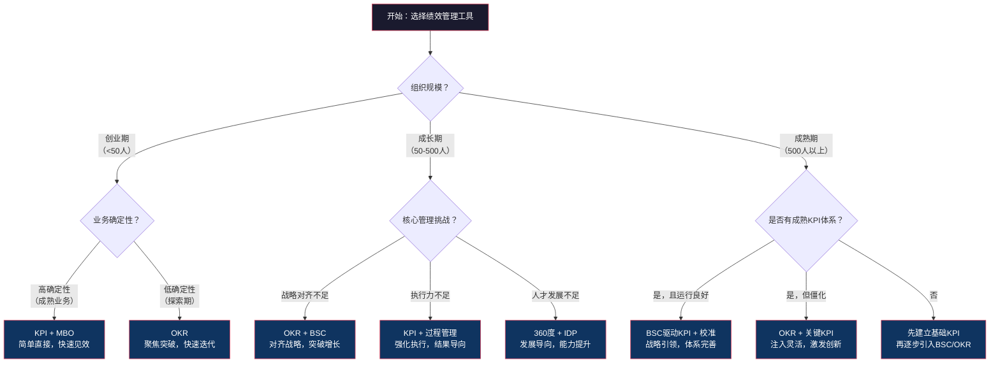

# 绩效管理工具对比与选择

## 核心命题

> [!IMPORTANT] 核心命题
> 没有最好的绩效工具，只有最适合的工具。选择绩效工具的关键不是"什么最流行"，而是"什么最适合你的组织阶段、业务模式和文化基因"。

## 一、五大绩效工具全景对比

### 1.1 工具矩阵总览

| 维度 | OKR | KPI | BSC | MBO | 360度反馈 |
|---|---|---|---|---|---|
| **诞生时间** | 1970s（Intel） | 1990s | 1992 | 1954 | 1990s |
| **核心关注** | 目标对齐与挑战 | 绩效衡量 | 战略平衡 | 目标达成 | 多源反馈 |
| **核心问题** | "我们要去哪里？" | "我们做得好不好？" | "战略是否全面？" | "目标达成了吗？" | "别人怎么看我？" |
| **适用层级** | 公司→个人 | 公司→个人 | 公司→部门 | 个人 | 个人 |
| **周期** | 季度/月度 | 月度/季度/年度 | 年度/季度 | 年度/半年 | 年度/半年 |
| **与薪酬关系** | 通常不挂钩 | 通常挂钩 | 通常挂钩 | 通常挂钩 | 通常不直接挂钩 |
| **实施难度** | 中等 | 低 | 高 | 低 | 中等 |
| **对文化要求** | 高（透明、信任） | 低 | 中高 | 低 | 中（开放、信任） |
| **数据收集成本** | 低 | 中 | 高 | 低 | 高 |

### 1.2 各工具深度解析

#### OKR（目标与关键成果）

- **核心优势**：聚焦、对齐、挑战、透明
- **核心劣势**：不适用于稳定/标准化业务，需要较强的管理能力和组织文化
- **最佳场景**：快速成长的企业、创新驱动的团队、需要战略对齐的组织
- **典型用户**：Google、字节跳动、LinkedIn
- 详见 [[03-HR人事/绩效管理/02_OKR深度解析]]

#### KPI（关键绩效指标）

- **核心优势**：简单直接、易理解、易操作
- **核心劣势**：容易导致指标博弈、短期主义、忽视非量化贡献
- **最佳场景**：业务模式成熟、产出可量化的岗位（销售、生产、客服）
- **典型用户**：几乎所有的传统企业
- 详见 [[03-HR人事/绩效管理/03_KPI与BSC：经典工具的新用]]

#### BSC（平衡计分卡）

- **核心优势**：多维度平衡、战略可视化、因果链驱动
- **核心劣势**：实施复杂、成本高、需要高层深度参与
- **最佳场景**：大型组织、需要战略转型的企业、多元化业务集团
- **典型用户**：美孚石油、中国移动、招商银行
- 详见 [[03-HR人事/绩效管理/03_KPI与BSC：经典工具的新用]]

#### MBO（目标管理）

- **核心优势**：简单、历史悠久、强调参与式管理
- **核心劣势**：过于关注"目标数字"而忽视"过程和方法"，容易被"SMART游戏"化
- **最佳场景**：知识型工作、项目制团队、管理人员
- **典型用户**：惠普（HP Way）、早期的 Intel

#### 360度反馈

- **核心优势**：多视角、全面、减少单一评估者偏见
- **核心劣势**：成本高、可能变成"人缘竞赛"、反馈质量参差不齐
- **最佳场景**：领导力发展、管理者评估、团队协作评估
- **典型用户**：GE、IBM、腾讯

---

## 二、工具选择的决策树



---

## 三、不同企业阶段的工具选择

### 3.1 创业期（0-50人）

**核心特征**：业务在探索中，组织扁平，沟通成本低，创始人直接管理。

**推荐工具**：
- **OKR**（如果业务不确定性高）：帮助团队聚焦最关键的突破点
- **KPI + MBO**（如果业务模式清晰）：简单直接，快速见效

**不推荐**：
- BSC（太重，不值得）
- 360度反馈（人太少，统计无意义）
- 强制分布（人太少，分布无意义）

**关键原则**：**简洁 > 完善**。创业期的绩效管理就是"创始人每周和团队对齐目标"。

### 3.2 成长期（50-500人）

**核心特征**：业务快速增长，组织层级开始出现，需要系统化管理。

**推荐工具**：
- **OKR**：解决"战略对齐"问题，确保快速扩张中方向不散
- **KPI**：建立基础的数据驱动管理能力
- **360度反馈**（可选）：用于管理者发展

**不推荐**：
- 全面 BSC（实施成本高，成长期重点在增长而非平衡）
- 强制分布（可能扼杀创新和协作）

**关键原则**：**对齐 > 管控**。成长期最大的风险不是"执行不力"，而是"方向跑偏"。

### 3.3 成熟期（500人以上）

**核心特征**：业务稳定，组织层级多，需要精细化管理。

**推荐工具**：
- **BSC 驱动 KPI**：建立战略引领的绩效体系
- **校准会**：确保跨部门的评价标准一致
- **OKR**（在创新部门）：保持创新活力，避免"大企业病"

**可选**：
- 360度反馈（管理者发展）
- 强制分布（需谨慎使用）

**关键原则**：**平衡 > 极致**。成熟期需要在"效率"和"创新"、"控制"和"信任"之间找到平衡。

---

## 四、混合使用：多工具组合的可能性

### 4.1 经典组合方案


### 4.2 混合使用的注意事项

> [!WARNING] 混合使用的陷阱
> 混合使用多个工具时，最大的风险是"工具过载"——员工和管理者被要求填写各种不同的表格、参加各种不同的会议，最终疲于应付，所有工具都沦为形式。

**混合使用的三个原则**：

1. **一个主导，其他辅助**：不要试图"平均用力"。选择一个主导工具（如 OKR 或 BSC），其他工具作为补充。

2. **明确边界**：每个工具覆盖什么，不覆盖什么。例如："OKR 管目标，KPI 管指标，360度管行为"。

3. **避免重复**：如果同一个指标同时出现在 OKR 和 KPI 中，那就是浪费。删除重复。

### 4.3 推荐的混合架构

**企业级绩效管理架构**：

| 层级 | 工具 | 目的 | 频率 |
|---|---|---|---|
| 战略层 | BSC / 战略地图 | 战略解码与可视化 | 年度 |
| 目标层 | OKR | 目标对齐与挑战 | 季度 |
| 指标层 | KPI | 日常运营监控 | 月度 |
| 行为层 | 360度 / 价值观评估 | 行为与能力评估 | 半年/年度 |
| 过程层 | 1on1 / CFR | 持续沟通与反馈 | 每周/每两周 |

---

## 五、工具选择的"灵魂三问"

在选择绩效工具之前，先问自己三个问题：

### 问题一：我们的业务需要"控制"还是"创新"？

```
控制型业务（如制造业、客服中心）→ KPI、BSC
创新型业务（如研发、产品设计）→ OKR
```

### 问题二：我们的管理成熟度够吗？

```
管理成熟度低（管理者缺乏教练能力）→ 先别上 OKR，从 KPI 开始
管理成熟度高（管理者善于辅导和反馈）→ 可以考虑 OKR
```

### 问题三：我们的文化支持"透明"吗？

```
文化开放透明 → OKR 的"全员可见"是加分项
文化封闭保守 → 强制透明可能引发抵触，从 KPI 逐步过渡
```

---

## 六、常见选择错误

### 错误一：跟风选择

"Google 用 OKR 很成功，所以我们也应该用 OKR。"

**纠正**：Google 用 OKR 成功，不是因为 OKR 本身，而是因为 Google 的文化（透明、信任、工程师文化）与 OKR 高度匹配。盲目跟风而不考虑自身条件，失败概率极高。

### 错误二：贪多求全

"OKR 很好，KPI 也需要，BSC 也很全面，360度也很有价值，我们全都要。"

**纠正**：工具越多，管理越复杂，员工越疲惫。从1-2个工具开始，用好了再加。

### 错误三：工具不变

"我们五年前引入了 KPI 体系，一直用到现在。"

**纠正**：绩效工具应该随着组织阶段的变化而演进。创业期用 OKR，成长期加入 KPI，成熟期引入 BSC，创新部门回归 OKR。

### 错误四：工具替代管理

"我们引入了 OKR 系统，绩效管理应该就没问题了。"

**纠正**：工具只是载体，管理才是本质。一个糟糕的管理者，用再好的工具也做不好绩效管理。一个优秀的管理者，甚至可以用 Excel 做好绩效管理。

---

## 七、本章要点回顾

| 要点 | 核心内容 |
|---|---|
| 五大工具 | OKR、KPI、BSC、MBO、360度，各有适用场景 |
| 选择逻辑 | 组织规模 × 业务确定性 × 管理挑战 → 推荐工具 |
| 创业期 | 简洁 > 完善，OKR 或 KPI+MBO |
| 成长期 | 对齐 > 管控，OKR 或 OKR+KPI |
| 成熟期 | 平衡 > 极致，BSC+KPI 或 OKR+KPI |
| 混合使用 | 一个主导，其他辅助，明确边界，避免重复 |
| 灵魂三问 | 控制 vs 创新？管理成熟度？文化开放性？ |

---

## 八、工具选择的"适配性"扩展讨论

### 8.1 行业特性对工具选择的影响

不同行业的绩效管理需求差异很大，工具选择需要考虑行业特性。

| 行业 | 推荐工具 | 原因 |
|---|---|---|
| **互联网/科技** | OKR | 快速变化、创新驱动、需要灵活对齐 |
| **制造业** | KPI + BSC | 流程标准化、产出可量化、需要平衡效率与质量 |
| **金融/银行** | BSC + KPI | 合规要求高、风险管控重要、需要多维平衡 |
| **咨询/专业服务** | MBO + 360度 | 项目制、知识工作者、个人能力与团队协作并重 |
| **零售/服务业** | KPI | 标准化运营、产出可量化、快速反馈 |
| **医药/研发** | OKR + KPI | 长周期研发 + 短期运营指标并重 |

### 8.2 跨国企业 vs 本土企业的工具选择

| 维度 | 跨国企业 | 本土企业 |
|---|---|---|
| 统一性要求 | 高：全球统一框架 | 低：可根据业务单元定制 |
| 文化适配 | 需要兼顾不同地区的文化差异 | 文化一致性高，工具适配更容易 |
| 工具复杂度 | 适中：太复杂难以全球推广 | 灵活：可以根据发展阶段调整 |
| 典型实践 | 微软全球统一"Connects"框架 | 阿里361、华为A/B/C/D各有特色 |

### 8.3 工具选择的"迭代路径"

工具选择不是一次性的决策，而是一个持续迭代的过程。

**推荐的迭代路径**：

```
创业期：MBO（最简单）→ 验证"目标管理"的基本能力
  ↓
成长期：加入 KPI（需要数据驱动）→ 建立"用数据说话"的习惯
  ↓
扩张期：引入 OKR（需要战略对齐）→ 解决"方向一致"的问题
  ↓
成熟期：引入 BSC（需要多维平衡）→ 解决"短期与长期平衡"的问题
  ↓
持续进化：混合使用 + 校准会 → 形成适合自己组织的独特体系
```

> [!TIP] 迭代而非革命
> 绩效工具的切换不需要"推倒重来"。可以在现有工具的基础上，逐步引入新的元素。例如在 KPI 体系中引入 OKR 的理念（设定挑战性目标），在 OKR 体系中引入 KPI 的监控（关键健康指标）。

---

## 下一步阅读

- 如果你想了解工具选定后如何落地，请阅读 [[03-HR人事/绩效管理/05_绩效循环：从目标设定到结果应用]]
- 如果你想了解 OKR 的详细写法，请阅读 [[03-HR人事/绩效管理/02_OKR深度解析]]
- 如果你想了解 KPI 和 BSC 的设计方法，请阅读 [[03-HR人事/绩效管理/03_KPI与BSC：经典工具的新用]]