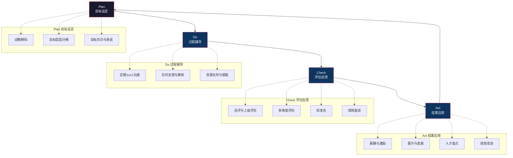
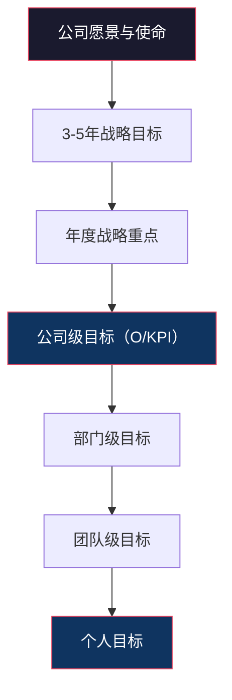
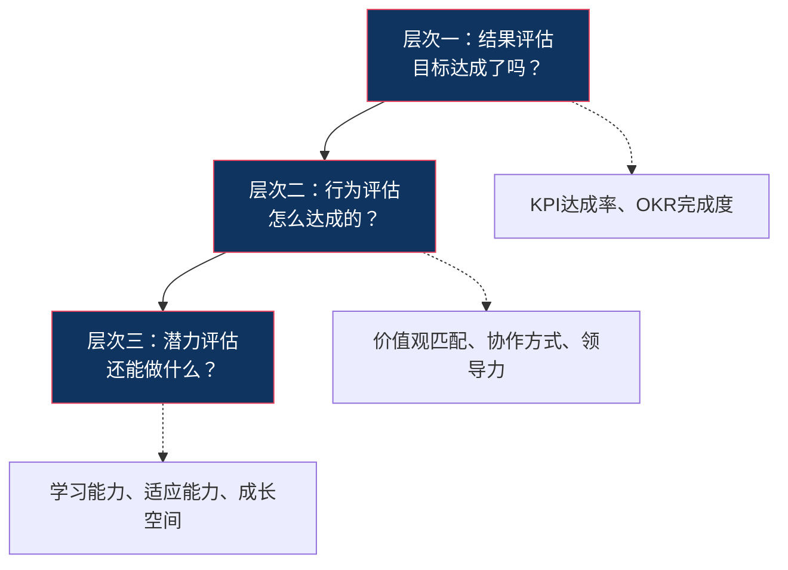
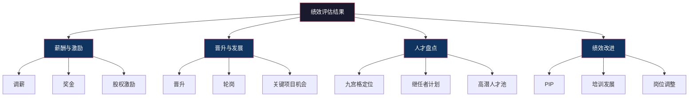
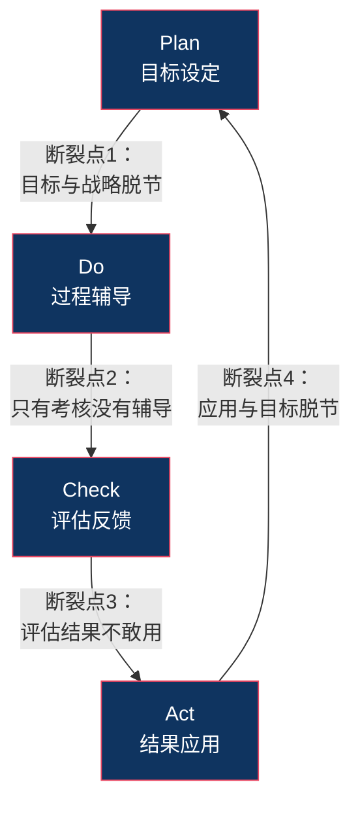

# 绩效循环：从目标设定到结果应用

## 核心命题

> [!IMPORTANT] 核心命题
> 绩效管理是一个闭环，任何一个环节的缺失都会导致整体失效。目标设定再完美，没有过程辅导就只是"空中楼阁"；评估再客观，没有结果应用就无法驱动行为改变。

## 一、绩效管理的 PDCA 循环



> [!NOTE] PDCA 循环的本质
> PDCA 不是"四个独立步骤"，而是"一个持续旋转的飞轮"。Plan 的质量决定 Do 的方向，Do 的质量决定 Check 的素材，Check 的质量决定 Act 的精准度，Act 的质量又反过来影响下一个周期的 Plan。

---

## 二、Plan（目标设定）：战略解码与目标分解

### 2.1 战略解码：从"公司战略"到"个人目标"

**战略解码**是将公司战略翻译为可执行的目标体系的过程。



**战略解码的四个步骤**：

1. **明确战略重点**：今年最重要的3-5件事是什么？
2. **定义成功标准**：到年底，我们怎么知道成功了？
3. **层层分解**：每个部门/团队需要做到什么，才能支撑公司目标的达成？
4. **双向对齐**：自下而上确认"我能贡献什么？" + 自上而下确认"我需要你贡献什么？"

### 2.2 目标层层分解的原则

**原则一：纵向对齐，横向协同**

```
纵向对齐：个人目标 → 团队目标 → 部门目标 → 公司目标
横向协同：A团队的目标如何支持B团队的目标？
```

**原则二：不要"平均分配"**

并不是每个部门都要承担公司级目标的同比例分解。销售部门承担"收入增长"目标的大头，研发部门承担"产品创新"目标的大头。

**原则三：目标数量要克制**

- 公司级：3-5个目标
- 部门级：3-5个目标
- 个人级：3-5个目标

### 2.3 目标设定的常见陷阱

| 陷阱 | 表现 | 对策 |
|---|---|---|
| **目标过多** | 列了10个目标，每个都不重要 | 强制排序，只保留前3-5个 |
| **目标模糊** | "提升客户满意度" | 明确"从X提升到Y" |
| **目标平均主义** | 每个部门承担等比例目标 | 根据战略重点差异化分配 |
| **目标无挑战** | 目标设定在"闭着眼睛都能完成"的水平 | 设定挑战型目标，允许60-70%达成 |
| **目标与战略脱节** | 部门目标完成了，但公司战略没进展 | 每年做一次"战略回溯"：目标→战略 |

---

## 三、Do（过程辅导）：从"秋后算账"到"日常赋能"

### 3.1 过程辅导为什么重要？

绩效管理的最大误区之一是把"过程辅导"等同于"不管不问，年底看结果"。但实际上：

- 目标设定时，未来是未知的。过程中一定会出现变化
- 员工遇到困难时，如果得不到及时帮助，就会"放弃"或"走偏"
- 如果没有过程辅导，年底的评估反馈就是"秋后算账"——员工会说"你为什么不早说？"

### 3.2 过程辅导的四种形式

| 形式 | 频率 | 目的 | 关键动作 |
|---|---|---|---|
| **定期1on1** | 每周/每两周 | 了解进展、提供支持、教练辅导 | 开放式提问、倾听、提供资源 |
| **实时反馈** | 随时 | 纠正偏差、强化正向行为 | 具体、及时、建设性 |
| **团队复盘** | 月度/季度 | 团队对齐、经验分享、问题预警 | 数据驱动、聚焦改进 |
| **正式中期Review** | 季度/半年 | 正式回顾目标进展、调整目标 | 客观评估、必要时调整目标 |

### 3.3 1on1 的结构化方法

**GROW 模型**（适用于教练式辅导）：

| 步骤 | 含义 | 示例问题 |
|---|---|---|
| **G**oal | 明确目标 | "这个月你最想达成的目标是什么？" |
| **R**eality | 现状分析 | "目前进展如何？遇到了什么困难？" |
| **O**ptions | 探索方案 | "你觉得有哪些可能的解决方案？" |
| **W**ill | 行动承诺 | "你接下来打算怎么做？需要我什么支持？" |

> [!TIP] 1on1 的黄金法则
> 1on1 是"员工的时间"，不是"管理者的时间"。让员工说70%，管理者说30%。管理者的角色是"提问者"和"支持者"，而不是"指令者"。

### 3.4 过程辅导的常见陷阱

| 陷阱 | 表现 | 对策 |
|---|---|---|
| **只问结果，不问过程** | "你那个目标完成了吗？" | 先问"你遇到了什么困难？" |
| **变成了"汇报会"** | 员工汇报工作，管理者点评 | 用开放性问题引导员工思考 |
| **频率太低** | 季度才做一次1on1 | 至少每两周一次，每次30分钟 |
| **没有跟进** | 聊完就没有下文了 | 每次1on1都要有"行动项"和"下次跟进" |

---

## 四、Check（评估反馈）：从"打分"到"对话"

### 4.1 评估反馈的三个层次



### 4.2 评估的多维度设计

**典型的评估维度**：

| 维度 | 权重 | 数据来源 | 评估者 |
|---|---|---|---|
| 业绩目标达成 | 50-70% | KPI数据、OKR完成度 | 上级 |
| 价值观/行为 | 20-30% | 观察、360度反馈 | 上级+同事 |
| 能力成长 | 10-20% | 技能评估、项目表现 | 上级+自评 |

> [!TIP] 权重设计原则
> 越是结果容易量化的岗位（如销售），业绩权重越高（70%+）；越是结果难以量化的岗位（如研发），行为和能力权重可以适当提高。

### 4.3 自评：一个被低估的环节

**自评的价值**：
- 让员工"主动反思"而非"被动接受"
- 暴露认知差距（员工自评 vs 上级评价）
- 为绩效面谈提供对话素材

**自评的引导问题**：
1. "这个周期，你最有成就感的一件事是什么？"
2. "如果重来一次，你会做什么不同？"
3. "你觉得自己在哪方面成长最大？"
4. "下一阶段你最想提升什么？"

### 4.4 校准会

详见 [[03-HR人事/绩效管理/08_强制分布与校准：公平还是制造焦虑？]]

### 4.5 绩效面谈

绩效面谈是 Check 阶段最重要的环节，详见 [[03-HR人事/绩效管理/06_绩效面谈：最难也最重要的一环]]。

---

## 五、Act（结果应用）：从"分数"到"行动"

### 5.1 结果应用的四条路径



### 5.2 薪酬联动：核心原则

**原则一：绩效结果必须差异化**

如果所有人的绩效评分都差不多，那薪酬联动就没有意义。这要求评估体系能够有效区分绩效差异。

**原则二：高绩效者必须获得显著更高的回报**

如果一个"卓越"绩效者的奖金只比"合格"绩效者多10%，那么没有人会为了"卓越"而努力。业界通常的做法是：卓越绩效者的奖金是合格绩效者的1.5-3倍。

**原则三：短期激励 + 长期激励**

- 短期激励（年度奖金）：与年度绩效挂钩
- 长期激励（股权/期权/递延奖金）：与持续高绩效挂钩

**原则四：公平感 > 绝对值**

薪酬分配的公平感比金额本身更重要。详见 [[03-HR人事/绩效管理/01_绩效管理的本质与演进]] 中关于公平三个维度的讨论。

### 5.3 与人才发展的联动

| 绩效等级 | 人才发展策略 |
|---|---|
| 卓越（Top 10-20%） | 加速发展：晋升、关键项目、高管导师 |
| 优秀（Next 20-30%） | 稳定发展：挑战性任务、专业深度培养 |
| 合格（Middle 40-50%） | 提升发展：针对性培训、短板改进 |
| 待改进（Bottom 10-20%） | PIP或岗位调整 |

与 [[03-HR人事/培训与人才发展/培训与人才发展_知识库建设方案]] 的关联：绩效评估结果是人才盘点九宫格的核心输入，驱动 IDP 的设计方向。详见 [[03-HR人事/培训与人才发展/04-人才发展/12_人才盘点九宫格]] 和 [[03-HR人事/培训与人才发展/04-人才发展/14_IDP个人发展计划]]。

### 5.4 绩效改进

对于低绩效员工，需要启动绩效改进计划（PIP）。详见 [[03-HR人事/绩效管理/07_绩效改进计划（PIP）与低绩效管理]]。

---

## 六、绩效循环的常见断裂点



| 断裂点 | 表现 | 对策 |
|---|---|---|
| 断裂点1 | 目标与战略脱节——团队目标完成了，但公司战略没进展 | 每年做一次战略回溯，确保目标的"战略贡献度" |
| 断裂点2 | 只有考核没有辅导——年底才知道做得不好 | 建立强制性的过程辅导机制（如每两周1on1） |
| 断裂点3 | 评估结果不敢用——管理者当"老好人"，人人都是"良好" | 校准会 + 管理者绩效管理能力培训 |
| 断裂点4 | 应用与目标脱节——奖金发了，但没人知道为什么 | 奖金沟通 + 绩效面谈中明确"为什么" |

---

## 七、本章要点回顾

| 要点 | 核心内容 |
|---|---|
| PDCA 循环 | Plan（目标设定）→ Do（过程辅导）→ Check（评估反馈）→ Act（结果应用） |
| 战略解码 | 将公司战略翻译为可执行的目标体系，层层分解 |
| 过程辅导 | 1on1、实时反馈、团队复盘、中期Review |
| GROW 模型 | Goal → Reality → Options → Will |
| 评估三维度 | 结果评估（目标达成）→ 行为评估（怎么达成）→ 潜力评估（还能做什么） |
| 结果应用 | 薪酬激励、晋升发展、人才盘点、绩效改进 |
| 四个断裂点 | 目标与战略脱节、有考核无辅导、结果不敢用、应用与目标脱节 |

---

## 下一步阅读

- 如果你想深入了解绩效面谈的技巧，请阅读 [[03-HR人事/绩效管理/06_绩效面谈：最难也最重要的一环]]
- 如果你想了解 PIP 的设计方法，请阅读 [[03-HR人事/绩效管理/07_绩效改进计划（PIP）与低绩效管理]]
- 如果你想了解校准会与强制分布，请阅读 [[03-HR人事/绩效管理/08_强制分布与校准：公平还是制造焦虑？]]