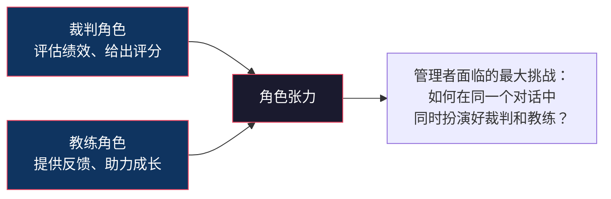
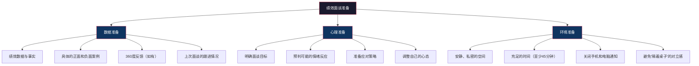
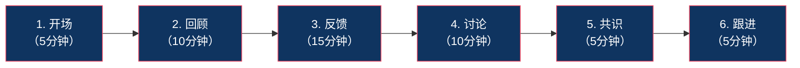
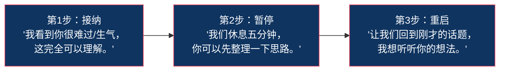

# 绩效面谈：最难也最重要的一环

## 核心命题

> [!IMPORTANT] 核心命题
> 绩效面谈是绩效管理中最容易被忽视、但最能产生价值的环节。一场好的绩效面谈，能让员工从"被动接受评分"转变为"主动追求成长"。一场糟糕的绩效面谈，能让之前所有的绩效管理工作功亏一篑。

## 一、为什么绩效面谈如此重要，又如此困难？

### 1.1 绩效面谈的双重角色



### 1.2 为什么管理者害怕绩效面谈？

| 原因 | 具体表现 |
|---|---|
| **害怕冲突** | "我不知道怎么告诉他，他的表现不好。" |
| **缺乏数据** | "我感觉他做得不好，但拿不出具体证据。" |
| **缺乏技巧** | "我不知道怎么给出建设性反馈。" |
| **害怕情绪** | "他可能会哭，可能会生气，我应付不来。" |
| **"老好人"心态** | "我不想破坏团队氛围，要不就给他一个'良好'吧。" |

### 1.3 为什么员工害怕绩效面谈？

| 原因 | 具体表现 |
|---|---|
| **不确定性焦虑** | "他会给我什么评分？对我有什么影响？" |
| **防御心理** | "他肯定会挑我的毛病，我得准备好解释。" |
| **不公平感** | "我做了那么多，他肯定看不到。" |
| **对未来的恐惧** | "如果评分不好，会不会影响我的晋升/奖金？" |

> [!TIP] 关键洞察
> 管理者和员工都害怕绩效面谈，根本原因是双方都将它视为"评判"而非"对话"。改变这一认知，是做好绩效面谈的第一步。

---

## 二、绩效面谈的准备

### 2.1 三个维度的准备



### 2.2 数据准备清单

**必须准备的"硬数据"**：
- 本周期目标及达成情况
- KPI/OKR 完成数据
- 关键项目/任务的成果
- 上次面谈确定的改进项及进展

**必须准备的"软数据"**：
- 至少 2-3 个具体的正面行为案例（附时间、情境）
- 至少 1-2 个具体的待改进行为案例（附时间、情境）
- 来自同事/客户的反馈（如有）

### 2.3 心理准备：管理者的心态调整

> [!IMPORTANT] 面谈前的心态自检
> 1. 我的目标是"帮助他成长"，还是"让他接受我的评价"？
> 2. 我是否准备好了聆听，而不只是"说"？
> 3. 我是否对"他可能不同意"做好了心理准备？
> 4. 我是否把这次面谈视为"对话"而非"宣判"？

---

## 三、结构化面谈流程

### 3.1 六步法



#### 第一步：开场（5分钟）

**目的**：建立安全、开放的对话氛围。

**原则**：
- 说明面谈的目的和流程
- 强调"这是一个对话，不是宣判"
- 表达对员工的尊重和重视

**示例话术**：
> "今天我们花45分钟，聊聊过去一个季度的工作。这不是我给你打分，而是我们一起回顾、一起讨论如何更好地前进。你先说说你的感受，然后我再分享我的观察，我们最后一起达成共识。"

#### 第二步：回顾（10分钟）

**目的**：让员工先回顾，激发主动反思。

**引导问题**：
1. "过去一个季度，你最满意/最有成就感的是什么？"
2. "有什么你觉得可以做得更好？"
3. "你遇到了什么困难？你是怎么应对的？"
4. "你觉得自己在哪方面成长最大？"

> [!TIP] 让员工先说的价值
> 让员工先回顾有三个好处：（1）了解员工的自我认知；（2）发现认知差距（他觉得自己做得很好，但你觉得不够）；（3）让员工感受到"被尊重"，而非"被审判"。

#### 第三步：反馈（15分钟）

**目的**：基于事实，给出建设性反馈。

**核心方法：SBI 模型**（详见下文第四节）

**反馈结构**：
- 先肯定：至少 2-3 个具体的正面反馈
- 再建设：1-2 个具体的改进建议
- 用 SBI 模型：每个反馈都基于情境、行为和影响

#### 第四步：讨论（10分钟）

**目的**：围绕反馈展开讨论，听取员工的回应。

**引导问题**：
1. "对于我刚才说的，你有什么想法？"
2. "你觉得哪些地方我理解得不够准确？"
3. "你有什么想补充的？"

**处理不同反应**：
- 如果员工同意：直接进入共识阶段
- 如果员工不同意：倾听、追问、澄清，但不争论
- 如果员工情绪化：暂停反馈，先处理情绪（详见第五节）

#### 第五步：共识（5分钟）

**目的**：就评估结果和下一步行动达成共识。

**关键产出**：
1. 对本周期绩效的共识（评分或等级）
2. 下一周期的重点目标
3. 个人发展重点（1-2个关键改进方向）
4. 需要的支持和资源

#### 第六步：跟进（5分钟）

**目的**：明确后续行动和跟进机制。

**关键产出**：
1. 下一次1on1的时间
2. 面谈记录（双方签字确认）
3. 行动项的责任人和截止日期

---

## 四、SBI 反馈模型

### 4.1 SBI 模型的定义

**SBI** 是给予建设性反馈最有效的结构化模型：

| 要素 | 含义 | 示例 |
|---|---|---|
| **S**ituation<br/>（情境） | 反馈发生的具体时间和场景 | "上周二的客户会议上..." |
| **B**ehavior<br/>（行为） | 你观察到的具体行为（而非对性格的判断） | "当客户提出质疑时，你立即给出了三个数据支撑..." |
| **I**mpact<br/>（影响） | 该行为带来的影响（正面或负面） | "这让客户对我们的专业度有了很高的认可，当场就签了合同。" |

### 4.2 SBI 示例

**正面反馈示例**：

```
S: "在上个月的Q3复盘会上，当你展示了竞品分析报告时..."
B: "你不仅分析了竞品的功能，还深入分析了他们的定价策略和目标客户群..."
I: "这让整个团队对市场格局有了更清晰的认识，也帮助我们调整了Q4的产品策略。这个分析质量非常高，继续保持！"
```

**建设性反馈示例**：

```
S: "在上周三的跨部门协调会上，当技术团队提出延期风险时..."
B: "你直接说'这个不行，必须按时交付'，没有询问具体原因和可能的解决方案..."
I: "这让技术团队感到没有被尊重，后续的沟通也出现了对抗情绪。下次遇到这种情况，建议先问'能告诉我具体遇到了什么困难吗？我们一起看看有没有替代方案。'"
```

### 4.3 SBI vs 常见错误反馈

| 错误反馈 | 为什么不好 | SBI 改进 |
|---|---|---|
| "你最近表现不错" | 太模糊，员工不知道什么被认可 | "在上周的项目交付中，你主动加班到周五晚上确保所有测试通过...这让我和客户都非常放心。" |
| "你沟通有问题" | 对人格的判断，而非对行为的描述 | "在周二的会议上，你打断了小李三次...这让他感觉自己的意见不被重视。" |
| "你需要更努力" | 没有具体行为，无法执行 | "我看到你最近三周的周报都在周五晚上才提交。建议你在周三前完成初稿，这样我们还有时间讨论和修改。" |

> [!WARNING] 避免"三明治法"的陷阱
> "三明治法"（先夸→再批→再夸）是流传最广但也最糟糕的反馈方法。员工会学会"等待但是"——所有正面反馈都被视为负面反馈的铺垫。更好的做法是：将正面反馈和建设性反馈分开，分别在面谈的不同阶段进行。

---

## 五、如何处理情绪化反应

### 5.1 常见的情绪反应及应对

| 情绪反应 | 表现 | 应对策略 |
|---|---|---|
| **否认** | "这不是我的问题，是XXX的原因。" | 回到具体事实，用 SBI 数据说话。不争辩，只讨论"我们观察到的现象"。 |
| **愤怒** | "你这样评价我不公平！" | 深呼吸，保持冷静。说"我理解你的感受，让我听听你的想法。" 先倾听，再回应。 |
| **哭泣** | 情绪崩溃，无法继续对话 | 暂停面谈，递纸巾，给时间。说"我们休息五分钟，等你准备好了再继续。" |
| **沉默** | 一言不发，拒绝沟通 | 用开放式问题引导："我注意到你好像不太愿意说话，能告诉我你在想什么吗？" |
| **过度防御** | 对每个反馈都给出长篇解释 | 说"我理解你有你的视角，但我想先确保我表达清楚了。然后我们再讨论你的想法。" |

### 5.2 情绪处理的"三步法"



**核心原则**：
- 不要否定情绪（"别哭了，这没什么大不了的"）
- 不要在有情绪时继续推进
- 不要试图"赢"——面谈不是辩论赛

---

## 六、如何引导员工制定改进计划

### 6.1 从"告诉"到"提问"

帮助员工制定改进计划的最好方式不是"告诉他要做什么"，而是"引导他自己想出来"。

**引导式提问**：

1. "你觉得在这个方面，你最想提升的是什么？"
2. "如果三个月后你在这方面有了明显进步，那会是什么样子？"
3. "你觉得第一步可以做什么？"
4. "你希望我怎么支持你？"
5. "如果遇到困难，你打算怎么应对？"

### 6.2 改进计划的 SMART 原则

改进计划也需要符合 SMART 原则：

| 原则 | 示例 |
|---|---|
| **S**pecific | "提升跨部门沟通能力" → "在跨部门项目中，主动组织两次对齐会议" |
| **M**easurable | "做得好一些" → "跨部门协作满意度评分从3.0提升到4.0" |
| **A**chievable | 在现有能力和资源下可实现 |
| **R**elevant | 与岗位要求和职业发展相关 |
| **T**ime-bound | "尽快" → "在下一个季度结束前" |

---

## 七、绩效面谈的常见错误

| 错误 | 表现 | 对策 |
|---|---|---|
| **近因效应** | 只记得最近一个月的表现，忽略整个周期 | 面谈前回顾整个周期的绩效笔记 |
| **光环效应** | 因为一个突出表现，给所有维度高分 | 每个维度独立评估，用具体事实支撑 |
| **对比效应** | 因为团队其他人表现都很好，把"好"评成"一般" | 以标准为参照，而非以同事为参照 |
| **"老好人"** | 不敢给低分，人人都是"良好" | 记住：不给真实反馈，是对员工最大的不尊重 |
| **只有批评没有建设** | 说了一堆问题，但没有给出改进建议 | 每个批评后面必须跟一个"下一步建议" |
| **说得太多，听得太少** | 管理者说了80%的时间 | 管理者说30%，员工说70% |

---

## 八、本章要点回顾

| 要点 | 核心内容 |
|---|---|
| 重要性 | 绩效面谈是绩效管理中最能产生价值的环节 |
| 六步法 | 开场 → 回顾 → 反馈 → 讨论 → 共识 → 跟进 |
| SBI 模型 | Situation（情境）→ Behavior（行为）→ Impact（影响） |
| 正面反馈 | 具体、及时、指向行为而非人格 |
| 建设性反馈 | 不回避、不攻击、有建议 |
| 情绪处理 | 接纳 → 暂停 → 重启 |
| 改进计划 | 引导而非告诉，SMART 原则 |

---

## 下一步阅读

- 如果你想了解 PIP 的设计方法，请阅读 [[03-HR人事/绩效管理/07_绩效改进计划（PIP）与低绩效管理]]
- 如果你想了解绩效面谈在绩效循环中的位置，请阅读 [[03-HR人事/绩效管理/05_绩效循环：从目标设定到结果应用]]
- 如果你想了解校准会如何影响面谈，请阅读 [[03-HR人事/绩效管理/08_强制分布与校准：公平还是制造焦虑？]]