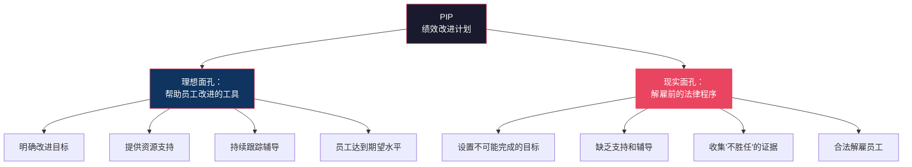
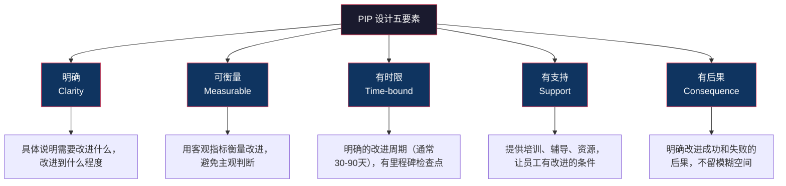
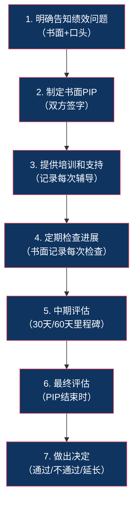
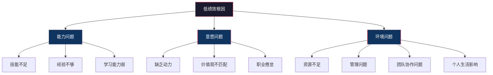
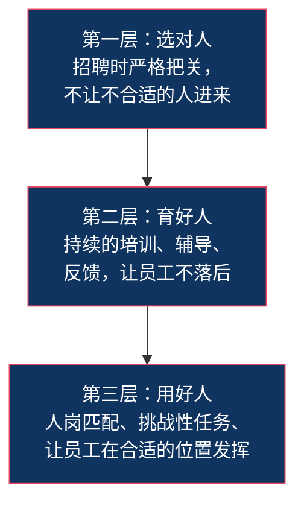

# 绩效改进计划（PIP）与低绩效管理

## 核心命题

> [!IMPORTANT] 核心命题
> PIP（Performance Improvement Plan）的目标是"改进"而非"劝退"，但现实中往往沦为解雇的前奏。做好 PIP 的关键在于：正确的设计、正当的程序、以及真正帮助员工改进的诚意。

## 一、PIP 的本质：改进还是劝退？

### 1.1 PIP 的两种面孔

> [!WARNING] 诚实面对
> 如果你启动 PIP 的真正目的是"劝退"，请诚实地面对这一点。伪装成"帮助改进"的 PIP 比直接解雇更伤害员工的信任和尊严。如果你真的想帮员工改进，那就用行动证明——提供真实的资源、时间和辅导。

### 1.2 PIP 的适用场景

PIP 适用于以下情况：

- 员工绩效持续低于岗位要求，但**不是**因为态度恶劣或价值观不符
- 员工有**改进意愿**和**改进潜力**
- 低绩效的根因是**能力不足**或**方法不当**，而非**意愿问题**
- 管理者愿意投入时间和精力去辅导

**PIP 不适用于**：
- 诚信问题、违反公司底线
- 员工明确表示"不想干了"
- 团队已经投入了大量辅导但始终无效
- 绩效差距太大，在合理时间内不可能弥补

---

## 二、PIP 的设计原则

### 2.1 PIP 的五个核心要素

### 2.2 PIP 模板

**PIP 文档应包含以下内容**：

| 部分 | 内容 | 示例 |
|---|---|---|
| **基本信息** | 员工姓名、岗位、管理者、PIP 起止日期 | 2026年8月1日 - 2026年10月31日（90天） |
| **绩效问题描述** | 具体说明哪些方面表现不达标 | "过去两个季度，客户问题解决率分别为65%和62%，低于岗位要求的80%" |
| **改进目标** | 明确、可衡量的改进目标 | "在PIP结束时，客户问题解决率达到80%以上" |
| **里程碑检查点** | 30天、60天、90天的检查点 | "第30天：解决率达到70%；第60天：解决率达到75%；第90天：解决率达到80%" |
| **支持措施** | 公司将提供什么支持 | "每周与主管进行1小时辅导；参加客户沟通技巧培训；安排高绩效同事影子学习" |
| **后果说明** | 改进成功和失败的后果 | "PIP成功：恢复正常工作状态；PIP失败：启动不胜任解除程序或岗位调整" |
| **双方签字** | 员工和管理者签字确认 | "我理解并接受本PIP的内容" |

### 2.3 PIP 的"好"与"坏"对比

| 维度 | 好的 PIP | 坏的 PIP |
|---|---|---|
| 目标 | 聚焦1-2个关键的、可改进的领域 | 列了一堆问题，什么都想改 |
| 指标 | 可客观衡量的结果指标 | 模糊的主观判断（"表现更好"） |
| 时限 | 合理（30-90天），有里程碑 | 不可能完成的时间（7天） |
| 支持 | 明确的培训、辅导、资源 | "你自己想办法" |
| 沟通 | 定期检查，双向沟通 | 只记录"证据"，单向要求 |
| 态度 | "我们相信你可以改进" | "你不行就走人" |

---

## 三、PIP 的正当程序：避免法律风险

### 3.1 中国劳动法下的 PIP

> [!WARNING] 法律风险警示
> 在中国劳动法框架下，PIP 如果被认定为"变相解雇"的前置程序，可能在劳动仲裁中处于不利地位。《劳动合同法》第四十条规定，劳动者不能胜任工作，经过培训或者调整工作岗位，仍不能胜任工作的，用人单位可以解除劳动合同，但需支付经济补偿。

**关键法律要求**：
1. 必须证明员工"不胜任工作"（需要客观证据）
2. 必须进行"培训或调整工作岗位"（PIP 可以视为培训的一种形式）
3. 必须证明"仍不能胜任"（PIP 期间和结束后的评估）
4. 解除合同需要支付经济补偿

### 3.2 PIP 的正当程序七步法

**每一步的文档要求**：
- 所有沟通都要有书面记录
- 所有辅导都要有签字确认
- 所有检查结果都要有双方确认
- 所有决定都要有事实依据

> [!TIP] 文档是最好的保护
> 在劳动仲裁中，口头承诺和口头沟通都没有法律效力。每一份签字的文档、每一次辅导的记录、每一个里程碑的确认，都是你保护公司和员工双方权益的武器。

---

## 四、低绩效员工的根因分析与分类管理

### 4.1 低绩效的三维根因分析

### 4.2 根因 vs 管理策略

| 根因 | 策略 | 具体措施 |
|---|---|---|
| **能力不足** | 培训 + 辅导 | PIP、技能培训、影子学习、导师制 |
| **意愿不足** | 激励 + 后果 | 明确期望、设定后果、寻找内在动机 |
| **环境问题** | 调整环境 | 更换岗位、调整团队、改善管理方式 |
| **能力+意愿都低** | 快速决策 | 短期 PIP（30天），不通过则快速解雇 |
| **能力+意愿+环境** | 系统性解决 | 可能不是员工的问题，而是组织的问题 |

### 4.3 与 [[03-HR人事/培训与人才发展/培训与人才发展_知识库建设方案]] 的关联

低绩效管理的核心产出之一，就是识别培训需求。绩效差距直接驱动培训需求分析（TNA）。

- 如果多个员工在同一个领域出现绩效差距 → 可能是系统性的培训需求
- 能力不足 → 与 [[03-HR人事/培训与人才发展/04-人才发展/14_IDP个人发展计划]] 关联
- 详见 [[03-HR人事/培训与人才发展/03-培训体系/08_培训需求分析TNA]]

---

## 五、末位淘汰的争议与替代方案

### 5.1 末位淘汰的争议

末位淘汰（Rank and Yank）是指强制淘汰一定比例（通常为后5-10%）的员工。

**支持者的论点**：
- 保持组织的"人才密度"
- 避免"劣币驱逐良币"
- 为优秀人才腾出空间

**反对者的论点**：
- 破坏团队协作和信任
- 制造焦虑文化，扼杀创新
- 在优秀团队中淘汰"相对差但绝对好"的人
- 统计假设失效（小团队中正态分布不成立）

### 5.2 替代方案

| 替代方案 | 方式 | 适用场景 |
|---|---|---|
| **基于标准的淘汰** | 设定明确的绩效标准，达不到就淘汰，而非强制比例 | 任何规模的组织 |
| **滚动式低绩效管理** | 不年度集中淘汰，而是持续管理低绩效 | 追求持续改进的文化 |
| **岗位调整** | 不适合当前岗位的人，先尝试换岗 | 能力不匹配但态度好的员工 |
| **PIP 先行** | 先给改进机会，改进失败再淘汰 | 法律风险意识强的组织 |
| **自愿离职计划** | 提供优厚的离职补偿，鼓励自愿离职 | 需要减员但不想强制淘汰 |

---

## 六、从"管理低绩效"到"预防低绩效"

### 6.1 预防低绩效的三个层次

**最好的低绩效管理，是让低绩效不要发生。**

### 6.2 早期预警信号

管理者应该关注以下低绩效的早期预警信号：

- 工作质量持续下降
- 截止日期频繁延迟
- 沟通减少、回避互动
- 对反馈的反应变得消极
- 缺席率或迟到率上升
- 不再主动承担任务

> [!TIP] 早期干预 > 晚期补救
> 当这些信号出现时，及时进行一次真诚的1on1对话，往往比等到年底再启动 PIP 有效得多。大多数低绩效问题，在早期干预下是可以解决的。

---

## 七、本章要点回顾

| 要点 | 核心内容 |
|---|---|
| PIP 的本质 | 理想是"改进工具"，现实常沦为"劝退程序" |
| PIP 五要素 | 明确、可衡量、有时限、有支持、有后果 |
| 正当程序 | 七步法，全程文档记录，确保法律合规 |
| 根因分析 | 能力问题 vs 意愿问题 vs 环境问题 |
| 低绩效管理 | 根因分析 → 分类管理 → PIP/培训/调整 |
| 末位淘汰 | 争议大，有多重替代方案 |
| 预防为主 | 选对人、育好人、用好人 |

---

### 6.3 管理者在低绩效管理中的自我反思

在启动 PIP 之前，管理者应该先问自己几个问题：

1. **我是否清晰地传达了期望？** 很多时候，"低绩效"其实是"期望不清晰"的结果。员工不知道什么是"做得好"，自然无法做到。
2. **我是否提供了足够的支持和资源？** 如果员工因为没有足够的工具、信息或权限而无法完成工作，那问题不在员工。
3. **我是否及时给出了反馈？** 如果员工在年底才知道自己做得不好，那是管理者的失职，而非员工的失败。
4. **我是否考虑了岗位匹配度？** 一个优秀的工程师可能在管理岗位上表现不佳，这不是能力问题，而是匹配问题。

### 6.4 低绩效管理的"最后一公里"

当所有方法都尝试过后，如果员工仍然无法达到绩效要求，管理者需要做出艰难的决定。

**公平解雇的五个原则**：
1. 程序正当：严格按照 PIP 流程和法律要求
2. 尊严尊重：让员工有尊严地离开，而非羞辱
3. 合理补偿：按照法律规定提供经济补偿
4. 坦诚沟通：解释清楚原因，不回避、不推诿
5. 帮助过渡：提供离职支持（如推荐信、职业咨询）

> [!NOTE] 管理者的责任
> 解雇一个员工，某种程度上也是管理者自己的失败——你没能帮他成功。但承认失败并做出正确的决定，比让一个不适合的人继续痛苦地挣扎，对双方都更好。

### 6.5 低绩效管理的组织层面反思

当低绩效不是个别现象，而是系统性出现时，管理者需要反思组织层面的问题：

- **招聘标准是否过低？** 如果大量员工需要 PIP，可能说明招聘标准需要提高
- **入职培训是否充分？** 新员工是否获得了足够的支持来胜任工作？
- **绩效标准是否合理？** 如果"所有人都达不到标准"，那标准本身可能有问题
- **管理者的能力是否足够？** 低绩效员工的直接上级是否具备辅导能力？

> [!IMPORTANT] 系统性思考
> 不要把所有低绩效问题都归因于"员工不行"。每一个低绩效员工的背后，可能都隐藏着招聘、培训、管理或文化方面的系统性问题。解决系统性问题，比解决个别员工问题更有价值。
>
> 定期进行"低绩效根因聚合分析"，将多个 PIP 的数据汇总，识别共性问题，推动组织层面的改进。这是 HRBP 在绩效管理中最重要的价值贡献之一。详见 [[02-AI趋势与素养/AI Native组织变革/05_HR部门在AI Native组织中的角色重塑]]。

---

## 下一步阅读

- 如果你想了解绩效面谈的技巧，请阅读 [[03-HR人事/绩效管理/06_绩效面谈：最难也最重要的一环]]
- 如果你想了解强制分布与校准，请阅读 [[03-HR人事/绩效管理/08_强制分布与校准：公平还是制造焦虑？]]
- 如果你想了解 IDP 与 PIP 的关系，请阅读 [[03-HR人事/培训与人才发展/04-人才发展/14_IDP个人发展计划]]