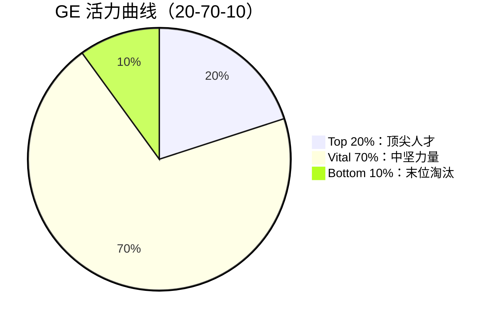
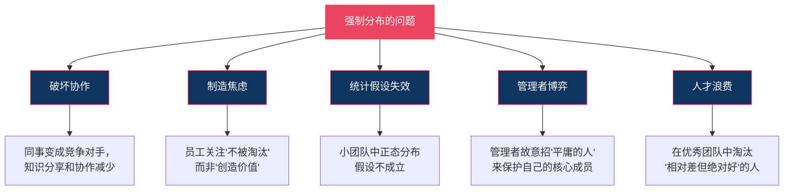
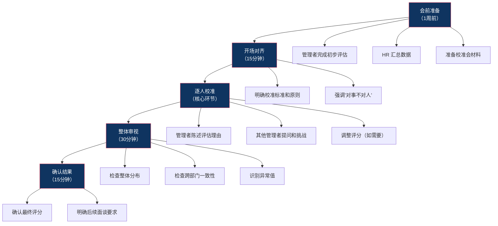

# 强制分布与校准：公平还是制造焦虑？

## 核心命题

> [!IMPORTANT] 核心命题
> 强制分布是"必要的恶"还是"过时的毒药"？它的本质是用"统计修正"对抗"评分通胀"，但在实践中引发了诸多争议。关键不是"是否强制分布"，而是"如何确保评价标准的一致性"。

## 一、强制分布法的起源

### 1.1 GE 的活力曲线

强制分布法（Forced Distribution）最著名的实践来自 **GE（通用电气）** 前 CEO **杰克·韦尔奇**（Jack Welch）。

**韦尔奇的"活力曲线"（Vitality Curve）**：



| 等级 | 比例 | 特征 | 管理策略 |
|---|---|---|---|
| **Top 20%** | 20% | 顶尖人才，绩效卓越 | 重奖、快速晋升、股票期权 |
| **Vital 70%** | 70% | 中坚力量，绩效合格 | 培养、激励、稳定发展 |
| **Bottom 10%** | 10% | 绩效不达标 | 改进或淘汰 |

**韦尔奇的逻辑**：
- 组织必须持续"换血"以保持活力
- 每年淘汰末位10%，让更优秀的人进来
- 这不仅是"淘汰"，更是对 Top 20% 的"保护"——不让平庸的人拖累优秀的人

### 1.2 强制分布的理论基础

**统计学假设**：在任何足够大的群体中，绩效应该呈正态分布。

```
        正态分布曲线
       / \
      /   \
     /     \
    /  Bottom \  Top
   /   10%  70% 20% \
  /                   \
```

**但这个假设有两个致命问题**：
1. 小团队（<30人）中，正态分布假设不成立
2. 如果团队本身已经是"高密度人才"（如经过严格筛选），就不应该有人落在"Bottom 10%"

---

## 二、强制分布的争议

### 2.1 强制分布的问题



### 2.2 详细分析

**问题一：破坏协作**

当你知道每年必须有10%的人被淘汰，你的同事就从"合作伙伴"变成了"竞争对手"。你会主动帮助同事吗？会分享你的知识和资源吗？——大概率不会。

**问题二：制造焦虑**

强制分布让员工处于持续的焦虑状态。这种焦虑可能带来短期绩效提升，但长期来看，会扼杀创造力、增加倦怠、导致优秀人才流失。

**问题三：统计假设失效**

在一个 10 人的团队中强制分布，你是在用"大数定律"处理"小样本"问题。如果这 10 个人都是经过严格筛选的优秀人才，你仍然要淘汰 1 个人——这纯粹是"为了淘汰而淘汰"。

**问题四：管理者博弈**

聪明的管理者会"反向操作"：故意招一个"注定被淘汰"的人进团队，以保护自己的核心成员。结果就是：组织花了钱招了一个"炮灰"，还浪费了管理精力。

**问题五：人才浪费**

如果你淘汰了一个"在自己团队中排末位，但在行业中仍然优秀"的人，你不仅损失了已经投入的培养成本，还可能在竞争对手那里给自己制造了一个强大的对手。

### 2.3 为什么 GE 能成功，而很多公司失败了？

GE 的强制分布之所以能运行，是因为它有一套完整的配套体系：

- **极强的招聘标准**：确保进来的人都是优秀的
- **极强的培训体系**：确保员工有持续成长的机会
- **极强的文化支撑**：绩效导向的文化深入人心
- **极强的领导力**：管理者有勇气和技巧处理"末位淘汰"

大多数复制 GE 做法的公司，只复制了"强制分布"这个表面动作，而忽视了背后的配套体系。

---

## 三、校准会（Calibration）：强制分布的替代方案

### 3.1 什么是校准会？

**校准会**是一种通过管理者集体讨论，确保不同团队的评价标准一致性的方法。它**不强制分布比例**，但通过集体校准来对抗"评分通胀"。

### 3.2 校准会的目的

| 目的 | 说明 |
|---|---|
| **确保标准一致** | A 管理者眼中的"优秀"可能等于 B 管理者眼中的"合格"，校准会消除这种差异 |
| **消除偏见** | 发现并纠正近因效应、光环效应、中心化趋势等评估偏见 |
| **提升评估质量** | 通过集体讨论，让评估更全面、更客观 |
| **建立管理共识** | 让管理团队对"什么是好的绩效"形成共同语言 |

### 3.3 校准会的操作流程



### 3.4 校准会的关键角色

| 角色 | 职责 |
|---|---|
| **主持人（通常为 HRBP）** | 引导流程、确保规则、控制时间、记录决议 |
| **各团队管理者** | 陈述本团队评估结果，回应其他管理者的挑战 |
| **上级管理者（如 VP）** | 做最终决策、确保跨部门公平 |
| **HR 负责人** | 确保流程合规、提供数据支持 |

### 3.5 校准会的讨论要点

对每个需要校准的员工，讨论以下问题：

1. 这个员工的**核心贡献**是什么？（用事实说话）
2. 这个员工的**评分依据**是什么？（与标准对比，而非与同事对比）
3. 这个评分在**跨部门对比**中是否合理？（A 部门的"优秀"是否等于 B 部门的"优秀"？）
4. 这个员工的**发展建议**是什么？（下一步该做什么？）

---

## 四、强制分布 vs 校准会

| 维度 | 强制分布 | 校准会 |
|---|---|---|
| 比例要求 | 强制（如 20-70-10） | 不强制，但会关注整体分布 |
| 灵活性 | 低 | 高 |
| 对管理者要求 | 要求管理者"敢于给低分" | 要求管理者"能够论证评分" |
| 对团队规模要求 | 需要较大团队（>30人） | 不限 |
| 协作影响 | 破坏协作 | 较少负面影响 |
| 公平性 | 可能"为了淘汰而淘汰" | 更关注"标准一致性" |
| 实施难度 | 低（简单粗暴） | 高（需要管理者的判断力和沟通力） |

---

## 五、中国企业的实践

### 5.1 阿里的 361 制度

阿里巴巴曾实行 **361 绩效分布**：
- 30%：优秀（3.75分以上）
- 60%：合格（3.5分）
- 10%：不合格（3.25分以下）

**特点**：
- 强制分布，但与薪酬和晋升强挂钩
- 在阿里文化中，361 被视为"保持组织活力"的手段
- 但也引发了内部争议，2019年后阿里开始弱化强制分布

### 5.2 华为的 A/B/C/D 评价

华为采用 **A/B/C/D 四级评价**：
- A：超出期望
- B：达到期望
- B+：在 B 和 A 之间
- C：待改进
- D：不合格

**特点**：
- 不强制比例，但历史上 A 的比例控制在 10-15%
- 与"奋斗者文化"深度绑定
- C/D 等级员工面临降薪、调岗或淘汰

### 5.3 字节跳动的实践

字节跳动在绩效管理上更接近 Google 的模式：
- 使用 OKR 进行目标管理
- 不强制分布
- 强调"Context, not Control"
- 通过校准会确保评估一致性

---

## 六、替代方案：无强制分布但仍需校准

### 6.1 替代方案的核心原则

> [!NOTE] 核心原则
> 替代强制分布，不等于"放任不管"。你仍然需要一套机制来确保评估的公平性和一致性。这就是校准会的价值。

**无强制分布的五步法**：

1. **设定明确的绩效标准**：每个等级有清晰的行为描述（而非"优秀""良好"这种模糊标签）
2. **要求管理者用事实论证**：每个评分都必须有具体的事实支撑，不能只说"我觉得他不错"
3. **校准会集体讨论**：管理者在会议上为每个评分"辩护"，接受同行的挑战
4. **关注整体分布**：检查整体分布是否合理，识别异常值
5. **HR 有权提出质疑**：如果某个管理者的评分明显偏离，HR 有权要求重新评估

### 6.2 绩效标准的行为锚定

**不要用模糊标签，用行为锚定**：

| 等级 | 模糊标签 | 行为锚定 |
|---|---|---|
| 卓越 | "表现非常出色" | "不仅完成了所有目标，还主动发现了业务中的新机会，并推动落地，产生了可量化的业务影响" |
| 优秀 | "表现良好" | "完成了所有目标，在部分目标上超出了预期，展现了高于岗位要求的能力" |
| 合格 | "表现一般" | "完成了大部分目标，达到了岗位的基本要求，没有重大失误" |
| 待改进 | "表现不好" | "多项关键目标未完成，或虽然完成了目标但方式不当（如损害团队协作），需要显著改进" |

---

## 七、评分偏见与校准的必要性

### 7.1 常见的评分偏见

| 偏见类型 | 表现 | 校准会如何纠正 |
|---|---|---|
| **宽容偏差** | 管理者给所有人都打高分 | 跨部门对比，发现"通货膨胀" |
| **严格偏差** | 管理者给所有人都打低分 | 跨部门对比，发现"过于苛刻" |
| **中心化趋势** | 所有人都打"合格"，不敢区分 | 要求管理者用事实论证每个评分 |
| **光环效应** | 因为一个突出表现给所有维度高分 | 逐维度讨论，分解评估 |
| **近因效应** | 只记得最近的表现 | 要求回顾整个周期的绩效数据 |
| **相似性偏差** | 对与自己相似的人评价更高 | 多个管理者交叉讨论 |

### 7.2 校准会对抗偏见的机制

校准会之所以有效，是因为它引入了**集体智慧**和**同行压力**：

- 当管理者必须"为评分辩护"时，偏见自然减少
- 当其他管理者提出挑战时，新的视角被引入
- 当 HR 提供数据支持时，主观判断被客观数据约束

---

## 八、本章要点回顾

| 要点 | 核心内容 |
|---|---|
| 强制分布起源 | GE 杰克·韦尔奇的"活力曲线"（20-70-10） |
| 强制分布的问题 | 破坏协作、制造焦虑、统计假设失效、管理者博弈 |
| 校准会 | 通过集体讨论确保评估标准一致，不强制分布比例 |
| 校准会流程 | 会前准备 → 开场对齐 → 逐人校准 → 整体审视 → 确认结果 |
| 替代方案 | 无强制分布五步法：标准、论证、校准、分布、质疑 |
| 评分偏见 | 宽容偏差、中心化趋势、光环效应、近因效应等 |
| 中国实践 | 阿里361、华为A/B/C/D、字节的OKR+校准 |

---

### 7.3 校准会成功的关键因素

校准会不是"走过场"，要让它真正发挥作用，需要以下条件：

1. **高层支持与参与**：校准会需要 VP 级别的高管参与并做最终决策，否则跨部门争议无法解决。
2. **HRBP 的专业引导**：HRBP 需要控制讨论节奏，确保公平，防止某个管理者"主导"讨论。
3. **数据驱动**：每个评分都需要有数据支撑，而非"我觉得"。
4. **心理安全**：管理者需要感到"可以坦诚地讨论"，而非"说了实话会被追究"。
5. **时间充足**：不能赶时间。每个员工的校准至少需要 5-10 分钟的讨论。

### 7.4 校准会之后的沟通

校准会结束后的沟通同样重要：

- **对管理者**：明确告知最终结果，说明调整的原因（如有调整）
- **对员工**：在绩效面谈中传达最终结果，但不透露"校准会"的讨论细节
- **对 HR**：记录校准会决议，确保结果应用的一致性

> [!TIP] 校准会不是"黑箱"
> 虽然校准会的具体讨论内容不应对外透露，但校准的标准和流程应该对全员透明。员工需要知道"我的评分是怎么来的"，即使他们不知道"具体是谁说了什么"。

---

## 下一步阅读

- 如果你想了解绩效面谈如何开展，请阅读 [[03-HR人事/绩效管理/06_绩效面谈：最难也最重要的一环]]
- 如果你想了解 PIP 的设计方法，请阅读 [[03-HR人事/绩效管理/07_绩效改进计划（PIP）与低绩效管理]]
- 如果你想了解 AI 时代的绩效管理趋势，请阅读 [[03-HR人事/绩效管理/09_AI时代的绩效管理新范式]]