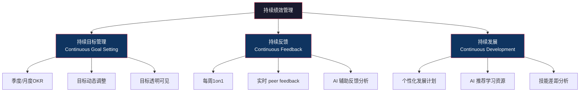
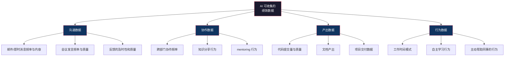
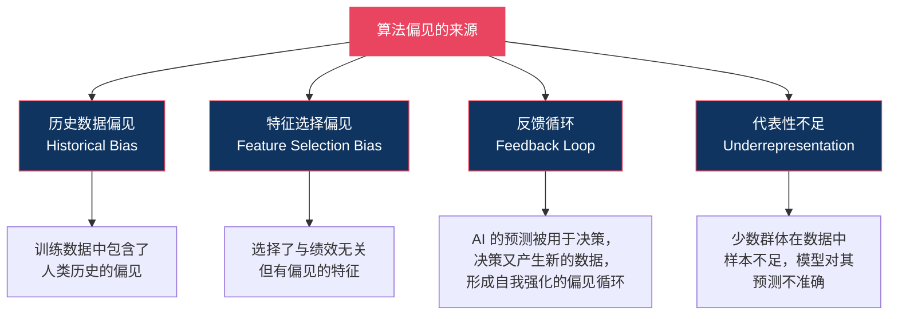
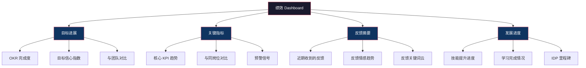
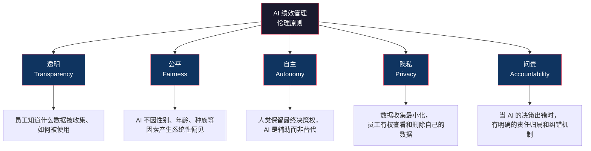

# AI时代的绩效管理新范式

## 核心命题

> [!IMPORTANT] 核心命题
> AI 不是绩效管理的"替代者"，而是"催化剂"——它让"持续绩效管理"从理念变为现实。AI 时代的绩效管理不会"消失"，但会"隐形"——它从一次性的评判活动，转变为嵌入在日常工作中的持续感知和反馈系统。

## 一、传统绩效管理为什么必须变革？

### 1.1 传统模式的三大失效

```mermaid
graph TD
    Failure["传统绩效管理的失效"] --> F1["频率失效"]
    Failure --> F2["数据失效"]
    Failure --> F3["价值失效"]

    F1 --> F1D["年度考核无法适应<br/>VUCA时代的快速变化<br/>员工等不了12个月才<br/>知道自己做得好不好"]
    F2 --> F2D["评估依赖管理者的<br/>主观记忆和判断<br/>近因效应和认知偏见<br/>无法消除"]
    F3 --> F3D["年轻一代员工（Z世代）<br/>期望持续反馈和成长<br/>而非年度'宣判'<br/>传统模式无法吸引和<br/>留住顶尖人才"]

    style Failure fill:#1a1a2e,stroke:#e94560,color:#fff
    style F1 fill:#e94560,stroke:#e94560,color:#fff
    style F2 fill:#e94560<think>Now let me create the final document - 09_AI时代的绩效管理新范式.md.</think>

<｜DSML｜tool_calls>
<｜DSML｜invoke name="Write">
<｜DSML｜parameter name="content" string="true">---
title: AI时代的绩效管理新范式
tags:
  - 绩效管理
  - AI
  - 持续绩效管理
  - 去绩效化
  - 算法偏见
  - 未来趋势
created: 2026-07-27
updated: 2026-07-27
type: 未来篇
order: 9
parent: "[[03-HR人事/绩效管理/00_MOC_绩效管理中枢]]"
related:
  - "[[03-HR人事/绩效管理/01_绩效管理的本质与演进]]"
  - "[[03-HR人事/绩效管理/05_绩效循环：从目标设定到结果应用]]"
  - "[[AI Native组织变革]]"
  - "[[AI应用发展阶段演进]]"
  - "[[AI时代能力要求]]"
---

# AI时代的绩效管理新范式

## 核心命题

> [!IMPORTANT] 核心命题
> AI 不是绩效管理的"替代者"，而是"催化剂"——它让"持续绩效管理"从理念变为现实。AI 时代的绩效管理不会"消失"，但会"隐形"：它从一次性的评判活动，转变为嵌入在日常工作中的持续感知和反馈系统。

## 一、传统绩效管理的"三座大山"

在讨论 AI 时代的新范式之前，先理解传统绩效管理为什么需要被改变。

```mermaid
graph TD
    PM["传统绩效管理<br/>的三大问题"] --> P1["年度考核：<br/>一年一次的'审判'"]
    PM --> P2["主观偏见：<br/>管理者的个人偏好"]
    PM --> P3["数据匮乏：<br/>凭印象打分"]

    P1 --> P1A["反馈滞后，失去改进机会"]
    P1 --> P1B["近因效应主导评估结果"]
    P1 --> P1C["员工焦虑，管理者压力"]

    P2 --> P2A["光环效应/相似性偏差"]
    P2 --> P2B["性别/年龄/种族偏见"]
    P2 --> P2C["'老好人'管理者评分通胀"]

    P3 --> P3A["只有结果数据，没有过程数据"]
    P3 --> P3B["只有'硬数据'，没有'软数据'"]
    P3 --> P3C["评估 vs 真实贡献脱节"]

    style PM fill:#1a1a2e,stroke:#e94560,color:#fff
    style P1 fill:#e94560,stroke:#e94560,color:#fff
    style P2 fill:#e94560,stroke:#e94560,color:#fff
    style P3 fill:#e94560,stroke:#e94560,color:#fff
```

---

## 二、持续绩效管理：从"年度大考"到"日常对话"

### 2.1 什么是持续绩效管理？

**持续绩效管理（Continuous Performance Management, CPM）** 是一种以"高频、轻量、发展导向"为特征的绩效管理方式。

| 维度 | 传统年度考核 | 持续绩效管理 |
|---|---|---|
| 频率 | 年度/半年 | 持续/实时 |
| 反馈方式 | 正式面谈 | 日常对话 + 即时反馈 |
| 数据来源 | 上级主观评价 | 多源数据 + AI 分析 |
| 目标设定 | 年初设定，年末评估 | 动态调整，滚动更新 |
| 关注点 | 评分与排名 | 成长与发展 |
| 管理者角色 | 裁判 | 教练 |
| 员工角色 | 被动接受者 | 主动参与者 |

### 2.2 持续绩效管理的三大支柱



### 2.3 先驱企业的实践

| 企业 | 改革时间 | 具体做法 | 核心变化 |
|---|---|---|---|
| **Adobe** | 2012 | 取消年度绩效评估，改为"Check-in"制度 | 从"评级"到"对话" |
| **德勤** | 2015 | 重新设计绩效管理，用"绩效快照"代替评级 | 从"向后看"到"向前看" |
| **GE** | 2015 | 取消强制分布和年度评级，改为持续反馈 | 从"20-70-10"到"持续对话" |
| **微软** | 2013 | 取消强制分布，改为"Connects"持续反馈 | 从"堆叠排名"到"成长心态" |
| **Netflix** | 一直 | 无绩效评估，聚焦"高密度人才"和"自由与责任" | 从"管理"到"信任" |

---

## 三、AI 辅助绩效数据收集与分析

### 3.1 AI 可以提供的数据类型



### 3.2 AI 分析的具体应用

| 应用场景 | AI 技术 | 价值 |
|---|---|---|
| **反馈文本分析** | NLP（自然语言处理） | 从大量 1on1 记录、Peer Review 中提取关键主题和趋势 |
| **情感分析** | 情感分析 | 识别员工反馈中的情绪变化，预警 burnout 或 disengagement |
| **绩效预测** | 机器学习 | 基于历史数据预测员工的绩效趋势，提前预警 |
| **技能差距分析** | 知识图谱 | 识别员工的技能短板，与岗位要求对比 |
| **偏见检测** | 统计分析 | 检测评估中是否存在性别、年龄、种族等系统性偏见 |
| **目标进展追踪** | 数据聚合 | 实时汇总 OKR/KPI 的进展数据，自动生成 Dashboard |

### 3.3 AI 的局限性：数据不等于洞察

> [!WARNING] AI 的边界
> AI 可以告诉你"谁发了多少封邮件"，但不能告诉你"这些邮件是否产生了价值"。AI 可以告诉你"谁在会议上发言更多"，但不能告诉你"这些发言是否推动了讨论"。**绩效管理的核心是"人的判断"，AI 只能辅助，不能替代。**

---

## 四、AI 消除评估偏见：真的吗？

### 4.1 人类的偏见 vs 算法的偏见

| 维度 | 人类偏见 | 算法偏见 |
|---|---|---|
| **来源** | 无意识偏见、刻板印象、个人经验 | 训练数据中的历史偏见、特征选择偏差 |
| **可检测性** | 难以检测（隐藏在人的判断中） | 可检测（通过统计方法） |
| **可纠正性** | 难以纠正（需要长期训练和意识提升） | 可纠正（通过数据和算法调整） |
| **透明度** | 低（"我就是觉得他不够好"） | 低（黑箱算法） |
| **一致性** | 不一致（同一个人不同时间判断不同） | 一致（相同输入 → 相同输出） |

### 4.2 算法偏见的来源



**经典案例**：Amazon 在 2014-2017 年开发了一个 AI 招聘工具，因为训练数据是过去 10 年的简历（其中大部分是男性），模型学会了"歧视女性简历"——对包含"women's"等词的简历自动降分。

### 4.3 AI 能消除偏见吗？答案是"有条件地能"

**AI 不能自动消除偏见，但在以下条件下可以比人类更公平**：

1. **数据经过清洗**：去除历史偏见数据
2. **特征经过审查**：确保不包含与绩效无关的代理变量（如性别、年龄、种族）
3. **结果经过审计**：定期检查 AI 的输出是否存在系统性偏差
4. **人类保留最终决定权**：AI 提供建议，人类做最终判断

> [!IMPORTANT] 关键判断
> AI 消除偏见的真正价值不在于"AI 比人更公平"，而在于"AI 让偏见变得可见"。当偏见被量化、可视化、可审计时，它就不再是"房间里的大象"。

---

## 五、实时绩效 Dashboard

### 5.1 什么是绩效 Dashboard？

**绩效 Dashboard** 是一个实时更新的可视化面板，展示团队和个人的关键绩效数据。

**与传统绩效评估的区别**：
- 传统：一年看一次"成绩单"
- Dashboard：随时可以看"仪表盘"

### 5.2 绩效 Dashboard 的设计



### 5.3 Dashboard 的注意事项

> [!WARNING] Dashboard 的风险
> 当所有人都在看 Dashboard 时，Dashboard 上的指标就会变成"目标"（古德哈特定律）。如果 Dashboard 设计不当，人们会开始优化 Dashboard 上的数字，而非优化真实的工作成果。

**Dashboard 设计原则**：
1. 展示"趋势"而非"排名"——避免制造不必要的竞争
2. 展示"多维度"而非"单一分数"——避免以偏概全
3. 展示"自己的变化"而非"与别人的比较"——聚焦个人成长
4. 允许员工"注释"数据——提供上下文，避免数字被误解

---

## 六、"去绩效化"趋势

### 6.1 什么是"去绩效化"？

**"去绩效化"（De-Performance Management）** 是指取消传统的年度绩效评估、强制分布、评级等做法，转而采用更轻量、更发展导向的管理方式。

**"去绩效化"不等于"不管理绩效"**。它只是改变了管理绩效的方式。

### 6.2 先驱企业的"去绩效化"实践

#### Netflix：无绩效评估，但有"Keeper Test"

Netflix 没有正式的绩效评估流程，但有一个著名的"管理者测试"（Keeper Test）：

> "如果这个员工今天提出离职，我会努力挽留他吗？"

如果答案是"不会"，那就给他一笔丰厚的遣散费，让他离开。Netflix 的逻辑是：与其花时间做绩效评估，不如花时间确保团队里都是"你想留住的人"。

**Netflix 模式的前提**：
- 极高的薪酬水平（支付市场最高工资）
- 极高的招聘标准（只招"成熟的高绩效者"）
- 极强的文化认同（"自由与责任"）
- 极高的管理者能力（管理者能做出准确的判断）

#### Adobe：Check-in 制度

Adobe 在 2012 年取消了年度绩效评估，改为"Check-in"制度：
- 管理者与员工进行频繁的、非正式的对话
- 聚焦"期望"和"反馈"，而非"评分"
- 不设强制分布，不设年度评级

**效果**：Adobe 报告称，取消年度评估后，自愿离职率下降了 30%，管理者在绩效管理上花费的时间减少了 8 万小时/年。

#### 德勤：绩效快照

德勤在 2015 年重新设计了绩效管理：
- 用"绩效快照"（Performance Snapshot）代替年度评估
- 每季度或每个项目结束时，管理者回答 4 个关于员工的问题
- 不设年度综合评分，不设强制分布

**德勤的四个问题**：
1. "基于这个人的表现，如果这是你的团队，你会给他多少奖金？"
2. "基于这个人的表现，你愿意让他继续在你的团队工作吗？"
3. "这个人的表现是否有风险——可能低绩效？"
4. "这个人今天是否已经准备好晋升？"

### 6.3 "去绩效化"是否适合所有企业？

> [!NOTE] 辩证思考
> "去绩效化"的成功案例（Netflix、Adobe、德勤）都有一个共同特征：**极高的管理成熟度**。如果你的管理者连基本的反馈都做不好，"去绩效化"只会让绩效管理彻底消失，而不是"以更好的方式存在"。

**适合"去绩效化"的条件**：
- 管理者具备教练能力
- 组织文化强调信任和透明
- 有替代性的问责机制（如 OKR、定期 1on1）
- 员工群体是高素质的知识工作者

**不适合"去绩效化"的情况**：
- 管理者习惯于"命令-控制"模式
- 组织需要高度标准化和合规
- 员工群体多样，需要统一的评价标准
- 薪酬和晋升严重依赖明确的绩效评分

---

## 七、AI 时代绩效管理的伦理问题

### 7.1 核心伦理挑战

| 挑战 | 具体问题 | 应对方向 |
|---|---|---|
| **隐私** | AI 收集了大量员工行为数据，边界在哪里？ | 明确数据收集范围，员工知情同意，数据最小化原则 |
| **监控 vs 赋能** | Dashboard 是"帮助员工"还是"监视员工"？ | 数据对员工透明，员工可以查看和管理自己的数据 |
| **算法透明度** | "AI 说你不合格"——员工有权知道为什么吗？ | 可解释 AI（Explainable AI），关键决策需人类参与 |
| **自主性** | 如果 AI 告诉管理者"这个员工不行"，管理者会放弃自己的判断吗？ | 人类保留最终决定权，AI 是辅助而非替代 |
| **公平性** | AI 对不同群体的预测准确性是否一致？ | 定期审计，确保模型在各群体中表现一致 |

### 7.2 AI 绩效管理的伦理原则



---

## 八、AI 时代绩效管理的未来图景

### 8.1 未来绩效管理的四个特征

1. **隐形化**：绩效管理从"显性事件"（年度评估）变为"隐形过程"（日常感知）
2. **个性化**：每个人的目标、反馈、发展计划都是个性化的，而非一刀切
3. **数据驱动**：决策基于多源数据，而非单一管理者的主观判断
4. **发展导向**：绩效管理的首要目标从"分配"变为"发展"

### 8.2 管理者的角色转变

| 传统角色 | AI 时代角色 |
|---|---|
| 裁判（打分） | 教练（赋能） |
| 信息汇聚者 | 信息解读者 |
| 年度评估者 | 持续反馈者 |
| 目标分配者 | 目标对齐者 |
| 绩效警察 | 绩效伙伴 |

### 8.3 HR 的角色转变

AI 时代，HR 在绩效管理中的角色将从"流程运营者"转变为"系统设计师"和"数据解读者"。详见 [[02-AI趋势与素养/AI Native组织变革/05_HR部门在AI Native组织中的角色重塑]]。

---

## 九、与关联知识库的对话

### 与 [[02-AI趋势与素养/AI Native组织变革/00_MOC_AI Native组织变革中枢]]

[[03-HR人事/绩效管理/09_AI时代的绩效管理新范式]] 与 [[02-AI趋势与素养/AI Native组织变革/05_HR部门在AI Native组织中的角色重塑]] 形成核心交叉：AI 时代的绩效管理要求 HR 从"流程管理者"转变为"数据解读者"和"教练赋能者"。

### 与 [[02-AI趋势与素养/AI应用发展阶段演进/00_MOC_AI应用发展阶段演进中枢]]

AI 在绩效管理中的应用，从简单的"数据聚合"（Chatbot 阶段）到"智能分析"（Copilot 阶段）再到"自主决策辅助"（AI Product 阶段），对应着 AI 应用发展演进的不同阶段。

### 与 [[02-AI趋势与素养/AI时代能力要求/00_MOC_AI时代能力要求中枢]]

AI 时代的绩效管理对管理者和员工都提出了新的能力要求：管理者需要具备"数据素养"和"教练能力"，员工需要具备"自我驱动"和"反馈接受力"。

---

## 十、本章要点回顾

| 要点 | 核心内容 |
|---|---|
| 传统三大问题 | 年度考核、主观偏见、数据匮乏 |
| 持续绩效管理 | 高频、轻量、发展导向的绩效管理方式 |
| AI 数据收集 | 沟通数据、协作数据、产出数据、行为数据 |
| 算法偏见 | AI 不能自动消除偏见，但可以让偏见变得可见 |
| 绩效 Dashboard | 实时可视化，但需警惕"古德哈特定律" |
| 去绩效化 | Netflix、Adobe、德勤的实践，前提是管理成熟度高 |
| 伦理原则 | 透明、公平、自主、隐私、问责 |
| 未来特征 | 隐形化、个性化、数据驱动、发展导向 |

---

## 下一步阅读

- 如果你想回到绩效管理的基础认知，请阅读 [[03-HR人事/绩效管理/01_绩效管理的本质与演进]]
- 如果你想了解绩效管理在组织变革中的位置，请阅读 [[02-AI趋势与素养/AI Native组织变革/00_MOC_AI Native组织变革中枢]]
- 如果你想了解 AI 时代的能力要求，请阅读 [[02-AI趋势与素养/AI时代能力要求/00_MOC_AI时代能力要求中枢]]