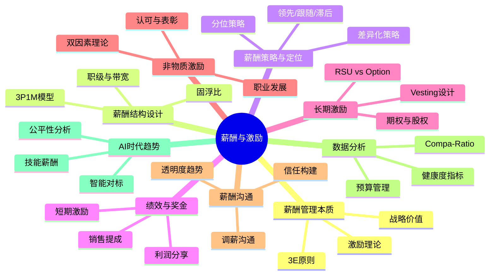
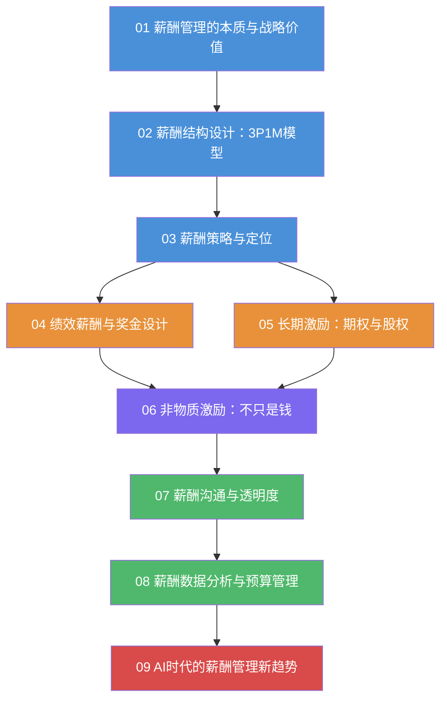
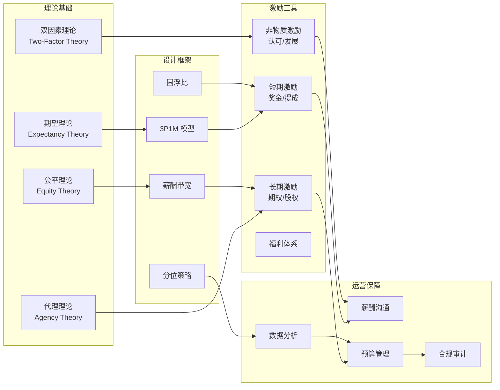
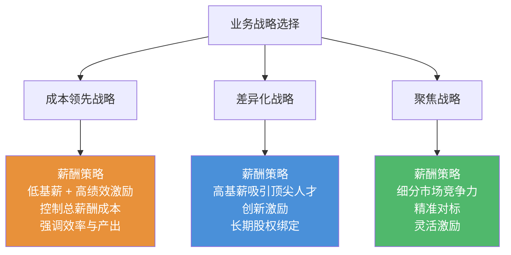
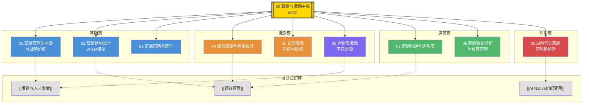

# 薪酬与激励中枢

> 从薪酬设计到全面激励体系 —— 战略 + HR + AI 视角

---

## 一、知识库定位

本知识库聚焦**薪酬与激励**这一核心人力资源管理领域，以"战略 + HR + AI"三重视角展开，系统性地覆盖从薪酬哲学、结构设计、策略定位，到绩效奖金、长期激励、非物质激励、薪酬沟通、数据分析，以及 AI 时代薪酬管理新趋势的全链路知识体系。

---

## 二、内容导航

### 2.1 核心文档索引

| 编号 | 文档 | 核心主题 | 关键概念 |
|------|------|----------|----------|
| 01 | [[03-HR人事/薪酬与激励/01_薪酬管理的本质与战略价值]] | 薪酬哲学与战略匹配 | 3E原则、战略匹配、成本领先vs差异化 |
| 02 | [[03-HR人事/薪酬与激励/02_薪酬结构设计：3P1M模型]] | 薪酬结构方法论 | 3P1M、职级体系、薪酬带宽、固浮比 |
| 03 | [[03-HR人事/薪酬与激励/03_薪酬策略与定位]] | 市场定位与策略选择 | 分位策略、领先型/跟随型/滞后型 |
| 04 | [[03-HR人事/薪酬与激励/04_绩效薪酬与奖金设计]] | 短期激励设计 | 奖金设计原则、销售提成、利润分享 |
| 05 | [[03-HR人事/薪酬与激励/05_长期激励：期权与股权]] | 股权激励体系 | 期权池、Vesting、RSU、初创陷阱 |
| 06 | [[03-HR人事/薪酬与激励/06_非物质激励：不只是钱]] | 非物质激励 | 双因素理论、认可表彰、使命感 |
| 07 | [[03-HR人事/薪酬与激励/07_薪酬沟通与透明度]] | 薪酬沟通策略 | 透明度趋势、调薪沟通、组织信任 |
| 08 | [[03-HR人事/薪酬与激励/08_薪酬数据分析与预算管理]] | 数据驱动薪酬管理 | CR、薪酬渗透率、预算编制、审计 |
| 09 | [[03-HR人事/薪酬与激励/09_AI时代的薪酬管理新趋势]] | AI与薪酬未来 | 智能对标、公平性分析、技能薪酬 |

### 2.2 学习路径推荐

**路径说明**：

- **蓝色节点**（01-03）：基础篇 —— 建立薪酬管理的底层认知框架
- **橙色节点**（04-05）：激励篇 —— 短期激励与长期激励的设计实践
- **紫色节点**（06）：补充篇 —— 非物质激励，丰富激励认知
- **绿色节点**（07-08）：运营篇 —— 薪酬沟通与数据分析
- **红色节点**（09）：前沿篇 —— AI 时代的薪酬变革

---

## 三、核心概念图谱

### 3.1 薪酬管理的理论支柱

### 3.2 3E 原则速览

| 原则 | 英文 | 含义 | 关键问题 | 关联文档 |
|------|------|------|----------|----------|
| 外部公平 | External Equity | 与市场水平对比 | 我们的薪酬有竞争力吗？ | [[03-HR人事/薪酬与激励/03_薪酬策略与定位]] |
| 内部公平 | Internal Equity | 岗位之间的相对价值 | 不同岗位的薪酬差异合理吗？ | [[03-HR人事/薪酬与激励/02_薪酬结构设计：3P1M模型]] |
| 个体公平 | Individual Equity | 同岗位不同人的差异 | 同一岗位，优秀员工和普通员工的差距合理吗？ | [[03-HR人事/薪酬与激励/04_绩效薪酬与奖金设计]] |

---

## 四、战略视角：薪酬与业务战略的联动

### 4.1 不同业务战略的薪酬匹配

### 4.2 不同企业阶段的薪酬策略差异

| 企业阶段 | 核心挑战 | 薪酬策略重点 | 典型做法 |
|----------|----------|-------------|----------|
| 初创期（天使/A轮） | 现金流紧张，需吸引核心人才 | 股权激励为主，现金薪酬为辅 | 低于市场现金 + 高股权期权 |
| 成长期（B/C轮） | 快速扩张，需批量招聘 | 现金薪酬逐步市场化，股权激励规范化 | 市场P50现金 + 期权/RSU |
| 成熟期（上市/Pre-IPO） | 稳定运营，保留关键人才 | 全面薪酬体系，精细化管理 | 市场P75现金 + RSU + 福利 |
| 转型期 | 组织变革，新旧业务并存 | 差异化策略，新业务创业式激励 | 双轨制薪酬体系 |

> [!tip] 关键洞察
> 薪酬策略不是一成不变的。企业从初创到上市，薪酬策略需要经历至少三次重大转型。**最常见的错误**是企业在成长期仍然沿用初创期的薪酬逻辑，导致无法吸引市场化人才。

---

## 五、跨知识库关联

本知识库与以下知识库存在紧密关联：

### 5.1 [[03-HR人事/培训与人才发展/培训与人才发展_知识库建设方案]]

- **薪酬与培训预算的联动**：培训预算的分配逻辑与薪酬预算的协调
- **技能薪酬（Skill-based Pay）**：培训体系输出的技能认证直接关联薪酬等级
- **人才梯队与薪酬**：不同梯队人才的差异化薪酬策略

> [!note] 边界说明
> 培训与人才发展知识库中「培训预算与ROI」章节聚焦培训投入产出，不涉及薪酬体系设计。本知识库聚焦薪酬结构本身，两个知识库在"技能薪酬"和"培训预算与薪酬预算协调"两个交叉点上形成互补。

### 5.2 [[02-AI趋势与素养/AI Native组织变革/00_MOC_AI Native组织变革中枢]]

- **AI 时代的新角色新岗位**：新岗位的薪酬定价与市场对标
- **组织扁平化对薪酬带宽的影响**：层级减少后薪酬带宽如何调整
- **AI 对薪酬管理本身的重塑**：智能化薪酬分析工具

> [!note] 边界说明
> AI Native组织变革知识库中「新角色新岗位」章节聚焦岗位定义与组织设计，不涉及薪酬定价。本知识库从薪酬定价维度补充，形成"岗位设计-薪酬定价"的完整闭环。

### 5.3 [[03-HR人事/绩效管理/00_MOC_绩效管理中枢]]

- **绩效薪酬的联动机制**：绩效结果如何转化为薪酬调整
- **OKR/KPI 与奖金挂钩模式**：不同绩效管理体系下的奖金设计差异
- **绩效校准与薪酬公平**：绩效评分的校准对薪酬公平性的影响

> [!note] 边界说明
> 绩效管理知识库聚焦于目标设定、绩效评估、反馈辅导等流程，不涉及奖金分配公式。本知识库中 [[03-HR人事/薪酬与激励/04_绩效薪酬与奖金设计]] 聚焦于"绩效结果如何转化为薪酬"，是绩效管理闭环的最后一环。

---

## 六、快速查阅指南

### 按角色查阅

| 角色 | 推荐阅读顺序 | 重点关注 |
|------|-------------|----------|
| **CEO / 创始人** | 01 -> 03 -> 05 -> 09 | 薪酬战略、股权设计、AI趋势 |
| **HRD / 薪酬负责人** | 01 -> 02 -> 03 -> 04 -> 05 -> 08 | 全链路薪酬管理 |
| **HRBP** | 01 -> 04 -> 06 -> 07 | 激励设计、非物质激励、薪酬沟通 |
| **业务 Leader** | 04 -> 05 -> 06 | 奖金设计、激励团队 |
| **财务/预算** | 08 -> 03 -> 04 | 薪酬预算、成本分析 |

### 按场景查阅

| 场景 | 推荐文档 | 核心问题 |
|------|----------|----------|
| 公司要搭建薪酬体系 | [[03-HR人事/薪酬与激励/02_薪酬结构设计：3P1M模型]] | 从零开始怎么设计薪酬结构？ |
| 要确定薪酬水平 | [[03-HR人事/薪酬与激励/03_薪酬策略与定位]] | 定多少分位？什么策略？ |
| 设计年度奖金方案 | [[03-HR人事/薪酬与激励/04_绩效薪酬与奖金设计]] | 奖金怎么发才公平有效？ |
| 做股权激励计划 | [[03-HR人事/薪酬与激励/05_长期激励：期权与股权]] | 期权池多大？怎么 vesting？ |
| 员工抱怨薪资不公 | [[03-HR人事/薪酬与激励/07_薪酬沟通与透明度]] | 如何沟通薪酬决策？ |
| 做年度薪酬预算 | [[03-HR人事/薪酬与激励/08_薪酬数据分析与预算管理]] | 预算怎么编？指标怎么看？ |
| 引入 AI 辅助薪酬管理 | [[03-HR人事/薪酬与激励/09_AI时代的薪酬管理新趋势]] | AI 能帮我们做什么？ |

---

## 七、关键概念术语表

| 术语 | 英文 | 定义 | 详见 |
|------|------|------|------|
| 3P1M | Position/Person/Performance/Market | 薪酬设计的四维模型 | [[03-HR人事/薪酬与激励/02_薪酬结构设计：3P1M模型]] |
| 薪酬带宽 | Salary Band / Range | 某一职级薪酬的最低到最高范围 | [[03-HR人事/薪酬与激励/02_薪酬结构设计：3P1M模型]] |
| 固浮比 | Fixed vs Variable Ratio | 固定薪酬与浮动薪酬的比例 | [[03-HR人事/薪酬与激励/02_薪酬结构设计：3P1M模型]] |
| 分位策略 | Percentile Strategy | 薪酬市场定位（P25/P50/P75/P90） | [[03-HR人事/薪酬与激励/03_薪酬策略与定位]] |
| CR | Compa-Ratio | 员工实际薪酬与市场中位值的比率 | [[03-HR人事/薪酬与激励/08_薪酬数据分析与预算管理]] |
| 薪酬渗透率 | Range Penetration | 员工薪酬在薪酬带宽中的位置 | [[03-HR人事/薪酬与激励/08_薪酬数据分析与预算管理]] |
| Vesting | 归属/兑现 | 股权激励的分期归属机制 | [[03-HR人事/薪酬与激励/05_长期激励：期权与股权]] |
| RSU | Restricted Stock Unit | 限制性股票单位 | [[03-HR人事/薪酬与激励/05_长期激励：期权与股权]] |
| 双因素理论 | Two-Factor Theory | 赫茨伯格的保健因素与激励因素 | [[03-HR人事/薪酬与激励/06_非物质激励：不只是钱]] |
| 全面薪酬 | Total Rewards | 包含货币薪酬+福利+非货币激励的整体回报 | [[03-HR人事/薪酬与激励/01_薪酬管理的本质与战略价值]] |
| Skill-based Pay | 技能薪酬 | 基于技能水平而非岗位的薪酬模式 | [[03-HR人事/薪酬与激励/09_AI时代的薪酬管理新趋势]] |

---

## 八、常见问题速查

> [!question] Q1: 初创公司薪酬怎么定？
> 核心原则：现金保生存，股权博未来。详见 [[03-HR人事/薪酬与激励/03_薪酬策略与定位]] 和 [[03-HR人事/薪酬与激励/05_长期激励：期权与股权]]。

> [!question] Q2: 薪酬带宽多宽合适？
> 通常薪酬带宽为 50%-100%（即最高值约为最低值的 1.5-2 倍）。不同层级差异较大：基层 40%-60%，中层 50%-80%，高层 80%-150%。详见 [[03-HR人事/薪酬与激励/02_薪酬结构设计：3P1M模型]]。

> [!question] Q3: 什么时候该用期权，什么时候该用 RSU？
> 期权适合早期公司（高风险高回报），RSU 适合成熟公司（稳定价值）。详见 [[03-HR人事/薪酬与激励/05_长期激励：期权与股权]]。

> [!question] Q4: 薪酬应该保密还是透明？
> 这取决于组织文化和战略目标。完全透明和完全保密各有利弊，大部分公司采用"有限透明"策略。详见 [[03-HR人事/薪酬与激励/07_薪酬沟通与透明度]]。

> [!question] Q5: 如何判断薪酬体系是否健康？
> 关注三个核心指标：CR（Compa-Ratio）、薪酬渗透率、薪酬满意度。详见 [[03-HR人事/薪酬与激励/08_薪酬数据分析与预算管理]]。

> [!question] Q6: 非物质激励真的有效吗？
> 有效，但前提是物质激励（薪酬）已经达到公平水平。双因素理论告诉我们：薪酬是"保健因素"，缺了会不满；非物质是"激励因素"，有了会更有动力。详见 [[03-HR人事/薪酬与激励/06_非物质激励：不只是钱]]。

---

## 九、知识库维护

### 更新日志

| 日期 | 版本 | 更新内容 |
|------|------|----------|
| 2026-07-27 | v1.0 | 初始版本，完成 9 篇内容文档 + MOC 中枢 |

### 待补充主题

- [ ] 薪酬体系的国际化（跨境薪酬管理、外派薪酬设计）
- [ ] 福利体系设计（弹性福利、全面健康管理）
- [ ] 高管薪酬与公司治理
- [ ] 薪酬合规与劳动法
- [ ] ESG 与薪酬（薪酬公平与可持续发展）

### 参考资源

- 米尔科维奇（Milkovich）《薪酬管理》
- 世界薪酬协会（WorldatWork）Total Rewards 模型
- 赫茨伯格（Herzberg）双因素理论
- 弗鲁姆（Vroom）期望理论
- 亚当斯（Adams）公平理论

---

## 十、知识库全景图

---

> [!quote] 薪酬管理的终极目标
> 薪酬管理的最高境界，不是让员工觉得"给的钱够了"，而是让员工觉得"在这里工作，我的价值被充分认可了"。当薪酬从"成本"变成"投资"，HR 就完成了从"操作者"到"战略伙伴"的转型。

---

*本知识库持续迭代，欢迎基于实践反馈进行补充和完善。*