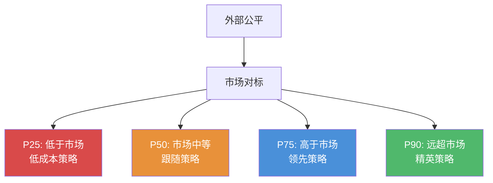
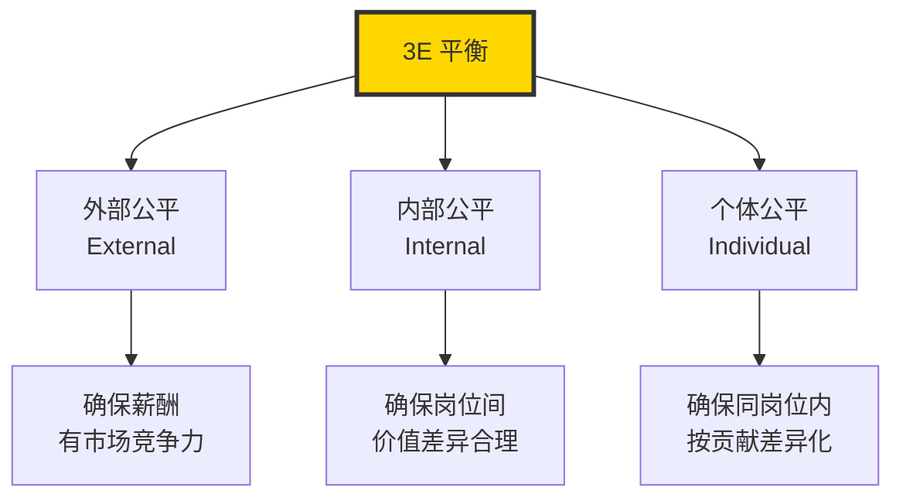
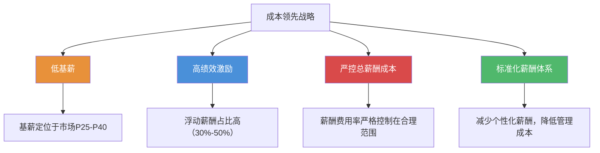
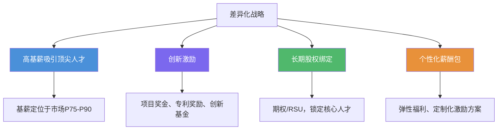
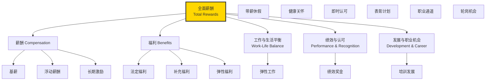
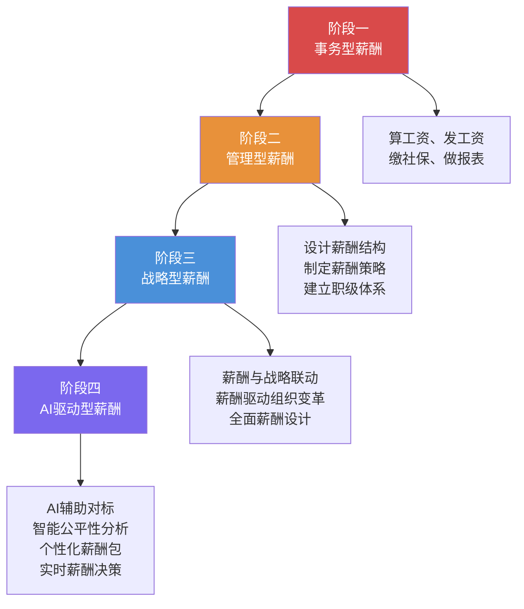
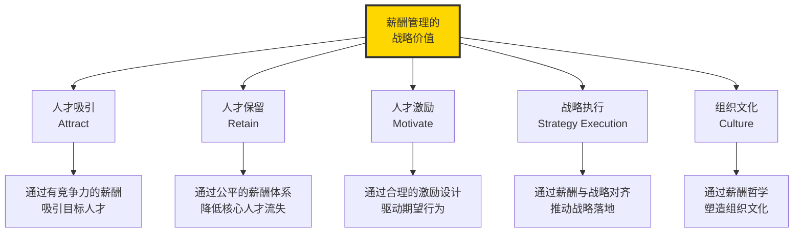

# 薪酬管理的本质与战略价值

> 薪酬不只是"发工资"，而是"吸引、保留、激励人才"的战略工具。

---

## 一、重新定义薪酬：从成本到投资

### 1.1 传统认知的局限

在大多数人的认知中，薪酬就是"公司发给员工的工资"。这种认知将薪酬视为一种**成本**——企业需要支付的、希望尽可能压缩的费用。这种视角导致了一种典型的博弈关系：

- **企业视角**：如何用最少的钱让员工干活？
- **员工视角**：如何让企业为我的劳动付出更多？

这种零和博弈的思维，恰恰是薪酬管理最大的误区。

### 1.2 战略视角下的薪酬本质

从战略HR的视角看，薪酬的本质是**人才资本的投资回报机制**。它不是成本，而是企业对人才的**投资**——通过合理的薪酬配置，吸引、保留和激励人才，从而驱动业务增长和组织能力提升。

> [!important] 薪酬不是成本，是投资
> 当你把薪酬看作成本时，你会想方设法压缩它；当你把薪酬看作投资时，你会思考如何让这笔投资产生最大的回报。这两种思维方式的差异，决定了企业薪酬管理的上限。

### 1.3 薪酬管理的三重境界

| 境界 | 名称 | 特征 | 典型行为 |
|------|------|------|----------|
| 第一重 | 操作型 | 把薪酬当成事务性工作 | 算工资、发工资、缴社保 |
| 第二重 | 管理型 | 把薪酬当成管理工具 | 设计薪酬结构、制定薪酬策略 |
| 第三重 | 战略型 | 把薪酬当成战略杠杆 | 薪酬与业务战略联动、用薪酬驱动组织变革 |

大部分企业停留在第一重和第二重之间。真正达到第三重境界的企业，薪酬管理已经成为其核心竞争力的重要组成部分。

---

## 二、薪酬管理的3E原则

3E原则是薪酬管理的基石，由薪酬管理大师米尔科维奇（Milkovich）提出，是判断一个薪酬体系是否合理的基本框架。

### 2.1 外部公平（External Equity）

**定义**：企业薪酬水平与外部市场同类岗位薪酬水平的比较。

**核心问题**：我们的薪酬在市场上有没有竞争力？

**外部公平失衡的后果**：

- 薪酬低于市场水平：难以吸引优秀人才，现有员工被竞争对手挖走
- 薪酬高于市场水平：人力成本过高，但如果不匹配高绩效要求，会形成"高薪养懒人"

> [!warning] 常见误区
> 很多企业认为"只要给够钱就能解决一切问题"。但外部公平只是薪酬管理的一个维度。如果内部不公平，即使整体薪酬高于市场，员工仍然会不满。

### 2.2 内部公平（Internal Equity）

**定义**：企业内部不同岗位之间薪酬的相对公平性。

**核心问题**：不同岗位的薪酬差异合理吗？岗位价值评估是否客观？

**内部公平的三大支柱**：

1. **岗位价值评估**：通过系统化的方法（如海氏评估法、美世IPE等）评估岗位的相对价值
2. **职级体系**：将岗位价值转化为明确的职级层级
3. **薪酬带宽**：每个职级对应一个薪酬范围，确保同一层级内的一致性

**内部公平的经典矛盾**：

| 矛盾场景 | 问题描述 | 解决思路 |
|----------|----------|----------|
| 新老员工薪酬倒挂 | 新员工薪资高于老员工 | 通过调薪机制逐步拉平，同时承认市场溢价 |
| 业务部门 vs 职能部门 | 前台部门薪酬高于后台 | 建立统一的岗位价值评估体系，以价值而非部门定薪 |
| 技术岗 vs 管理岗 | 技术专家与管理者谁更值钱 | 建立双通道职业发展体系，技术通道与管理通道同等价值 |

### 2.3 个体公平（Individual Equity）

**定义**：同一岗位内，不同员工之间薪酬差异的公平性。

**核心问题**：干得好的员工和干得一般的员工，薪酬差距合理吗？

**个体公平的关键要素**：

- **绩效差异**：高绩效者应获得更高的薪酬回报
- **能力差异**：技能水平、经验丰富度应体现在薪酬上
- **潜力差异**：高潜人才可能需要额外的薪酬投入以保留

> [!tip] 个体公平的"拉链原则"
> 同一岗位内，最优秀员工与最普通员工的薪酬差异，应该在薪酬带宽内拉开。通常建议带宽内的高绩效者处于中上区间（P75-P100），一般绩效者处于中下区间（P25-P50）。如果所有人都挤在同一个薪酬点上，说明个体公平出了问题。

### 2.4 3E原则的关系

三个公平不是独立的，而是相互影响、相互制约的。一个优秀的薪酬体系，需要在三者之间找到平衡点。

---

## 三、薪酬与企业战略的匹配

薪酬管理最重要的战略价值，在于它与企业战略的深度联动。不同的业务战略，需要完全不同的薪酬策略来支撑。

### 3.1 成本领先战略下的薪酬设计

**战略特征**：通过规模效应、运营效率、成本控制来获得竞争优势。

**典型行业**：制造业、零售业、物流业、共享经济平台

**薪酬策略**：

**关键设计要点**：

- 基薪不宜过高，但必须保证员工的基本生活需求
- 浮动薪酬与效率指标（如人均产出、单位成本）紧密挂钩
- 福利体系以"必需"为标准，不做过度设计
- 重点激励对象：能够提升效率的关键岗位（如产线优化工程师、供应链管理人员）

> [!example] 案例：某制造业企业
> 一家年营收50亿的制造企业，采用成本领先战略。其薪酬策略为：基薪P40，浮动薪酬占比40%，奖金与产量、良品率、能耗指标挂钩。在薪酬总成本控制的前提下，优秀产线管理者的年收入可达普通员工的2倍，激励效果显著。

### 3.2 差异化战略下的薪酬设计

**战略特征**：通过产品创新、品牌溢价、客户体验来获得竞争优势。

**典型行业**：科技公司、高端消费品、专业服务、生物医药

**薪酬策略**：

**关键设计要点**：

- 基薪必须具有市场竞争力，因为顶尖人才的选择权很多
- 激励设计要鼓励创新和长期主义，而非短期效率
- 股权激励是差异化战略下薪酬体系的核心组成部分
- 薪酬体系需要体现"不差钱"的姿态，但也要有明确的回报预期

### 3.3 聚焦战略下的薪酬设计

**战略特征**：专注于特定细分市场，建立深度竞争优势。

**典型行业**：利基市场企业、垂直领域的专业公司

**薪酬策略**：

- 在目标细分市场保持薪酬竞争力（P50-P75）
- 薪酬设计高度定制化，匹配细分领域的特殊需求
- 重点激励细分领域的专业深度和客户关系

### 3.4 战略匹配核心原则

| 战略类型 | 薪酬水平 | 固浮比 | 激励重点 | 典型工具 |
|----------|----------|--------|----------|----------|
| 成本领先 | P25-P50 | 低固定高浮动 | 效率、成本控制 | 计件工资、效率奖金 |
| 差异化 | P75-P90 | 高固定低浮动 | 创新、质量、客户 | 股权、项目奖金、专利奖 |
| 聚焦 | P50-P75 | 灵活配置 | 细分领域专业性 | 定制化激励方案 |

> [!important] 战略-薪酬一致性原则
> 薪酬策略必须与业务战略保持一致。如果一家企业声称自己是"差异化战略"，但薪酬却是成本领先的配置（低薪+高绩效压力），那么它永远无法吸引到实现差异化所需的人才。**战略与薪酬的不一致，是组织执行力的最大隐形杀手。**

---

## 四、全面薪酬（Total Rewards）模型

### 4.1 什么是全面薪酬

全面薪酬是世界薪酬协会（WorldatWork）提出的核心框架，它将员工从工作中获得的全部回报视为一个整体，而非仅仅局限于货币薪酬。

### 4.2 全面薪酬的战略意义

1. **从"交易"到"关系"**：传统的薪酬是"我给你钱，你给我干活"的交易关系；全面薪酬是"我投资你，一起成长"的伙伴关系
2. **差异化竞争**：当薪酬水平无法超越竞争对手时，全面薪酬的其他维度可以形成差异化优势
3. **员工体验**：全面薪酬模型更贴合新一代员工对"整体回报"的期望，而非单纯追求高薪

> [!quote] 全面薪酬的哲学
> "如果你想让员工为钱工作，你会得到只为钱工作的人。如果你想让员工为使命和成长工作，你会得到超越期望的人。"

---

## 五、薪酬管理的激励理论基础

### 5.1 期望理论（Expectancy Theory）

**核心观点**（弗鲁姆 Vroom）：激励力 = 期望值 x 工具性 x 效价

$$
\text{激励力} = E \times I \times V
$$

其中：
- **E（Expectancy，期望值）**：员工认为努力会带来绩效的可能性
- **I（Instrumentality，工具性）**：员工认为绩效会带来报酬的可能性
- **V（Valence，效价）**：员工对报酬的重视程度

**对薪酬设计的启示**：

- 奖金目标必须是员工认为通过努力可以达到的（提高E）
- 绩效与奖金的挂钩关系必须清晰透明（提高I）
- 奖励内容必须是员工真正在乎的（提高V）

### 5.2 公平理论（Equity Theory）

**核心观点**（亚当斯 Adams）：员工不仅关注自己获得的绝对报酬，更关注与他人比较的相对公平。

$$
\text{公平感} = \frac{\text{自己的报酬}}{\text{自己的投入}} \div \frac{\text{参照对象的报酬}}{\text{参照对象的投入}}
$$

**对薪酬设计的启示**：

- 薪酬保密制度的存在，正是因为公平感的主观性
- 内部公平和个体公平直接影响员工的公平感知
- 薪酬沟通（见 [[03-HR人事/薪酬与激励/07_薪酬沟通与透明度]]）是管理公平感的重要手段

### 5.3 双因素理论（Two-Factor Theory）

详见 [[03-HR人事/薪酬与激励/06_非物质激励：不只是钱]]。

**对薪酬设计的启示**：

- 薪酬（基薪）属于"保健因素"：低了会不满，高了不一定满意
- 奖金、认可、发展机会属于"激励因素"：能让员工更有动力
- 薪酬体系设计要同时兼顾保健和激励两个维度

### 5.4 代理理论（Agency Theory）

**核心观点**：股东（委托人）与管理层（代理人）之间存在利益不一致，需要通过激励设计来对齐利益。

**对薪酬设计的启示**：

- 长期激励（期权/股权）的设计初衷就是解决代理问题
- 详见 [[03-HR人事/薪酬与激励/05_长期激励：期权与股权]]

---

## 六、薪酬管理的战略转型路径

### 转型关键动作

| 阶段 | 关键动作 | 组织能力要求 |
|------|----------|-------------|
| 事务型 -> 管理型 | 建立薪酬结构、引入市场对标 | 薪酬专业知识、数据分析能力 |
| 管理型 -> 战略型 | 薪酬与业务战略对齐、全面薪酬设计 | 业务理解能力、战略思维 |
| 战略型 -> AI驱动型 | 引入AI工具、数据驱动决策 | 数据科学能力、AI工具应用 |

> [!tip] 转型提醒
> 不要试图跳过阶段。没有扎实的薪酬结构（管理型），就想做战略型薪酬，如同没有地基就想盖高楼。每一阶段的积累都是下一阶段的必要条件。

---

## 七、薪酬管理的常见误区

### 7.1 "高薪一定能留住人"

**事实**：高薪能降低离职率，但不能消除离职。当薪酬达到一定水平后，边际效用递减。真正决定人才去留的，往往是薪酬之外的因素（详见 [[03-HR人事/薪酬与激励/06_非物质激励：不只是钱]]）。

### 7.2 "薪酬保密就能避免矛盾"

**事实**：薪酬保密制度可以管理表面矛盾，但无法消除员工对公平性的感知。在信息高度透明的时代，完全保密越来越难。详见 [[03-HR人事/薪酬与激励/07_薪酬沟通与透明度]]。

### 7.3 "只要内部公平就行，不用看市场"

**事实**：内部公平解决的是"不患寡而患不均"，但如果不看市场，就会出现"大家一起低"的局面。外部公平决定了你能吸引什么样的人，内部公平决定了你能留住什么样的人。

### 7.4 "薪酬体系设计好了就不用动"

**事实**：薪酬体系需要动态调整。市场在变、业务在变、人才结构在变，薪酬体系也需要随之迭代。建议每年至少进行一次薪酬体系健康度检查（详见 [[03-HR人事/薪酬与激励/08_薪酬数据分析与预算管理]]）。

---

## 八、总结：薪酬管理的战略价值

薪酬管理的终极目标不是"把钱分好"，而是**通过薪酬这一杠杆，撬动组织能力和业务绩效的持续提升**。这正是薪酬管理之所以成为战略级议题的根本原因。

---

## 延伸阅读

- [[03-HR人事/薪酬与激励/02_薪酬结构设计：3P1M模型]] —— 薪酬设计的核心方法论
- [[03-HR人事/薪酬与激励/03_薪酬策略与定位]] —— 如何确定薪酬的市场定位
- [[03-HR人事/薪酬与激励/06_非物质激励：不只是钱]] —— 当薪酬不再是唯一激励手段
- [[03-HR人事/绩效管理/00_MOC_绩效管理中枢]] —— 薪酬与绩效的联动机制
- [[03-HR人事/培训与人才发展/培训与人才发展_知识库建设方案]] —— 技能薪酬与人才发展的交叉

---

*薪酬管理的本质，是对"人的价值"的定价与投资。*