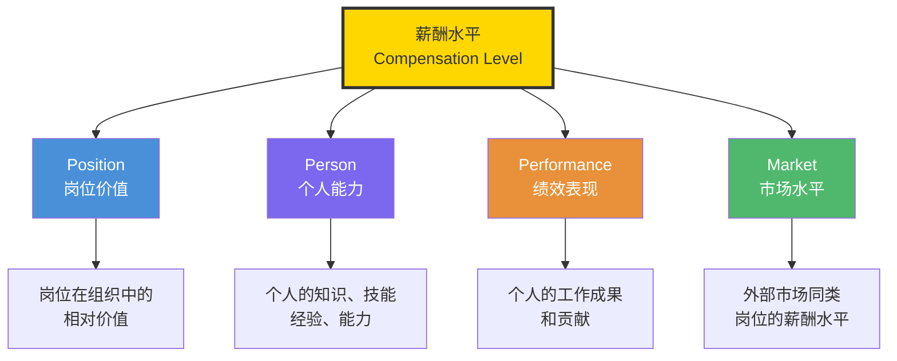
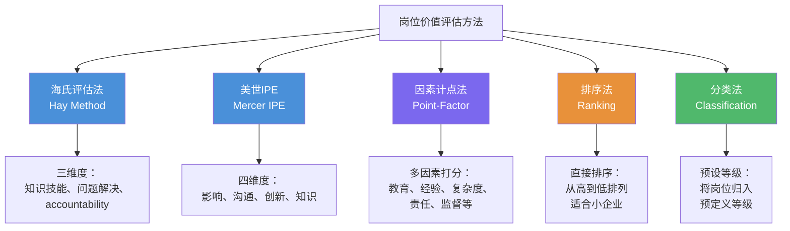
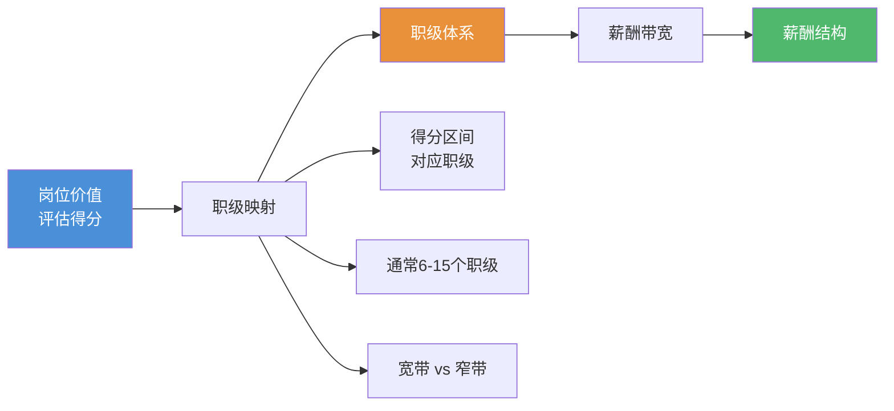
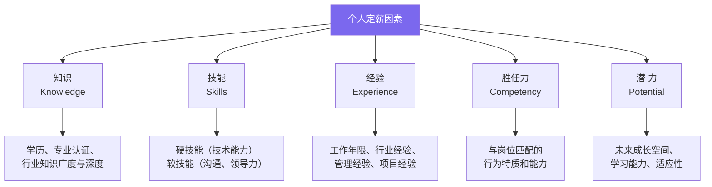
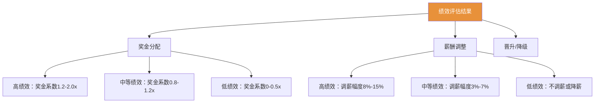
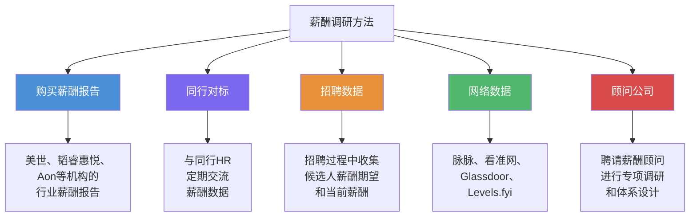
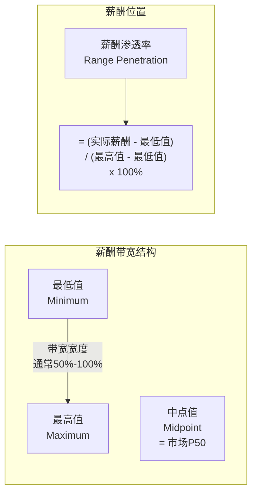
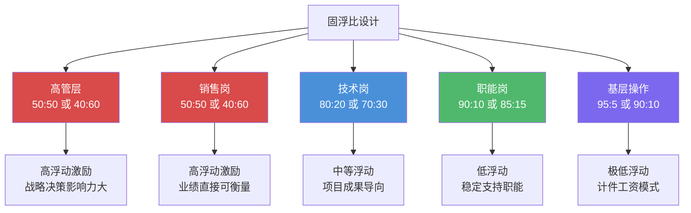
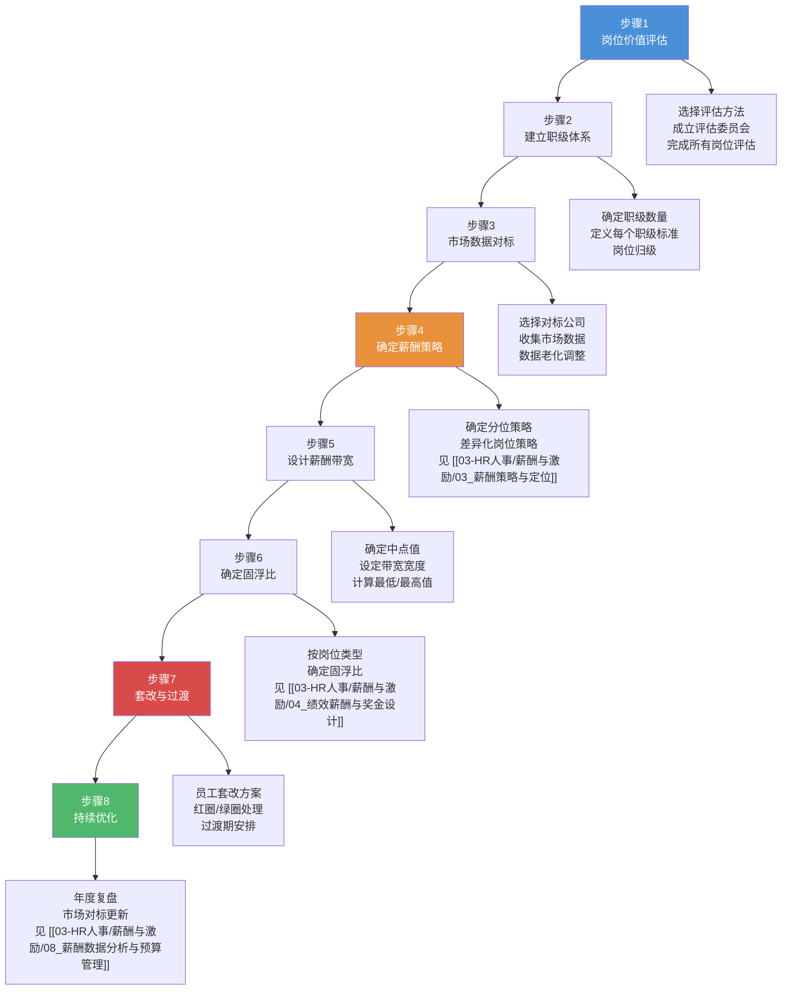
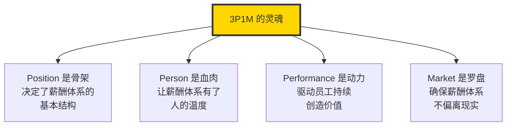

# 薪酬结构设计：3P1M模型

> 3P1M 是薪酬结构设计的核心方法论 —— 将"该给多少钱"从经验判断变成系统化决策。

---

## 一、什么是3P1M模型

### 1.1 模型概述

3P1M 模型是薪酬结构设计领域最经典、最广泛应用的方法论框架。它将薪酬的决定因素分解为四个维度：

### 1.2 为什么需要3P1M

在没有系统化薪酬模型之前，企业定薪通常依赖三种方式：

| 方式 | 问题 | 后果 |
|------|------|------|
| 老板拍脑门 | 完全主观，缺乏依据 | 薪酬体系混乱，内部不公平 |
| 看候选人要价 | 被市场牵着走 | 新老倒挂，薪酬体系不可持续 |
| 照搬同行 | 忽略自身业务特点 | 战略不一致，人才错配 |

3P1M 模型的价值在于：**将薪酬决策从"拍脑门"变成"有据可依"**。

---

## 二、Position（岗位价值）：以岗定薪

### 2.1 岗位价值评估的核心逻辑

Position 维度回答的问题是：**这个岗位对公司有多重要？**

岗位价值评估不是评"人"——我们评估的是岗位本身的价值，而不是坐在这个岗位上的人。一个人可能能力很强，但如果他所在的岗位价值有限，他的薪酬上限也会受到岗位带宽的限制。

### 2.2 主流岗位价值评估方法

### 2.3 海氏评估法详解

海氏评估法（Hay Method）是全球使用最广泛的岗位价值评估方法，其核心公式为：

$$
\text{岗位价值} = \text{知识技能} \times \text{问题解决能力} + \text{责任性（Accountability）}
$$

**三个评价维度**：

| 维度 | 子因素 | 评价要点 |
|------|--------|----------|
| 知识技能（Know-How） | 专业技术知识、管理幅度、人际关系技能 | 完成该岗位工作需要什么样的知识储备？ |
| 问题解决（Problem Solving） | 思考环境、思考挑战 | 该岗位面对的问题有多复杂？需要什么样的思考能力？ |
| 责任性（Accountability） | 行动自由度、影响范围、影响性质 | 该岗位的决策对公司的影响有多大？ |

> [!tip] 海氏评估法的精妙之处
> 海氏评估法将"知识技能"与"问题解决"相乘（而非相加），是因为它认为知识技能需要通过问题解决能力来"转化"为价值。一个拥有知识但不会解决问题的人，岗位价值是有限的。而"责任性"作为加项，体现了"位高权重"的独立价值。

### 2.4 从岗位价值到职级体系

岗位价值评估完成后，需要将评估结果转化为职级体系：

**职级设计的关键决策**：

| 决策点 | 选项 | 适用场景 |
|--------|------|----------|
| 职级数量 | 少层级（5-7级） | 扁平化组织、科技公司 |
| 职级数量 | 多层级（10-15级） | 传统组织、制造业、金融业 |
| 带宽策略 | 宽带薪酬（100%+） | 强调个人成长、淡化晋升 |
| 带宽策略 | 窄带薪酬（30%-50%） | 强调层级差异、精细化管理 |

---

## 三、Person（个人能力）：以人定薪

### 3.1 Person 维度要解决的问题

Position 解决的是"这个岗位值多少钱"，Person 解决的是"这个人值多少钱"。

同一个岗位，不同的人来做，价值产出可能天差地别。Person 维度就是要在岗位价值的基础上，根据个人的能力差异进行差异化定薪。

### 3.2 影响个人薪酬的能力因素

### 3.3 能力定薪的实践方式

| 方式 | 描述 | 适用场景 |
|------|------|----------|
| 能力等级制 | 同一岗位按能力分Junior/Senior/Staff等 | 技术岗位、专业岗位 |
| 技能薪酬（Skill-based Pay） | 按掌握的技能数量和等级付薪 | 制造业、技术密集型岗位 |
| 经验溢价 | 在岗位薪酬基准上按经验年限加成 | 咨询、法律、医疗等经验密集型行业 |
| 学历溢价 | 按学历水平在基准上加成 | 校招定薪、研究型岗位 |

> [!warning] Person 定薪的边界
> 个人能力定薪必须在岗位薪酬带宽内进行。如果一个人的能力远超岗位要求，应该考虑的是"这个人是否应该在这个岗位"，而不是无限制地突破带宽上限。突破带宽的定薪需要在薪酬委员会层面进行审批。

---

## 四、Performance（绩效表现）：以绩定奖

### 4.1 Performance 维度的定位

Performance 维度主要影响的是**浮动薪酬**（奖金、调薪幅度），而非基础薪酬。这一维度将在 [[03-HR人事/薪酬与激励/04_绩效薪酬与奖金设计]] 中详细展开。

### 4.2 绩效与薪酬的联动机制

### 4.3 绩效薪酬的公平性挑战

- **绩效评级的主观性**：如何确保绩效评级客观公正？（参见 [[03-HR人事/绩效管理/00_MOC_绩效管理中枢]]）
- **校准机制**：绩效校准（Calibration）是确保跨部门公平性的关键
- **强制分布**：强制分布（如271分布）的利弊讨论

---

## 五、Market（市场水平）：以市为锚

### 5.1 Market 维度的作用

Market 维度回答的问题是：**市场上同类岗位的薪酬水平是多少？**

Market 是薪酬设计的"锚点"。没有市场对标，内部再公平的薪酬体系也可能完全脱离现实。

### 5.2 薪酬调研方法论

### 5.3 市场数据的使用

市场数据不是"照抄"的，而是"参考"的。市场数据的使用需要考虑：

1. **对标公司选择**：选择与自身业务模式、规模、发展阶段相似的公司
2. **数据时效性**：薪酬数据每年更新，需要考虑数据的老化（Aging）
3. **地域差异**：一线城市 vs 二三线城市的薪酬差异系数
4. **行业差异**：不同行业的薪酬水平差异（如互联网 vs 传统制造）

---

## 六、职级体系与薪酬带宽

### 6.1 什么是薪酬带宽

薪酬带宽（Salary Band / Salary Range）是指每个职级对应的薪酬范围，由最低值（Minimum）、中点值（Midpoint）和最高值（Maximum）组成。

### 6.2 带宽设计的关键参数

| 层级 | 典型带宽 | 中位值递进率 | 说明 |
|------|----------|-------------|------|
| 基层（P1-P3） | 40%-60% | 15%-20% | 岗位差异小，快速成长阶段 |
| 中层（P4-P6） | 50%-80% | 20%-30% | 管理能力差异开始显现 |
| 高层（P7-P9） | 80%-150% | 30%-50% | 个人能力差异极大 |
| 高管（VP+） | 100%-200% | 个案处理 | 高度个性化 |

### 6.3 级差设计

**级差（Grade Differential）**是指相邻职级中点值之间的差异比例。

$$
\text{级差} = \frac{\text{上级中点值} - \text{下级中点值}}{\text{下级中点值}} \times 100\%
$$

**级差设计原则**：

- 低层级级差较小（15%-20%）：因为低层级员工成长快，频繁晋升
- 高层级级差较大（30%-50%）：因为高层级晋升难度大，需要足够的薪酬差异来体现价值

### 6.4 重叠度设计

**重叠度（Overlap）**是指相邻职级带宽之间的重叠程度。

| 重叠度 | 含义 | 适用场景 |
|--------|------|----------|
| 高重叠（50%+） | 上级最低值低于下级最高值 | 宽带薪酬，强调个人成长 |
| 中重叠（20%-50%） | 适度重叠 | 平衡型薪酬设计 |
| 低重叠（0%-20%） | 几乎不重叠 | 窄带薪酬，强调层级差异 |

> [!tip] 重叠度的管理意义
> 高重叠度意味着一个资深员工可能比新晋管理者的薪酬更高，这体现了对"专业价值"的认可，是双通道职业发展的薪酬基础。但高重叠度也可能导致晋升激励不足，需要平衡。

---

## 七、薪酬结构：固定 vs 浮动

### 7.1 固浮比的概念

**固浮比（Fixed vs Variable Ratio）**，即固定薪酬与浮动薪酬的比例关系。

$$
\text{固浮比} = \text{固定薪酬} : \text{浮动薪酬（目标值）}
$$

### 7.2 不同岗位的固浮比设计

### 7.3 固浮比设计的核心原则

1. **影响力原则**：对业务结果影响越大的岗位，浮动薪酬占比越高
2. **可衡量性原则**：绩效越容易量化的岗位，浮动薪酬占比越高
3. **风险承受原则**：员工对薪酬波动的承受能力也是设计考量因素
4. **市场惯例原则**：参照行业惯例，避免与市场预期偏离过大

> [!important] 固浮比的关键认知
> 浮动薪酬占比高不等于"风险大"。正确设计的浮动薪酬应该是"干得好收入更高"而非"干不好就扣钱"。绑定高浮动薪酬的前提是：目标设定合理、绩效衡量清晰、员工有足够的能力去影响结果。

---

## 八、薪酬结构设计实操流程

### 套改中的红圈与绿圈

| 状态 | 含义 | 处理方式 |
|------|------|----------|
| 绿圈（Green Circle） | 员工薪酬低于带宽最低值 | 制定调薪计划，逐步提升到带宽内 |
| 红圈（Red Circle） | 员工薪酬高于带宽最高值 | 冻结调薪，通过晋升或职责调整来解决 |
| 正常 | 员工薪酬在带宽范围内 | 正常管理 |

> [!warning] 套改风险提示
> 薪酬套改是最容易引发员工不满的环节。核心原则：**不降薪**。对于红圈员工，不能直接降薪，而是通过"冻结调薪+等待晋升"的方式逐步消化。同时，套改方案必须有充分的沟通（详见 [[03-HR人事/薪酬与激励/07_薪酬沟通与透明度]]）。

---

## 九、3P1M模型的局限性与补充

### 9.1 模型的局限性

1. **静态性**：3P1M 是静态模型，无法完全反映快速变化的市场环境
2. **忽视团队因素**：模型聚焦个人，对团队协作的激励考虑不足
3. **实施成本**：全面实施 3P1M 需要大量的数据收集和分析工作

### 9.2 AI时代的补充

在 AI 时代，3P1M 模型正在被数据驱动的动态薪酬管理系统所补充（详见 [[03-HR人事/薪酬与激励/09_AI时代的薪酬管理新趋势]]）：

- **实时市场数据**：AI 可以实时抓取和分析市场薪酬数据，替代年度薪酬调研
- **个性化优化**：AI 可以帮助设计更精准的个性化薪酬方案
- **公平性监控**：AI 可以持续监控薪酬公平性指标，及时预警

---

## 十、总结

3P1M 模型是薪酬结构设计的核心框架，它将薪酬决策分解为四个可量化、可管理的维度。但模型是工具，不是目的。真正的挑战在于：**如何在这个框架下，做出符合企业战略、适应市场变化、满足员工期望的薪酬决策。**

---

## 延伸阅读

- [[03-HR人事/薪酬与激励/03_薪酬策略与定位]] —— 如何确定市场分位策略
- [[03-HR人事/薪酬与激励/04_绩效薪酬与奖金设计]] —— Performance 维度的深度展开
- [[03-HR人事/薪酬与激励/08_薪酬数据分析与预算管理]] —— 薪酬体系的量化管理
- [[03-HR人事/薪酬与激励/09_AI时代的薪酬管理新趋势]] —— AI 如何重塑薪酬结构设计
- [[03-HR人事/绩效管理/00_MOC_绩效管理中枢]] —— 绩效与薪酬的联动机制

---

*3P1M 不是公式，而是思维框架。它教会我们的不是"算出一个数字"，而是"系统性地思考薪酬决策"。*