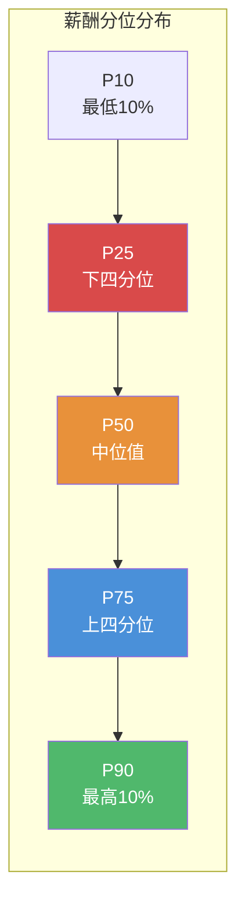
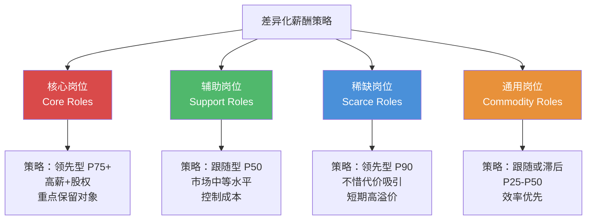
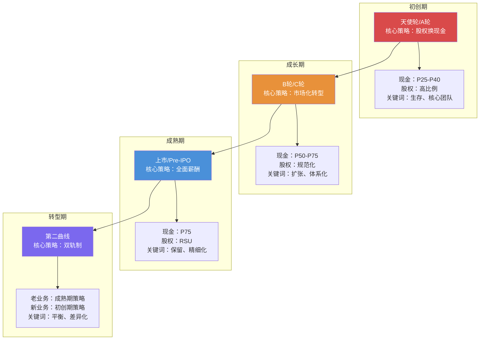
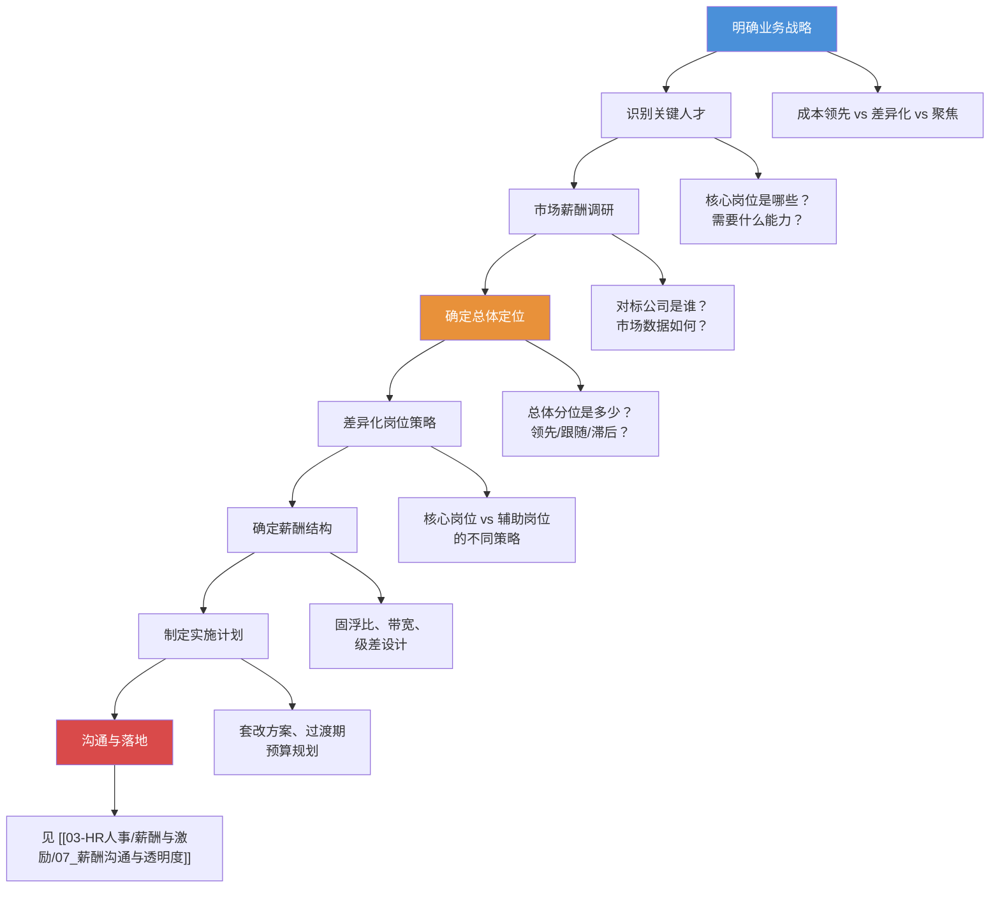
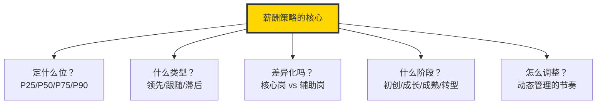

# 薪酬策略与定位

> 薪酬策略的本质是回答一个问题：我们用什么样的薪酬水平，吸引什么样的人，实现什么样的战略目标？

---

## 一、薪酬市场定位：分位策略

### 1.1 什么是分位策略

**分位（Percentile）**是薪酬市场定位的核心概念。当你看到一个薪酬数据报告中的"P50 = 50万"，意味着在调查样本中，有50%的人薪酬低于50万，50%的人高于50万。



### 1.2 各分位策略的含义与适用场景

| 分位 | 市场含义 | 人才吸引力 | 成本压力 | 适用场景 |
|------|----------|-----------|----------|----------|
| **P25** | 低于市场平均水平 | 弱 | 低 | 成本领先战略、劳动密集型 |
| **P50** | 市场中等水平 | 中等 | 中等 | 跟随策略、大多数企业 |
| **P75** | 高于市场平均水平 | 强 | 较高 | 差异化战略、争夺顶尖人才 |
| **P90** | 远超市场平均水平 | 极强 | 高 | 精英策略、头部企业 |

### 1.3 分位选择的误区

> [!warning] 常见误区
> 很多企业认为"分位越高越好"。实际上，分位策略不是越高越好，而是越匹配越好。P90 的薪酬策略如果匹配的是一个不需要顶尖人才的业务，那就是在浪费股东的钱。同时，高薪酬也意味着高期望——如果员工拿着 P90 的薪酬却只产出 P50 的绩效，这对组织士气的打击是巨大的。

---

## 二、薪酬策略的三种基本类型

### 2.1 领先型策略（Lead Strategy）

**定义**：将薪酬水平定位于市场前列（P75-P90），以吸引和保留最优秀的人才。

```mermaid
graph TD
    LEAD["领先型策略"] --> L1["优势"]
    LEAD --> L2["劣势"]
    LEAD --> L3["适用条件"]

    L1 --> L1A["吸引顶尖人才"]
    L1 --> L1B["降低招聘难度"]
    L1 --> L1C["提升员工忠诚度"]
    L1 --> L1D["成为行业标杆"]

    L2 --> L2A["人力成本高"]
    L2 --> L2B["可能吸引"向钱看"的人"]
    L2 --> L2C["降低薪酬激励弹性"]
    L2 --> L2D["压缩利润空间"]

    L3 --> L3A["业务处于高利润行业"]
    L3 --> L3B["人才是核心竞争力"]
    L3 --> L3C["企业处于快速成长期"]
    L3 --> L3D["品牌溢价能力强"]

    style LEAD fill:#4A90D9,color:#fff
```

**领先型策略的典型代表**：

- **科技巨头**（Google、Meta、字节跳动）：以高薪吸引顶尖工程师
- **顶级咨询公司**（麦肯锡、BCG、贝恩）：高薪吸引顶尖商学院毕业生
- **头部投行/PE**：高薪吸引顶尖金融人才

### 2.2 跟随型策略（Match Strategy）

**定义**：将薪酬水平定位于市场中位值（P50），跟随市场节奏调整。

**跟随型策略的特征**：

| 维度 | 特征 |
|------|------|
| 薪酬水平 | 整体 P50，核心岗位可略高 |
| 调薪策略 | 紧跟市场平均调薪幅度 |
| 竞争优势 | 不靠薪酬，靠其他维度（文化、发展、品牌等） |
| 风险 | 在人才争夺战中可能处于劣势 |

**适用场景**：

- 成熟行业、稳定发展阶段
- 企业品牌本身就具有吸引力（如知名消费品公司）
- 全面薪酬的其他维度（文化、福利、发展）具有竞争力

### 2.3 滞后型策略（Lag Strategy）

**定义**：将薪酬水平定位于市场低位（P25-P40），控制人力成本。

> [!warning] 滞后型策略不是"抠门"
> 有效的滞后型策略不是简单地"给钱少"，而是通过其他方式弥补薪酬差距，例如：
> - 初创公司：低薪 + 高股权（未来价值）
> - 非营利组织：低薪 + 使命驱动
> - 事业单位：低薪 + 稳定性 + 福利
> - 培训型组织：低薪 + 大量学习成长机会

**滞后型策略的补偿机制**：

| 补偿方式 | 说明 | 典型场景 |
|----------|------|----------|
| 股权期权 | 用未来的财富换取当下的低薪 | 初创公司 |
| 使命愿景 | 用意义感弥补薪酬差距 | 非营利、社会企业 |
| 学习成长 | 用能力提升机会换取低薪 | 管培生项目、学徒制 |
| 工作生活平衡 | 用时间和自由度换取低薪 | 远程办公、弹性工作 |
| 稳定性 | 用职业安全感换取低薪 | 国企、事业单位 |

---

## 三、差异化薪酬策略：不同岗位不同策略

### 3.1 为什么需要差异化

一刀切的薪酬策略是最懒惰的做法。不同岗位对业务的影响不同、市场稀缺度不同、可替代性不同，薪酬策略理应差异化。

### 3.2 岗位分类与差异化策略



### 3.3 核心岗位识别矩阵

| 维度 | 高战略价值 | 低战略价值 |
|------|-----------|-----------|
| **高市场稀缺** | 核心岗位（领先型 P75+） | 稀缺岗位（领先型 P90） |
| **低市场稀缺** | 关键岗位（跟随型+ P50-P75） | 通用岗位（跟随或滞后 P25-P50） |

> [!tip] 如何识别核心岗位
> 核心岗位的三个判断标准：
> 1. **战略影响**：这个岗位的绩效差异对业务结果的影响有多大？
> 2. **替代难度**：如果这个岗位的人离开，找到合适替代者需要多长时间？
> 3. **人才稀缺**：市场上具备这个岗位所需能力的人有多少？

---

## 四、不同企业阶段的薪酬策略差异

这是薪酬策略中最具战略视角的部分。同一家企业在不同阶段，薪酬策略应该完全不同。

### 4.1 企业生命周期与薪酬策略



### 4.2 各阶段详解

**初创期（天使轮/A轮）**：

| 维度 | 策略 |
|------|------|
| 现金薪酬 | 低于市场（P25-P40），保证基本生活 |
| 股权激励 | 核心手段，期权池通常 10%-20% |
| 核心逻辑 | 用未来的财富换取当下的低成本 |
| 关键挑战 | 如何说服人才相信"未来" |
| 典型错误 | 现金给太多，烧钱太快；股权给太少，无法激励 |

**成长期（B轮/C轮）**：

| 维度 | 策略 |
|------|------|
| 现金薪酬 | 逐步市场化（P50-P75） |
| 股权激励 | 规范化，期权池缩减至 5%-10% |
| 核心逻辑 | 从"创始人魅力"驱动转向"体系化"驱动 |
| 关键挑战 | 新老员工薪酬平衡，套改过渡 |
| 典型错误 | 沿用初创期薪酬逻辑，无法吸引市场化人才 |

**成熟期（上市/Pre-IPO）**：

| 维度 | 策略 |
|------|------|
| 现金薪酬 | 市场领先（P75） |
| 股权激励 | RSU 为主，每年授予 |
| 核心逻辑 | 全面薪酬体系，精细化管理 |
| 关键挑战 | 保持创业精神，避免大公司病 |
| 典型错误 | 薪酬体系过于僵化，无法激励创新 |

**转型期**：

| 维度 | 策略 |
|------|------|
| 核心策略 | 双轨制薪酬体系 |
| 老业务 | 成熟期策略，稳定为主 |
| 新业务 | 初创期策略，创业式激励 |
| 关键挑战 | 内部公平感，资源分配 |
| 典型错误 | 一刀切，用同一套薪酬体系管理新旧业务 |

> [!important] 转型期薪酬策略的关键
> 转型期最大的薪酬陷阱是"一碗水端平"。如果你用成熟期业务的薪酬体系去管理创新型新业务，新业务永远无法吸引到创业型人才。反之，如果你用初创期的低薪+高股权去管理成熟业务，稳定运营的人才会大量流失。**双轨制是转型期薪酬管理的必然选择。**

---

## 五、薪酬策略的制定流程



---

## 六、薪酬策略的常见挑战与应对

### 6.1 新老员工薪酬倒挂

**问题**：市场薪酬上涨，新招聘员工薪酬高于同等资历的老员工。

**应对策略**：

1. **承认市场现实**：薪酬倒挂本质上是市场变化快于内部调薪机制
2. **系统化调整**：通过年度调薪机制逐步拉平，而非一次性补偿
3. **透明沟通**：向老员工解释薪酬倒挂的原因，并说明调整计划
4. **增加非薪酬认可**：对老员工给予更多的认可、发展机会和尊重

### 6.2 地域薪酬差异

**问题**：同一岗位在不同城市薪酬差异大，如何管理？

**应对策略**：

| 策略 | 描述 | 适用场景 |
|------|------|----------|
| 统一薪酬 | 全国统一薪酬标准 | 小而精的团队，远程办公文化 |
| 地域系数 | 按城市级别设定薪酬系数 | 大型企业，多地办公 |
| 总部基准 | 以总部所在城市为基准，其他城市按比例调整 | 总部集中型企业 |

### 6.3 薪酬策略与组织文化的冲突

**问题**：薪酬策略与宣称的组织文化不一致。

**示例**：

- 宣称"扁平化"但薪酬层级差异极大
- 宣称"创新驱动"但薪酬全是固定薪资
- 宣称"客户第一"但薪酬考核全看销售额

> [!quote] 薪酬是文化的试金石
> "不要听一家公司说了什么，看它的薪酬体系奖励了什么。薪酬体系是组织文化最诚实的表达。"

---

## 七、薪酬策略的国际化视角

### 7.1 不同市场的薪酬策略差异

| 市场 | 特征 | 薪酬策略特点 |
|------|------|-------------|
| 美国 | 市场驱动，薪酬透明化趋势 | 基薪高、股权激励普遍、绩效导向强 |
| 欧洲 | 福利导向，工会力量强 | 基薪中等、福利丰厚、薪酬增长缓慢 |
| 中国 | 高速发展，人才竞争激烈 | 互联网行业薪酬高、传统行业偏低、股权激励兴起 |
| 东南亚 | 新兴市场，人才供给不足 | 对中高层管理人才需要高溢价 |
| 日本 | 年功序列制传统 | 薪酬与年龄/工龄挂钩，变革缓慢 |

### 7.2 跨境薪酬管理

对于跨国企业，薪酬策略需要额外考虑：

- **购买力平价（PPP）**：同样的薪酬在不同国家的实际购买力差异
- **税务优化**：不同国家的个人所得税制度差异
- **外派薪酬**：外派员工的薪酬设计（津贴、住房、子女教育等）
- **合规要求**：不同国家的劳动法、最低工资标准

---

## 八、总结

薪酬策略不是"定个数字"那么简单，而是需要综合考虑业务战略、人才市场、企业阶段、岗位价值的系统性决策。



最终，一个好的薪酬策略应该让企业能够回答三个问题：

1. **我们想吸引什么样的人？** —— 薪酬策略决定了你的人才池
2. **我们想保留什么样的人？** —— 薪酬策略决定了你的核心人才留存率
3. **我们想激励什么样的行为？** —— 薪酬策略决定了组织的行为导向

---

## 延伸阅读

- [[03-HR人事/薪酬与激励/02_薪酬结构设计：3P1M模型]] —— 策略落地到结构的桥梁
- [[03-HR人事/薪酬与激励/04_绩效薪酬与奖金设计]] —— 如何通过奖金实现策略意图
- [[03-HR人事/薪酬与激励/05_长期激励：期权与股权]] —— 初创期和成长期的关键策略工具
- [[03-HR人事/薪酬与激励/08_薪酬数据分析与预算管理]] —— 策略执行的量化保障
- [[02-AI趋势与素养/AI Native组织变革/00_MOC_AI Native组织变革中枢]] —— 组织变革如何影响薪酬策略

---

*薪酬策略不是HR的"抽屉文件"，而是企业战略在人才领域的投射。*