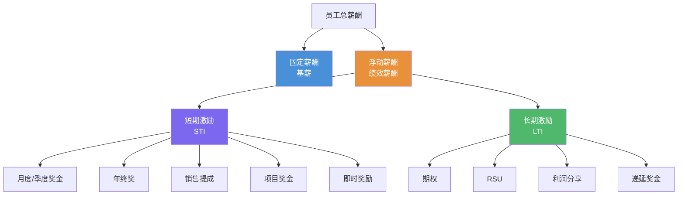
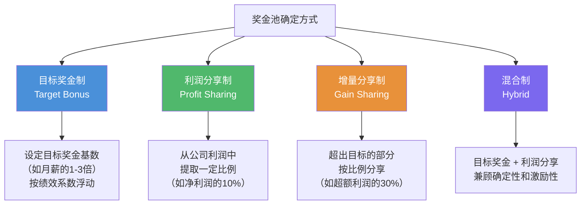
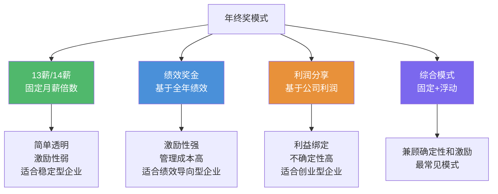
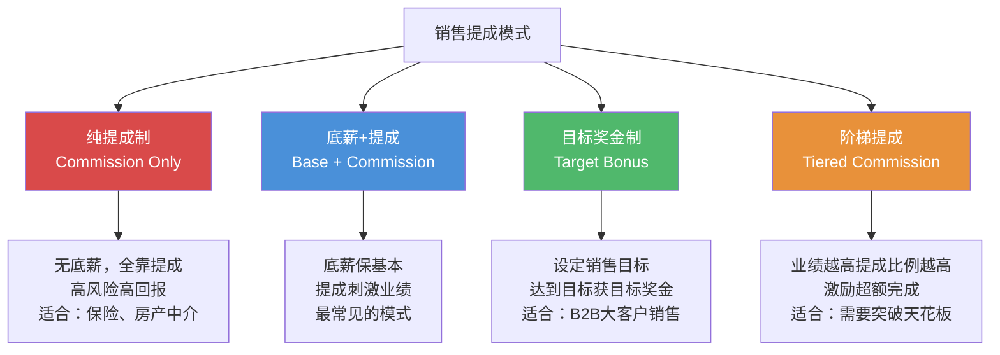
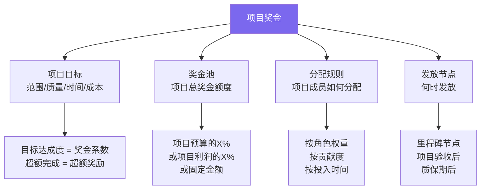
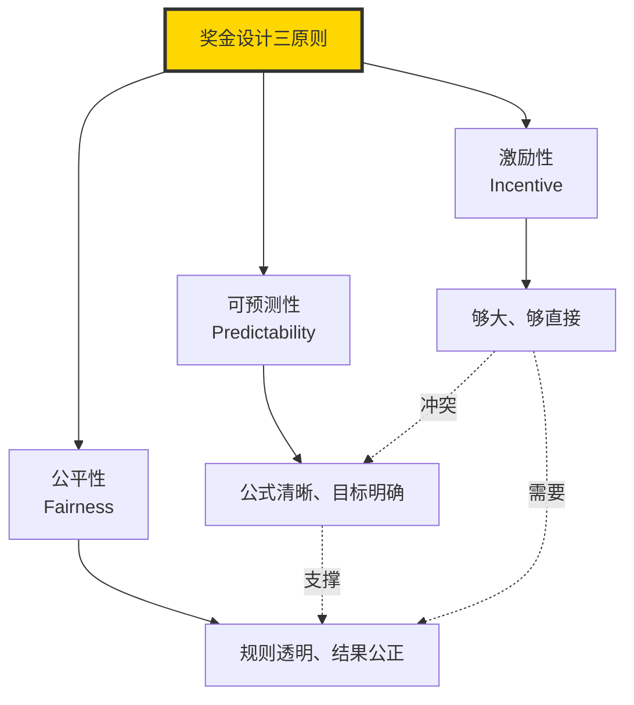
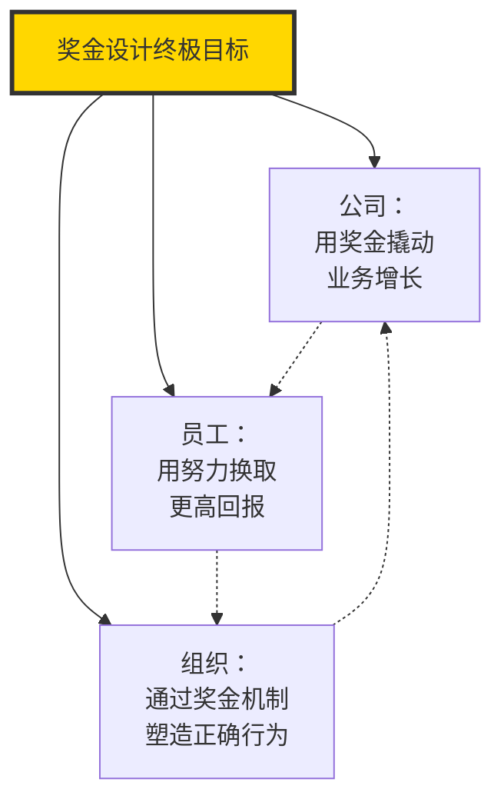

# 绩效薪酬与奖金设计

> 奖金设计的核心不是"怎么分钱"，而是"如何通过分钱驱动正确的行为"。

---

## 一、绩效薪酬概述

### 1.1 什么是绩效薪酬

绩效薪酬（Performance-based Pay）是将员工的薪酬与其工作绩效直接挂钩的薪酬组成部分。区别于固定的基薪，绩效薪酬是**浮动**的、**有条件**的、**与结果关联**的。

### 1.2 绩效薪酬的激励逻辑

绩效薪酬之所以有效，基于一个简单但强大的心理机制：

$$
\text{行为} \rightarrow \text{绩效} \rightarrow \text{奖金} \rightarrow \text{满足感} \rightarrow \text{强化行为}
$$

这个闭环的关键在于：**奖金与绩效之间的因果关系必须是清晰、可信、及时的**。

> [!important] 绩效薪酬的灵魂
> 绩效薪酬设计的核心原则是 **"激励性、可预测性、公平性"** 三者的平衡。偏废任何一个都会导致激励失效甚至产生负面效果。

---

## 二、短期激励：月度/季度奖金

### 2.1 月度/季度奖金的设计逻辑

**短期激励**是最常见的绩效薪酬形式，其核心特点是周期短、反馈快、与日常绩效直接挂钩。

### 2.2 奖金池的确定方式

### 2.3 个人奖金分配公式

最常见的个人奖金计算模型：

$$
\text{个人奖金} = \text{目标奖金基数} \times \text{公司绩效系数} \times \text{部门绩效系数} \times \text{个人绩效系数}
$$

**各系数的设计原则**：

| 系数 | 范围 | 决定因素 | 权重建议 |
|------|------|----------|----------|
| 公司绩效系数 | 0.5-1.5 | 公司整体业绩达成 | 20%-30% |
| 部门绩效系数 | 0.5-1.5 | 部门/团队业绩达成 | 20%-30% |
| 个人绩效系数 | 0-2.0 | 个人绩效评估结果 | 40%-60% |

> [!tip] 权重设计的艺术
> 个人绩效系数权重越高，激励越直接，但可能引发"各自为战"；公司/部门系数权重越高，越能促进协作，但个人激励感减弱。通常建议个人系数不低于40%，以保持足够的激励强度。

### 2.4 季度奖金的节奏设计

| 节奏 | 优点 | 缺点 | 适用场景 |
|------|------|------|----------|
| 月度 | 反馈即时，激励强 | 管理成本高，容易短视 | 销售、操作类岗位 |
| 季度 | 平衡即时性和管理成本 | 反馈周期略长 | 大多数岗位 |
| 半年度 | 管理成本低 | 反馈太慢，激励弱 | 项目制、长周期业务 |

---

## 三、年终奖设计

### 3.1 年终奖的特殊性

年终奖不同于月度/季度奖金，它承载了更多的功能：

1. **全年绩效的总结性回报**
2. **留人工具**（通常春节后发放，降低年初离职率）
3. **企业文化载体**（年终奖的"温度"体现公司文化）
4. **税收优化**（利用年终奖单独计税政策）

### 3.2 年终奖的主要模式

### 3.3 年终奖发放的时间策略

| 发放时间 | 优点 | 缺点 |
|----------|------|------|
| 12月底 | 员工过年有资金 | 年初离职风险高 |
| 春节前 | 过年前资金到位 | 离职风险仍未解决 |
| 春节后（3-4月） | 有效降低年初离职 | 员工等待焦虑 |
| 分批发放 | 平衡留人和满意度 | 管理复杂 |

---

## 四、销售提成设计

### 4.1 销售提成的特殊性

销售提成是绩效薪酬中最特殊的一种形式，因为销售的业绩天然可量化、结果直接关联公司收入。销售提成设计的核心是回答一个问题：**"你卖多少，我分你多少？"**

### 4.2 提成模式对比

### 4.3 提成设计的关键参数

| 参数 | 说明 | 设计要点 |
|------|------|----------|
| 提成基数 | 按什么计算提成（收入、毛利、回款） | 建议按毛利或回款，避免只追求收入 |
| 提成比例 | 提成占基数的百分比 | 需计算销售人员的总目标收入，反推比例 |
| 提成上限 | 是否有封顶 | 封顶会抑制超额动力，但可控制成本 |
| 提成周期 | 月度/季度结算 | 周期越短激励越强，但管理成本越高 |
| 区域/客户保护 | 避免内部恶性竞争 | 明确区域划分和客户归属规则 |

> [!warning] 销售提成的常见陷阱
> 1. **提成比例过高**：导致销售人员收入远超其价值贡献，不可持续
> 2. **只考核收入**：销售人员为冲业绩不计成本，公司利润受损
> 3. **提成政策频繁变动**：破坏信任，优秀销售离职
> 4. **新老客户无差异**：吃老本也能拿高提成，新客户开发动力不足

---

## 五、项目奖金设计

### 5.1 项目奖金的适用场景

项目奖金适用于以项目制运作的团队（如软件开发、咨询、研发、工程建设等）。

### 5.2 项目奖金的设计要素

### 5.3 项目奖金分配矩阵

| 角色 | 典型权重 | 说明 |
|------|----------|------|
| 项目经理 | 20%-30% | 承担项目整体责任 |
| 核心技术成员 | 15%-25% | 技术攻坚关键贡献 |
| 其他项目成员 | 按贡献/投入时间 | 多劳多得 |
| 支持人员 | 5%-10% | 辅助性支持 |

---

## 六、利润分享计划

### 6.1 什么是利润分享

利润分享（Profit Sharing）是将公司利润的一部分按一定规则分配给员工，让员工分享公司经营成果。

### 6.2 利润分享的激励机理

与个人绩效奖金不同，利润分享的激励对象是**集体**而非**个人**。它的核心逻辑是：**让员工感觉自己是"股东"而非"打工者"**。

### 6.3 利润分享的常见形式

| 形式 | 描述 | 适用场景 |
|------|------|----------|
| 全员利润分享 | 所有员工按薪酬比例分享利润池 | 希望全员利益绑定 |
| 核心团队利润分享 | 仅核心管理层/关键人才参与 | 资源有限，集中激励 |
| 递延利润分享 | 利润分享分期兑现 | 长期留人 |
| 虚拟股权 | 按虚拟股份分享利润 | 不想稀释真实股权 |

---

## 七、奖金设计的核心原则

### 7.1 激励性原则

奖金必须足够"大"才能产生激励效果。通常建议：

- **目标奖金**至少占年收入的 10%-20% 才有感知度
- **超额奖金**的增长曲线应该陡峭，让超额完成变得"值得"

### 7.2 可预测性原则

员工必须能够大致预测自己的奖金。如果奖金完全不可预测，激励效果就会消失：

- 奖金计算公式必须清晰
- 绩效目标必须在周期开始前设定
- 避免"黑箱"操作

### 7.3 公平性原则

奖金的公平性包括：

- **程序公平**：奖金分配规则透明、一致
- **分配公平**：奖金与贡献的匹配度合理
- **人际公平**：沟通过程中的尊重和解释

### 7.4 三大原则的平衡

> [!important] 三原则的张力
> 激励性要求奖金差异大，但公平性要求差异合理；可预测性要求公式稳定，但激励性要求动态调整。奖金设计者的核心工作就是在三者之间找到最优平衡点。

---

## 八、奖金设计的常见陷阱

### 8.1 "撒胡椒面"式奖金

**表现**：人人有奖金，但金额差异极小，高绩效者只比低绩效者多了一点点。

**后果**：激励效果为零，变成了"福利"。

**解决**：拉大奖金差距，高绩效者的奖金至少是低绩效者的 2-3 倍。

### 8.2 目标设定博弈

**表现**：员工为了拿到更多奖金，刻意压低目标；管理者为了激励，抬高目标。

**后果**：目标设定变成谈判游戏，失去管理意义。

**解决**：
- 目标设定与奖金脱钩（如用相对排名而非绝对达成）
- 引入外部对标，减少目标设定中的主观性
- 建立目标设定的校准机制

### 8.3 奖金发放延迟

**表现**：季度奖金拖到季度结束后两个月才发，年终奖拖到次年四月。

**后果**：激励的时效性丧失，员工感受不到"即时反馈"。

**解决**：优化奖金核算流程，缩短发放周期。

### 8.4 奖金变成"工资的一部分"

**表现**：员工将奖金视为"理所当然的年收入"，拿不到就是"被扣钱"。

**后果**：奖金的激励属性消失，变成了固定薪酬的心理预期。

**解决**：
- 明确沟通奖金的不确定性
- 奖金金额每年有显著波动
- 不要让奖金成为"惯例"

---

## 九、总结

奖金设计的本质，是通过"分钱"来"驱动行为"。一个优秀的奖金方案应该让员工清晰地知道：

1. **做什么能拿到奖金**（行为导向）
2. **做到什么程度能拿多少**（可预测性）
3. **为什么别人拿得比我多/少**（公平性）

---

## 延伸阅读

- [[03-HR人事/薪酬与激励/02_薪酬结构设计：3P1M模型]] —— 固浮比设计的基础框架
- [[03-HR人事/薪酬与激励/05_长期激励：期权与股权]] —— 长期激励与短期激励的配合
- [[03-HR人事/薪酬与激励/06_非物质激励：不只是钱]] —— 当奖金不是万能的
- [[03-HR人事/绩效管理/00_MOC_绩效管理中枢]] —— 绩效与薪酬的联动机制
- [[03-HR人事/薪酬与激励/08_薪酬数据分析与预算管理]] —— 奖金预算的编制与管理

---

*奖金不是"分钱"，而是"投资行为"。*