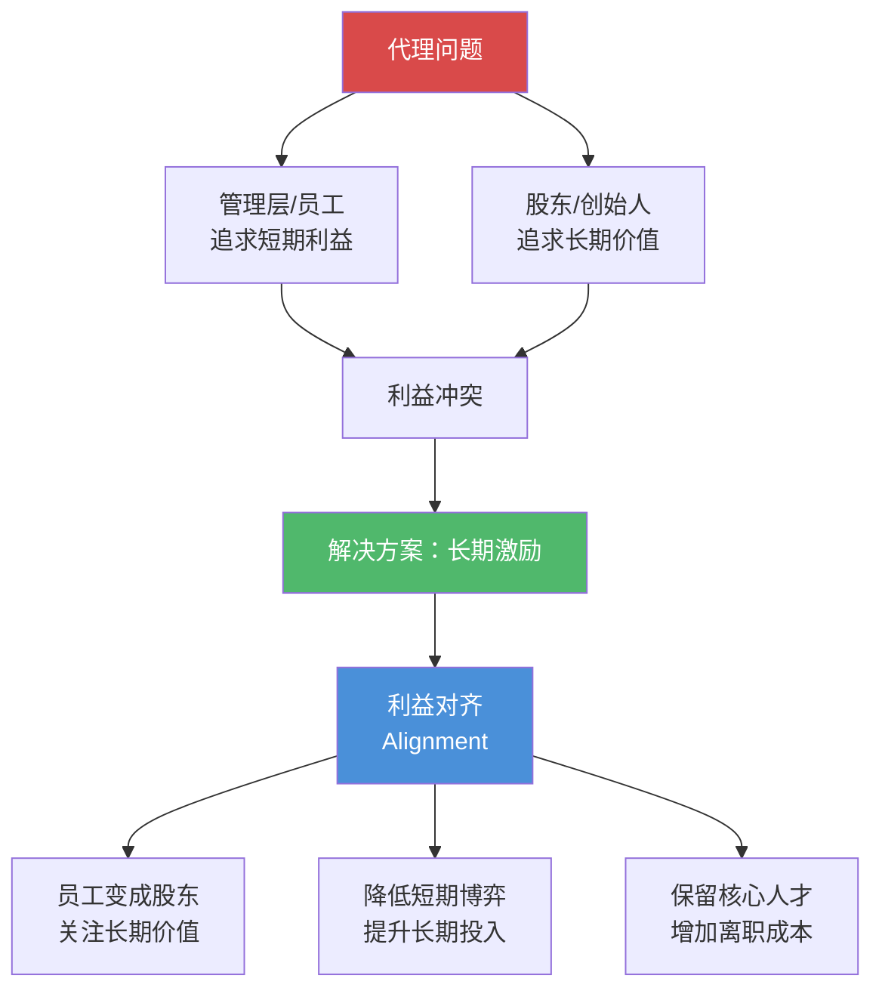
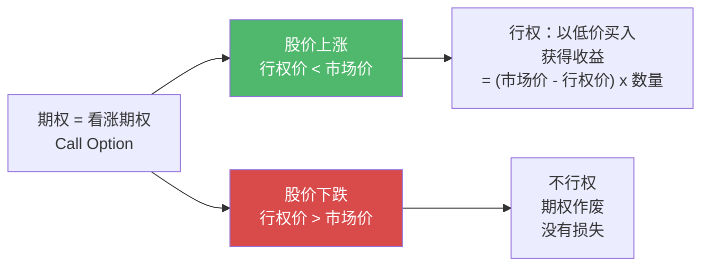
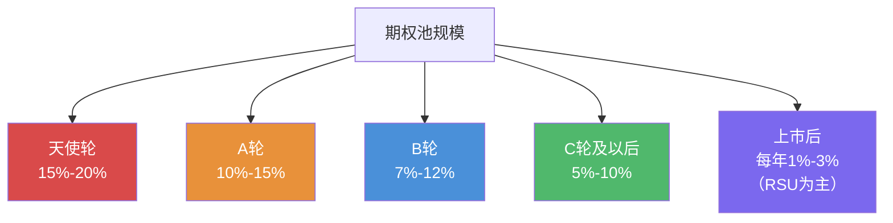
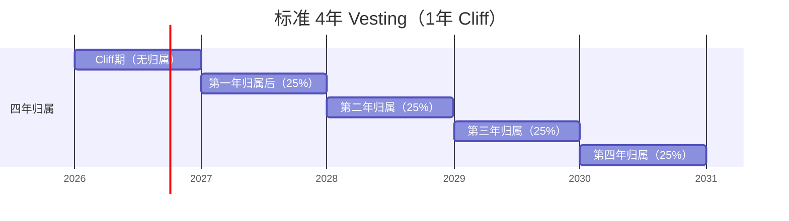
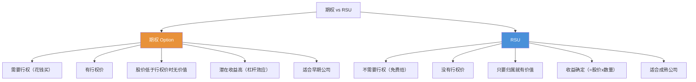
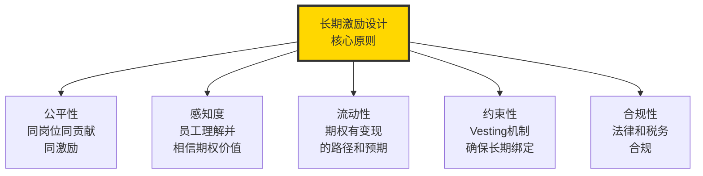

# 长期激励：期权与股权

> 期权的本质不是"送钱"，而是"用未来的财富换取当下的忠诚与奋斗"。

---

## 一、长期激励的本质

### 1.1 为什么需要长期激励

短期激励（奖金）解决的是"这个季度干得好"的问题，但无法解决"这个人与公司长期绑定"的问题。长期激励的诞生，正是为了解决代理理论中的核心矛盾：**股东与管理层/核心员工之间的利益不一致**。

### 1.2 长期激励 vs 短期激励

| 维度 | 短期激励（奖金） | 长期激励（期权/股权） |
|------|-----------------|---------------------|
| 时间周期 | 月度/季度/年度 | 3-5年或更长 |
| 激励对象 | 短期业绩 | 长期价值创造 |
| 风险特征 | 低风险，确定性高 | 高风险，不确定性高 |
| 心理效应 | "干得好就有钱" | "公司是我的" |
| 适用阶段 | 所有阶段 | 初创/成长期尤为关键 |

> [!important] 长期激励的核心认知
> 长期激励是一种"金手铐"——它让员工在离开时面临巨大的机会成本。但真正优秀的长期激励不是"锁住人"，而是"让人愿意留下来一起创造价值"。前者是恐惧驱动的，后者是希望驱动的。

---

## 二、期权的本质

### 2.1 期权是什么

期权（Stock Option）是赋予员工在未来某个时间以约定价格（行权价）购买公司股票的权利——但不是义务。

### 2.2 期权的关键要素

| 要素 | 说明 | 典型值 |
|------|------|--------|
| 授予数量 | 授予多少股期权 | 根据职级和贡献确定 |
| 行权价 | 购买股票的价格 | 最近一轮融资估值的折扣价 |
| Vesting | 分期归属的时间安排 | 4年，1年cliff |
| 到期日 | 期权失效的时间 | 通常10年 |
| 行权窗口 | 离职后多久内必须行权 | 通常90天（美国标准） |

### 2.3 期权不是"送钱"

> [!warning] 期权不是工资
> 期权是一种**风险资产**，不是确定性收入。期权的价值取决于公司未来的成长。如果公司不成长，期权就是一张废纸。HR在向员工解释期权时，必须帮助员工理解这一点，避免期权被误解为"确定性的未来收入"。

**期权的价值公式**：

$$
\text{期权价值} = (\text{退出时每股价值} - \text{行权价}) \times \text{归属数量} - \text{税费}
$$

---

## 三、期权池设计

### 3.1 什么是期权池

期权池（Option Pool）是公司预留出来用于员工股权激励的股份比例。期权池的大小直接影响：

- 创始人的股权稀释程度
- 能吸引和激励多少人才
- 投资人的估值计算

### 3.2 各阶段期权池典型规模

### 3.3 期权池的分配策略

| 角色 | 典型期权占比（占期权池） | 说明 |
|------|------------------------|------|
| 联合创始人 | 20%-40% | 按贡献和角色分配 |
| 早期核心员工（前10号） | 1%-5% | 承担了最大的早期风险 |
| 关键高管（CXO级别） | 1%-3% | 市场惯例 |
| 总监/核心工程师 | 0.1%-1% | 根据职级和稀缺性 |
| 普通员工 | 0.01%-0.1% | 广覆盖，普惠性 |

> [!tip] 期权的心理价值
> 对于普通员工，期权数量本身可能不大，但"拥有公司的一部分"的心理价值远超其经济价值。这种"所有权心态"是期权激励最强大的心理杠杆。

---

## 四、行权价与 Vesting

### 4.1 行权价的设计

行权价（Exercise Price / Strike Price）是期权持有人购买公司股票的价格。

**行权价设定的核心原则**：

- 不低于授予时的公允市场价值（Fair Market Value, FMV）
- 通常由 409A 估值（美国）或类似方法确定
- 早期公司行权价通常很低（几分钱到几毛钱），后期公司逐渐升高

### 4.2 Vesting 机制详解

Vesting（归属/兑现）是股权激励中最重要的设计机制之一。

**Vesting 的核心参数**：

| 参数 | 说明 | 典型设置 |
|------|------|----------|
| 总周期 | 全部归属完成的时间 | 4年 |
| Cliff | 第一个归属触发点 | 1年（满1年归属25%） |
| 节奏 | Cliff之后的归属频率 | 按月/按季度归属 |
| 加速条款 | 特定事件触发加速归属 | 被收购/IPO（单触发/双触发） |

**Cliff 的设计意义**：

> "Cliff 是员工和公司的双向选择期。如果员工在1年内离职，一分钱期权都拿不到。这既是对公司的保护，也是让员工在加入前认真思考：我真的愿意在这里至少干一年吗？"

### 4.3 加速归属（Acceleration）

| 类型 | 触发条件 | 说明 |
|------|----------|------|
| 单触发（Single Trigger） | 公司被收购 | 收购时自动加速归属 |
| 双触发（Double Trigger） | 公司被收购 + 员工被辞退 | 两个条件同时满足才加速 |
| 部分加速 | 按比例加速 | 如已归属50%则加速剩余50% |

---

## 五、RSU vs Option

### 5.1 RSU 是什么

RSU（Restricted Stock Unit，限制性股票单位）是公司承诺在未来某个时间给员工一定数量的公司股票。与期权不同，RSU 不需要员工"花钱购买"。

### 5.2 期权 vs RSU 对比

### 5.3 选择期权还是 RSU

| 公司阶段 | 推荐工具 | 原因 |
|----------|----------|------|
| 天使轮/A轮 | 期权 | 公司估值低，期权杠杆效应大 |
| B轮/C轮 | 期权为主，部分RSU | 逐步过渡到更稳定的激励工具 |
| Pre-IPO | 期权+RSU混合 | 平衡激励性和确定性 |
| 上市后 | RSU为主 | 股价稳定，员工偏好确定性 |

> [!important] 从期权到RSU的转型
> 当公司从早期走向成熟，股权激励工具从期权转向RSU是一个自然的演变。这个转型的标志是：**公司估值增长速度放缓，员工不再愿意为"期权价值的不确定性"承担风险。**

---

## 六、不同阶段的股权激励策略

### 6.1 天使轮/A轮

**核心策略**：用高比例的股权换取低现金薪酬。

| 维度 | 策略 |
|------|------|
| 期权池 | 15%-20% |
| 授予对象 | 创始团队、早期核心员工 |
| 授予数量 | 慷慨（核心员工1%-5%） |
| Vesting | 标准4年+1年cliff |
| 行权价 | 极低（名义价格） |
| 关键挑战 | 员工不理解期权价值，感知度低 |

### 6.2 B轮/C轮

**核心策略**：逐步规范化，现金薪酬与市场接轨。

| 维度 | 策略 |
|------|------|
| 期权池 | 10%-15% |
| 授予对象 | 扩展到中层管理者和关键岗位 |
| 授予数量 | 适度（VP级别0.5%-2%） |
| Vesting | 标准4年+1年cliff |
| 行权价 | 按409A估值 |
| 关键挑战 | 新老员工期权差异大，公平感问题 |

### 6.3 上市前（Pre-IPO）

**核心策略**：锁定期权变现预期，管理行权行为。

| 维度 | 策略 |
|------|------|
| 期权池 | 5%-10% |
| 授予对象 | 全员覆盖（广度） |
| 授予数量 | 精细化（按职级有标准） |
| Vesting | 可能引入绩效条件 |
| 关键挑战 | 员工行权资金压力、税务规划 |

---

## 七、初创公司股权激励的常见陷阱

### 7.1 陷阱一：期权给得太少

**表现**：创始人舍不得稀释股权，期权给得极其吝啬。

**后果**：核心员工期权价值不足以产生激励，无法吸引和保留人才。

**解决**：理解"做大的蛋糕分一小块 > 做不大的蛋糕全归自己"。

### 7.2 陷阱二：期权给得太随意

**表现**：没有标准，拍脑门给期权，同岗位差异巨大。

**后果**：内部不公平，引发矛盾。

**解决**：建立期权授予标准，按职级和贡献系统化分配。

### 7.3 陷阱三：行权窗口太短

**表现**：员工离职后90天内必须行权（美国标准），但中国员工没有这个习惯和资金准备。

**后果**：离职员工被迫放弃期权，激励效果大打折扣。

**解决**：考虑延长行权窗口（如1-2年），或转为"受限股票"形式。

### 7.4 陷阱四：忽视税务问题

**表现**：员工行权时产生巨额税务负担，但公司没有提前告知和规划。

**后果**：员工行权后发现"赚的钱大部分交了税"，甚至需要倒贴钱。

**解决**：提供税务咨询服务，帮助员工理解行权的税务影响。

### 7.5 陷阱五：期权信息不透明

**表现**：员工不知道自己有多少期权、值多少钱、什么时候能行权。

**后果**：期权激励形同虚设，员工感知度为零。

**解决**：建立期权管理平台，定期向员工通报期权状态和公司估值。

---

## 八、股权激励的沟通策略

详见 [[03-HR人事/薪酬与激励/07_薪酬沟通与透明度]]，这里强调几个关键点：

1. **授予时**：不要只说"给你多少股"，要说"为什么给你这么多"、"期权怎么变值钱"
2. **估值变化时**：及时更新员工对公司估值和期权价值的认知
3. **离职时**：清晰说明行权窗口、行权成本和税务影响

---

## 九、总结

长期激励不是"给员工发股票"那么简单。它是一个系统工程，需要从**法律结构、税务规划、估值管理、沟通策略、退出机制**等多个维度进行系统性设计。

---

## 延伸阅读

- [[03-HR人事/薪酬与激励/03_薪酬策略与定位]] —— 不同阶段的薪酬策略差异
- [[03-HR人事/薪酬与激励/04_绩效薪酬与奖金设计]] —— 短期激励与长期激励的配合
- [[03-HR人事/薪酬与激励/07_薪酬沟通与透明度]] —— 股权激励的沟通策略
- [[02-AI趋势与素养/AI Native组织变革/00_MOC_AI Native组织变革中枢]] —— 新组织形态下的股权激励创新

---

*期权不是"送钱"，而是"种树"。种得好，十年后所有人都在树下乘凉。*