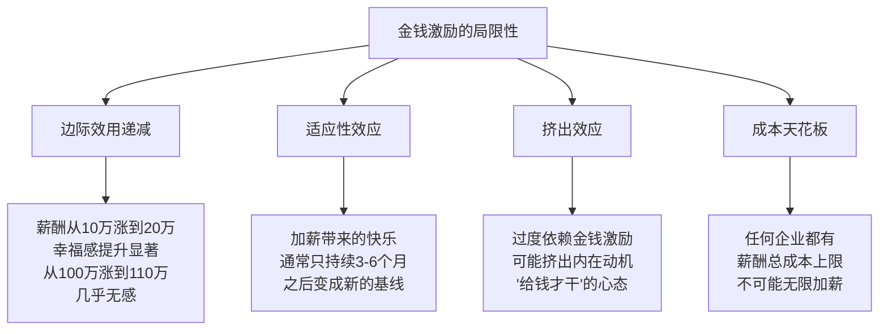
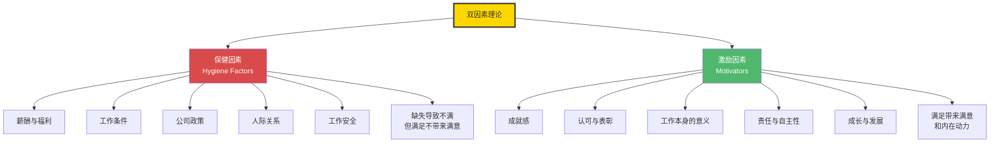
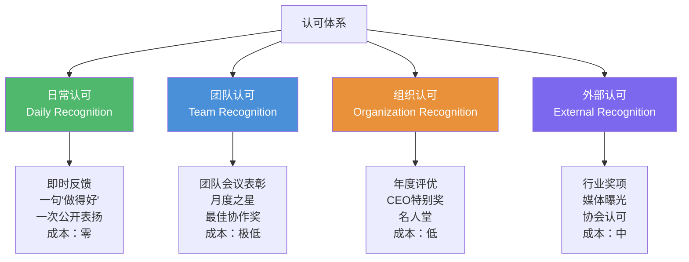
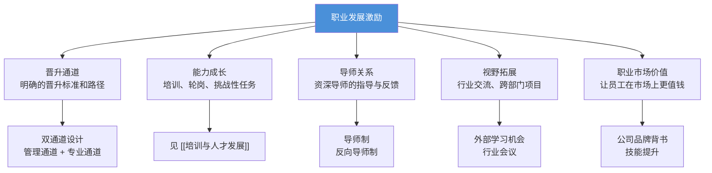
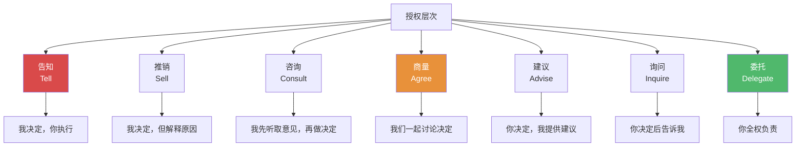
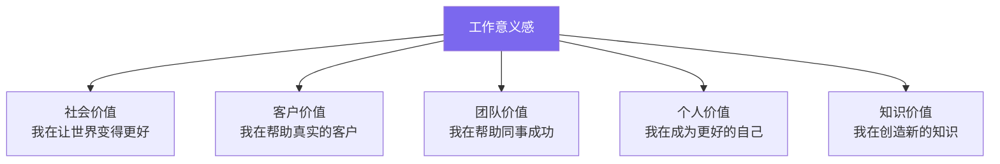
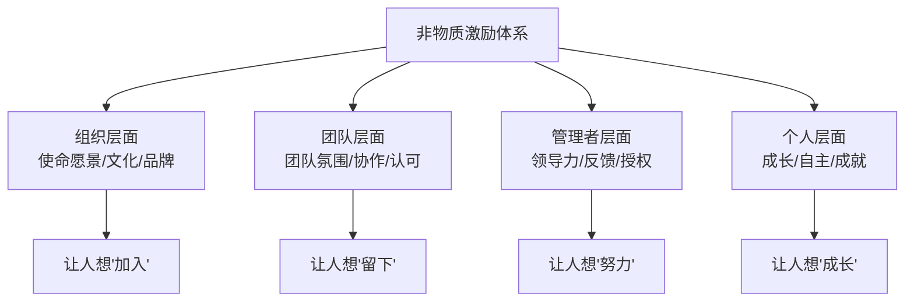
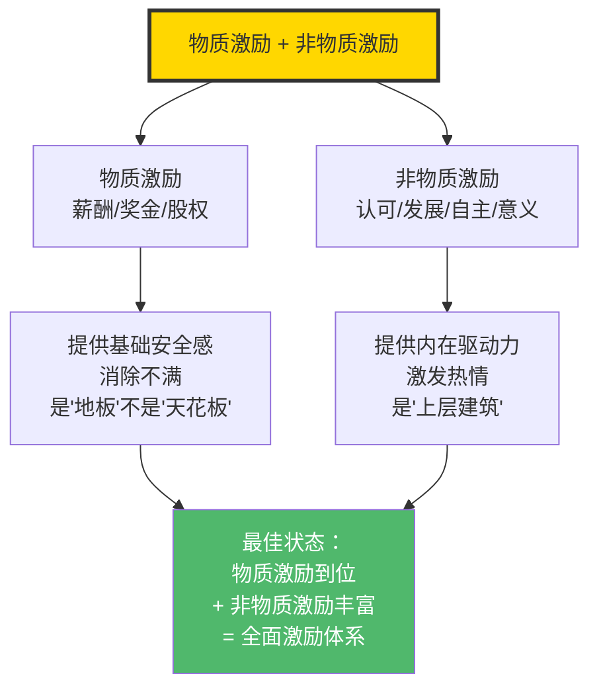
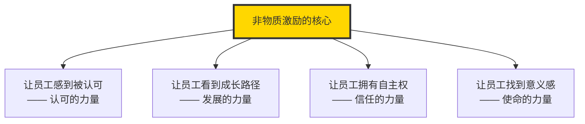

# 非物质激励：不只是钱

> 最好的激励，是让员工觉得"在这里工作，本身就是一种回报"。

---

## 一、为什么需要非物质激励

### 1.1 金钱激励的边界

薪酬和奖金作为激励工具，有其天然的局限性：

### 1.2 为什么有些公司薪资不高但人才趋之若鹜

这是一个值得深思的现象。我们可以观察到：

| 公司/组织 | 薪酬水平 | 吸引力来源 |
|-----------|----------|-----------|
| 特斯拉早期 | 低于市场 | 使命感、改变世界的愿景 |
| 麦肯锡 | 市场中等 | 职业发展、品牌背书、校友网络 |
| NASA | 远低于市场 | 使命感、荣誉感、顶尖项目 |
| 开源社区 | 无薪酬 | 自主性、技术挑战、社区认可 |
| 知名公益组织 | 低于市场 | 社会价值、使命驱动 |

**共同特征**：这些组织提供了超越金钱的"意义感"和"成长性"。

> [!quote] 战略视角
> 为什么有些公司薪资不高但人才趋之若鹜？答案在于：**当非物质激励足够强大时，它可以弥补甚至超越物质激励的差距。** 这些公司提供的不是"一份工作"，而是"一个身份认同"和"一个值得投入的事业"。当员工觉得"在这里工作让我成为更好的人"，薪酬就不再是唯一的考量因素。

---

## 二、双因素理论：激励的底层逻辑

### 2.1 赫茨伯格的双因素理论

赫茨伯格（Frederick Herzberg）在1959年提出的双因素理论（Two-Factor Theory），是理解非物质激励最重要的理论基础。

### 2.2 保健因素 vs 激励因素

| 维度 | 保健因素 | 激励因素 |
|------|----------|----------|
| 作用机制 | 消除不满，但不能带来满意 | 带来满意，激发内在动力 |
| 典型表现 | 薪酬、福利、办公环境 | 认可、成就、成长、自主 |
| 缺失后果 | 员工不满、抱怨、离职 | 员工不积极、缺乏动力 |
| 满足后果 | 员工"不抱怨"但"不兴奋" | 员工投入、创新、超越期望 |
| 管理策略 | 必须满足，但投入过多ROI低 | 重点投入，ROI高 |

### 2.3 双因素理论在薪酬管理中的应用

**薪酬是保健因素还是激励因素？**

- **基薪**：典型的保健因素。低了会不满，高了不一定满意。
- **奖金**：处于保健与激励的过渡地带。如果变成"预期收入"，就退化为保健因素；如果保持"不确定性"和"绩效关联"，则具有激励属性。
- **股权/期权**：激励因素，因为它的价值取决于公司成长和个人贡献。

> [!important] 关键洞察
> 很多公司犯的错误是：在保健因素上过度投入（如不断加薪、升级办公室），却忽视了激励因素（如认可、授权、成长机会）。结果是钱花了不少，员工依然"不兴奋"。

---

## 三、认可与表彰

### 3.1 认可的力量

认可是最简单、成本最低、但往往最被忽视的激励手段。研究表明，**被认可的员工比不被认可的员工敬业度高出2-3倍**。

### 3.2 认可的层次

### 3.3 有效认可的原则

| 原则 | 说明 | 反面示例 |
|------|------|----------|
| **及时** | 行为发生后尽快认可 | 年底才想起来表扬 |
| **具体** | 说明认可的具体行为 | "你做得很好"（太笼统） |
| **真诚** | 发自内心的认可 | 走过场式的"轮流表扬" |
| **公开** | 在适当的场合公开认可 | 只在私下说，影响力有限 |
| **个性化** | 用被认可者喜欢的方式 | 让不喜欢当众发言的人上台 |

> [!tip] 管理者的日常激励
> 最有效的认可往往不是来自HR设计的表彰体系，而是来自直属上级的日常互动。一个真诚的"谢谢你"、一次具体的"你刚才的处理方式很专业"、一次在团队面前提到的"这件事XX做得很棒"——这些看似微小的认可，积累起来就是巨大的激励力量。

---

## 四、职业发展机会

### 4.1 成长是最好的激励

对于有追求的员工来说，能力成长和职业发展往往比当下的薪酬更重要。他们愿意接受"当下的低薪"来换取"未来的高价值"。

### 4.2 职业发展激励的维度

### 4.3 双通道职业发展体系

双通道（管理通道 + 专业通道）是职业发展激励的基础设施：

| 管理通道 | 专业通道 | 薪酬对标 |
|----------|----------|----------|
| M1 主管 | P1 初级工程师 | 同级 |
| M2 经理 | P2 高级工程师 | 同级 |
| M3 高级经理 | P3 资深工程师 | 同级 |
| M4 总监 | P4 首席工程师 | 同级 |
| M5 VP | P5 杰出工程师 | 同级 |

> [!important] 双通道不是"两条平行的路"
> 真正的双通道意味着：选择专业通道的人，在薪酬、影响力、决策参与度上，与同级别的管理者拥有同等地位。如果专业通道的"专家"在组织中没有话语权，双通道就只是"画饼"。

---

## 五、工作自主性与授权

### 5.1 自主性的激励力量

自我决定理论（Self-Determination Theory）指出，**自主性（Autonomy）**是人类的三大基本心理需求之一（另外两个是胜任感 Competence 和归属感 Relatedness）。

### 5.2 自主性的实践维度

| 维度 | 低自主性 | 高自主性 |
|------|----------|----------|
| 工作时间 | 固定上下班打卡 | 弹性工作制，结果导向 |
| 工作方式 | 严格按照流程 | 在目标框架内自主选择方法 |
| 工作内容 | 只做分配的任务 | 可以主动选择项目 |
| 决策权 | 一切需要审批 | 在授权范围内自主决策 |
| 工作地点 | 必须在办公室 | 远程办公/混合办公 |

### 5.3 授权的层次

---

## 六、使命愿景与意义感

### 6.1 意义感是最强大的激励

当一个人觉得自己的工作"有意义"，他会自发地投入更多、做得更好。这不是外界奖励驱动的，而是内在动力驱动的。

### 6.2 意义感的来源

### 6.3 如何让员工感受到意义

| 方法 | 说明 | 示例 |
|------|------|------|
| 讲好故事 | 让员工看到自己的工作如何影响真实的人 | 客户感谢信分享 |
| 连接战略 | 让员工理解自己的工作如何贡献公司战略 | 战略向下传递机制 |
| 看到结果 | 让员工看到自己的工作成果 | 项目成果展示 |
| 接触客户 | 让员工直接听到客户的声音 | 客户访谈、NPS反馈 |
| 社会影响 | 让员工参与社会责任项目 | 技术公益、志愿者活动 |

> [!quote] 意义感的本质
> "最好的工作不是'给钱多'，而是'每天早上醒来，你都想去做'。意义感不是HR能'设计'出来的，但它可以通过组织文化、领导力、沟通机制来营造和放大。"

---

## 七、非物质激励体系设计

### 7.1 非物质激励的四个层次

### 7.2 非物质激励的工具箱

| 激励类型 | 工具/方法 | 成本 | 效果 |
|----------|----------|------|------|
| 认可 | 公开表扬、感谢信、荣誉墙 | 零 | 高 |
| 成长 | 培训、轮岗、导师制 | 低-中 | 高 |
| 自主 | 弹性工作、授权、自组织团队 | 零-低 | 高 |
| 意义 | 使命故事、客户连接、社会影响 | 低 | 高 |
| 关系 | 团队建设、社交活动、导师关系 | 低-中 | 中-高 |
| 环境 | 舒适的办公环境、创意空间 | 中-高 | 中 |

---

## 八、物质激励与非物质激励的协同

### 8.1 两者的关系

### 8.2 协同设计的核心原则

1. **物质激励是基础**：薪酬不公平时，非物质激励很难发挥作用
2. **非物质激励是放大器**：在物质激励到位的基础上，非物质激励能产生倍增效应
3. **两者不可替代**：不能用非物质激励来"弥补"低薪，也不能只靠高薪而忽视非物质激励
4. **个性化是关键**：不同员工对两种激励的偏好不同，需要差异化设计

> [!important] 全面激励的金字塔
> 底层：有竞争力的薪酬（保健因素，消除不满）
> 中层：公平的绩效激励（激励因素，驱动业绩）
> 上层：丰富的非物质激励（内在动力，驱动卓越）
> 顶层：使命感与意义感（最高层次的激励，驱动超越）

---

## 九、常见误区

### 9.1 "非物质激励就是省钱"

**事实**：有效的非物质激励需要投入管理者的时间、精力和组织资源，不是"免费"的。但它通常是ROI最高的激励投资。

### 9.2 "非物质激励可以替代薪酬"

**事实**：当薪酬低于市场水平时，再好的非物质激励也难以留住人才。两者是"和"的关系，不是"或"的关系。

### 9.3 "非物质激励就是搞活动"

**事实**：团建、年会、生日会等活动是激励的一种形式，但远非全部。真正有效的非物质激励嵌入在日常工作中，而非偶尔的活动。

### 9.4 "非物质激励是HR的事"

**事实**：非物质激励的主要责任人是**直属管理者**。HR的角色是设计体系、提供工具、赋能管理者，而非替代管理者进行激励。

---

## 十、总结

非物质激励不是薪酬的"补充品"，而是全面激励体系的"另一半"。当薪酬设计解决了"公平"的问题，非物质激励才能解决"卓越"的问题。

---

## 延伸阅读

- [[03-HR人事/薪酬与激励/01_薪酬管理的本质与战略价值]] —— 全面薪酬模型中的非物质维度
- [[03-HR人事/薪酬与激励/04_绩效薪酬与奖金设计]] —— 物质激励的设计方法
- [[03-HR人事/薪酬与激励/07_薪酬沟通与透明度]] —— 认可与薪酬沟通的交叉
- [[03-HR人事/培训与人才发展/培训与人才发展_知识库建设方案]] —— 职业发展激励的系统化设计
- [[03-HR人事/绩效管理/00_MOC_绩效管理中枢]] —— 绩效反馈中的认可机制

---

*最好的激励，是让工作本身成为奖励。*