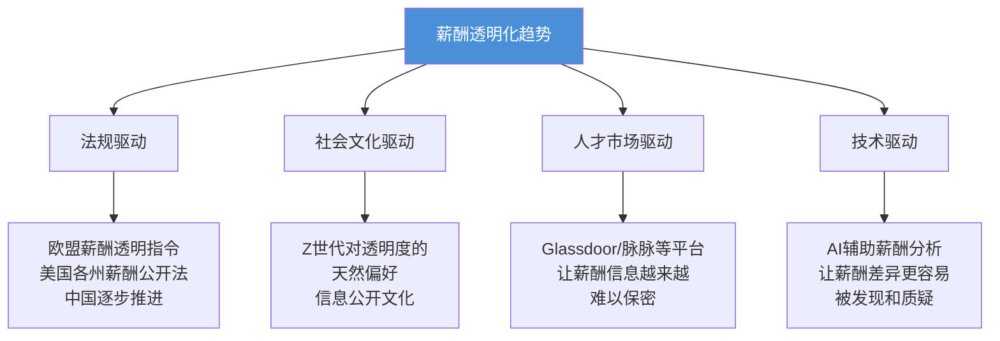
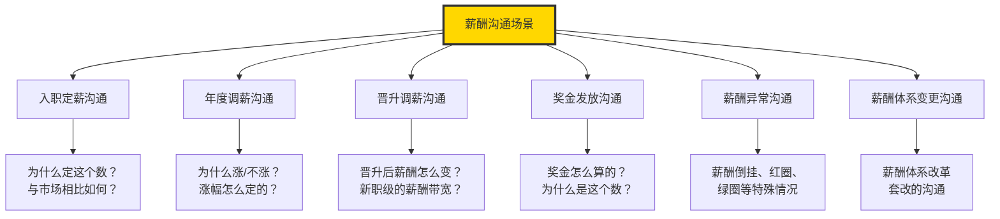
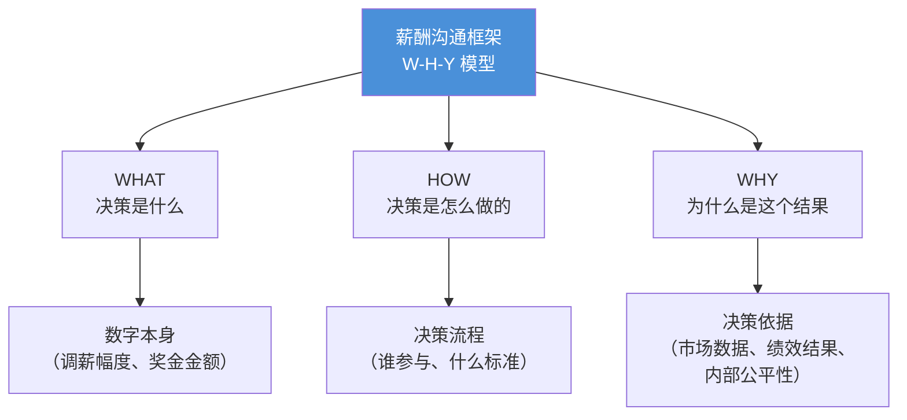
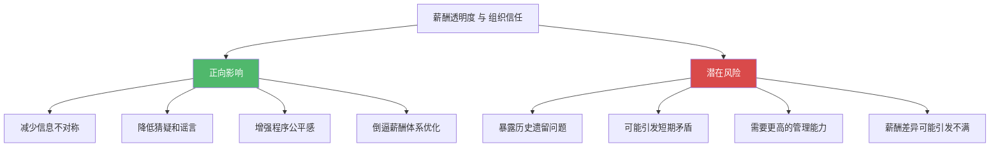
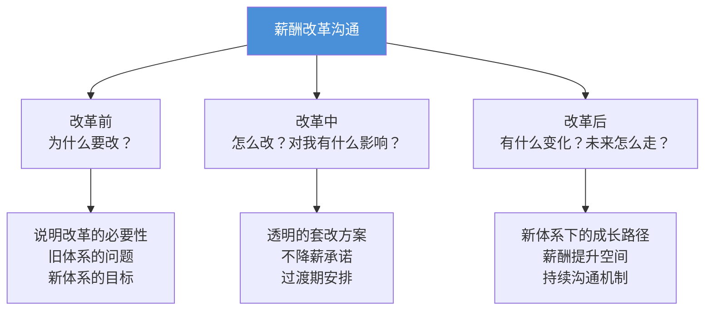
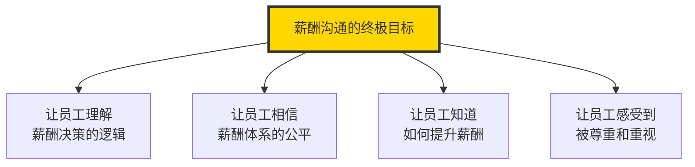

# 薪酬沟通与透明度

> 再好的薪酬体系，如果沟通不到位，员工的感知就是"不公平"。

---

## 一、薪酬沟通的战略价值

### 1.1 薪酬的"感知鸿沟"

在薪酬管理中，存在一个普遍但常被忽视的问题：**感知鸿沟（Perception Gap）**——公司实际付出的薪酬与员工感知到的薪酬之间的差距。


**感知鸿沟的来源**：

- 员工不了解公司的全面薪酬成本（培训、福利、社保等）
- 员工不了解自己的薪酬在市场上的位置
- 员工不了解薪酬决策的逻辑和依据
- 薪酬保密制度导致的信息不对称

### 1.2 薪酬沟通的ROI

有效的薪酬沟通可以将薪酬投资的感知回报率提升 20%-30%。换句话说：**花同样的钱，员工觉得你给得更多**。

> [!important] 薪酬沟通的本质
> 薪酬沟通不是"告诉员工一个数字"，而是"帮助员工理解薪酬决策的逻辑、依据和公平性"。沟通的目标不是让每个人都满意（那是不可能的），而是让每个人都能理解。

---

## 二、薪酬保密 vs 薪酬透明

### 2.1 薪酬保密的现状

在中国，绝大多数企业实行薪酬保密制度。这源于多个原因：

- 避免员工之间的攀比和不满
- 给管理者更大的薪酬决策弹性
- 保护个人隐私
- 避免薪酬信息的对外泄露

### 2.2 薪酬透明的趋势

全球范围内，薪酬透明化正在成为一个不可逆转的趋势：



### 2.3 薪酬透明度的光谱

薪酬透明度不是一个二元选择（保密 vs 透明），而是一个连续光谱：

| 透明度级别 | 公开内容 | 代表企业/做法 |
|-----------|----------|-------------|
| **完全保密** | 不公开任何薪酬信息 | 大多数中国传统企业 |
| **有限透明** | 公开薪酬结构、带宽、定薪逻辑 | 有成熟薪酬体系的企业 |
| **部分透明** | 公开职级薪酬范围 | 部分科技公司 |
| **高度透明** | 公开每个人的薪酬 | Buffer、GitLab（全员薪酬公开） |
| **完全透明** | 公开每个人的薪酬+决策过程 | 极少数激进透明组织 |

### 2.4 保密与透明的利弊分析

| 维度 | 薪酬保密 | 薪酬透明 |
|------|----------|----------|
| 内部公平感 | 可能隐藏不公平 | 促进公平，但暴露历史问题 |
| 管理灵活性 | 高，可以个案处理 | 低，需要严格按规则 |
| 员工信任 | 可能滋生猜疑 | 增强信任，但需要强大的解释能力 |
| 招聘效率 | 薪资谈判成本高 | 减少谈判摩擦 |
| 法律风险 | 合规风险低 | 需要确保薪酬结构无歧视 |
| 实施难度 | 低 | 非常高 |

> [!tip] 有限透明：最务实的路径
> 对于大多数企业，**有限透明**是最务实的策略：公开薪酬哲学、薪酬结构、调薪逻辑，但不公开个人薪酬数字。这既满足了员工对"公平性"的知情需求，又保留了必要的管理灵活性。

---

## 三、如何向员工解释薪酬决策

### 3.1 薪酬沟通的常见场景



### 3.2 薪酬沟通的核心框架

任何薪酬沟通都应遵循以下框架：



### 3.3 调薪沟通的具体策略

**调薪沟通的"三要三不要"**：

| 要做 | 不要做 |
|------|--------|
| 提前准备，有数据支撑 | 临时通知，没有解释 |
| 聚焦于"为什么" | 只告知"涨了多少" |
| 连接绩效与薪酬 | 把调薪说成"福利" |
| 诚实说明不调薪的原因 | 用模糊的理由搪塞 |
| 提供未来改进路径 | 让员工感觉"没有希望" |
| 记录沟通内容 | 口头说说就算了 |

**调薪沟通模板**：

```
沟通结构：
1. 开场：感谢员工的贡献
2. 数据：调薪幅度/金额
3. 依据：基于什么因素（绩效结果、市场对标、内部公平）
4. 定位：你的薪酬在团队/市场中的位置
5. 期望：对未来的期望和成长路径
6. 倾听：给员工表达想法的机会
```

> [!warning] 调薪沟通中最致命的错误
> 最致命的错误不是说"你不涨薪"，而是说"你不涨薪是因为公司没钱"。这传递的信息是：你在一个没有前途的公司。正确的方式是：坦诚说明不调薪的原因（绩效、预算、市场等），并给出明确的改进方向。

---

## 四、薪酬透明化对组织信任的影响

### 4.1 信任是薪酬体系的基石

薪酬体系的有效性高度依赖于员工对体系的信任。如果员工不相信薪酬体系是公平的，再好的设计也形同虚设。

### 4.2 透明度如何影响信任



### 4.3 构建信任的薪酬沟通实践

| 实践 | 说明 | 效果 |
|------|------|------|
| 薪酬哲学公开 | 明确告知公司薪酬的定位和原则 | 设定预期 |
| 薪酬结构透明 | 公开职级体系和薪酬带宽 | 减少猜疑 |
| 调薪逻辑透明 | 说明调薪的依据和计算方式 | 增强公平感 |
| 定期薪酬沟通 | 年度薪酬沟通会，而非仅调薪时才沟通 | 持续建立信任 |
| 管理者赋能 | 培训管理者如何进行薪酬沟通 | 提升沟通质量 |

---

## 五、薪酬沟通的特殊场景

### 5.1 新老员工薪酬倒挂的沟通

**背景**：市场薪酬上涨，新入职员工薪酬高于同职级老员工。

**沟通策略**：

1. **承认现实**：坦诚说明市场薪酬的变化
2. **解释逻辑**：新员工薪酬反映的是"当前市场价"，老员工薪酬反映的是"历史定价"
3. **给出方案**：说明公司如何通过调薪机制逐步解决倒挂问题
4. **认可老员工**：强调老员工在经验、关系、文化等方面的不可替代价值

### 5.2 薪酬体系改革的沟通

**背景**：公司进行薪酬体系套改，部分员工薪酬发生变化。

**沟通策略**：



> [!important] 薪酬改革的第一原则
> **不降薪**。任何薪酬体系改革，都不能让现有员工的实际收入下降。对于"红圈"员工（薪酬高于新带宽上限），可以冻结调薪但绝不能降薪。降薪是对信任的毁灭性打击。

### 5.3 薪酬不满的应对

当员工表达薪酬不满时，标准处理流程：

1. **倾听**：让员工充分表达，不要打断
2. **理解**：确认不满的具体原因（绝对水平？相对比较？）
3. **数据**：用市场数据解释薪酬的合理性
4. **路径**：如果确实存在差距，给出改善路径和时间表
5. **跟进**：定期回顾，不要让沟通变成"一次性"

---

## 六、管理者在薪酬沟通中的角色

### 6.1 管理者是薪酬沟通的第一责任人

HR 设计薪酬体系和沟通框架，但实际的薪酬沟通应该由**直属管理者**来完成。

**为什么是管理者而不是HR？**

- 管理者最了解员工的实际表现和贡献
- 管理者与员工有日常的信任关系
- 薪酬沟通是管理关系的核心组成部分
- 如果连薪酬沟通都推给HR，管理者就失去了最重要的管理工具

### 6.2 管理者的薪酬沟通能力建设

| 能力 | 内容 | 培训方式 |
|------|------|----------|
| 薪酬知识 | 理解公司的薪酬哲学、结构和逻辑 | HR培训+手册 |
| 沟通技巧 | 如何进行困难的薪酬对话 | 角色扮演+案例 |
| 数据解读 | 能用数据解释薪酬决策 | 实操演练 |
| 情绪管理 | 处理员工的情绪反应 | 情景模拟 |

---

## 七、薪酬沟通的数字化趋势

### 7.1 数字化薪酬沟通工具

随着企业数字化转型，薪酬沟通也在经历技术赋能：

| 工具 | 功能 | 价值 |
|------|------|------|
| 薪酬门户 | 员工自助查看薪酬结构、历史调薪、市场对标 | 减少信息不对称 |
| 薪酬模拟器 | 员工可以模拟不同绩效下的薪酬变化 | 增强可预测性 |
| AI沟通助手 | 为管理者提供薪酬沟通话术建议 | 提升沟通质量 |
| 薪酬满意度调研 | 定期匿名调研，获取员工真实感受 | 发现潜在问题 |
| 薪酬数据看板 | 管理者视角的团队薪酬一览 | 辅助管理决策 |

### 7.2 薪酬沟通的衡量指标

薪酬沟通的效果需要被衡量，而不仅仅是"感觉"：

| 指标 | 衡量方式 | 目标值 |
|------|----------|--------|
| 薪酬理解度 | 调研"你理解公司的薪酬逻辑吗？" | >80% |
| 薪酬公平感 | 调研"你认为薪酬体系公平吗？" | >70% |
| 调薪沟通满意度 | 调薪后调研沟通满意度 | >85% |
| 薪酬相关离职率 | 因薪酬原因离职的占比 | 逐年下降 |
| 薪酬信任度 | 调研"你相信薪酬决策是公正的吗？" | >75% |

> [!tip] 薪酬沟通的衡量
> 如果你不衡量薪酬沟通的效果，你就不知道你的沟通是"有效传递"还是"自说自话"。建议每年至少进行一次薪酬满意度调研，并将结果与薪酬数据分析（见 [[03-HR人事/薪酬与激励/08_薪酬数据分析与预算管理]]）进行交叉验证。

---

## 八、总结



薪酬沟通不是薪酬管理的"最后一公里"，而是贯穿始终的"主线"。没有好的沟通，再好的薪酬设计也会被感知为"不公平"。而好的沟通，能让一个"还行"的薪酬体系被感知为"很好"。

---

## 延伸阅读

- [[03-HR人事/薪酬与激励/01_薪酬管理的本质与战略价值]] —— 薪酬哲学，沟通的基础
- [[03-HR人事/薪酬与激励/03_薪酬策略与定位]] —— 薪酬策略的沟通逻辑
- [[03-HR人事/薪酬与激励/04_绩效薪酬与奖金设计]] —— 奖金沟通的特殊性
- [[03-HR人事/薪酬与激励/06_非物质激励：不只是钱]] —— 认可也是薪酬沟通的一部分
- [[03-HR人事/绩效管理/00_MOC_绩效管理中枢]] —— 绩效反馈与薪酬沟通的交叉

---

*薪酬沟通不是"告知"，而是"对话"。不是"说服"，而是"理解"。*