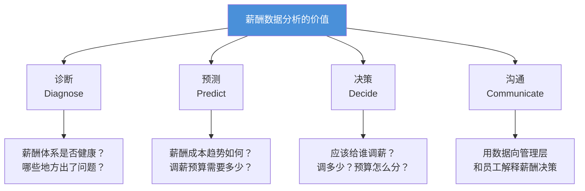
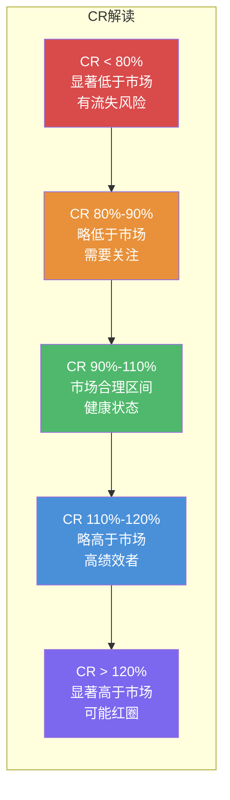
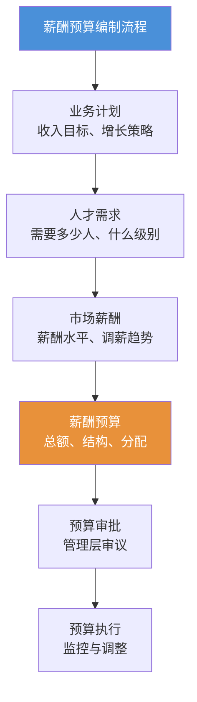
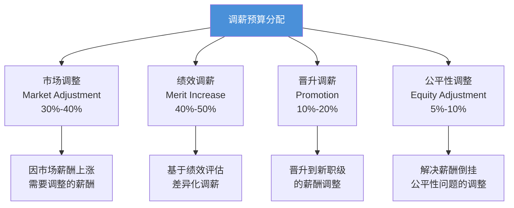
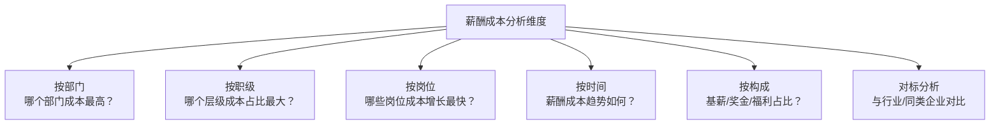
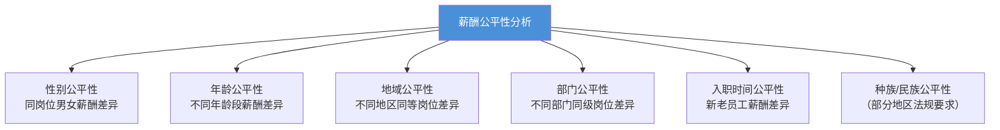
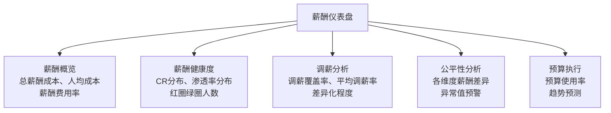
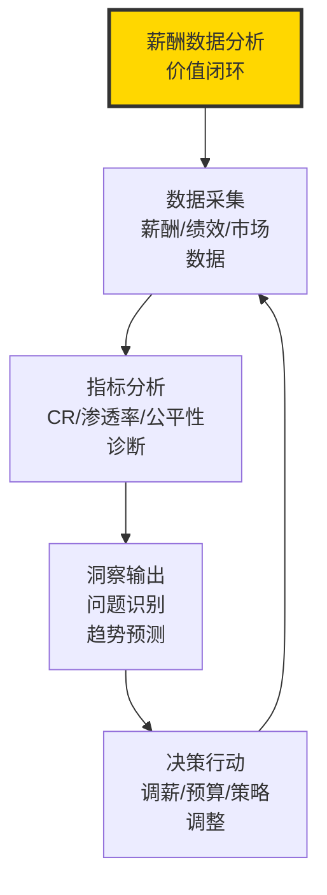

# 薪酬数据分析与预算管理

> 没有数据的薪酬管理是"拍脑门"，没有分析的数据是"看热闹"。

---

## 一、薪酬数据分析的价值

### 1.1 数据驱动薪酬管理的意义

薪酬管理正在从"经验驱动"转向"数据驱动"。数据分析能力已经成为薪酬HR的核心竞争力。

### 1.2 薪酬分析的三个层次

| 层次 | 名称 | 核心问题 | 典型分析 |
|------|------|----------|----------|
| 第一层 | 描述性分析 | 发生了什么？ | 薪酬成本报表、薪酬分布 |
| 第二层 | 诊断性分析 | 为什么发生？ | CR分析、薪酬渗透率、薪酬公平性 |
| 第三层 | 预测性分析 | 将会发生什么？ | 薪酬成本预测、离职风险与薪酬的关系 |

---

## 二、核心薪酬健康度指标

### 2.1 Compa-Ratio（CR）

**CR（Compa-Ratio，比较比率）**是薪酬分析中最核心的指标，反映员工实际薪酬与市场中位值（或薪酬中点值）的比率。

$$
\text{CR} = \frac{\text{员工实际薪酬}}{\text{薪酬中点值（Midpoint）}} \times 100\%
$$

**CR 的解读**：

**CR 的应用场景**：

| 场景 | 如何使用CR |
|------|-----------|
| 年度调薪 | 优先调CR低的员工，缩小与市场差距 |
| 招聘定薪 | 新员工定薪目标CR 90%-100% |
| 晋升调薪 | 晋升后CR应落在新职级的合理区间 |
| 离职分析 | 高绩效低CR员工是离职高风险人群 |
| 薪酬公平性审查 | 检查CR在不同群体间是否存在系统性偏差 |

### 2.2 薪酬渗透率（Range Penetration）

**薪酬渗透率**反映员工薪酬在薪酬带宽中的位置。

$$
\text{薪酬渗透率} = \frac{\text{员工实际薪酬} - \text{带宽最低值}}{\text{带宽最高值} - \text{带宽最低值}} \times 100\%
$$

**薪酬渗透率的解读**：

| 渗透率 | 含义 | 管理建议 |
|--------|------|----------|
| < 0% | 绿圈，低于带宽最低值 | 制定调薪计划，尽快进入带宽 |
| 0%-25% | 带宽低位，通常是新入职或初学者 | 正常，随着成长逐步提升 |
| 25%-75% | 带宽中位，经验丰富者 | 健康区间 |
| 75%-100% | 宽带高位，资深专家 | 考虑晋升或扩大职责 |
| > 100% | 红圈，高于带宽最高值 | 冻结调薪，推动晋升 |

> [!tip] CR vs 薪酬渗透率
> CR 是"外部对标"指标（与市场比），薪酬渗透率是"内部对标"指标（与带宽比）。两者结合使用，可以全面诊断一个员工的薪酬健康度。例如：CR=120%但渗透率=90%，说明这个人薪酬高于市场但还在带宽内，问题不大；CR=95%但渗透率=5%，说明这个人薪酬合理但处于带宽低位，可能是新晋升者。

### 2.3 其他关键指标

| 指标 | 公式 | 用途 |
|------|------|------|
| 薪酬费用率 | 总薪酬成本 / 营业收入 | 衡量薪酬成本对业务的影响 |
| 人均薪酬成本 | 总薪酬成本 / 员工人数 | 衡量人力投入效率 |
| 薪酬增长率 | (本期薪酬 - 上期薪酬) / 上期薪酬 | 监控薪酬增长趋势 |
| 调薪覆盖率 | 调薪人数 / 总人数 | 反映调薪的普惠性 |
| 调薪集中度 | 前20%调薪金额 / 总调薪金额 | 反映调薪的差异化程度 |
| 薪酬差距比 | 最高薪酬 / 最低薪酬 | 反映薪酬公平性 |
| 离职率-薪酬关联 | 低CR高绩效员工离职率 | 预警薪酬驱动的流失风险 |

---

## 三、薪酬预算编制

### 3.1 薪酬预算的核心逻辑

薪酬预算不是"老板给多少钱就花多少钱"，而是基于业务计划、人才策略和市场环境，系统性地规划薪酬资源的配置。

### 3.2 薪酬预算的构成

| 预算项目 | 内容 | 占比参考 |
|----------|------|----------|
| 基薪预算 | 固定薪酬的总支出 | 50%-70% |
| 调薪预算 | 年度调薪的增量成本 | 3%-8% |
| 奖金预算 | 短期激励支出 | 10%-25% |
| 股权激励预算 | 长期激励成本（含摊销） | 5%-15% |
| 福利预算 | 社保、公积金、补充福利 | 10%-20% |
| 招聘薪酬预算 | 新员工入职薪酬 | 根据招聘计划 |
| 晋升薪酬预算 | 晋升带来的薪酬增量 | 根据晋升计划 |

### 3.3 调薪预算的分配逻辑

调薪预算是最受关注的薪酬预算组成部分。通常的分配逻辑：

**差异化调薪矩阵**：

|  | 高绩效 | 中等绩效 | 低绩效 |
|------|--------|----------|--------|
| **高CR（>110%）** | 3%-5% | 1%-3% | 0% |
| **中CR（90%-110%）** | 5%-8% | 3%-5% | 1%-2% |
| **低CR（<90%）** | 8%-12% | 5%-8% | 3%-5% |

> [!tip] 调薪矩阵的设计逻辑
> 调薪矩阵的核心逻辑是"向高绩效低CR的人倾斜"——这些人对公司的价值最大，但薪酬风险最高（容易被挖走）。而高CR低绩效的人，即使绩效好也不应该大幅调薪，因为他们的薪酬已经高于市场水平。

---

## 四、薪酬成本分析

### 4.1 薪酬成本的结构分析

### 4.2 薪酬成本效率指标

| 指标 | 公式 | 含义 | 健康区间 |
|------|------|------|----------|
| 人事费用率 | 薪酬成本 / 营业收入 | 每元营收需要多少薪酬 | 因行业而异 |
| 人均营收 | 营业收入 / 员工人数 | 每人创造多少营收 | 越高越好 |
| 人均利润 | 净利润 / 员工人数 | 每人创造多少利润 | 越高越好 |
| 薪酬利润率 | 净利润 / 薪酬成本 | 每元薪酬产生多少利润 | 越高越好 |

---

## 五、薪酬公平性分析

### 5.1 为什么要做薪酬公平性分析

薪酬公平性分析不仅是道德要求，也是法律合规要求，更是保留人才的关键。

### 5.2 公平性分析的维度

### 5.3 公平性分析的方法

**回归分析法**：在控制岗位、绩效、经验、学历等因素后，检查是否存在系统性薪酬差异。

**分析步骤**：

1. 收集数据：薪酬、岗位、绩效、经验、学历、性别、年龄等
2. 建立回归模型：薪酬 = f(岗位, 绩效, 经验, 学历, 性别, 年龄...)
3. 检查性别/年龄等变量的系数是否显著
4. 如果显著，说明存在需要调查的薪酬差异

> [!warning] 公平性分析不等于"平均主义"
> 公平性分析关注的是"在同等条件下是否存在系统性差异"，而不是"所有人薪酬应该一样"。如果男性因绩效更高而薪酬更高，这是公平的；如果男女绩效相同但薪酬有差异，这是需要警惕的。

---

## 六、薪酬审计

### 6.1 薪酬审计的目的

薪酬审计是对薪酬体系的全面体检，确保薪酬管理合规、有效、公平。

### 6.2 薪酬审计的检查清单

| 审计领域 | 关键检查项 |
|----------|-----------|
| 合规性 | 最低工资、社保公积金、加班费、个税合规 |
| 结构合理性 | 薪酬带宽、级差、固浮比是否合理 |
| 公平性 | 性别、年龄、地域等维度的薪酬差异分析 |
| 激励有效性 | 绩效薪酬与绩效的关联度、奖金差异度 |
| 成本控制 | 薪酬费用率、薪酬增长趋势 |
| 流程合规 | 调薪审批、奖金发放、薪酬保密 |

### 6.3 薪酬审计的频率

| 审计类型 | 频率 | 负责方 |
|----------|------|--------|
| 日常监控 | 月度 | HR薪酬团队 |
| 季度分析 | 季度 | HR薪酬团队 + 财务 |
| 年度审计 | 年度 | 内审部门/外部审计 |
| 专项审计 | 按需 | 针对性审计 |

---

## 七、薪酬数据可视化

### 7.1 常用薪酬仪表盘

### 7.2 薪酬分析的"一页纸"原则

向管理层汇报薪酬分析时，遵循"一页纸"原则：将最核心的发现浓缩在一页纸上，用图表而非文字呈现。

**必备要素**：

- 核心指标摘要（3-5个关键数字）
- 趋势图（薪酬成本/CR趋势）
- 异常预警（红圈/绿圈/公平性风险）
- 预算执行情况

---

## 八、总结

薪酬数据分析不是"锦上添花"，而是薪酬管理的"基础设施"。没有数据支撑的薪酬决策，就像没有导航的航行——你可能在朝着正确的方向，但更可能在偏离航线而不自知。

---

## 延伸阅读

- [[03-HR人事/薪酬与激励/02_薪酬结构设计：3P1M模型]] —— CR和渗透率的基础框架
- [[03-HR人事/薪酬与激励/03_薪酬策略与定位]] —— 市场对标数据的来源与应用
- [[03-HR人事/薪酬与激励/04_绩效薪酬与奖金设计]] —— 奖金预算的编制与管理
- [[03-HR人事/薪酬与激励/09_AI时代的薪酬管理新趋势]] —— AI如何赋能薪酬数据分析
- [[02-AI趋势与素养/AI Native组织变革/00_MOC_AI Native组织变革中枢]] —— 新组织形态下的薪酬数据分析

---

*数据不会说谎，但需要有人去解读。薪酬数据分析的价值，不在于"有多少数据"，而在于"从数据中看到了什么"。*