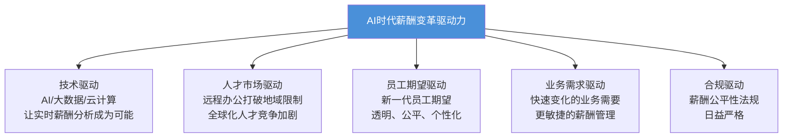
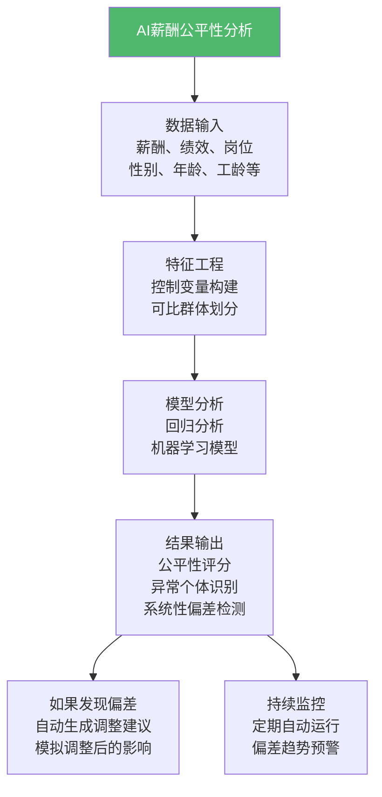
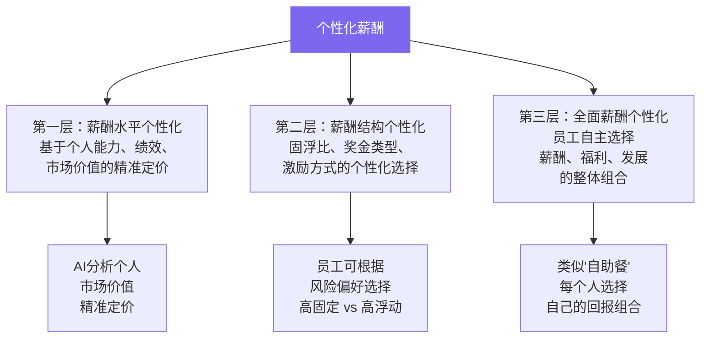
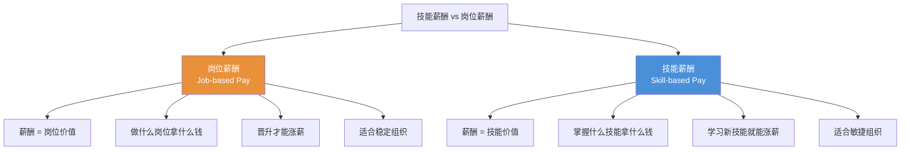
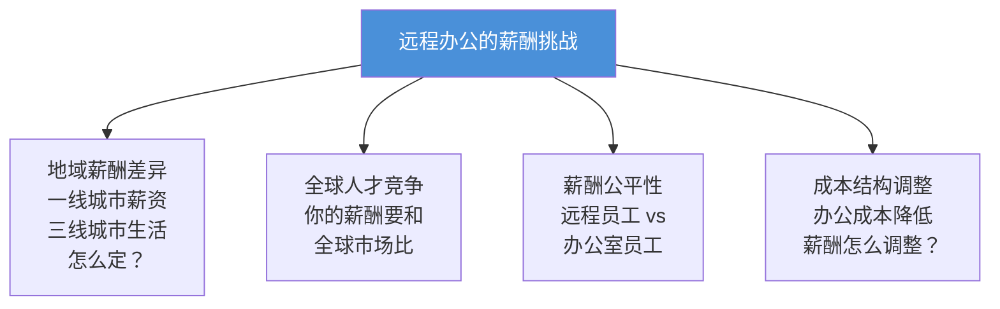
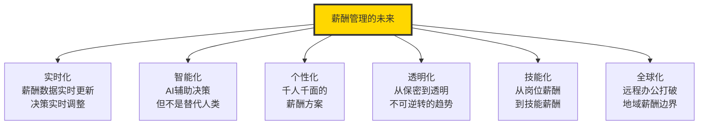

# AI时代的薪酬管理新趋势

> AI 不是在"替代"薪酬管理，而是在"重塑"薪酬管理的底层逻辑。

---

## 一、AI时代的薪酬管理变革

### 1.1 变革的驱动力

AI 时代薪酬管理的变革不是"要不要"的问题，而是"多快"的问题。驱动这场变革的力量来自多个方向：



### 1.2 薪酬管理从"经验驱动"到"AI驱动"

| 维度 | 传统薪酬管理 | AI驱动薪酬管理 |
|------|-------------|---------------|
| 市场对标 | 年度薪酬调研报告 | 实时市场数据抓取与分析 |
| 定薪决策 | 基于经验和谈判 | 基于数据模型和预测 |
| 公平性分析 | 年度抽样检查 | 持续监控，实时预警 |
| 薪酬沟通 | 标准化模板 | 个性化沟通建议 |
| 预算管理 | 静态预算 | 动态预测和弹性调整 |
| 员工体验 | 被动接受 | 主动参与和个性化配置 |

---

## 二、AI辅助薪酬对标：实时市场数据

### 2.1 传统薪酬对标的痛点

传统薪酬调研存在几个根本性问题：

1. **数据滞后**：薪酬报告通常滞后6-12个月
2. **样本有限**：调研覆盖的公司和岗位有限
3. **成本高**：购买专业薪酬报告费用不菲
4. **静态**：一年一次，无法反映市场的快速变化

### 2.2 AI如何改变薪酬对标

```mermaid
graph TD
    AIBM["AI薪酬对标"]

    AIBM --> S1["数据采集<br/>招聘网站、社交平台<br/>政府公开数据<br/>行业报告"]
    S1 --> S2["数据清洗<br/>NLP提取岗位信息<br/>标准化薪酬数据<br/>去重与去噪"]
    S2 --> S3["智能匹配<br/>岗位相似度匹配<br/>公司可比性分析<br/>地域差异调整"]
    S3 --> S4["实时输出<br/>动态薪酬基准<br/>趋势预警<br/>差距分析"]

    S1 --> S1D["多源数据融合<br/>实时更新<br/>海量样本"]
    S3 --> S3D["AI匹配精度<br/>远超人工匹配"]
    S4 --> S4D["从"年更新"到<br/>"周更新"甚至<br/>"日更新""]

    style AIBM fill:#4A90D9,color:#fff
```

### 2.3 AI对标的关键能力

| 能力 | 传统方式 | AI方式 |
|------|----------|--------|
| 岗位匹配 | 基于岗位名称，容易误匹配 | 基于JD语义分析，精准匹配 |
| 公司对标 | 手动选择对标公司 | AI自动识别可比公司 |
| 地域调整 | 简单的地域系数 | 考虑生活成本、人才供需等多维因素 |
| 时效性 | 年度更新 | 实时/近实时 |
| 覆盖范围 | 几百到几千个样本 | 数万到数十万个样本 |

> [!tip] AI对标的实践
> 目前已有多个AI薪酬对标平台（如 Levels.fyi、Payscale、薪智等），它们利用AI技术从招聘网站、社交平台抓取薪酬数据，提供实时薪酬对标服务。对于HR来说，学会使用这些工具已成为基本技能要求。

---

## 三、AI薪酬公平性分析

### 3.1 薪酬公平性的AI解决方案

AI在薪酬公平性分析中有独特的优势：

- **大规模数据处理**：可以分析全量员工数据，而非抽样
- **多维度交叉分析**：同时考虑岗位、绩效、经验、性别、年龄等多个维度
- **异常检测**：AI可以自动识别薪酬异常值
- **持续监控**：从"年度审计"到"持续监控"

### 3.2 AI公平性分析的工作原理



### 3.3 AI公平性分析的价值

| 价值 | 说明 |
|------|------|
| **预防法律风险** | 在薪酬歧视诉讼发生前发现并修复问题 |
| **提升组织信任** | 用数据证明薪酬体系的公平性 |
| **优化薪酬投资** | 识别并修复不公平的薪酬差距 |
| **赋能DEI** | 为多样性、公平性、包容性目标提供数据支持 |

> [!warning] AI公平性分析的局限
> AI可以发现数据中的模式，但无法判断因果关系。AI发现的薪酬差异可能是公平的（如绩效差异导致的），也可能是不公平的（如性别歧视）。**AI是工具，不是裁判。最终的判断和决策仍需要人类HR的专业判断。**

---

## 四、个性化薪酬包

### 4.1 从"一刀切"到"个性化"

传统薪酬体系是"一刀切"的：同一职级同一薪酬。但AI时代，个性化薪酬包正在成为可能。

### 4.2 个性化薪酬的三个层次



### 4.3 个性化薪酬的实现条件

| 条件 | 说明 | 现状 |
|------|------|------|
| 数据基础 | 需要大量个人数据支撑个性化定价 | 正在建设中 |
| AI能力 | 需要AI进行精准的个人价值评估 | 快速发展中 |
| 管理能力 | 管理者需要处理更复杂的薪酬管理 | 挑战较大 |
| 员工接受度 | 员工是否接受"同岗不同酬" | 因人而异 |
| 合规要求 | 个性化不能违反公平性法规 | 需要谨慎 |

> [!important] 个性化薪酬的双刃剑
> 个性化薪酬可以提高激励精准度，但也可能带来新的公平性问题。如果AI的个性化定价模型本身存在偏见（如训练数据中的历史偏见），那么个性化薪酬可能会放大而非缩小不公平。

---

## 五、技能薪酬（Skill-based Pay）的兴起

### 5.1 什么是技能薪酬

技能薪酬（Skill-based Pay）是一种基于员工掌握的技能——而非岗位——来确定薪酬的模式。这是对传统"以岗定薪"模式的根本性挑战。

### 5.2 技能薪酬 vs 岗位薪酬



### 5.3 技能薪酬的实施框架

| 步骤 | 内容 | 关键问题 |
|------|------|----------|
| 技能定义 | 定义组织需要的技能体系和等级 | 哪些技能是核心的？等级如何划分？ |
| 技能评估 | 评估员工当前的技能水平 | 如何客观评估？谁来评估？ |
| 技能定价 | 为每种技能等级设定薪酬标准 | 如何参考市场数据？技能如何定价？ |
| 技能发展 | 提供技能学习和认证路径 | 如何帮助员工提升技能？ |
| 动态调整 | 定期更新技能需求和定价 | 技能需求变化了怎么办？ |

### 5.4 技能薪酬的适用场景

| 场景 | 适用程度 | 原因 |
|------|----------|------|
| 科技公司/研发团队 | 高 | 技能迭代快，个人能力差异大 |
| 咨询/专业服务 | 高 | 专业能力是核心价值 |
| 制造业（多技能工） | 中-高 | 多技能工提高生产灵活性 |
| 传统职能岗位 | 低 | 岗位价值相对稳定 |
| 高度标准化岗位 | 低 | 不需要技能差异化 |

> [!tip] 技能薪酬与培训的联动
> 技能薪酬的实施需要与培训体系深度绑定。详见 [[03-HR人事/培训与人才发展/培训与人才发展_知识库建设方案]]。如果只有技能薪酬体系而没有配套的技能发展体系，技能薪酬就会变成"画饼"。这也是本知识库与培训与人才发展知识库的重要交叉点。

---

## 六、远程办公对薪酬结构的影响

### 6.1 远程办公带来的薪酬挑战

远程办公打破了"薪酬与地域绑定"的传统模式，带来了一系列新问题：



### 6.2 远程薪酬策略的几种模式

| 模式 | 描述 | 代表企业 | 优点 | 缺点 |
|------|------|----------|------|------|
| 地域薪酬 | 按员工所在地的薪酬水平定薪 | 大多数企业 | 成本可控 | 可能引发不满 |
| 统一薪酬 | 全国/全球统一薪酬 | Buffer、GitLab | 简单公平 | 成本高 |
| 总部基准+系数 | 以总部薪酬为基准，按地域调整 | 部分科技公司 | 平衡 | 系数之争 |
| 价值定价 | 按岗位价值而非地域定薪 | 少数前沿企业 | 最公平 | 实施复杂 |

### 6.3 远程办公薪酬的未来趋势

1. **非地域化薪酬**：越来越多的企业将薪酬与"价值创造"而非"地理位置"绑定
2. **全球薪酬对标**：远程办公使人才竞争全球化，薪酬对标也需要全球化
3. **灵活薪酬包**：员工可以根据自己的生活成本选择不同的福利组合

---

## 七、AI在薪酬管理中的其他应用

### 7.1 AI薪酬预测

AI可以预测：
- 哪些员工有离职风险（基于薪酬竞争力分析）
- 调薪对员工留存的影响
- 薪酬成本未来趋势
- 招聘薪酬的市场变化

### 7.2 AI薪酬沟通辅助

详见 [[03-HR人事/薪酬与激励/07_薪酬沟通与透明度]]。AI可以：
- 生成个性化的薪酬沟通话术
- 分析员工对薪酬沟通的情绪反应
- 提供薪酬沟通的最佳时机建议

### 7.3 AI薪酬审计

AI可以自动化薪酬审计流程：
- 持续监控薪酬合规性
- 自动检测异常薪酬数据
- 生成薪酬审计报告

---

## 八、AI时代薪酬管理的伦理挑战

### 8.1 算法偏见

AI模型可能从训练数据中学习到历史偏见，导致薪酬决策存在系统性歧视。

**防范措施**：
- 定期审查AI模型的公平性
- 使用可解释的AI模型（而非黑箱模型）
- 保留人类对AI建议的最终决策权

### 8.2 数据隐私

AI薪酬管理需要大量个人数据，如何在数据利用和隐私保护之间取得平衡？

**防范措施**：
- 数据最小化原则
- 严格的访问权限控制
- 员工知情同意

### 8.3 人的角色

AI不会取代薪酬HR，但会改变薪酬HR的工作内容：

| 从 | 到 |
|----|-----|
| 数据收集和整理 | 数据分析和洞察 |
| 计算和报表 | 策略和决策 |
| 标准化操作 | 个性化设计 |
| 事后分析 | 实时监控和预测 |

---

## 九、薪酬管理的未来图景



---

## 十、总结

AI时代的薪酬管理，不是用AI替代HR，而是用AI赋能HR，让薪酬管理更精准、更公平、更个性化、更实时。

**对HR的建议**：

1. **拥抱数据**：培养数据分析和AI工具使用能力
2. **关注公平**：AI时代薪酬公平性将受到更多审视
3. **保持人性**：AI可以提供建议，但薪酬决策需要人的判断和同理心
4. **持续学习**：AI技术发展迅速，需要持续学习新工具和新方法

> [!quote] AI时代薪酬管理的终极命题
> 当AI可以比人类更精准地计算薪酬时，HR的价值不再是"算得准"，而是"理解人"——理解员工的需求、动机和期望，设计出既有数据支撑又有人性温度的薪酬体系。

---

## 延伸阅读

- [[03-HR人事/薪酬与激励/01_薪酬管理的本质与战略价值]] —— 薪酬哲学，AI时代仍然适用
- [[03-HR人事/薪酬与激励/02_薪酬结构设计：3P1M模型]] —— AI如何增强3P1M模型
- [[03-HR人事/薪酬与激励/08_薪酬数据分析与预算管理]] —— AI赋能的数据分析
- [[03-HR人事/薪酬与激励/07_薪酬沟通与透明度]] —— AI辅助的薪酬沟通
- [[02-AI趋势与素养/AI Native组织变革/00_MOC_AI Native组织变革中枢]] —— AI时代组织变革与薪酬的联动
- [[03-HR人事/培训与人才发展/培训与人才发展_知识库建设方案]] —— 技能薪酬与技能发展的闭环

---

*AI不是薪酬管理的终点，而是薪酬管理进化到新阶段的新起点。*