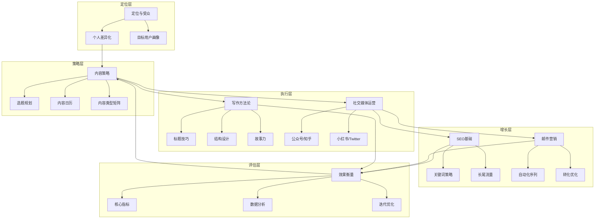
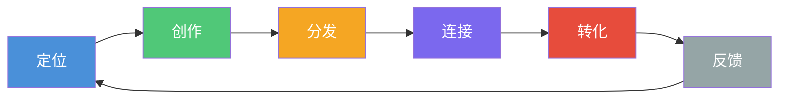

# 内容营销与个人品牌中枢

> [!key] 核心主张
> 内容营销的本质不是"做内容"，而是**通过持续提供价值来建立信任，最终实现商业转化**。个人品牌是这一过程的终极形态——当你的内容成为某个领域的默认参考时，你就拥有了不可替代的资产。

---

## 全景图：内容营销的完整体系

---

## 文档索引

| 序号 | 文档名称 | 核心主题 | 难度 |
|:---:|:---|:---|:---:|
| 00 | 本文件 | 全景图与索引 | 入门 |
| 01 | [[04-商业与战略/内容营销与个人品牌/01_内容营销的本质：从流量思维到信任思维|内容营销的本质]] | 流量思维 vs 信任思维 | 入门 |
| 02 | [[04-商业与战略/内容营销与个人品牌/02_定位与受众：让对的人找到你|定位与受众]] | 定位方法论 | 进阶 |
| 03 | [[04-商业与战略/内容营销与个人品牌/03_内容策略与规划：从零开始的内容机器|内容策略与规划]] | 内容生产系统 | 进阶 |
| 04 | [[04-商业与战略/内容营销与个人品牌/04_写作方法论：如何写出有传播力的内容|写作方法论]] | 写作技巧 | 核心 |
| 05 | [[04-商业与战略/内容营销与个人品牌/05_社交媒体运营：不同平台的打法差异|社交媒体运营]] | 平台策略 | 核心 |
| 06 | [[04-商业与战略/内容营销与个人品牌/06_SEO基础：让内容被搜索到|SEO基础]] | 搜索优化 | 进阶 |
| 07 | [[04-商业与战略/内容营销与个人品牌/07_邮件营销：最被低估的变现渠道|邮件营销]] | 变现工具 | 进阶 |
| 08 | [[04-商业与战略/内容营销与个人品牌/08_内容效果衡量：从数据中优化|内容效果衡量]] | 数据驱动 | 进阶 |

---

## 核心框架：内容营销飞轮

> [!tip] 核心洞察
> 内容营销飞轮的每个环节都依赖上一个环节的质量。**定位不准，创作再好也是自嗨；创作不精，分发再广也无转化。** 大多数人的误区是跳过定位直接追求分发，这恰恰是最低效的做法。

---

## 与其他知识库的关联

- [[02-AI趋势与素养/AI应用发展阶段演进/00_MOC_AI应用发展阶段演进中枢|AI应用发展阶段演进]] — AI 工具正在重塑内容生产方式，了解 AI 能力边界有助于构建高效内容系统
- [[01-AI技术/AI Agent开发实战/00_MOC_AI Agent开发实战中枢|AI Agent开发实战]] — 内容营销的自动化流程可以用 AI Agent 来编排，实现内容生产流水线
- [[03-HR人事/劳动法与合规/00_MOC_劳动法与合规中枢|劳动法与合规]] — 内容创作者与平台的合作关系涉及法律合规问题

---

## 使用指引

> [!warning] 建议阅读顺序
> 如果你是新手，建议按 01 → 02 → 03 → 04 → 05 → 06 → 07 → 08 的顺序阅读。
> 如果你已有基础，可以直接跳到你最感兴趣的章节。

> [!example] 实践建议
> 每读完一章，完成以下动作：
> 1. 在对应的 Notion 或飞书文档中写下你的思考
> 2. 做一个小实验：比如读了"写作方法论"，就写一篇 500 字的小文章
> 3. 记录实验结果，为后续优化提供素材

---

## 内容营销的七大原则

1. **价值优先** — 每一篇内容都要回答"读者为什么要花时间看这个"
2. **一致性** — 持续输出是建立信任的基石，三天打鱼两天晒网等于零
3. **差异化** — 在一个信息过载的世界里，只有独特视角才能突围
4. **可执行** — 好的内容不仅要让人知道，还要让人能做到
5. **可衡量** — 没有数据的内容营销等于盲人摸象
6. **可迭代** — 内容不是一次性的，持续优化才能发挥复利效应
7. **以人为本** — 算法会变，平台会变，但人性不变

---

*创建于 2026-07-31 | 最后更新: 2026-07-31*