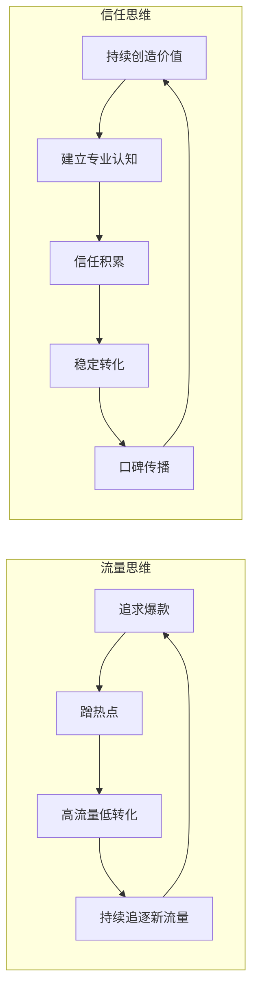
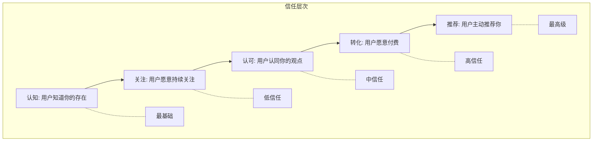

# 内容营销的本质：从流量思维到信任思维

## 为什么大多数内容营销都失败了？

> [!warning] 残酷真相
> 90% 的内容营销项目在前 6 个月内失败。不是因为内容质量差，而是因为**用错了思维框架**——他们用流量思维做内容，却期待信任思维的结果。

---

## 流量思维 vs 信任思维

### 流量思维的特征

- **关注一次性结果**：这篇内容能带来多少阅读量
- **追逐热点**：什么火做什么，缺乏持续性
- **短期导向**：追求快速转化，忽略长期关系
- **渠道依赖**：依赖平台推荐算法，缺乏自主流量

### 信任思维的特征

- **关注长期价值**：这篇内容能建立什么认知
- **坚持方向**：在特定领域持续深耕
- **关系导向**：先建立信任，再考虑转化
- **资产积累**：每一篇内容都是品牌资产

> [!key] 核心差异
> 流量思维**消耗**用户注意力，信任思维**投资**用户关系。前者是交易，后者是复利。

---

## 内容营销的"信任金字塔"

### 如何构建信任金字塔

1. **认知层（L1）**：通过 SEO 和社交媒体让用户发现你
2. **关注层（L2）**：持续输出高质量内容，让用户愿意订阅
3. **认可层（L3）**：展示专业深度和独特观点，让用户认同你
4. **转化层（L4）**：在信任基础上提供解决方案，实现变现
5. **推荐层（L5）**：口碑传播，让用户成为你的传播者

> [!tip] 实践建议
> 不要试图跳过信任层次直接追求转化。**用户不会在第一次看到你时就掏钱**，这是反人性的。先把注意力放在"如何让用户因为你的内容而变得更好"上，转化是自然而然的结果。

---

## 内容作为"信任资产"的复利效应

每一篇内容就像一笔投资，它的价值不会在发布之日就结束：

- **第一年**：一篇优质文章每月带来 100 次浏览
- **第二年**：通过 SEO 积累，增长到 500 次/月
- **第三年**：被广泛引用，增长到 2000 次/月
- **长期**：成为该领域的经典参考

> [!example] 真实案例
> 我的一个朋友在 2020 年写了一篇关于"远程工作效率"的文章，当时只有 500 次阅读。但三年后，这篇文章每个月仍然带来 3000+ 次搜索流量，累计产生了超过 50 个付费咨询客户。**这就是内容资产的复利效应。**

---

## 从内容策略角度的延伸

理解了内容营销的本质，下一步就是如何系统化地构建你的内容体系。详见：

- [[04-商业与战略/内容营销与个人品牌/02_定位与受众：让对的人找到你]] — 如何找到你的精准受众
- [[04-商业与战略/内容营销与个人品牌/03_内容策略与规划：从零开始的内容机器]] — 如何建立可持续的内容生产系统
- [[04-商业与战略/内容营销与个人品牌/04_写作方法论：如何写出有传播力的内容]] — 如何让每一篇内容都有深度

---

## 关键要点总结

> [!tip] 三个核心行动
> 1. **切换思维框架**：从"这篇能带来多少流量"转变为"这篇能建立什么信任"
> 2. **坚持长期主义**：给每篇内容至少 6 个月的时间来积累价值
> 3. **注重资产积累**：每一篇内容都应该是你品牌资产的一部分，而非一次性消费品

---

## 相关链接

- [[04-商业与战略/内容营销与个人品牌/00_MOC_内容营销与个人品牌中枢|返回内容营销中枢]]
- 外部参考：[[02-AI趋势与素养/AI应用发展阶段演进/00_MOC_AI应用发展阶段演进中枢|AI应用发展阶段演进]] — AI 工具如何改变内容生产的信任机制
- [[04-商业与战略/内容营销与个人品牌/08_内容效果衡量：从数据中优化]] — 如何衡量信任资产的增长

---

*创建于 2026-07-31 | 字数: ~800 字*