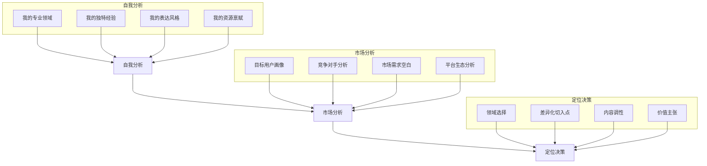

# 定位与受众：让对的人找到你

## 定位：内容营销的"一"是一切

> [!key] 定位的第一性原理
> **定位不是你要成为什么，而是你在用户心智中占据什么位置。** 在信息过载的时代，用户的心智是有限的，他们只会记住每个领域的"第一名"。

---

## 定位三部曲

### 第一步：自我分析

在定位之前，先问自己五个问题：

1. **我在哪个领域有超过 80% 人的知识储备？**（不是兴趣，是真正的积累）
2. **我有哪些独特的职业或人生经历？**（这些经历构成了你的独特视角）
3. **我擅长什么表达方式？**（写作、视频、播客、还是图文结合？）
4. **我每周能投入多少时间做内容？**（决定了你的内容节奏）
5. **我的终极目标是什么？**（副业收入、行业影响力、还是转型跳板？）

> [!tip] 自我定位工具
> 使用"三圈定位法"：画三个重叠的圆，分别代表"你擅长的"、"你热爱的"和"市场需要的"。**三圈交集处就是你的最佳定位点。**

### 第二步：市场分析

- **目标用户画像**：他们的年龄、职业、痛点、信息获取渠道
- **竞争对手分析**：谁已经在做类似的内容？他们的优势和盲点是什么？
- **市场需求空白**：市场上哪些需求没有被充分满足？哪些话题讨论质量低？
- **平台生态分析**：你的目标用户在哪个平台活跃？[[04-商业与战略/内容营销与个人品牌/05_社交媒体运营：不同平台的打法差异|不同平台的打法差异]]是怎样的？

### 第三步：定位决策

- **领域选择**：大领域 + 小切口，如"AI 领域的非技术从业者应用指南"
- **差异化切入点**：你的独特视角是什么？[[04-商业与战略/内容营销与个人品牌/04_写作方法论：如何写出有传播力的内容|写作方法论]]中会详细讨论如何表达差异化
- **内容调性**：专业、轻松、深度、实用——选择一种并坚持
- **价值主张**：用一句话说清楚"关注我能获得什么"

---

## 受众画像：从"泛人群"到"精准用户"

> [!warning] 常见误区
> 很多人说"我的内容适合所有人"，这恰恰是最危险的定位。**为所有人创作，等于没有为任何人创作。**

### 构建受众画像的维度

| 维度 | 问题示例 | 目标 |
|:---|:---|:---|
| 人口统计 | 年龄、职业、收入 | 基础筛选 |
| 行为特征 | 信息获取渠道、消费习惯 | 触达策略 |
| 心理特征 | 价值观、恐惧、 aspirations | 内容共鸣 |
| 痛点需求 | 最困扰的问题、未满足的需求 | 内容方向 |
| 决策路径 | 如何做出购买决策 | 转化路径设计 |

> [!example] 受众画像示例
> **目标受众：初级产品经理转型AI产品经理**
> - 年龄：25-35 岁
> - 痛点：不懂技术，但需要和 AI 工程师协作
> - 需求：AI 产品思维、非技术背景的 AI 知识体系
> - 渠道：知乎、公众号、即刻
> - 决策特征：偏好系统性学习，愿意为课程付费

---

## 差异化策略：让你的内容不可替代

当你的定位和受众清晰后，差异化是让你在竞争中脱颖而出的关键：

1. **视角差异化**：同一个话题，从不同角度切入
2. **深度差异化**：比别人研究得更深，提供更系统的框架
3. **表达差异化**：用独特的语言风格和叙事方式
4. **经验差异化**：分享亲身经历，而非二手知识
5. **形式差异化**：别人写文章，你做信息图或视频

> [!tip] 差异化自检
> 问自己：如果用户只能关注一个该领域的创作者，他凭什么选我？

---

## 与内容策略的衔接

定位完成后，接下来就是 [[04-商业与战略/内容营销与个人品牌/03_内容策略与规划：从零开始的内容机器|内容策略与规划]]——如何将你的定位落地为持续的内容产出。

---

## 关键要点总结

1. **定位是内容营销的基石**，定位不准，后面所有努力都是浪费
2. **受众要精准**，宁愿一个细分领域做到极致，也不要泛泛而谈
3. **差异化是生存之道**，在红海中找到蓝海
4. **定位不是一成不变的**，定期复盘和调整是必要的

---

*创建于 2026-07-31 | 字数: ~800 字*