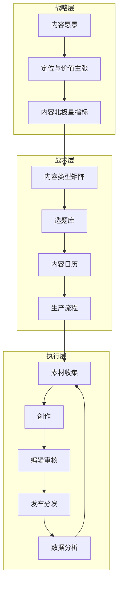
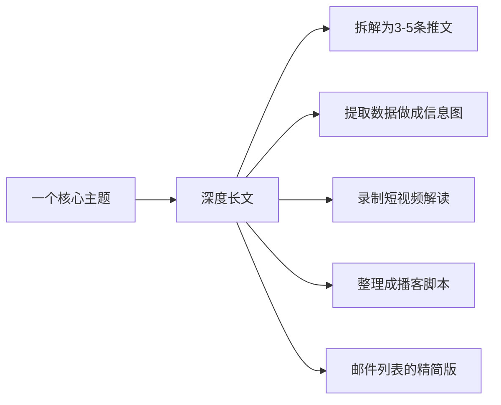

# 内容策略与规划：从零开始的内容机器

## 内容策略：从"想到哪写到哪"到"系统化生产"

> [!warning] 大多数内容创作者的困境
> 灵感驱动的内容生产注定不可持续。**今天有灵感就写一篇，明天没灵感就断更**——这是所有内容创作者失败的根源。真正的内容高手不依赖灵感，他们依赖系统。

---

## 内容策略的三个层次

### 战略层：明确你的内容方向

- **内容愿景**：你希望通过内容达到什么目的？（影响力、变现、职业机会...）
- **定位与价值主张**：参考 [[04-商业与战略/内容营销与个人品牌/02_定位与受众：让对的人找到你|定位方法论]]，明确你的内容方向
- **内容北极星指标**：什么样的指标代表你的内容在健康成长？（如：邮件订阅数、回访率等）

### 战术层：搭建内容生产系统

#### 内容类型矩阵

| 内容类型 | 目的 | 频率 | 制作难度 |
|:---|:---|:---:|:---:|
| 深度长文 | 建立专业权威 | 每周1篇 | 高 |
| 短评/观点 | 日常互动、保持存在感 | 每天 | 低 |
| 案例研究 | 展示实战能力 | 每月2篇 | 高 |
| 工具/资源推荐 | 提供实用价值 | 每周1篇 | 中 |
| 行业动态解读 | 体现时效性 | 每周1篇 | 中 |
| 问答/答疑 | 增强互动 | 按需 | 低 |

#### 选题库建设方法

> [!tip] 持续记录你的选题库
> 选题库是内容机器的"燃料"，没有选题库，内容生产就会断档。以下是我使用的选题来源：

1. **用户问题收集**：后台留言、私信、评论中的高频问题
2. **行业热点监控**：通过 RSS、Google Alerts、即刻等工具监控行业动态
3. **竞品内容分析**：分析同领域优秀创作者的内容，找到他们没覆盖到的空白
4. **个人经验沉淀**：工作中的项目经验、踩过的坑、学到的教训
5. **书籍/文章启发**：读到好的框架或观点后，用自己的视角重新解读

---

## 内容日历：把战略变成可执行的计划

> [!example] 内容日历模板（每周）

| 周一 | 周二 | 周三 | 周四 | 周五 | 周末 |
|:---:|:---:|:---:|:---:|:---:|:---:|
| 选题确定 | 素材收集 | 初稿写作 | 编辑修改 | 发布 | 数据分析 |
| 30min | 1h | 2h | 1h | 30min | 30min |

### 内容日历的迭代原则

- **月度复盘**：每个月检查一次内容表现，调整选题方向
- **季度规划**：每个季度做一次内容主题规划，确保方向一致性
- **灵活调整**：内容日历是工具不是枷锁，遇到热点事件可以灵活调整

---

## 批量生产与"内容原子化"

高效的内容创作者都掌握了"内容原子化"的方法：

> [!key] 内容原子化的核心理念
> **一次深度创作，多渠道分发。** 你的时间应该花在深度思考上，而不是重复劳动。一篇文章可以衍生出 5-10 个不同格式的内容，覆盖不同平台的用户。

---

## 与写作和分发的衔接

有了内容策略，下一步就是 [[04-商业与战略/内容营销与个人品牌/04_写作方法论：如何写出有传播力的内容|如何写出高质量内容]]，以及 [[04-商业与战略/内容营销与个人品牌/05_社交媒体运营：不同平台的打法差异|如何在不同平台分发]]。

---

## 关键要点总结

1. **内容策略不是"写什么"**，而是"为什么写、为谁写、怎么写"
2. **建立选题库**是持续输出的基础，不要等到要写的时候才想选题
3. **内容日历**将战略落地为可执行计划
4. **内容原子化**提高效率，一次创作、多渠道分发
5. **定期复盘**，用数据驱动内容策略的迭代

---

*创建于 2026-07-31 | 字数: ~800 字*