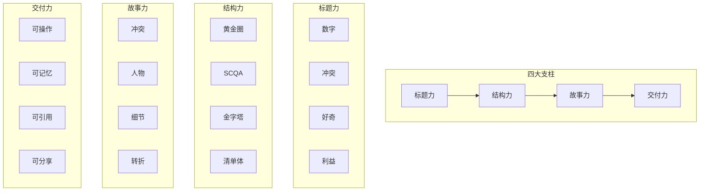
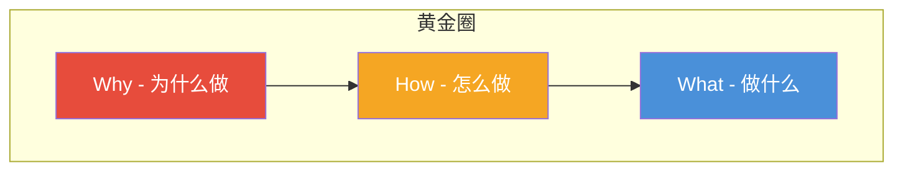

# 写作方法论：如何写出有传播力的内容

## 写作不是天赋，是系统

> [!key] 核心认知
> 好的写作不是源自天赋，而是源自**一套可复用的方法系统**。今天这篇文章会拆解这套系统，让你从"写得出来"到"写得有传播力"。

---

## 传播力写作的四大支柱



---

## 一、标题力：80% 的传播力来自标题

> [!warning] 数据真相
> 在信息流中，80% 的人只看标题，只有 20% 的人会点开正文。**如果标题没吸引力，内容再好也没人看到。**

### 标题公式

| 公式 | 示例 | 原理 |
|:---|:---|:---|
| 数字 + 利益 | "7个让你写作效率翻倍的方法" | 具体可预期 |
| 冲突 + 反转 | "为什么你越努力写作，越没人看" | 制造认知冲突 |
| 疑问 + 好奇 | "顶尖内容创作者从不告诉你的3个秘密" | 勾起好奇心 |
| 痛点 + 解决方案 | "写不出东西？这个框架帮你30分钟搞定" | 命中痛点 |
| 权威 + 实用 | "哈佛商学院教授推荐的写作框架" | 背书效应 |

### 标题自检清单

- [ ] 是否包含具体数字？
- [ ] 是否能引发好奇心？
- [ ] 是否明确读者能获得什么？
- [ ] 是否足够简洁（< 30字）？
- [ ] 是否避免"标题党"（承诺 > 实际）？

---

## 二、结构力：让读者"丝滑"读完全文

### SCQA 框架：最通用的叙事结构

> [!example] SCQA 结构
> **S**ituation（情境）：设定背景
> **C**omplication（冲突）：指出问题
> **Q**uestion（问题）：引发思考
> **A**nswer（答案）：提供解决方案

```
S: 很多人都在做内容营销，但效果很差。
C: 他们花了很多时间，却没人看、没人转化。
Q: 问题出在哪里？怎么解决？
A: 答案就在"信任思维"——从流量思维切换到信任思维。
```

### 黄金圈法则：Why-How-What



### 金字塔原理

- **结论先行**：开头就告诉读者核心观点
- **以上统下**：上层观点统领下层论据
- **归类分组**：同类信息放在一起
- **逻辑递进**：按照时间、重要性或结构顺序排列

---

## 三、故事力：让内容"活"起来

> [!tip] 故事的力量
> 人类的大脑天生适合处理故事，而不是数据。**同一个观点，用数据说是说教，用故事说是共鸣。**

### 好故事的三个要素

1. **冲突**：没有冲突就没有故事。你的用户遇到了什么困难？
2. **人物**：让读者能在故事中看到自己。用"我的朋友"、"我的客户"替代抽象概念。
3. **细节**：具体细节让故事有真实感。"他连续加班 30 天"比"他很努力"有力得多。

### 故事在内容中的位置

- **开头用故事建立共鸣**：让读者觉得"这说的就是我"
- **中间用故事佐证观点**：用案例让抽象概念变得具体
- **结尾用故事引发行动**：用"我做到了，你也可以"激励读者

---

## 四、交付力：让读者觉得"这钱花得值"

即使是免费内容，读者也在付出"时间成本"。你的内容需要让读者觉得"值"：

- **可操作**：读完能立刻做某事
- **可记忆**：用金句、框架、口诀让观点难忘
- **可引用**：提供可以 paraphase 的独特观点
- **可分享**：让读者觉得"分享出去很有面子"

---

## 与 SEO 和社交媒体的协同

高质量的内容还需要被看到。[[04-商业与战略/内容营销与个人品牌/06_SEO基础：让内容被搜索到|SEO基础]] 会告诉你如何让内容被搜索到，[[04-商业与战略/内容营销与个人品牌/05_社交媒体运营：不同平台的打法差异|社交媒体运营]] 会告诉你如何在不同平台分发。

---

## 关键要点总结

> [!tip] 写作的"四个一"
> 1. **一个致命标题**：花 30% 的时间在标题上
> 2. **一个清晰结构**：让读者知道你在讲什么、为什么讲
> 3. **一个动人故事**：用故事让观点深入人心
> 4. **一个超值交付**：让读者觉得"这时间花得值"

---

*创建于 2026-07-31 | 字数: ~800 字*