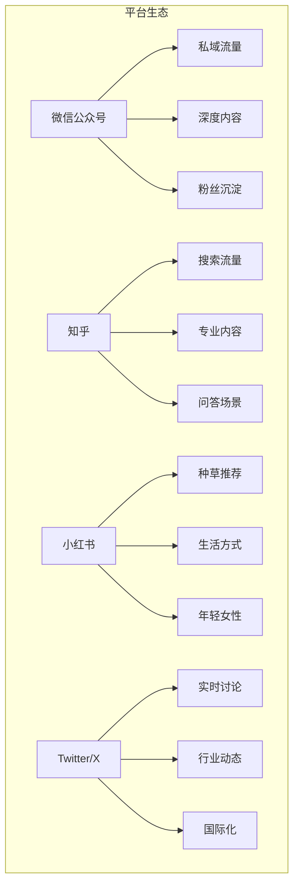
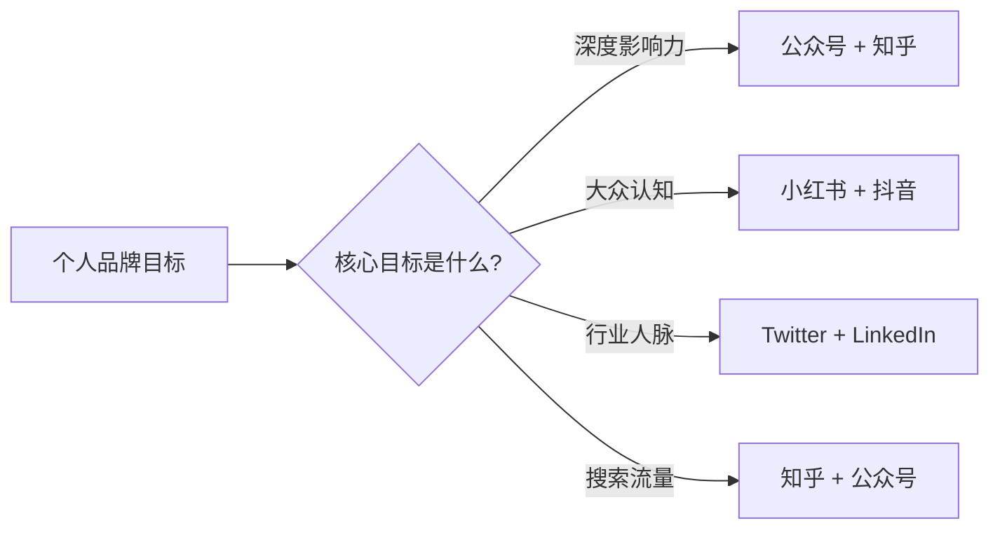

# 社交媒体运营：不同平台的打法差异

## 平台选择的本质：用最小的成本触达对的人

> [!key] 核心策略
> 不要试图在所有平台上都做到完美。**选择 1-2 个核心平台深耕，其他平台做"冷启动分发"。** 每个平台都有自己的"内容语言"和"社区文化"，用错语言等于对牛弹琴。

---

## 主流平台对比分析

| 平台 | 内容形态 | 推荐机制 | 用户画像 | 最适合的方向 |
|:---|:---|:---|:---|:---|
| 公众号 | 长文/图文 | 订阅+社交分发 | 25-40岁，城市白领 | 深度思考、行业分析 |
| 知乎 | 问答/文章 | 内容质量+赞同 | 20-35岁，求知欲强 | 专业知识、行业洞察 |
| 小红书 | 图文/短视频 | 标签+算法推荐 | 18-35岁，女性为主 | 生活方式、经验分享 |
| Twitter/X | 短文/Thread | 时间线+算法 | 25-45岁，行业从业者 | 即时观点、行业动态 |

---

## 各平台运营策略详解

### 1. 微信公众号：私域沉淀的基石

> [!warning] 公众号的困境
> 公众号的打开率已经降到 1-3%，但这并不意味着它不重要。**公众号的核心价值不是流量，而是粉丝的"所有权"**——你可以直接触达他们，不受算法影响。

**运营策略：**
- **节奏**：每周 2-3 篇，保持稳定输出
- **内容**：深度长文为主，每篇 2000-3000 字
- **标题**：公众号标题直接影响打开率，多用 [[04-商业与战略/内容营销与个人品牌/04_写作方法论：如何写出有传播力的内容|标题技巧]]
- **互动**：留言区是核心互动区域，积极回复
- **引流**：文章末尾引导关注、加微信、订阅邮件

### 2. 知乎：搜索流量的金矿

知乎的内容在百度搜索中权重极高，一篇优质回答可以持续带来流量数年。

**运营策略：**
- **选题**：关注高热度问题，提前布局
- **回答**：用 [[04-商业与战略/内容营销与个人品牌/04_写作方法论：如何写出有传播力的内容|SCQA 框架]] 组织回答，先分析问题再给出解决方案
- **专栏**：将回答系统化，形成专栏内容
- **SEO 红利**：知乎内容是百度搜索的"宠儿"，[[04-商业与战略/内容营销与个人品牌/06_SEO基础：让内容被搜索到|SEO 策略]] 在这里效果显著
- **互推**：与同领域创作者互相关注、互相点赞

### 3. 小红书：种草经济的核心阵地

> [!tip] 小红书的独特逻辑
> 小红书是一个"搜索+推荐"双驱动的平台。**用户在小红书上不是"刷内容"，而是"找答案"。** 这意味着你的内容要有明确的"搜索关键词"。

**运营策略：**
- **标题**：包含核心关键词，如"2024 年最值得买的 5 款..."
- **封面图**：小红书是视觉驱动的，封面图决定点击率
- **正文**：口语化、真实、有温度，避免说教
- **标签**：精准标签比广泛标签更有效
- **互动**：评论区引导讨论，回复率影响推荐权重

### 4. Twitter/X：行业影响力的加速器

Twitter 是建立行业影响力的最佳平台——你的观点可以快速触达行业 KOL。

**运营策略：**
- **Thread 长推**：将深度内容拆解为 5-10 条推文
- **日常互动**：每天花 15 分钟回复和转发行业动态
- **话题标签**：使用行业相关话题标签增加曝光
- **时间选择**：根据目标时区选择发布时段
- **英文内容**：如果想做国际影响力，Twitter 是必选项

---

## 平台选择矩阵

> [!example] 个人推荐策略
> 如果你是一个专业领域的从业者，我的推荐是：
> 1. **核心阵地**：公众号（深度内容）+ 知乎（搜索流量）
> 2. **辅助分发**：小红书（提炼精华内容做图文）
> 3. **行业互动**：Twitter（追踪行业动态，建立人脉）
> 4. **变现渠道**：[[04-商业与战略/内容营销与个人品牌/07_邮件营销：最被低估的变现渠道|邮件营销]]

---

## 多平台内容分发策略

### 内容原子化在不同平台的落地

参考 [[04-商业与战略/内容营销与个人品牌/03_内容策略与规划：从零开始的内容机器|内容原子化]] 的理念：

| 原始内容 | 公众号 | 知乎 | 小红书 | Twitter |
|:---|:---|:---|:---|:---|
| 3000字深度文 | 全文发布 | 拆成问答 | 3张信息图+摘要 | 10条Thread |
| 行业观点 | 短文+评论 | 回答提问 | 图文笔记 | 短推文 |
| 工具推荐 | 合集文章 | 回答工具问题 | 好物推荐 | 工具链 Thread |

---

## 关键要点总结

1. **不要贪多**：选 1-2 个核心平台深耕，而不是所有平台都做
2. **理解平台语言**：每个平台有不同的内容文化和用户预期
3. **内容原子化**：一次创作，多渠道分发
4. **数据驱动**：定期分析各平台数据，优化内容策略
5. **长期主义**：社交媒体是马拉松，不是短跑

---

*创建于 2026-07-31 | 字数: ~900 字*