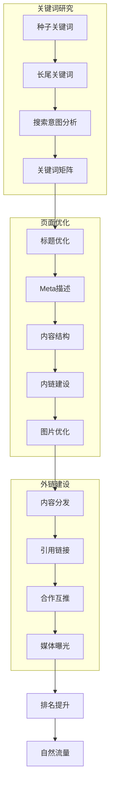
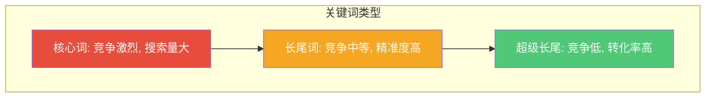

# SEO基础：让内容被搜索到

## 内容营销的最高境界：用户主动来找你

> [!key] SEO 的核心价值
> 社交媒体推荐是"我要让用户看到"，SEO 是"用户主动来找我"。**前者的流量是租来的，后者的流量是属于自己的。** 一篇好的 SEO 文章可以持续带来流量 3-5 年，这是内容营销中复利效应最强的环节。

---

## SEO 的基础框架

---

## 一、关键词研究：找到用户的"搜索语言"

### 关键词类型金字塔

### 关键词研究方法

> [!tip] 关键词研究工具
> 推荐使用以下工具进行关键词研究：
> - **Google Keyword Planner**：免费，数据最全
> - **Ahrefs / SEMrush**：付费，功能最强大
> - **AnswerThePublic**：找到用户问的问题
> - **百度指数**：中文关键词搜索量

### 搜索意图分析

关键词不是为了"有搜索量"，而是为了"匹配用户意图"：

| 搜索意图 | 关键词示例 | 内容类型 | 转化潜力 |
|:---|:---|:---|:---:|
| 信息型 | "什么是内容营销" | 科普文章 | 低 |
| 评估型 | "内容营销工具对比" | 对比评测 | 中 |
| 交易型 | "内容营销课程推荐" | 推荐列表 | 高 |
| 导航型 | "公众号后台登录" | 操作指南 | 低 |

---

## 二、页面优化：让搜索引擎读懂你的内容

### 页面标题优化

- **包含核心关键词**：但不堆砌关键词
- **控制在 30 字以内**：过长会被截断
- **吸引点击**：参考 [[04-商业与战略/内容营销与个人品牌/04_写作方法论：如何写出有传播力的内容|标题技巧]]
- **格式**：主标题 - 副标题 | 品牌名

### 内容结构优化

- **H1 标签**：文章标题，包含核心关键词
- **H2/H3 标签**：章节标题，包含长尾关键词
- **段落长度**：每段不超过 5 行，提高可读性
- **列表使用**：有序/无序列表，让结构更清晰

### 内链建设

> [!warning] 内链的重要性
> 内链是 SEO 中最容易被忽视但效果最好的策略。**合理的内链可以让搜索引擎更好地理解你的网站结构，同时传递权重。**

- 每篇文章至少有 3-5 个内链链接到其他相关文章
- 内链锚文本使用相关关键词
- 构建"内容枢纽"（如 [[04-商业与战略/内容营销与个人品牌/00_MOC_内容营销与个人品牌中枢|MOC 中枢文档]]）

---

## 三、内容 SEO vs 技术 SEO

对于内容创作者来说，**内容 SEO 远比技术 SEO 重要**：

| 内容 SEO | 技术 SEO |
|:---|:---|
| 关键词研究 | 网站加载速度 |
| 内容质量 | 移动端适配 |
| 内链建设 | 网站结构 |
| 外链获取 | URL 结构 |
| 更新频率 | Sitemap |

> [!tip] 80/20 法则
> 对于个人创作者，花 80% 的时间在内容 SEO 上，20% 的时间在技术 SEO 上。**优质内容可以弥补技术 SEO 的不足，但反过来不行。**

---

## 四、SEO 与内容策略的协同

SEO 不是独立的工作，而是内容策略的一部分：

- [[04-商业与战略/内容营销与个人品牌/03_内容策略与规划：从零开始的内容机器|内容策略]] 中的选题应该基于关键词研究
- [[04-商业与战略/内容营销与个人品牌/04_写作方法论：如何写出有传播力的内容|写作方法]] 要融入 SEO 思维
- [[04-商业与战略/内容营销与个人品牌/05_社交媒体运营：不同平台的打法差异|社交媒体分发]] 可以帮助获取外链
- [[04-商业与战略/内容营销与个人品牌/08_内容效果衡量：从数据中优化|数据分析]] 可以验证 SEO 效果

---

## 关键要点总结

> [!example] SEO 行动清单
> 1. **研究关键词**：找到 20-30 个有搜索量且竞争度适中的长尾关键词
> 2. **优化已有内容**：为旧文章更新标题、Meta 描述和内链
> 3. **构建内容枢纽**：围绕核心主题创建系列内容
> 4. **获取外链**：在知乎、简书等平台发布内容，获取高质量外链
> 5. **持续监控**：使用 Google Search Console 监控搜索表现
> 6. **耐心等待**：SEO 的效果需要 3-6 个月才能显现，不要半途而废

---

*创建于 2026-07-31 | 字数: ~800 字*