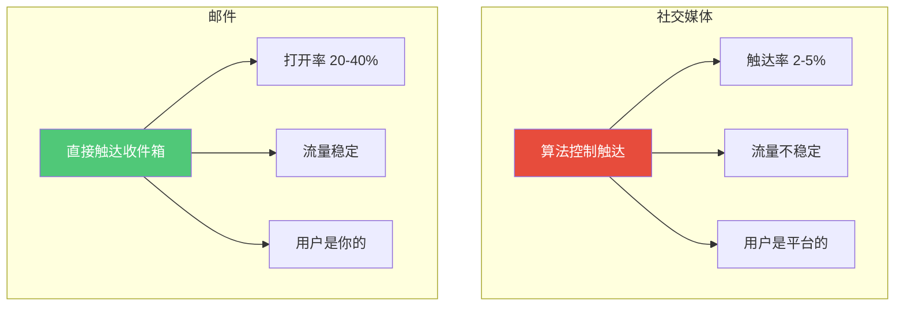
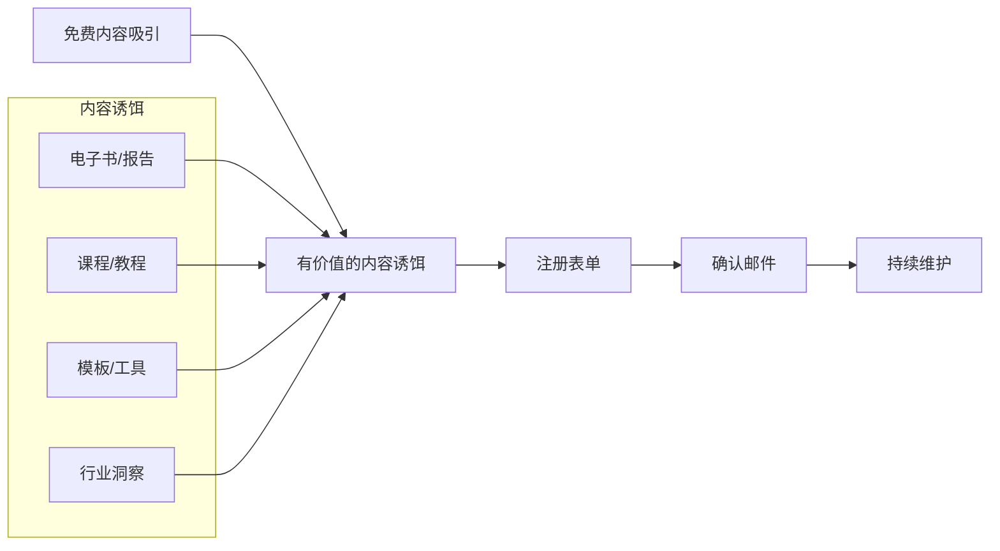

# 邮件营销：最被低估的变现渠道

## 为什么邮件营销是"最被低估"的渠道？

> [!key] 邮件营销的真相
> 在中国，邮件营销被严重低估。但在全球范围内，**邮件营销的 ROI（投资回报率）是 4200%**——每投入 1 美元，平均回报 42 美元。没有任何其他营销渠道能达到这个数字。

---

## 邮件 vs 社交媒体的对比

| 维度 | 社交媒体 | 邮件 |
|:---|:---:|:---:|
| 触达率 | 2-5%（依赖算法） | 80-90%（直接进入收件箱） |
| 打开率 | 取决于内容质量 | 20-40%（优秀者可到 50%+） |
| 点击率 | 0.5-3% | 2-5% |
| 用户所有权 | 平台所有 | 你所有 |
| 长期价值 | 不稳定 | 持续积累 |
| 变现能力 | 弱 | 强 |

> [!warning] 为什么大多数人忽视邮件？
> 因为邮件营销需要"慢功夫"——你需要先建立信任，再逐步转化。社交媒体给人一种"一夜爆红"的幻觉，但 **99% 的爆红都是不可持续的。**

---

## 邮件营销的核心三要素

### 1. 建立邮件列表：从零到一

**内容诱饵（Lead Magnet）示例：**
- "内容营销新手入门手册"（PDF）
- "30天内容创作计划"（模板）
- "行业趋势报告 2026"（研究报告）
- "写作检查清单"（工具表）

### 2. 自动化序列：让邮件"自己工作"

> [!tip] 自动化序列的设计原则
> 一个好的自动化序列就像一个"自动销售员"，在你睡觉的时候也在工作。

**欢迎序列（Welcome Sequence）：**

| 邮件 | 主题 | 目的 |
|:---:|:---|:---|
| 第1封 | 欢迎 + 交付内容诱饵 | 建立初步信任 |
| 第2封 | 分享你的故事/为什么做这件事 | 建立情感连接 |
| 第3封 | 提供高价值内容 | 展示专业度 |
| 第4封 | 推荐相关资源/产品 | 尝试转化 |
| 第5封 | 邀请反馈/调查 | 加深关系 |

**培育序列（Nurture Sequence）：**

- **每周/双周**：定期发送价值内容
- **自动触发**：基于用户行为（如点击链接、访问特定页面）触发相应邮件
- **生日/纪念日**：个性化祝福，增强关系

### 3. 转化优化：从订阅到付费

> [!example] 转化漏斗
> 1. **免费订阅者** → 获得内容诱饵
> 2. **活跃订阅者** → 打开邮件、点击链接
> 3. **信任订阅者** → 购买入门产品/课程
> 4. **忠实客户** → 购买高价值产品/服务
> 5. **品牌大使** → 推荐给他人

---

## 邮件营销的最佳实践

### 内容策略

- **价值先行**：90% 的内容提供价值，10% 的内容做推广
- **个性化**：使用订阅者的名字、细分兴趣领域
- **故事驱动**：用故事代替说教，参考 [[04-商业与战略/内容营销与个人品牌/04_写作方法论：如何写出有传播力的内容|写作方法论]]
- **简洁有力**：每封邮件聚焦一个主题，200-400 字最佳

### 技术细节

- **发送频率**：每周 1-2 封，保持稳定
- **发送时间**：周二至周四上午 10-11 点（数据支持）
- **A/B 测试**：测试标题、CTA、发送时间
- **移动端优化**：60%+ 的邮件在手机上阅读

### 合规要求

> [!warning] 法律合规
> 在中国，邮件营销需要遵守《个人信息保护法》和《反垃圾邮件法》：
> - 必须获得用户明确同意
> - 每封邮件必须包含退订链接
> - 不得购买或交换邮件列表
> - 参考 [[03-HR人事/劳动法与合规/00_MOC_劳动法与合规中枢|劳动法与合规]] 了解更多合规要求

---

## 邮件营销与内容策略的协同

邮件营销不是孤立的，它是内容策略的重要一环：

- [[04-商业与战略/内容营销与个人品牌/03_内容策略与规划：从零开始的内容机器|内容策略]] 中的"内容诱饵"是邮件列表的入口
- [[04-商业与战略/内容营销与个人品牌/05_社交媒体运营：不同平台的打法差异|社交媒体]] 是引流到邮件列表的主要渠道
- [[04-商业与战略/内容营销与个人品牌/08_内容效果衡量：从数据中优化|数据分析]] 可以优化邮件营销的效果

---

## 关键要点总结

1. **邮件营销是 ROI 最高的营销渠道**，没有之一
2. **建立邮件列表是第一步，但也是最难的一步**——需要持续提供价值
3. **自动化序列是核心**，让邮件营销实现"睡后收入"
4. **价值先行**，不要急于转化
5. **合规是底线**，不要触碰法律红线

---

*创建于 2026-07-31 | 字数: ~800 字*