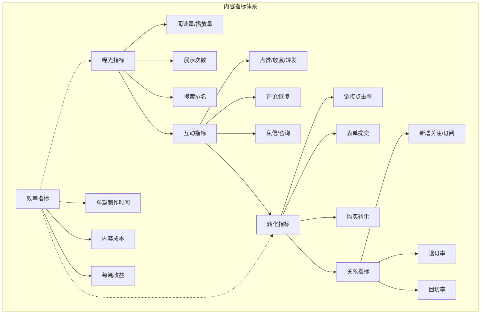
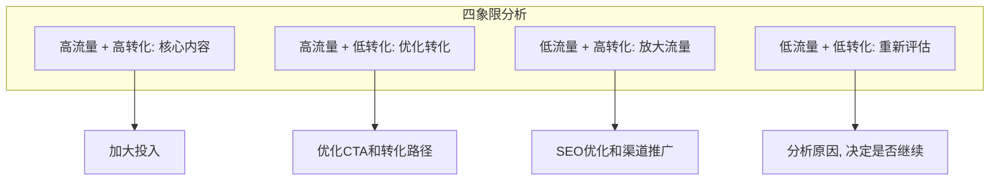

# 内容效果衡量：从数据中优化

## 没有数据的内容营销等于盲人摸象

> [!key] 数据驱动的核心
> 内容营销不是"创作完就完事了"，**真正的价值在于持续的优化迭代。** 没有数据，你永远不知道哪些内容有效、哪些是浪费时间、哪里需要改进。

---

## 内容营销的指标体系

---

## 核心指标详解

### 1. 曝光指标：内容被多少人看到了？

| 指标 | 定义 | 关注价值 |
|:---|:---|:---:|
| 阅读量/播放量 | 内容被打开的次数 | 基础指标，但最容易被"注水" |
| 展示次数 | 内容在信息流中展示的次数 | 了解平台推荐效率 |
| 搜索排名 | 目标关键词的搜索排名 | [[04-商业与战略/内容营销与个人品牌/06_SEO基础：让内容被搜索到|SEO 效果]] 的核心指标 |

> [!warning] 阅读量陷阱
> 阅读量高不等于效果好。**一篇 10 万阅读但没有转化的文章，不如一篇 1000 阅读但有 10 个咨询的文章。** 不要被"虚荣指标"迷惑。

### 2. 互动指标：内容引起了什么反应？

- **点赞/收藏/转发**：反映内容的情感价值
- **评论/回复**：反映内容的讨论价值
- **私信/咨询**：反映内容的商业价值

> [!tip] 互动率的计算
> 互动率 = 互动次数 / 阅读量 × 100%。**互动率比阅读量更能反映内容质量。** 一般互动率在 1-3% 为正常，超过 5% 说明内容质量很高。

### 3. 转化指标：内容带来了什么结果？

- **链接点击率**：有多少读者点击了你的 CTA
- **表单提交**：有多少人留下了联系方式
- **购买转化**：[[04-商业与战略/内容营销与个人品牌/07_邮件营销：最被低估的变现渠道|邮件营销]] 或产品的实际购买

### 4. 关系指标：内容是否建立了长期关系？

- **新增关注/订阅**：内容是否让用户产生"持续关注"的意愿
- **退订率**：是否有用户因为内容质量下降而离开
- **回访率**：用户是否会再次访问你的内容

### 5. 效率指标：内容生产是否高效？

- **单篇制作时间**：从选题到发布的总耗时
- **内容成本**：时间成本 + 工具成本 + 外包成本
- **每篇收益**：单篇内容带来的直接或间接收益

---

## 数据分析框架

### 内容效果四象限

### 用数据驱动内容策略

根据 [[04-商业与战略/内容营销与个人品牌/03_内容策略与规划：从零开始的内容机器|内容策略]] 中的规划，数据应该反馈到以下决策：

1. **选题方向**：哪些话题的数据好？多写类似内容
2. **内容形式**：长文、短视频、图文哪个更受欢迎？
3. **分发渠道**：[[04-商业与战略/内容营销与个人品牌/05_社交媒体运营：不同平台的打法差异|哪个平台]] 的转化率最高？
4. **发布时间**：哪个时间段发布效果最好？
5. **标题风格**：哪些标题模式打开率更高？

---

## 各平台的数据工具

| 平台 | 数据工具 | 核心关注指标 |
|:---|:---|:---|
| 公众号 | 公众号后台、新榜 | 打开率、分享率、关注转化 |
| 知乎 | 知乎创作者中心 | 赞同数、收藏数、关注转化 |
| 小红书 | 小红书创作者中心 | 互动率、涨粉率、搜索排名 |
| Twitter | Twitter Analytics | 曝光量、互动率、关注增长 |
| 网站 | Google Analytics | 流量来源、跳出率、转化率 |
| 邮件 | Mailchimp / SendGrid | 打开率、点击率、退订率 |

---

## 从数据到行动的闭环

> [!example] 数据驱动的优化流程
> 1. **收集数据**：每周收集各平台数据
> 2. **分析趋势**：对比上周/上月，发现变化趋势
> 3. **识别问题**：哪些指标在下降？原因是什么？
> 4. **制定方案**：针对问题制定改进方案
> 5. **执行优化**：实施改进方案
> 6. **验证效果**：对比优化前后的数据变化
> 7. **循环迭代**：重复以上流程

---

## 关键要点总结

1. **不要被虚荣指标迷惑**，关注转化指标和关系指标
2. **建立自己的数据看板**，每周固定时间分析数据
3. **数据不是目的，优化才是**，数据要服务于决策
4. **长期追踪**，一个季度以上的数据才有分析价值
5. **回归内容本质**，数据是工具，内容质量才是根本

---

*创建于 2026-07-31 | 字数: ~800 字*