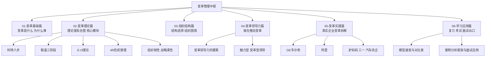

# 变革管理中枢

> 组织变革管理课程的系统知识库。素材来自课程课件，按"基础、理论、结构、领导力、实践、应用"组织为六大模块，共19篇文档加本中枢。

## 六大模块速览

## 学习路径建议

**课程复习路线**（以考试为导向）：
1. 先过[[04-商业与战略/变革管理/06-学习应用篇/01_模型速查与对比表|模型速查与对比表]]，建立全局地图
2. 深读理论篇：[[04-商业与战略/变革管理/02-变革理论篇/03_科特八步与变革失败八因|科特八步]]、[[04-商业与战略/变革管理/02-变革理论篇/02_线性模型：E-O理论与勒温三阶段|勒温三阶段]]、[[04-商业与战略/变革管理/02-变革理论篇/05_战略管理视角：柔性韧性与资源观|战略管理视角]]
3. 用概念速查表自测，成对概念对比记忆

**面试应用路线**（以实战为导向）：
1. 学[[04-商业与战略/变革管理/06-学习应用篇/02_案例分析框架与面试应用|案例分析框架与面试应用]]的四段法与STAR话术
2. 用实践篇练手：GE、阿里、驴妈妈与三一与汽车央企
3. 衔接[[04-商业与战略/战略落地与组织变革/00_MOC_战略落地与组织变革中枢|战略落地与组织变革]]的实操内容

> [!tip] 关键洞察
> 两条路线共用同一个理论底座：考试考模型是什么，面试考模型怎么用。先背总表，再练四段法，理论就活了。

## 模型速查入口

全部13个模型一张表（勒温、科特、E-O、4R、ADKAR、OD、柯林斯、领导力四要素、魅力型、变革型、5M、组织韧性、战略柔性），配套考试高频概念速查，直达：[[04-商业与战略/变革管理/06-学习应用篇/01_模型速查与对比表|模型速查与对比表]]。

## 与战略落地与组织变革的分工

- 本库：学术理论视角，回答"变革是什么、有哪些模型"
- 实战库：一把手落地视角，回答"想法怎么变成组织行动"
- 衔接方式：模型在本库有理论版，在实战库有动作版，双库互链，同一模型两处入口

## 关联知识库

- [[04-商业与战略/战略/00_MOC_战略中枢|战略知识库]]：战略与执行的宏观框架
- [[03-HR人事/组织行为学精要/00_MOC_组织行为学精要中枢|组织行为学精要]]：组织文化与人的行为基础
- [[03-HR人事/AI时代领导力与管理/00_MOC_AI时代领导力与管理中枢|AI时代领导力]]：领导力在新技术时代的演化
- [[03-HR人事/HR管培生备战/03-战略篇/03_组织变革管理方法论|组织变革管理方法论]]：Kotter与Kübler-Ross的实践版

## 模块结构一览

| 模块 | 文档数 | 核心内容 |
| --- | --- | --- |
| 01-变革基础篇 | 3篇 | 变革的概念与分类、变革为什么艰难、变革雄心与结构体系 |
| 02-变革理论篇 | 5篇 | 组织发展OD、E-O与勒温、科特八步、批判视角、战略管理视角 |
| 03-组织结构篇 | 2篇 | 五种组织结构、组织困境与结构匹配 |
| 04-变革领导力篇 | 4篇 | 四要素、魅力型与变革型、5M与权变、空降兵与冲突 |
| 05-变革实践篇 | 3篇 | GE韦尔奇、阿里、驴妈妈与三一与汽车央企 |
| 06-学习应用篇 | 2篇 | 模型速查与对比表、案例分析框架与面试应用 |
