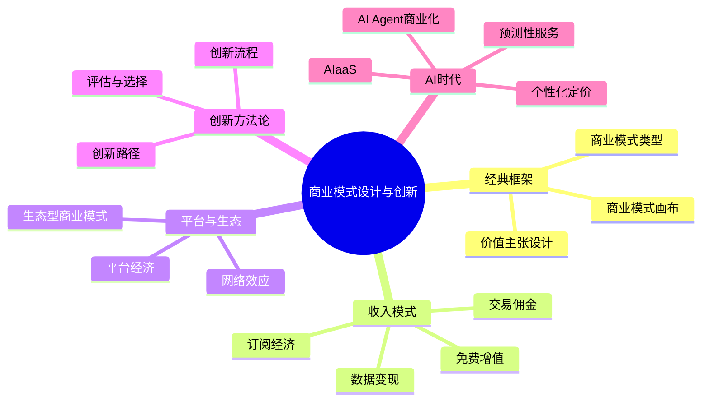
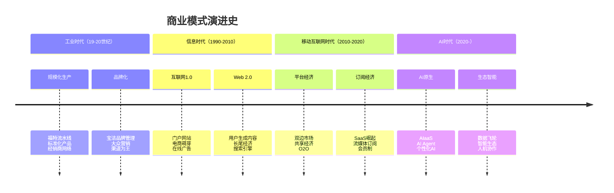
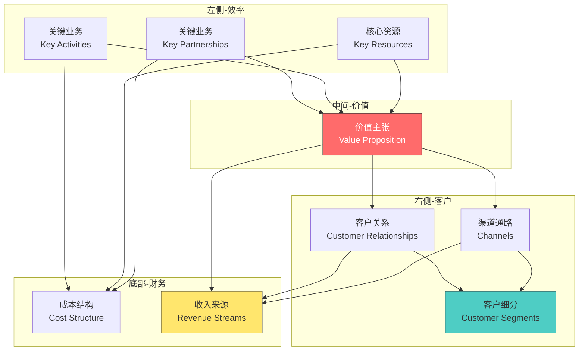
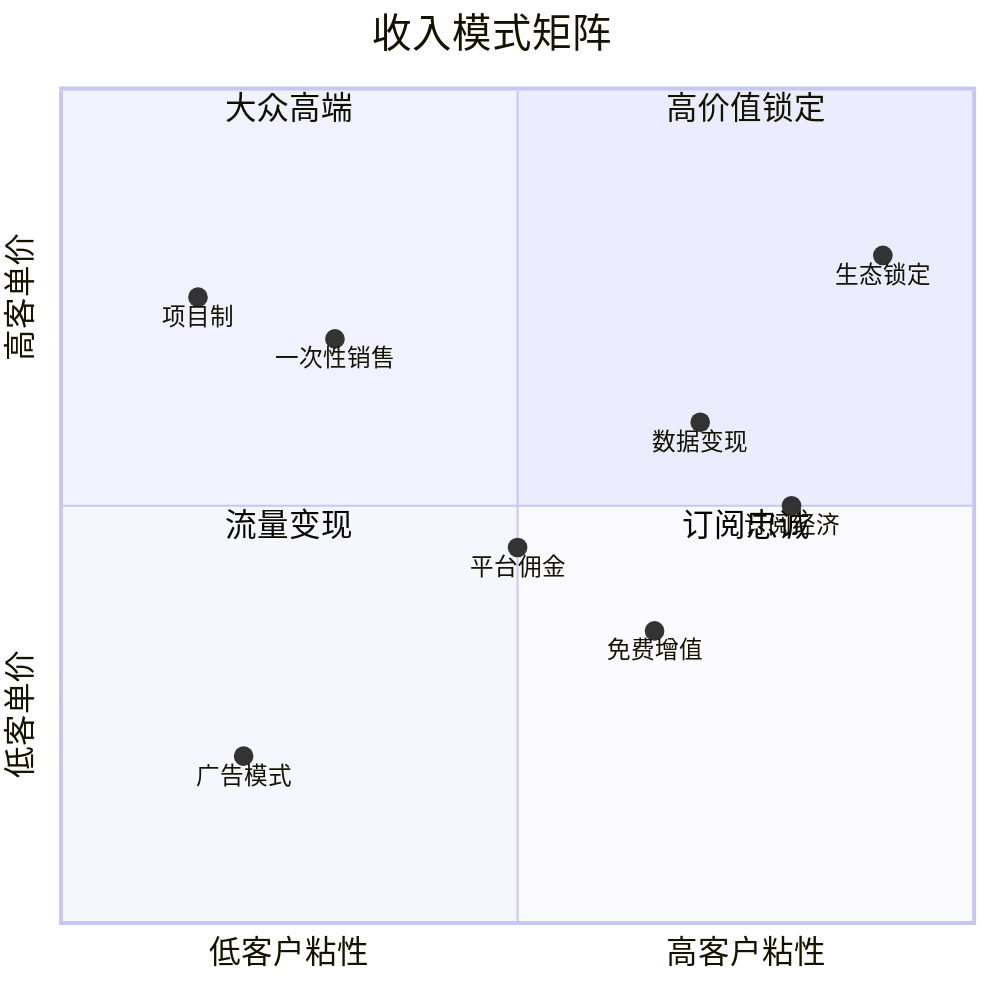
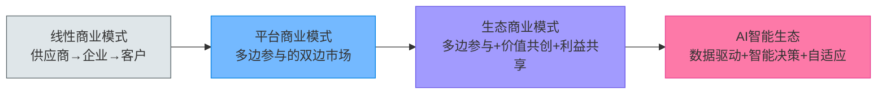
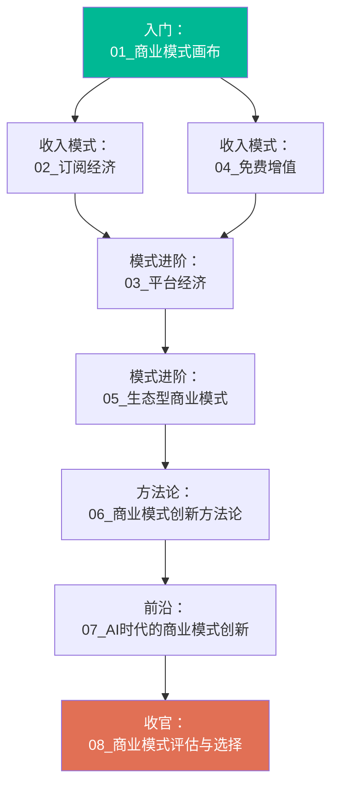
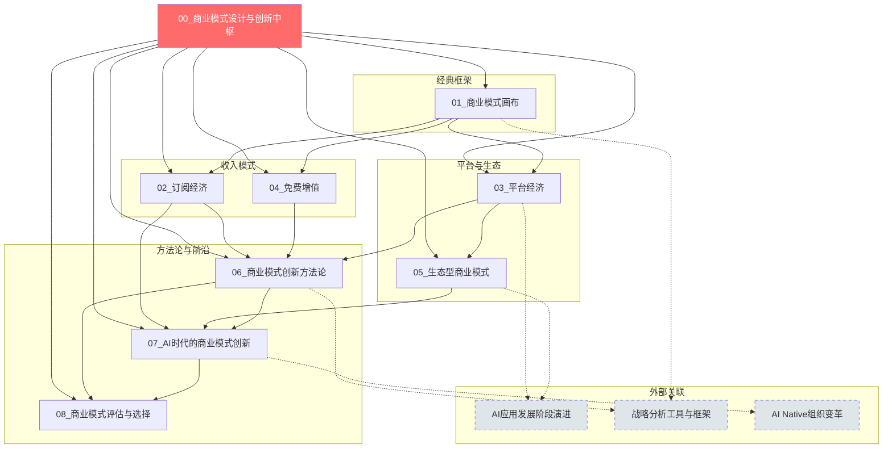
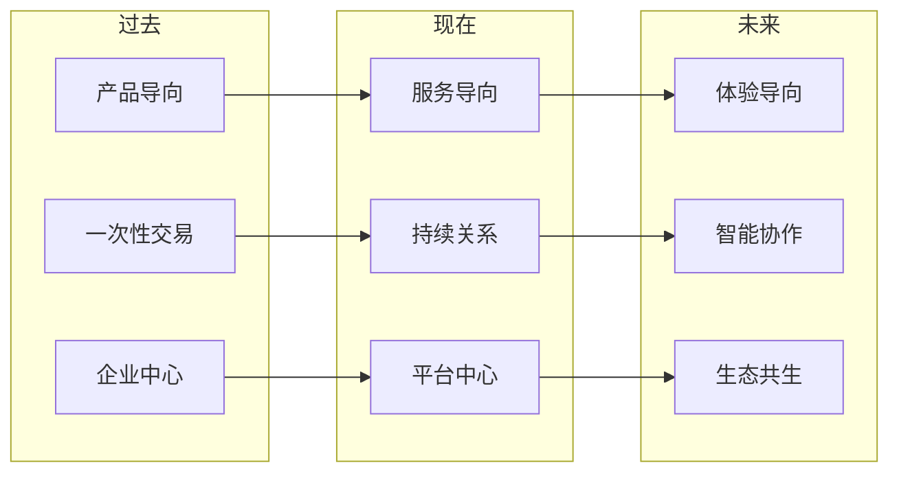

# 商业模式设计与创新中枢

> 从经典商业模式到AI时代的商业模式创新——系统化理解商业模式的过去、现在与未来。

---

## 一、知识库导航

本知识库聚焦**商业模式本身**，系统梳理从经典框架到前沿创新的完整知识体系。与 [[02-AI趋势与素养/AI应用发展阶段演进/00_MOC_AI应用发展阶段演进中枢]]（聚焦产品演进路径）和 [[04-商业与战略/战略分析工具与框架/00_MOC_战略分析工具与框架中枢]]（聚焦战略分析工具）不同，本知识库的核心视角是：**企业如何创造价值、传递价值、捕获价值**。

### 文档索引

| 编号 | 文档 | 核心主题 | 关键概念 |
|:---:|------|----------|----------|
| 01 | [[04-商业与战略/商业模式设计与创新/01_商业模式画布：理解商业的九宫格]] | 经典框架 | 九要素、价值主张、客户细分 |
| 02 | [[04-商业与战略/商业模式设计与创新/02_订阅经济：从卖产品到卖服务]] | 收入模式 | MRR/ARR、Churn、LTV/CAC |
| 03 | [[04-商业与战略/商业模式设计与创新/03_平台经济：双边市场的网络效应]] | 平台模式 | 网络效应、冷启动、多边市场 |
| 04 | [[04-商业与战略/商业模式设计与创新/04_免费增值：Freemium的艺术与科学]] | 定价策略 | 免费转化、功能限制、转化漏斗 |
| 05 | [[04-商业与战略/商业模式设计与创新/05_生态型商业模式：从竞争到共生]] | 生态模式 | 价值共创、利益共享、生态治理 |
| 06 | [[04-商业与战略/商业模式设计与创新/06_商业模式创新方法论]] | 创新方法 | 客户驱动、资源驱动、技术驱动、结构驱动 |
| 07 | [[04-商业与战略/商业模式设计与创新/07_AI时代的商业模式创新]] | 前沿趋势 | AIaaS、AI Agent、预测性服务 |
| 08 | [[04-商业与战略/商业模式设计与创新/08_商业模式评估与选择]] | 评估体系 | 可行性、可规模化、可防御性、护城河 |

---

## 二、商业模式的核心逻辑

### 2.1 什么是商业模式

> [!defn] 商业模式的定义
> 商业模式描述了**一个组织如何创造价值、传递价值并捕获价值**的基本原理。它回答三个核心问题：
> 1. **为谁创造价值？**（客户是谁？）
> 2. **创造什么价值？**（解决了什么问题？）
> 3. **如何捕获价值？**（如何赚钱？）

### 2.2 商业模式的演进脉络

### 2.3 商业模式画布总览

商业模式画布是本知识库的**基础框架**，它由九个构造块组成，覆盖了商业的四个主要领域：客户、产品/服务、基础设施、财务生存能力。

> [!tip] 画布使用技巧
> 商业模式画布的核心价值在于**可视化**和**系统性**。它不是简单的清单，而是九个要素之间的逻辑关系网。关键要理解：
> - **左侧**（基础设施）支撑**中间**（价值主张）
> - **中间**（价值主张）通过**右侧**（客户关系与渠道）传递给**右侧**（客户）
> - **顶部**决定**底部**（收入与成本）

---

## 三、收入模式矩阵

商业模式的核心是收入模式。以下是主要收入模式的对比分析：

### 收入模式详解

| 收入模式 | 核心逻辑 | 代表企业 | 关键指标 | 适用场景 |
|----------|----------|----------|----------|----------|
| 一次性销售 | 产品所有权转移 | 苹果(iPhone)、特斯拉 | 销量、毛利率 | 高价值耐用品 |
| **订阅经济** | 持续使用权 | Netflix、Salesforce | MRR、Churn、LTV | 持续服务/内容 |
| **免费增值** | 免费获客→付费转化 | Spotify、Dropbox | 转化率、CAC | 边际成本低 |
| 平台佣金 | 撮合交易抽成 | Airbnb、Uber | GMV、Take Rate | 双边市场 |
| 广告模式 | 注意力变现 | Google、Meta | DAU、ARPU | 高流量场景 |
| 数据变现 | 数据产品化 | Palantir、Bloomberg | 数据资产价值 | 数据密集型 |
| 生态锁定 | 生态内交叉销售 | 苹果、微信 | 生态ARPU | 多产品矩阵 |
| 项目制 | 按项目交付 | 咨询公司、设计公司 | 项目利润率 | 定制化服务 |

> [!important] 收入模式选择的黄金法则
> 收入模式的选择取决于三个核心变量：
> 1. **产品/服务的边际成本**：边际成本越低，越适合订阅/免费增值
> 2. **客户使用频率**：使用频率越高，越适合订阅制
> 3. **网络效应强度**：网络效应越强，越适合平台模式

---

## 四、商业模式演进路径

### 4.1 从线性到生态

### 4.2 商业模式创新的四个维度

| 维度 | 传统模式 | 创新模式 | 案例 |
|------|----------|----------|------|
| 客户关系 | 一次性交易 | 持续关系 | 订阅制替代买断制 |
| 价值定义 | 产品功能 | 解决方案/体验 | iPhone从手机到生态入口 |
| 盈利方式 | 产品销售 | 多维变现 | 微信从IM到支付+广告+电商 |
| 资源利用 | 自有资源 | 社会资源 | Airbnb利用闲置房产 |

---

## 五、知识库学习路径

### 5.1 推荐阅读顺序

### 5.2 按角色推荐

> [!info] 产品经理路径
> 01_画布 → 02_订阅 → 04_免费增值 → 06_创新方法论 → 08_评估

> [!info] 创业者路径
> 01_画布 → 03_平台 → 05_生态 → 06_创新方法论 → 07_AI时代 → 08_评估

> [!info] 战略分析师路径
> 01_画布 → 03_平台 → 05_生态 → 06_创新方法论 → 08_评估

> [!info] 技术管理者路径
> 02_订阅 → 03_平台 → 07_AI时代 → 08_评估

### 5.3 按主题深度阅读

- **收入模式深度**：02_订阅经济 → 04_免费增值 → 07_AI时代（AI定价）
- **平台生态深度**：03_平台经济 → 05_生态型商业模式
- **创新方法论深度**：01_画布 → 06_创新方法论 → 08_评估
- **AI前沿深度**：07_AI时代 → 06_创新方法论（技术驱动）→ 08_评估

---

## 六、知识库关联图谱

---

## 七、核心概念速查

### 7.1 商业模式画布九要素

| 要素 | 英文 | 核心问题 |
|------|------|----------|
| 客户细分 | Customer Segments | 我们在为谁创造价值？ |
| 价值主张 | Value Proposition | 我们解决什么问题？ |
| 渠道通路 | Channels | 如何触达客户？ |
| 客户关系 | Customer Relationships | 如何建立和维护客户关系？ |
| 收入来源 | Revenue Streams | 客户愿意为什么付费？ |
| 核心资源 | Key Resources | 需要哪些关键资产？ |
| 关键业务 | Key Activities | 需要做什么关键事情？ |
| 重要伙伴 | Key Partnerships | 谁是我们关键的合作伙伴？ |
| 成本结构 | Cost Structure | 最主要的成本是什么？ |

### 7.2 收入模式关键指标

| 指标 | 全称 | 含义 | 参考文档 |
|------|------|------|----------|
| MRR | Monthly Recurring Revenue | 月度经常性收入 | [[04-商业与战略/商业模式设计与创新/02_订阅经济：从卖产品到卖服务]] |
| ARR | Annual Recurring Revenue | 年度经常性收入 | [[04-商业与战略/商业模式设计与创新/02_订阅经济：从卖产品到卖服务]] |
| Churn | Churn Rate | 客户流失率 | [[04-商业与战略/商业模式设计与创新/02_订阅经济：从卖产品到卖服务]] |
| LTV | Lifetime Value | 客户终身价值 | [[04-商业与战略/商业模式设计与创新/02_订阅经济：从卖产品到卖服务]] |
| CAC | Customer Acquisition Cost | 客户获取成本 | [[04-商业与战略/商业模式设计与创新/02_订阅经济：从卖产品到卖服务]] |
| GMV | Gross Merchandise Volume | 总交易额 | [[04-商业与战略/商业模式设计与创新/03_平台经济：双边市场的网络效应]] |
| Take Rate | — | 平台抽成比例 | [[04-商业与战略/商业模式设计与创新/03_平台经济：双边市场的网络效应]] |
| DAU/MAU | Daily/Monthly Active Users | 日活/月活 | [[04-商业与战略/商业模式设计与创新/04_免费增值：Freemium的艺术与科学]] |
| Conversion Rate | — | 转化率 | [[04-商业与战略/商业模式设计与创新/04_免费增值：Freemium的艺术与科学]] |
| NPS | Net Promoter Score | 净推荐值 | [[04-商业与战略/商业模式设计与创新/08_商业模式评估与选择]] |

### 7.3 商业模式类型速查

| 类型 | 核心机制 | 代表企业 | 关键挑战 | 深度文档 |
|------|----------|----------|----------|----------|
| 订阅经济 | 持续付费换取持续使用权 | Netflix, Salesforce | 流失率控制 | [[04-商业与战略/商业模式设计与创新/02_订阅经济：从卖产品到卖服务]] |
| 平台经济 | 双边/多边市场撮合 | Uber, Airbnb | 冷启动 | [[04-商业与战略/商业模式设计与创新/03_平台经济：双边市场的网络效应]] |
| 免费增值 | 免费基础+付费高级 | Spotify, Dropbox | 转化率优化 | [[04-商业与战略/商业模式设计与创新/04_免费增值：Freemium的艺术与科学]] |
| 生态型 | 多产品协同锁定 | 苹果, 微信 | 生态治理 | [[04-商业与战略/商业模式设计与创新/05_生态型商业模式：从竞争到共生]] |
| AIaaS | AI能力按需提供 | OpenAI, 微软 | 模型成本与定价 | [[04-商业与战略/商业模式设计与创新/07_AI时代的商业模式创新]] |
| 一次性销售 | 产品所有权转移 | 特斯拉, 戴森 | 复购率 | [[04-商业与战略/商业模式设计与创新/01_商业模式画布：理解商业的九宫格]] |

---

## 八、商业模式设计原则

> [!tip] 设计原则一：从客户出发
> 商业模式设计的起点永远是**客户价值**，而不是技术或资源。先问"客户需要什么"，再问"我们如何满足"。

> [!tip] 设计原则二：系统性思考
> 商业模式是一个系统，九个要素之间相互关联。改变一个要素，必然影响其他要素。用画布进行全局思考。

> [!tip] 设计原则三：持续迭代
> 商业模式不是一成不变的。技术变革、客户需求变化、竞争格局演变，都需要商业模式的持续迭代。

> [!warning] 设计原则四：警惕路径依赖
> 成功的商业模式容易形成路径依赖，阻碍创新。柯达发明了数码相机却死于数码相机，就是路径依赖的经典案例。

> [!tip] 设计原则五：收入模式与价值创造匹配
> 收入模式必须与价值创造方式匹配。如果价值创造是持续性的（如SaaS），一次性销售就不匹配；如果价值是一次性的（如婚礼摄影），订阅制就不合适。

---

## 九、商业模式创新趋势

### 九大趋势

1. **从拥有到使用**：订阅制替代所有权，如汽车订阅、服装租赁
2. **从产品到服务**：产品服务化，如GE的"按小时卖引擎推力"
3. **从单一到多元**：多维收入模式，如苹果的硬件+服务+广告
4. **从线性到平台**：平台化转型，如Nike从品牌商到DTC平台
5. **从封闭到开放**：开放式创新，如特斯拉开放专利
6. **从交易到关系**：客户终身价值管理，如亚马逊Prime
7. **从人工到智能**：AI驱动的商业模式，如个性化推荐
8. **从企业到生态**：生态型组织，如微信生态
9. **从增长到可持续**：ESG驱动的商业模式，如Patagonia

---

## 十、常见问题与误区

> [!question] Q1: 商业模式画布和精益画布有什么区别？
> 商业模式画布（Business Model Canvas）适合已有企业分析，精益画布（Lean Canvas）更适合创业公司。精益画布用"问题"和"解决方案"替代了"客户关系"和"关键伙伴"，更强调"不公平优势"和"关键指标"。

> [!question] Q2: 订阅经济适用于所有行业吗？
> 不是。订阅经济适合客户使用频率高、边际服务成本低、价值持续交付的场景。低频率使用或高边际成本的产品不适合订阅制。

> [!question] Q3: 免费增值模式如何避免"免费用户拖垮成本"？
> 关键在于：1）免费服务的边际成本趋近于零；2）免费用户通过数据或网络效应贡献价值；3）转化率优化使足够多的免费用户转化为付费用户。

> [!question] Q4: 平台经济和生态型商业模式有什么区别？
> 平台经济侧重**双边市场的撮合交易**，生态型商业模式侧重**多边参与者的价值共创和利益共享**。平台是生态的基础，但生态比平台更进一步——不仅撮合交易，还共同创造价值。

> [!question] Q5: AI时代最大的商业模式创新是什么？
> AI时代最大的创新是从"卖软件"到"卖智能"——AI不再是工具，而是成为商业决策的参与者、创造者甚至决策者。AI Agent的商业化将是下一个大浪潮。

---

## 十一、延伸阅读

- [[02-AI趋势与素养/AI应用发展阶段演进/00_MOC_AI应用发展阶段演进中枢]] — 理解产品演进路径（工具→平台→生态）
- [[04-商业与战略/战略分析工具与框架/00_MOC_战略分析工具与框架中枢]] — 波特五力、SWOT、PESTEL等战略工具
- [[02-AI趋势与素养/AI Native组织变革/00_MOC_AI Native组织变革中枢]] — AI如何重塑组织形态
- *Business Model Generation* — Alexander Osterwalder & Yves Pigneur
- *Platform Revolution* — Geoffrey G. Parker, Marshall W. Van Alstyne
- *Subscribed* — Tien Tzuo
- *Free: The Future of a Radical Price* — Chris Anderson

---

> [!quote] 商业模式的核心洞见
> "商业模式不是关于你的产品有多好，而是关于你的生意如何运作。同样的产品，不同的商业模式，可以产生完全不同的商业结果。"
>
> — 本知识库编纂者

---

*最后更新：2026-07-27*