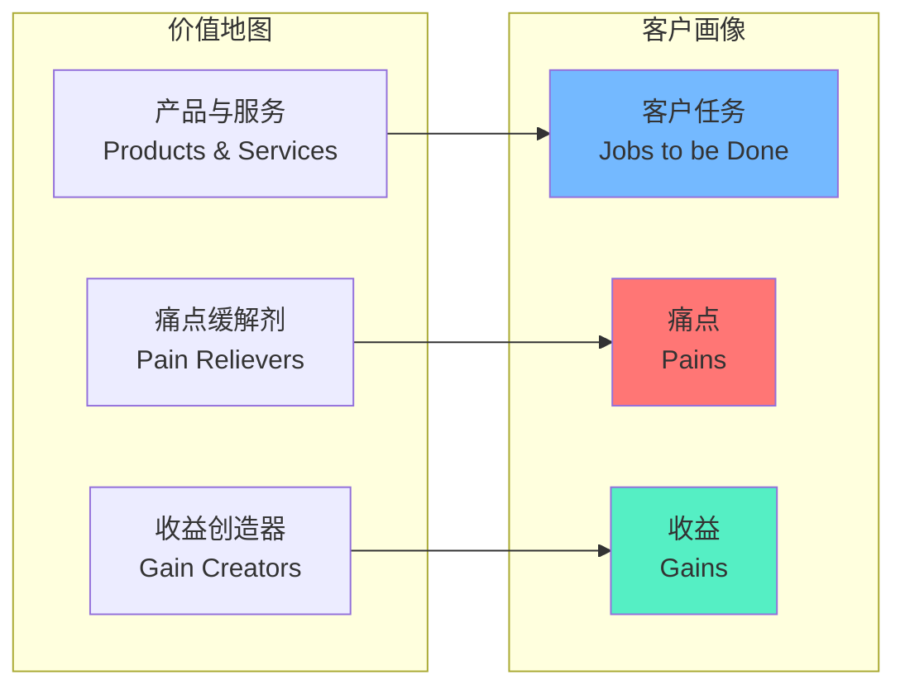
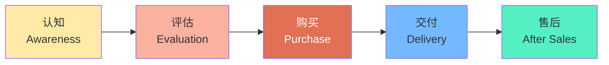
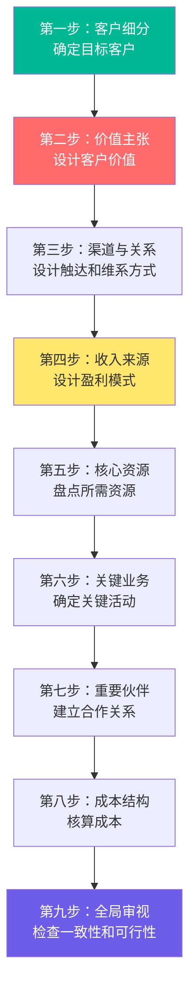
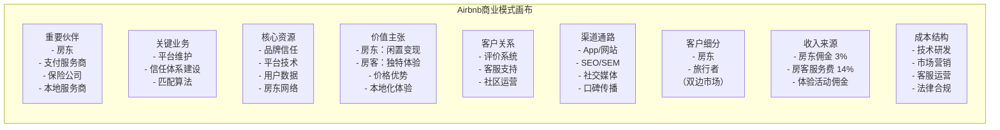
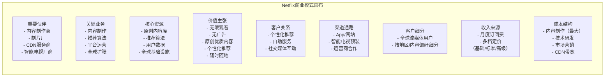
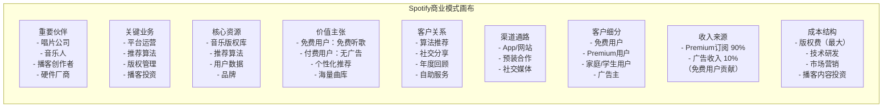

# 商业模式画布：理解商业的九宫格

> 商业模式画布是理解任何商业运作方式的最强大工具——它用一张图讲清楚一个企业如何创造价值、传递价值并捕获价值。

---

## 一、什么是商业模式画布

### 1.1 起源与定义

商业模式画布（Business Model Canvas, BMC）由 Alexander Osterwalder 和 Yves Pigneur 在《Business Model Generation》（2010）中提出。它是一个**战略管理工具**，用九个基本构造块描述一个组织的商业模式。

> [!defn] 商业模式画布
> 商业模式画布是一种**可视化工具**，通过九个相互关联的构造块，系统性地描述、分析、设计一个组织的商业模式。它让复杂的商业逻辑变得可视、可讨论、可迭代。

```mermaid
graph TB
    subgraph 基础设施（左侧）
        KP["8. 重要伙伴<br/>Key Partnerships"]
        KA["7. 关键业务<br/>Key Activities"]
        KR["6. 核心资源<br/>Key Resources"]
    end

    subgraph 价值（中间）
        VP["2. 价值主张<br/>Value Proposition<br/><br/>核心！"]
    end

    subgraph 客户（右侧）
        CR["4. 客户关系<br/>Customer Relationships"]
        CH["3. 渠道通路<br/>Channels"]
        CS["1. 客户细分<br/>Customer Segments"]
    end

    subgraph 财务（底部）
        CSt["9. 成本结构<br/>Cost Structure"]
        RS["5. 收入来源<br/>Revenue Streams"]
    end

    KP --> VP
    KA --> VP
    KR --> VP
    VP --> CR
    VP --> CH
    CR --> CS
    CH --> CS
    VP --> RS
    CR --> RS
    CH --> RS
    KA --> CSt
    KR --> CSt
    KP --> CSt

    style VP fill:#ff6b6b,stroke:#e74c3c,color:#fff,stroke-width:3px
    style CS fill:#4ecdc4,stroke:#1abc9c,color:#000
    style RS fill:#ffe66d,stroke:#f39c12,color:#000
```

### 1.2 画布的四个领域

九个要素覆盖了商业的四个核心领域：

| 领域 | 包含要素 | 核心问题 |
|------|----------|----------|
| **客户** | 客户细分、渠道通路、客户关系 | 为谁服务？如何触达？如何维护？ |
| **产品/服务** | 价值主张 | 为客户创造什么价值？ |
| **基础设施** | 核心资源、关键业务、重要伙伴 | 需要什么来支撑价值创造？ |
| **财务生存能力** | 收入来源、成本结构 | 如何赚钱？花多少钱？ |

---

## 二、九要素详解

### 2.1 客户细分（Customer Segments）

> [!key] 核心问题
> **我们在为谁创造价值？谁是我们最重要的客户？**

客户细分是商业模式画布的**起点**。没有清晰的客户画像，价值主张就无从谈起。

**客户细分的维度**：

| 细分维度 | 说明 | 示例 |
|----------|------|------|
| 大众市场 | 无差异化的广泛客户群 | 可口可乐、牙膏 |
| 利基市场 | 特定的、小众的客户群 | 劳斯莱斯、专业医疗器械 |
| 区隔化市场 | 需求略有差异的多个细分 | 银行（零售/对公/私银） |
| 多元化市场 | 服务完全不同的客户群 | 亚马逊（消费者/AWS企业/广告商） |
| 多边平台 | 两个或多个相互依赖的客户群 | Uber（乘客/司机） |

**客户画像工具**：

> [!tip] 客户画像三要素
> 1. **人口统计**：年龄、性别、收入、地域、职业
> 2. **行为特征**：使用习惯、购买频率、决策路径
> 3. **需求痛点**：待解决的Job to be Done（JTBD）

### 2.2 价值主张（Value Proposition）

> [!key] 核心问题
> **我们为客户解决什么问题？我们传递什么价值？**

价值主张是商业模式画布的**心脏**。它回答了"为什么客户选择我们而不是竞争对手"。

**价值主张的类型**：

| 类型 | 描述 | 案例 |
|------|------|------|
| 新颖性 | 满足全新的需求 | iPhone重新定义手机 |
| 性能 | 更好的性能 | 特斯拉的加速和续航 |
| 定制化 | 个性化产品/服务 | Nike By You定制鞋 |
| 设计 | 卓越的设计体验 | 戴森的产品设计 |
| 品牌/身份 | 品牌带来的身份认同 | 劳力士、爱马仕 |
| 价格 | 更低的价格 | 小米、瑞幸 |
| 成本削减 | 帮客户降本 | Salesforce减少IT投入 |
| 风险降低 | 减少不确定性 | 保险公司、诺顿杀毒 |
| 便利性 | 让事情更简单 | Uber、美团外卖 |
| 可获取性 | 让更多人获得 | 可汗学院免费教育 |

**价值主张画布（Value Proposition Canvas）**：



### 2.3 渠道通路（Channels）

> [!key] 核心问题
> **我们通过什么渠道触达客户？哪些渠道最有效？**

渠道通路连接价值主张和客户细分。它分为五个阶段：



| 渠道类型 | 优势 | 劣势 | 示例 |
|----------|------|------|------|
| 自有直销 | 高利润、客户关系强 | 成本高、规模化难 | Tesla直销店 |
| 自有在线 | 低成本、可规模化 | 竞争激烈 | 官网电商 |
| 合作伙伴零售 | 覆盖面广 | 利润分成、品牌稀释 | 苹果进Best Buy |
| 合作伙伴批发 | 快速铺货 | 利润低、无终端控制 | 宝洁进沃尔玛 |
| 应用商店 | 海量用户 | 30%抽成 | App Store |
| 社交媒体 | 病毒传播 | 算法依赖 | TikTok电商 |

### 2.4 客户关系（Customer Relationships）

> [!key] 核心问题
> **我们与每个客户细分建立什么样的关系？**

客户关系决定了客户获取、留存和增长的方式。

| 关系类型 | 描述 | 案例 |
|----------|------|------|
| 个人助理 | 人工一对一服务 | 私人银行、高端咨询 |
| 专属个人助理 | 长期专属服务 | 奢侈品私人购物顾问 |
| 自助服务 | 客户自助完成 | IKEA、ATM |
| 自动化服务 | 智能自动化 | Amazon推荐、Netflix算法 |
| 社区 | 用户互助社区 | Apple支持社区、小米社区 |
| 共同创造 | 用户参与创造 | GitHub开源、乐高Ideas |

> [!tip] 客户关系成本阶梯
> 从高成本到低成本：专属个人助理 > 个人助理 > 社区 > 自动化服务 > 自助服务
> AI正在重塑这一阶梯——AI Agent让自动化服务越来越接近个人助理的体验。

### 2.5 收入来源（Revenue Streams）

> [!key] 核心问题
> **客户愿意为什么价值付费？如何付费？**

收入来源是商业模式的**血液**。详见 [[02_订阅经济：从"卖产品"到"卖服务"]] 和 [[04-商业与战略/商业模式设计与创新/04_免费增值：Freemium的艺术与科学]]。

**定价机制**：

| 机制 | 描述 | 案例 |
|------|------|------|
| 固定定价 | 基于产品/服务特征 | 菜单价格 |
| 动态定价 | 基于市场条件 | 机票、酒店 |
| 协商定价 | 双方谈判 | B2B大单 |
| 拍卖定价 | 竞价决定 | eBay、Google Ads |
| 按使用量定价 | 用多少付多少 | AWS、Snowflake |
| 订阅定价 | 按期付费 | Netflix、Salesforce |
| 免费增值 | 免费基础+付费高级 | Spotify、Dropbox |

### 2.6 核心资源（Key Resources）

> [!key] 核心问题
> **我们的价值主张需要哪些核心资源？**

核心资源是企业持续运营的**资产**。

| 资源类型 | 描述 | 案例 |
|----------|------|------|
| 物理资源 | 厂房、设备、门店 | 亚马逊仓储、特斯拉工厂 |
| 智力资源 | 品牌、专利、数据 | 可口可乐配方、Google算法 |
| 人力资源 | 关键人才 | 顶级科学家、设计师 |
| 金融资源 | 资金、信用 | 创业融资、银行授信 |
| 数据资源 | 用户数据、训练数据 | OpenAI训练数据、微信社交数据 |

### 2.7 关键业务（Key Activities）

> [!key] 核心问题
> **我们的价值主张需要哪些关键业务活动？**

| 业务类型 | 描述 | 案例 |
|----------|------|------|
| 生产制造 | 设计、制造、交付产品 | 苹果硬件设计、特斯拉制造 |
| 问题解决 | 为客户解决特定问题 | 咨询公司、软件定制 |
| 平台/网络 | 维护和发展平台 | 微信维护社交网络、Uber匹配供需 |

### 2.8 重要伙伴（Key Partnerships）

> [!key] 核心问题
> **谁是我们的关键合作伙伴？我们依赖他们什么？**

| 伙伴类型 | 动机 | 案例 |
|----------|------|------|
| 战略联盟 | 非竞争者之间的合作 | 星巴克×微信支付 |
| 竞合关系 | 竞争者之间的合作 | 苹果用三星屏幕 |
| 合资企业 | 共同开发新业务 | 索尼爱立信 |
| 供应商关系 | 确保关键供应 | 苹果与富士康 |

### 2.9 成本结构（Cost Structure）

> [!key] 核心问题
> **我们的商业模式中最重要的成本是什么？**

| 成本驱动类型 | 特征 | 案例 |
|--------------|------|------|
| 成本驱动型 | 极致低成本 | 瑞幸、小米 |
| 价值驱动型 | 高价值高成本 | 奢侈品、高端服务 |
| 规模经济 | 规模越大单位成本越低 | 亚马逊、沃尔玛 |
| 范围经济 | 多产品共享成本 | 宝洁多品牌共享渠道 |

---

## 三、商业模式画布的使用方法

### 3.1 使用流程



### 3.2 使用场景

1. **新业务设计**：从零开始设计商业模式
2. **现有业务分析**：理解现有商业模式，发现改进空间
3. **竞争分析**：对比分析竞争对手的商业模式
4. **创新探索**：探索新的商业模式可能性
5. **投资分析**：评估投资标的的商业逻辑
6. **团队沟通**：让团队对商业模式达成共识

### 3.3 画布设计原则

> [!tip] 好的画布的特征
> 1. **一致性**：九个要素之间逻辑自洽，没有矛盾
> 2. **聚焦性**：不是面面俱到，而是聚焦最关键要素
> 3. **差异化**：价值主张有明显的差异化
> 4. **可行性**：技术上可行，经济上可持续
> 5. **可迭代**：不是一成不变的，可以持续优化

---

## 四、商业模式画布的应用案例

### 4.1 Airbnb



> [!example] Airbnb商业模式分析
> Airbnb的商业模式核心是**双边平台**：一边是希望将闲置空间变现的房东，一边是追求独特旅行体验的房客。其价值主张对双方完全不同：
> - **对房东**：轻松将闲置空间变现，不需自己找客户
> - **对房客**：比酒店更便宜、更有当地特色的住宿体验
>
> Airbnb的**信任体系**（双向评价、身份验证、房东保障金）是解决"陌生人住进陌生人家"这一核心信任问题的关键基础设施。

### 4.2 Netflix



> [!example] Netflix商业模式分析
> Netflix的商业模式核心是**订阅经济**（详见 [[02_订阅经济：从"卖产品"到"卖服务"]]）。其关键特点：
> 1. **从内容分发到内容制作**：Netflix从DVD租赁起家，转型流媒体，再转型原创内容制作，每次转型都是商业模式的重大升级
> 2. **数据驱动的内容决策**：Netflix的推荐算法不仅是用户体验的关键，更是内容投资决策的依据（知道用户想看什么再拍什么）
> 3. **订阅定价的精细化**：多档定价满足不同用户需求，同时最大化ARPU

### 4.3 Spotify



> [!example] Spotify商业模式分析
> Spotify是**免费增值**模式的经典案例（详见 [[04-商业与战略/商业模式设计与创新/04_免费增值：Freemium的艺术与科学]]）。其核心逻辑：
> 1. **免费版获客**：免费版吸引海量用户，形成规模优势
> 2. **付费版变现**：通过无广告、离线下载、高音质等差异化功能驱动转化
> 3. **独特的挑战**：版权成本极高（约70%收入归版权方），但通过规模效应和推荐算法优化，边际成本递减
> 4. **双向价值主张**：对用户是"海量音乐随时听"，对广告主是"精准投放的注意力"

---

## 五、商业模式画布的局限与进阶

### 5.1 画布的局限

> [!warning] 画布不是万能的
> 1. **静态视角**：画布是某一时刻的快照，无法反映商业模式随时间的变化
> 2. **内部视角**：画布缺少竞争环境和宏观环境的分析
> 3. **缺少战略维度**：画布不涉及使命、愿景、竞争战略等
> 4. **过于简化**：复杂商业（如生态型企业）难以用单一画布完整描述

### 5.2 画布与其他工具的配合

| 工具 | 互补作用 | 参考文档 |
|------|----------|----------|
| 波特五力 | 补充竞争分析维度 | [[04-商业与战略/战略分析工具与框架/00_MOC_战略分析工具与框架中枢]] |
| SWOT分析 | 补充内外部分析 | [[04-商业与战略/战略分析工具与框架/00_MOC_战略分析工具与框架中枢]] |
| 精益画布 | 更适合创业场景 | 本知识库 |
| 价值主张画布 | 深化价值主张设计 | 本文档第二节 |
| 蓝海战略画布 | 补充差异化竞争维度 | [[04-商业与战略/战略分析工具与框架/00_MOC_战略分析工具与框架中枢]] |

---

## 六、实战练习

> [!example] 练习：用画布分析你熟悉的公司
> 选一家你熟悉的公司（或你自己的业务），尝试用九要素填充画布：
> 1. 客户细分：谁是核心客户？
> 2. 价值主张：核心价值是什么？
> 3. 渠道通路：客户如何发现和购买？
> 4. 客户关系：如何维护客户？
> 5. 收入来源：如何赚钱？
> 6. 核心资源：最关键资产是什么？
> 7. 关键业务：最关键活动是什么？
> 8. 重要伙伴：谁是不可或缺的伙伴？
> 9. 成本结构：最大成本是什么？
>
> 完成后，检查九个要素之间的**一致性**：左侧资源是否支撑中间价值？中间价值是否通过右侧渠道触达客户？收入是否覆盖成本？

---

## 七、延伸阅读

- [[04-商业与战略/商业模式设计与创新/00_MOC_商业模式设计与创新中枢]] — 知识库总览
- [[02_订阅经济：从"卖产品"到"卖服务"]] — 订阅模式深度分析
- [[04-商业与战略/商业模式设计与创新/04_免费增值：Freemium的艺术与科学]] — 免费增值模式深度分析
- [[04-商业与战略/商业模式设计与创新/06_商业模式创新方法论]] — 如何系统性地创新商业模式
- [[04-商业与战略/战略分析工具与框架/00_MOC_战略分析工具与框架中枢]] — 波特五力、SWOT等战略工具
- *Business Model Generation* — Alexander Osterwalder & Yves Pigneur（必读原著）

---

> [!quote]
> "商业模式画布的魅力在于，它让复杂的商业世界变得简单、可视化、可讨论。但记住，画布只是工具，真正重要的是画布背后的商业洞察。"
>
> — Alexander Osterwalder

---

*最后更新：2026-07-27*