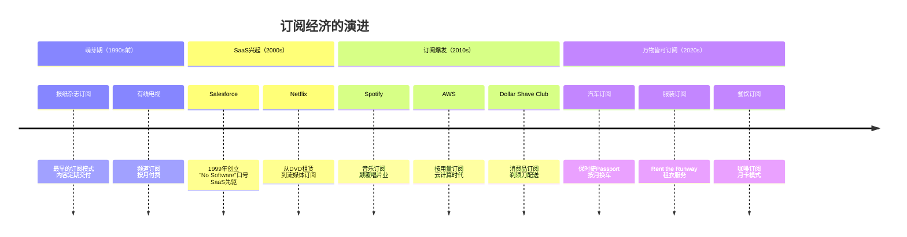
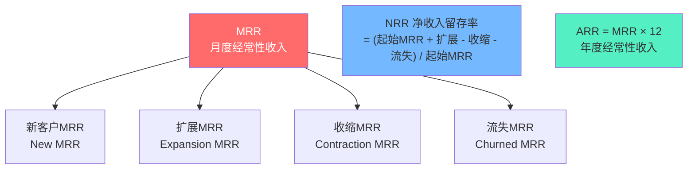
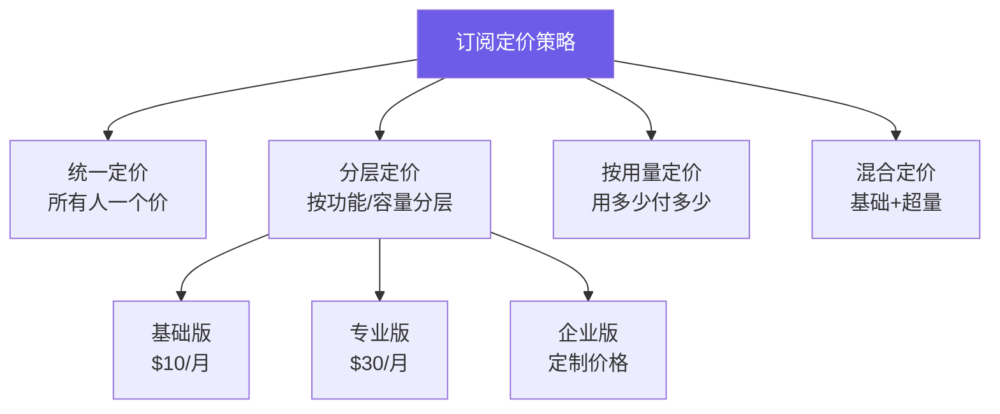
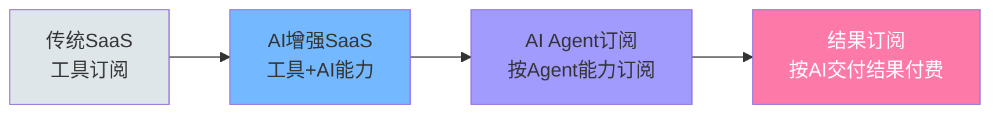

# 订阅经济：从"卖产品"到"卖服务"

> 订阅经济不是定价策略的改变，而是**商业哲学的根本转变**——从"卖一次"到"服务一辈子"。

---

## 一、订阅经济的本质

### 1.1 从一次性交易到持续关系

> [!defn] 订阅经济
> 订阅经济是一种以**持续付费换取持续使用权**的商业模式。客户不再"购买"产品，而是"订阅"服务。核心是一种**关系型商业模式**，而非交易型。

```mermaid
graph LR
    subgraph 传统模式：一次性交易
        A1[制造产品] --> A2[销售产品] --> A3[交易结束]
        A3 -.-> A4[复购？不确定]
    end

    subgraph 订阅模式：持续关系
        B1[获取客户] --> B2[持续服务] --> B3[持续收费] --> B4[持续优化]
        B4 --> B2
    end

    style A2 fill:#fab1a0
    style B3 fill:#55efc4
```

**关键转变**：

| 维度 | 传统模式 | 订阅模式 |
|------|----------|----------|
| 收入性质 | 一次性、波动大 | 经常性、可预测 |
| 客户关系 | 交易型、疏离 | 关系型、持续 |
| 价值交付 | 一次性交付 | 持续交付 |
| 企业重心 | 获取新客户 | 留存现有客户 |
| 成功指标 | 销量、市场份额 | MRR、Churn、LTV |
| 产品迭代 | 大版本更新 | 持续小步迭代 |
| 风险承担 | 客户承担 | 企业和客户共担 |

### 1.2 订阅经济的演进



---

## 二、订阅经济的关键指标

订阅经济的成功不靠"卖了多少"，而靠"留住了多少"。以下是核心指标体系。

### 2.1 收入指标



> [!key] 核心公式
> - **MRR** = 付费客户数 × 平均月客单价
> - **ARR** = MRR × 12（或直接计算年度合同）
> - **NRR（净收入留存率）** = (期初MRR + 扩展MRR - 收缩MRR - 流失MRR) / 期初MRR
> - **NRR > 100%** 意味着即使不获新客，收入也在增长（黄金标准）

**NRR基准**：

| NRR | 评级 | 说明 |
|-----|------|------|
| > 120% | 卓越 | 顶级的扩展和留存能力（如Snowflake、CrowdStrike） |
| 110-120% | 优秀 | 客户持续扩展使用 |
| 100-110% | 良好 | 健康增长 |
| < 100% | 警惕 | 客户在收缩或流失 |
| < 80% | 危险 | 严重流失问题 |

### 2.2 客户留存指标

> [!key] Churn Rate（流失率）
> **月度流失率** = 当月流失客户数 / 月初总客户数
> **年度流失率** ≈ 月度流失率 × 12（简化计算）
> **精确年度流失率** = 1 - (1 - 月度流失率)^12

| 月度Churn | 年度Churn | 含义 |
|-----------|-----------|------|
| 1% | ~11.4% | 优秀（SaaS基准） |
| 2% | ~21.5% | 一般 |
| 3% | ~30.6% | 需要关注 |
| 5% | ~46.0% | 严重问题 |
| 10% | ~71.8% | 不可持续 |

> [!warning] Churn的复利效应
> 月度2%的流失看似不高，但一年下来意味着**超过21%的客户流失**。如果每年新增客户数量不变，三年后客户基数可能不增反降。Churn是订阅经济的头号敌人。

### 2.3 单位经济学：LTV/CAC

```mermaid
graph LR
    LTV["LTV 客户终身价值<br/>= ARPU × 毛利率 / Churn率"] --> RATIO["LTV/CAC 比率"]
    CAC["CAC 客户获取成本<br/>= 总营销销售费用 / 新客户数"] --> RATIO

    RATIO --> HEALTH["健康度判断"]
    HEALTH --> GOOD["> 3:1 优秀"]
    HEALTH --> OK["1-3:1 一般"]
    HEALTH --> BAD["< 1:1 亏损"]

    style LTV fill:#55efc4
    style CAC fill:#ff7675
    style RATIO fill:#ffeaa7
```



> [!key] LTV/CAC黄金法则
> - **LTV/CAC > 3**：优秀，可以加速增长
> - **LTV/CAC 1-3**：可行，但需要优化
> - **LTV/CAC < 1**：不可持续，每获取一个客户都在亏损
> - **CAC回收期 < 12个月**：健康的增长节奏

---

## 三、订阅经济的适用场景与陷阱

### 3.1 适用场景

> [!tip] 订阅模式适合的条件
> 1. **高频使用**：客户频繁使用你的产品/服务
> 2. **持续价值交付**：价值不是一次性的，而是持续产生的
> 3. **低边际服务成本**：每增加一个客户，服务成本增加很少
> 4. **可预测的需求**：客户的需求是稳定的、可预期的
> 5. **内容或服务持续更新**：产品持续进化，客户持续收益

**行业适用性矩阵**：

| 行业 | 适合度 | 案例 | 订阅形式 |
|------|--------|------|----------|
| SaaS | 极高 | Salesforce, Notion | 软件订阅 |
| 流媒体 | 极高 | Netflix, Spotify | 内容订阅 |
| 云计算 | 极高 | AWS, Azure | 按用量订阅 |
| 消费品 | 中高 | Dollar Shave Club | 定期配送 |
| 汽车 | 中 | 保时捷Passport | 汽车订阅 |
| 服装 | 中 | Rent the Runway | 租赁订阅 |
| 餐饮 | 中低 | Panera咖啡订阅 | 消费订阅 |
| 房地产 | 低 | — | 不适合 |
| 奢侈品 | 低 | — | 不适合 |

### 3.2 常见陷阱

> [!warning] 陷阱一：伪订阅
> 把一次性购买包装成"订阅"，但实际价值交付没有持续更新。客户很快会发现"订阅"和"买断"没有区别，导致高流失率。

> [!warning] 陷阱二：忽视Churn的复利效应
> 月度Churn 5% 看起来不多，但一年后客户会流失46%。如果没有持续增长的新客，业务会快速萎缩。

> [!warning] 陷阱三：订阅疲劳
> 当每个App都要求订阅，用户开始抵抗。2023年调查显示，美国消费者平均每月订阅支出已超过$200，**订阅疲劳**成为真实问题。

> [!warning] 陷阱四：CAC回收期过长
> 如果获取一个客户需要$1000，但月费只有$10，需要100个月才能回本。在此之前如果客户流失，就是净亏损。

> [!warning] 陷阱五：忽视价格弹性
> 订阅价格不是越高越好。价格每提高10%，可能带来20%的流失增加。精细化的价格测试是必需的。

---

## 四、订阅经济的定价策略

### 4.1 定价模型



### 4.2 定价心理学

| 策略 | 描述 | 案例 |
|------|------|------|
| 锚定效应 | 先展示高价方案，让中价方案看起来更划算 | Netflix三档定价 |
| 诱饵效应 | 加入一个不具吸引力的选项，引导选择目标选项 | 《经济学人》订阅实验 |
| 年付折扣 | 年付比月付便宜20-30%，锁定客户 | 大多数SaaS |
| 免费试用 | 降低试用门槛，建立使用习惯 | 7天/14天/30天免费试用 |
| 反向试用 | 先给高级功能，到期降级 | 部分SaaS测试 |

### 4.3 年付vs月付

| 维度 | 月付 | 年付 |
|------|------|------|
| 客户门槛 | 低 | 高 |
| 现金流 | 平滑 | 集中 |
| 客户留存 | 每月都有流失风险 | 至少锁定一年 |
| 折扣 | 无折扣 | 通常20-30%折扣 |
| 适合场景 | 新客户获取 | 成熟客户留存 |

---

## 五、AI时代的订阅经济新形态

> [!important] AI对订阅经济的重塑
> AI正在从三个维度改变订阅经济：**成本结构**、**定价模式**、**价值交付**。

### 5.1 AI驱动的成本结构变化

传统SaaS的主要成本是人力（研发、销售、客服）。AI正在改变这一点：

| 成本项 | 传统模式 | AI驱动模式 | 变化 |
|--------|----------|------------|------|
| 研发 | 大量工程师 | AI辅助开发 | 降低30-50% |
| 销售 | 销售团队 | AI SDR + 自助 | 降低40-60% |
| 客服 | 客服团队 | AI Agent | 降低50-80% |
| 基础设施 | 服务器 | GPU/推理 | 可能增加 |

> [!comment] 关键影响
> 当AI大幅降低服务成本，订阅经济的**单位经济学**将发生根本改变。LTV/CAC比率可能大幅提升，使得更多"非传统"订阅场景变得可行。

### 5.2 AI驱动的定价创新

详见 [[04-商业与战略/商业模式设计与创新/07_AI时代的商业模式创新]]，核心包括：

1. **基于结果的定价**：不再按座位或功能收费，而是按AI创造的实际价值收费
2. **个性化定价**：AI根据每个客户的使用模式和支付意愿动态定价
3. **混合定价**：基础订阅 + AI功能按次付费

### 5.3 AI Agent订阅

AI Agent的兴起正在创造一种新的订阅形态：



---

## 六、订阅经济的未来趋势

### 6.1 趋势地图

| 趋势 | 描述 | 影响 |
|------|------|------|
| 万物皆可订阅 | 从软件到硬件、从产品到服务 | 市场规模持续扩大 |
| 订阅疲劳 | 用户订阅过多，开始精简 | 优质订阅留存，劣质订阅淘汰 |
| 捆绑订阅 | 多服务打包订阅（如Apple One） | 提高ARPU，降低Churn |
| 按结果付费 | 从"订阅工具"到"订阅结果" | 商业模式根本性变革 |
| 订阅即服务 | B2B2C模式，企业为员工订阅 | 新增长渠道 |
| AI驱动订阅 | AI优化定价、留存、个性化 | 运营效率革命 |

### 6.2 订阅经济的护城河

> [!tip] 构建订阅经济的护城河
> 1. **切换成本**：让客户离开的成本越高，留存越好
> 2. **数据网络效应**：越多客户使用，产品越智能（如推荐算法）
> 3. **品牌信任**：客户信任你的品牌，不会轻易更换
> 4. **持续创新**：产品持续进化，让客户觉得"订阅很值"
> 5. **社区绑定**：客户不仅是用户，还是社区成员

---

## 七、延伸阅读

- [[04-商业与战略/商业模式设计与创新/00_MOC_商业模式设计与创新中枢]] — 知识库总览
- [[04-商业与战略/商业模式设计与创新/01_商业模式画布：理解商业的九宫格]] — 商业模式基础框架
- [[04-商业与战略/商业模式设计与创新/04_免费增值：Freemium的艺术与科学]] — 免费增值的转化逻辑
- [[04-商业与战略/商业模式设计与创新/07_AI时代的商业模式创新]] — AI时代的新商业模式
- [[04-商业与战略/商业模式设计与创新/08_商业模式评估与选择]] — 商业模式评估方法
- *Subscribed* — Tien Tzuo（Zuora创始人，订阅经济必读）

---

> [!quote]
> "我们正在从'拥有'的世界转向'使用'的世界。未来，你不会拥有任何东西，但你可以使用一切。这就是订阅经济的终极愿景。"
>
> — Tien Tzuo, *Subscribed*

---

*最后更新：2026-07-27*