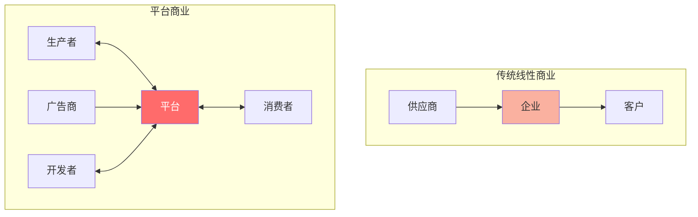
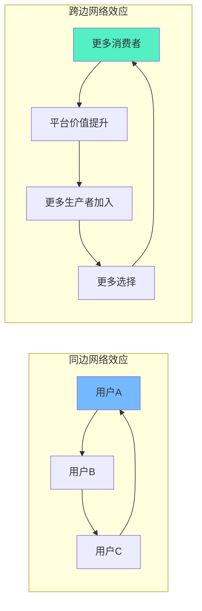
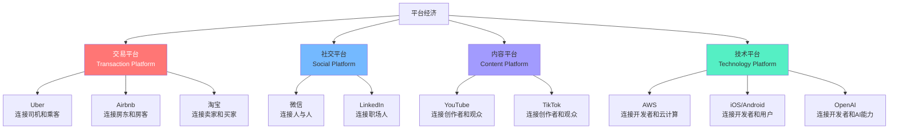
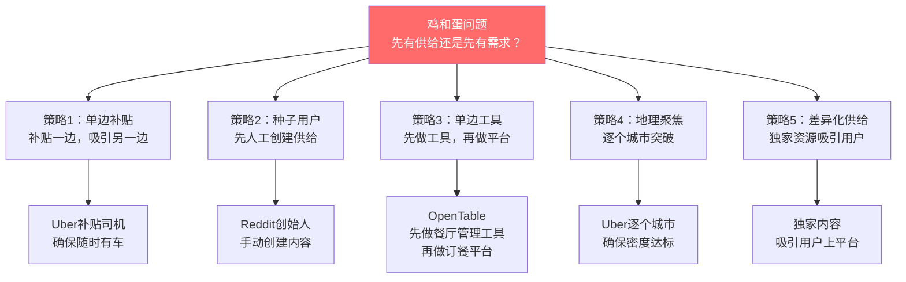

# 平台经济：双边市场的网络效应

> 平台经济的核心不是"卖什么"，而是"连接谁"。它的价值不来自产品本身，而来自**参与者之间的互动**。

---

## 一、平台经济的核心

### 1.1 什么是平台经济

> [!defn] 平台经济
> 平台经济是一种**以平台为核心、连接多方参与者并促进其互动**的商业模式。平台本身不直接生产商品或服务，而是通过**降低交易成本、促进匹配、提供基础设施**来创造价值。

> [!important] 平台 vs 管道
> 传统企业是"管道"——线性地从供应商到客户。平台是"双边市场"——连接生产者和消费者，并从他们的互动中创造价值。管道靠效率取胜，平台靠网络效应取胜。

### 1.2 网络效应：平台经济的核心引擎

网络效应是平台经济最核心的竞争力来源。

**网络效应的类型**：

| 类型 | 描述 | 案例 | 特点 |
|------|------|------|------|
| 直接网络效应 | 用户越多，每个用户价值越大 | 微信、电话 | 正向、直接 |
| 间接网络效应 | 一边用户越多，另一边价值越大 | Uber（乘客多→司机多→乘客多） | 正向、跨边 |
| 数据网络效应 | 用户越多→数据越多→产品越好→用户越多 | Google搜索、TikTok推荐 | 正向、延迟 |
| 负网络效应 | 用户过多导致体验下降 | 拥堵的社交平台 | 负向 |

> [!tip] 网络效应的数学本质
> - **梅特卡夫定律**：网络价值 ≈ n²（n为节点数）
> - **实际修正**：网络价值 ≈ n × log(n)（更符合实际）
> - 核心洞察：**网络价值增长远超用户数量增长**，这是平台经济的根本魅力所在。

---

## 二、平台经济的类型

### 2.1 四大平台类型

### 2.2 各类型详解

#### 交易平台

| 维度 | 特征 |
|------|------|
| 核心价值 | 撮合供给和需求，降低交易成本 |
| 收入模式 | 交易佣金（Take Rate）、服务费、广告 |
| 关键挑战 | 信任体系、质量控制、供需平衡 |
| 代表企业 | Uber、Airbnb、淘宝、美团 |
| 网络效应 | 强跨边网络效应（供给多→需求多→供给多） |

#### 社交平台

| 维度 | 特征 |
|------|------|
| 核心价值 | 连接人与人，促进社交互动 |
| 收入模式 | 广告、增值服务、电商 |
| 关键挑战 | 隐私保护、内容审核、用户增长天花板 |
| 代表企业 | 微信、Facebook、LinkedIn |
| 网络效应 | 强同边网络效应（朋友都在用→你也要用） |

#### 内容平台

| 维度 | 特征 |
|------|------|
| 核心价值 | 连接内容创作者和消费者 |
| 收入模式 | 广告分成、订阅、打赏 |
| 关键挑战 | 内容质量、创作者激励、版权保护 |
| 代表企业 | YouTube、TikTok、B站、Substack |
| 网络效应 | 跨边+数据网络效应 |

#### 技术平台

| 维度 | 特征 |
|------|------|
| 核心价值 | 提供技术基础设施，让第三方在其上构建 |
| 收入模式 | API调用费、订阅、利润分成 |
| 关键挑战 | 技术标准、安全性、生态治理 |
| 代表企业 | AWS、iOS/Android、OpenAI |
| 网络效应 | 间接网络效应（开发者多→应用多→用户多） |

---

## 三、平台经济的"鸡和蛋"问题

### 3.1 核心困境

> [!danger] 平台经济的终极困境
> 平台的价值取决于参与者的数量，但参与者只在平台有价值时才加入。这就是经典的**"鸡和蛋"问题**：
> - 没有司机，乘客不会来
> - 没有乘客，司机不会来
> - 怎么破？

### 3.2 冷启动策略详解

**策略一：单边补贴**

> [!example] Uber的冷启动
> Uber在进入新城市时，先**补贴司机**（保证每小时最低收入），确保供给充足。当乘客打开App发现随时有车，体验好，自然留存。供给稳定后，逐步降低补贴。

**策略二：种子用户**

> [!example] Reddit的冷启动
> Reddit创始人在早期用自己的多个账号手动创建内容，让平台看起来"有人气"。当真实用户开始贡献内容时，平台已经具备了初始吸引力。

**策略三：单边工具起步**

> [!example] OpenTable的冷启动
> OpenTable先做餐厅预订管理软件（单边工具），卖给餐厅。当积累足够餐厅后，再开放消费者端，实现双边连接。**先做工具，再做平台**。

**策略四：地理聚焦**

> [!example] 美团外卖的冷启动
> 美团外卖不是一个城市一个城市地铺开，而是一个**商圈一个商圈**地突破。在一个小区域内确保足够密度（商户够多、骑手够快），再扩展到下一个商圈。

**策略五：差异化供给**

> [!example] 游戏主机的冷启动
> PlayStation和Xbox通过**独家游戏**吸引玩家。玩家因为独占游戏购买主机，开发者因为主机有足够玩家而愿意开发游戏。

### 3.3 冷启动策略选择

| 策略 | 适合场景 | 风险 | 成本 |
|------|----------|------|------|
| 单边补贴 | 资金充裕 | 补贴依赖症 | 高 |
| 种子用户 | 内容/UGC平台 | 人工成本高 | 中 |
| 单边工具 | B2B2C场景 | 转型困难 | 中 |
| 地理聚焦 | O2O/本地服务 | 扩展速度慢 | 高 |
| 差异化供给 | 有独家资源 | 供给可持续性 | 中高 |

---

## 四、平台经济的垄断风险

### 4.1 赢家通吃效应

> [!warning] 网络效应导致自然垄断
> 网络效应越强，平台越容易形成**赢家通吃**（Winner-Takes-All）的格局。当大多数用户都在一个平台上时，新平台即使功能更好也很难吸引用户——因为用户的社交网络、交易历史、数据都在旧平台上。

**赢家通吃的条件**：

| 条件 | 说明 | 示例 |
|------|------|------|
| 强网络效应 | 用户越多价值越大 | 社交网络 |
| 高切换成本 | 用户难以迁移 | 数据/社交关系 |
| 低多归属 | 用户不同时使用多个平台 | 即时通讯 |
| 规模经济 | 规模越大成本越低 | 云计算 |

### 4.2 垄断的表现与监管

| 表现 | 案例 | 监管应对 |
|------|------|----------|
| 数据垄断 | Google垄断搜索数据 | GDPR、数据可携带权 |
| 生态锁定 | 苹果App Store强制使用其支付 | DMA（数字市场法案） |
| 杀手并购 | Facebook收购Instagram/WhatsApp | 反垄断审查 |
| 自我优待 | 亚马逊推广自有品牌 | 平台中立性要求 |

> [!info] 平台垄断的监管趋势
> 全球监管机构正在加强对平台经济的监管：
> - **欧盟DMA**：对"守门人"平台施加严格义务
> - **中国反垄断**：对阿里、美团等平台处以巨额罚款
> - **美国反垄断**：对Google、苹果、亚马逊提起反垄断诉讼

---

## 五、平台经济的商业模式视角

> [!comment] 与AI应用发展阶段演进的区别
> [[02-AI趋势与素养/AI应用发展阶段演进/00_MOC_AI应用发展阶段演进中枢]]讨论的是AI产品从工具到平台到生态的**产品演进路径**，关注的是技术能力和产品形态的演变。本文聚焦的是**商业模式层面**——平台如何创造价值、如何定价、如何盈利，不涉及技术实现细节。

### 5.1 平台收入模式

| 收入模式 | 描述 | 代表平台 | Take Rate |
|----------|------|----------|-----------|
| 交易佣金 | 对每笔交易抽成 | Uber、Airbnb | 15-30% |
| 订阅费 | 对平台使用收取订阅费 | LinkedIn Premium | 固定月费 |
| 广告 | 对流量变现 | Google、Facebook | 按CPC/CPM |
| 增值服务 | 提供额外付费服务 | 淘宝直通车 | 按效果付费 |
| 数据变现 | 出售数据洞察 | Bloomberg Terminal | 高额订阅 |
| 开放平台 | 对API调用收费 | AWS、OpenAI | 按用量 |

### 5.2 平台定价原则

> [!tip] 平台定价的核心原则
> 1. **补贴弹性大的一边**：哪边对价格更敏感，补贴哪边
> 2. **收费价值高的一边**：哪边从平台获得更多价值，收费哪边
> 3. **控制多归属**：如果某边容易多归属，降低对该边的收费
> 4. **品牌差异化**：如果某边有品牌优势，可以对其收费

---

## 六、平台经济的成功关键因素

### 6.1 平台成功的核心要素

> [!tip] 成功平台的五大要素
> 1. **解决真实的供需匹配问题**：不是创造需求，而是连接已有的供需
> 2. **建立信任体系**：评价系统、认证、保险、担保——让陌生人之间可以安全交易
> 3. **降低交易成本**：搜索成本、匹配成本、信任成本、执行成本——越低越好
> 4. **设计合理的抽成比例**：Take Rate过高会驱逐参与者，过低平台无法盈利
> 5. **持续迭代匹配效率**：数据驱动的匹配算法，让每次交易体验越来越好

### 6.2 平台经济的核心指标

| 指标 | 含义 | 健康基准 |
|------|------|----------|
| GMV（总交易额） | 平台上的总交易金额 | 持续增长 |
| Take Rate（抽成率） | 平台从交易中抽取的比例 | 15-30% |
| 流动性 | 供给匹配需求的速度 | 匹配率 > 90% |
| 集中度 | 交易是否过度集中在少数供给方 | 集中度适中 |
| 多归属率 | 用户同时使用多个平台的比例 | 越低越好 |
| 网络密度 | 参与者之间的连接密度 | 越高越好 |

### 6.3 平台经济的常见失败模式

> [!warning] 失败模式一：烧钱补贴不可持续
> 大量补贴获取用户，但补贴停止后用户流失。补贴应该用于建立网络效应，而非购买一次性交易。

> [!warning] 失败模式二：忽视信任体系
> 平台不建立信任机制，导致欺诈、劣质服务泛滥，最终驱逐优质参与者和优质客户。

> [!warning] 失败模式三：过早追求商业化
> 在网络效应尚未建立时就追求高抽成，导致参与者流失到竞争对手。

> [!warning] 失败模式四：忽视本地化
> 平台模式高度依赖本地网络效应，一刀切的全球化策略往往失败。Uber在中国、东南亚的失败就是教训。

---

## 七、延伸阅读

- [[04-商业与战略/商业模式设计与创新/00_MOC_商业模式设计与创新中枢]] — 知识库总览
- [[04-商业与战略/商业模式设计与创新/01_商业模式画布：理解商业的九宫格]] — 商业模式基础框架
- [[04-商业与战略/商业模式设计与创新/05_生态型商业模式：从竞争到共生]] — 从平台到生态的演进
- [[04-商业与战略/商业模式设计与创新/06_商业模式创新方法论]] — 商业模式创新方法论
- [[02-AI趋势与素养/AI应用发展阶段演进/00_MOC_AI应用发展阶段演进中枢]] — 产品演进路径（工具→平台→生态）
- [[04-商业与战略/战略分析工具与框架/00_MOC_战略分析工具与框架中枢]] — 波特五力等战略工具
- *Platform Revolution* — Geoffrey G. Parker, Marshall W. Van Alstyne

---

> [!quote]
> "在平台经济中，最重要的不是你能做什么，而是你能让其他人做什么。平台的真正价值在于赋能生态参与者。"
>
> — *Platform Revolution*

---

*最后更新：2026-07-27*