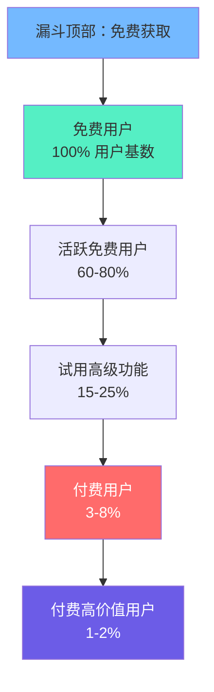
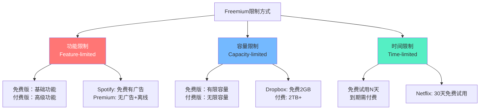
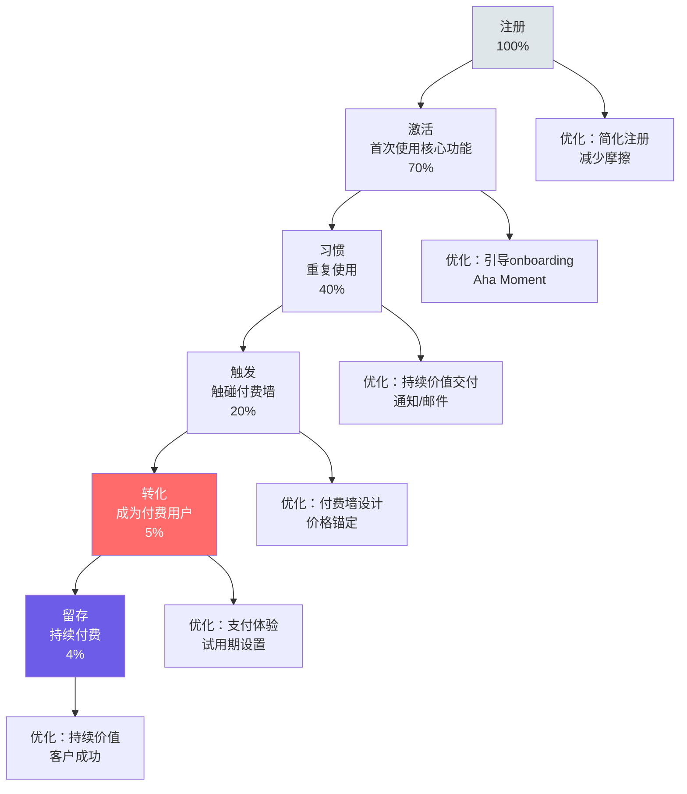
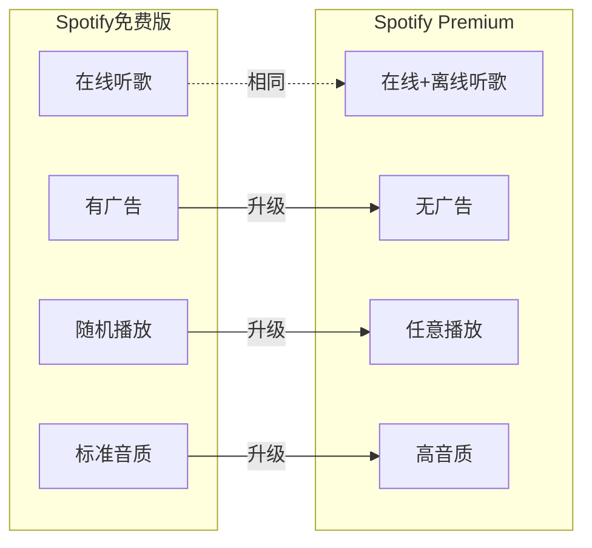

# 免费增值：Freemium的艺术与科学

> Freemium不是"免费"和"付费"的简单叠加，而是一门精确的科学——**用免费获取用户，用付费创造收入**。两者之间的平衡，决定了模式的成败。

---

## 一、Freemium的核心逻辑

### 1.1 什么是Freemium

> [!defn] Freemium
> Freemium = Free + Premium。它是一种**分层定价策略**：提供免费的基础版本获取大量用户，通过功能/容量/体验的差异化，将部分用户转化为付费用户。



### 1.2 Freemium的经济学原理

> [!key] 为什么Freemium有效
> 1. **零边际成本**：数字产品的边际成本趋近于零，免费用户的增量成本几乎为零
> 2. **网络效应**：免费用户越多，产品价值越大（数据、社交、内容）
> 3. **降低试用门槛**：免费消除了客户的"尝试风险"，大幅降低获客成本
> 4. **口碑传播**：免费用户是最便宜的营销渠道
> 5. **习惯养成**：用户先免费使用，形成习惯后更难离开

**Freemium的数学**：

```
假设：
- 免费用户：1,000,000 人
- 转化率：5%
- 付费用户：50,000 人
- 月均ARPU：$10
- 免费用户月均成本：$0.05

收入 = 50,000 × $10 = $500,000/月
免费用户成本 = 1,000,000 × $0.05 = $50,000/月
净收入 = $450,000/月

如果转化率提升到 6%：
收入 = 60,000 × $10 = $600,000/月（+$100,000）
```

> [!comment] 关键洞察
> 转化率每提升1个百分点，收入可以增加20%。这就是为什么Freemium公司对转化率优化如此痴迷。

---

## 二、Freemium的定价策略

### 2.1 三种限制方式



#### 功能限制（Feature-limited）

| 平台 | 免费版 | 付费版 | 差异化策略 |
|------|--------|--------|------------|
| Spotify | 有广告、随机播放、在线 | 无广告、任意播放、离线 | 核心体验差异 |
| Notion | 个人使用、有限块数 | 无限块数、团队协作 | 协作限制 |
| Zoom | 40分钟会议 | 无限制时长 | 时间+功能组合 |
| Canva | 基础模板、有限素材 | 高级模板、无限素材 | 内容质量差异 |

#### 容量限制（Capacity-limited）

| 平台 | 免费版 | 付费版 | 差异化策略 |
|------|--------|--------|------------|
| Dropbox | 2GB | 2TB+ | 存储容量 |
| Evernote | 60MB/月上传 | 10GB/月上传 | 上传容量 |
| Google Drive | 15GB | 100GB-2TB | 存储容量 |

#### 时间限制（Time-limited）

| 平台 | 试用期 | 后续 | 策略 |
|------|--------|------|------|
| Netflix | 30天 | 付费 | 充分体验 |
| Amazon Prime | 30天 | 付费 | 培养习惯 |
| Adobe Creative Cloud | 7天 | 付费 | 专业工具 |

### 2.2 定价策略选择

> [!tip] 如何选择限制方式
> 1. **功能限制**：适合产品功能层次分明，高级功能有明确价值的场景
> 2. **容量限制**：适合使用量与价值正相关的场景（如存储、处理量）
> 3. **时间限制**：适合完整产品体验后才显价值的场景（如流媒体、SaaS）
> 4. **混合策略**：大多数成功产品使用混合策略（如功能限制+容量限制）

---

## 三、Freemium的转化率优化

### 3.1 转化漏斗



### 3.2 转化率提升的五个杠杆

#### 杠杆一：Aha Moment

> [!key] Aha Moment
> 用户第一次真正感受到产品价值的时刻。让用户尽快到达Aha Moment是转化率优化的第一要务。

| 产品 | Aha Moment | 时间目标 |
|------|------------|----------|
| Dropbox | 首次同步文件成功 | 注册后5分钟 |
| Slack | 团队成员发送第一条消息（2000条） | 注册后一周内 |
| Spotify | 收藏第一首歌/创建第一个播放列表 | 注册后10分钟 |
| Zoom | 成功发起第一次会议 | 注册后立即 |

#### 杠杆二：付费墙设计

> [!tip] 付费墙设计原则
> 1. **在价值最高点触发**：不要一注册就要求付费，在用户感受到价值后再提示
> 2. **自然阻断**：让付费墙出现得自然（如"你已达到免费额度上限"）
> 3. **展示价值差距**：让用户清楚看到付费版比免费版好在哪里
> 4. **价格锚定**：先展示高价方案，让中间方案看起来更划算

#### 杠杆三：免费试用

| 试用类型 | 描述 | 优势 | 劣势 |
|----------|------|------|------|
| 选择加入 | 用户主动选择试用 | 意向明确 | 转化率低 |
| 选择退出 | 默认进入试用，到期自动续费 | 转化率高 | 可能引起反感 |
| 反向试用 | 先给高级功能，到期降级 | 充分体验价值 | 降级体验差 |

#### 杠杆四：行为触发

> [!example] 促使用户升级的行为信号
> - 频繁遇到付费墙（如"已达到免费额度"）
> - 使用量接近免费上限
> - 通过团队邀请加入（协作需求）
> - 使用高级功能后才有的体验（如模板、数据导出）
> - 达到某个里程碑（如创建第10个项目）

#### 杠杆五：定价实验

> [!tip] A/B测试定价
> 持续测试定价方案是提升转化率的最有效方法之一：
> - 测试不同价格点（$9 vs $12 vs $15）
> - 测试不同方案数量（2档 vs 3档 vs 4档）
> - 测试不同年付折扣（20% vs 30% vs 40%）
> - 测试免费试用时长（7天 vs 14天 vs 30天）

---

## 四、Freemium的陷阱

### 4.1 五大陷阱

> [!warning] 陷阱一：免费用户太多，拖垮成本
> 即使边际成本低，百万级免费用户的基础设施成本也不容忽视。如果免费用户不贡献网络效应（如数据、内容、社交），他们就是纯成本。

> [!warning] 陷阱二：付费版价值不够吸引人
> 如果免费版"足够好"，用户没有升级动力。Spotify免费版有广告限制，但核心功能（听歌）完整，导致部分用户永不升级。

> [!warning] 陷阱三：转化率过低
> 行业平均Freemium转化率在2-5%。如果低于2%，需要重新审视免费版和付费版的差异设计。

> [!warning] 陷阱四：免费用户稀释品牌
> 如果免费版体验太差，用户会形成负面印象，反而伤害品牌。免费版应该是"好"的，付费版是"更好"的。

> [!warning] 陷阱五：忽视免费用户的价值
> 免费用户不是"成本中心"，他们是：
> - 数据贡献者（训练推荐算法）
> - 网络效应贡献者（社交平台）
> - 口碑传播者
> - 潜在的付费用户

### 4.2 Freemium健康度检查

| 指标 | 健康基准 | 危险信号 |
|------|----------|----------|
| 转化率 | 3-8% | < 2% |
| 免费用户边际成本 | < $0.10/月 | > $0.50/月 |
| 付费用户留存率 | > 90%/月 | < 80%/月 |
| 免费用户活跃度 | > 40% MAU | < 20% MAU |
| 付费ARPU | 持续增长 | 停滞或下降 |

---

## 五、Freemium的成功案例

### 5.1 Spotify：音乐Freemium的教科书



> [!example] Spotify的Freemium策略
> - **免费版**：有广告、仅在线、随机播放限制——创造明确的不便
> - **付费版**：无广告、离线下载、任意播放、高音质——消除所有痛点
> - **转化率**：约45%用户最终成为付费用户（行业最高之一）
> - **关键成功因素**：广告足够"烦人"但不至于赶走用户；免费版体验足够好让用户不想离开

### 5.2 Dropbox：容量限制的典范

> [!example] Dropbox的Freemium策略
> - **免费版**：2GB存储——足够个人轻度使用
> - **付费版**：2TB+——满足重度用户需求
> - **增长引擎**：推荐计划（邀请好友各得500MB）——免费用户帮助获客
> - **转化触发**：用户存储空间满了，自然触发付费需求
> - **关键成功因素**：容量限制是"自然"的付费墙，用户不会觉得被强迫

### 5.3 Notion：协作驱动的Freemium

> [!example] Notion的Freemium策略
> - **免费版**：个人使用完整功能——让个人用户爱上产品
> - **付费版**：团队协作功能——用户把Notion带入工作场景后，协作需求自然产生
> - **转化逻辑**：个人使用 → 分享给团队 → 团队需要协作功能 → 团队付费
> - **关键成功因素**：**病毒式增长**——个人用户是进入企业的"特洛伊木马"

---

## 六、Freemium vs 其他模式

| 维度 | Freemium | 免费试用 | 直接付费 | 开源 |
|------|----------|----------|----------|------|
| 获客成本 | 低 | 中 | 高 | 低 |
| 转化率 | 2-8% | 15-30% | N/A | 0.5-2% |
| 品牌建设 | 强 | 中 | 弱 | 强 |
| 适合场景 | 产品驱动增长 | 销售驱动增长 | 品牌垄断 | 开发者工具 |
| 代表企业 | Spotify, Dropbox | Salesforce, HubSpot | SAP, Oracle | MongoDB, GitLab |

---

## 七、延伸阅读

- [[04-商业与战略/商业模式设计与创新/00_MOC_商业模式设计与创新中枢]] — 知识库总览
- [[04-商业与战略/商业模式设计与创新/01_商业模式画布：理解商业的九宫格]] — 商业模式基础框架
- [[04-商业与战略/商业模式设计与创新/02_订阅经济：从卖产品到卖服务]] — 订阅经济的指标与策略
- [[04-商业与战略/商业模式设计与创新/06_商业模式创新方法论]] — 商业模式创新方法论
- *Free: The Future of a Radical Price* — Chris Anderson

---

> [!quote]
> "免费不是商业模式，免费是获客策略。Freemium的终极目标是让免费用户爱上产品，然后心甘情愿地付费。"
>
> — Chris Anderson, *Free*

---

*最后更新：2026-07-27*