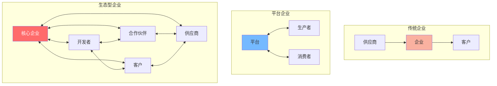
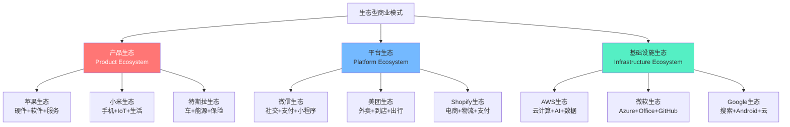
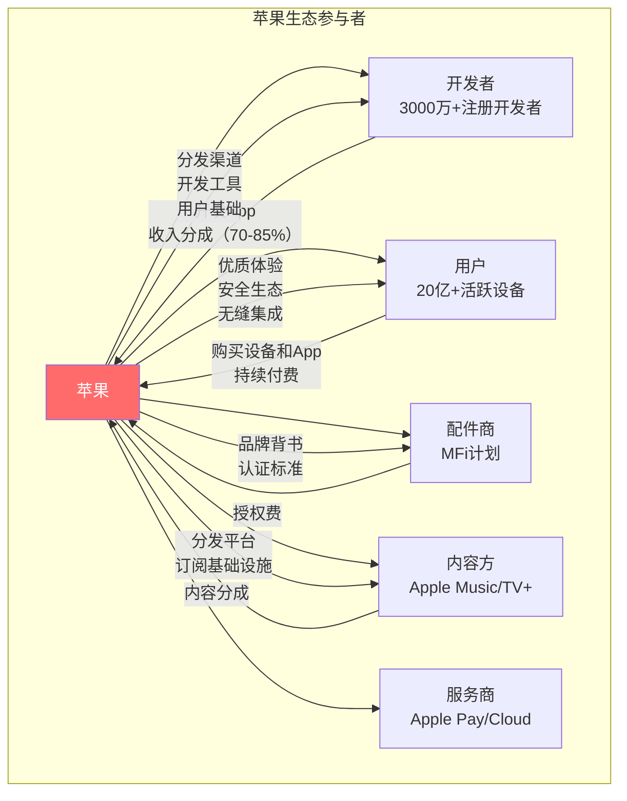
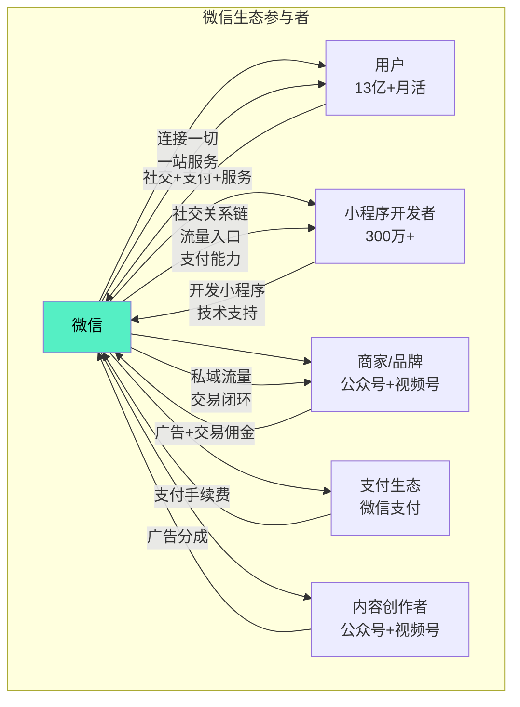
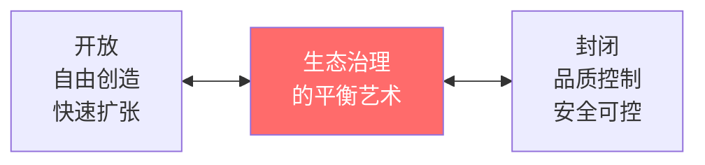
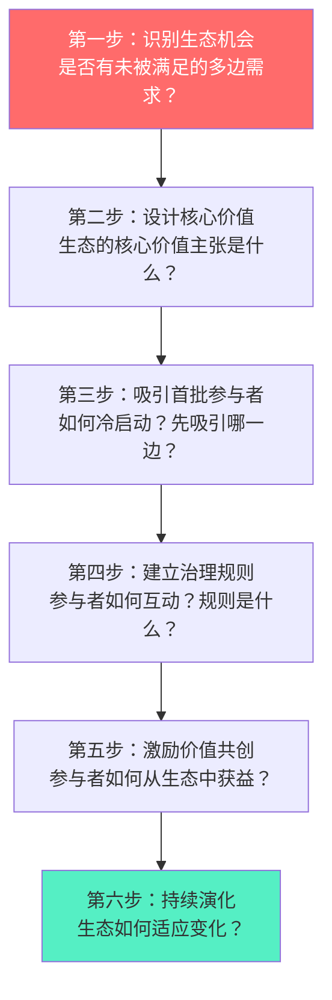

# 生态型商业模式：从"竞争"到"共生"

> 生态型商业模式不是"大企业"的专利，而是一种**组织逻辑的根本转变**——从"我赢你输"到"我们一起赢"。

---

## 一、什么是生态型商业模式

### 1.1 定义与特征

> [!defn] 生态型商业模式
> 生态型商业模式是一种以**多边参与、价值共创、利益共享**为核心特征的商业组织形式。它不再是单一企业向客户提供产品，而是多个参与者围绕一个核心平台或标准，共同创造和分配价值。



**生态型商业模式的五大特征**：

| 特征 | 描述 | 与传统模式的区别 |
|------|------|------------------|
| 多边参与 | 不止供需两方，而是多方角色共同参与 | 传统：企业→客户 单向 |
| 价值共创 | 参与者共同创造价值，而非单向传递 | 传统：企业创造，客户消费 |
| 利益共享 | 价值在生态参与者之间合理分配 | 传统：企业独享利润 |
| 协同进化 | 生态参与者共同成长、相互促进 | 传统：各自独立发展 |
| 自组织 | 生态具有自我调节和演化的能力 | 传统：层级式管理 |

### 1.2 生态 vs 平台

> [!important] 生态与平台的核心区别
> 平台是**撮合交易**，生态是**共创价值**。平台是生态的"骨架"，生态是平台的"血肉"。参照 [[04-商业与战略/商业模式设计与创新/03_平台经济：双边市场的网络效应]] 理解平台基础，再看生态如何超越平台。

| 维度 | 平台经济 | 生态型商业模式 |
|------|----------|----------------|
| 核心逻辑 | 撮合供需 | 共创价值 |
| 参与角色 | 生产者+消费者 | 多角色（开发者、服务商、内容方等） |
| 价值创造 | 平台提供基础设施 | 多方共同创造 |
| 关系类型 | 交易关系 | 共生关系 |
| 治理模式 | 平台规则 | 生态治理（规则+激励+文化） |
| 收入模式 | 佣金/广告 | 多元化（佣金+订阅+服务+数据） |
| 典型案例 | Uber、Airbnb | 苹果生态、微信生态、AWS生态 |

---

## 二、生态型商业模式的类型

### 2.1 三大生态类型



### 2.2 苹果App Store生态



> [!example] 苹果生态的商业模式逻辑
> - **硬件是入口**：iPhone/iPad/Mac/Watch 是用户进入生态的"门票"
> - **软件是粘合剂**：iOS/macOS/watchOS 实现无缝体验
> - **服务是利润引擎**：App Store（30%佣金）、iCloud、Apple Music、Apple Pay —— 2024年服务收入超$850亿
> - **配件是扩展**：AirPods、Apple Watch、MFi配件 —— 扩展生态边界
> - **核心洞察**：苹果不卖"最好的手机"，而是卖"最好的生态"。用户一旦进入苹果生态，切换成本极高。

### 2.3 微信生态



> [!example] 微信生态的商业模式逻辑
> - **社交是根基**：13亿+月活是生态的土壤
> - **支付是血脉**：微信支付连接所有交易场景
> - **小程序是枝叶**：300万+小程序覆盖几乎所有生活服务
> - **公众号/视频号是内容层**：吸引和留存用户注意力
> - **核心洞察**：微信不是"一个App"，而是"一个操作系统级生态"。它在iOS/Android之上构建了第二个应用层。

### 2.4 AWS生态

```mermaid
graph TB
    AWS[AWS]

    subgraph AWS生态参与者
        AWS --> ENTERPRISE[企业客户<br/>数百万企业]
        AWS --> PARTNER[合作伙伴<br/>10万+合作伙伴]
        AWS --> DEV3[开发者<br/>数百万开发者]
        AWS --> SAAS[SaaS厂商<br/>在AWS上构建]
        AWS --> MARKET[MARKET[Marketplace<br/>第三方软件]
    end

    ENTERPRISE -->|"按用量付费<br/>长期合同"| AWS
    PARTNER -->|"联合销售<br/>收入分成"| AWS
    SAAS -->|"基础设施费用"| AWS

    AWS -->|"基础设施<br/>200+服务<br/>全球覆盖"| ENTERPRISE
    AWS -->|"技术认证<br/>联合营销<br/>市场机会"| PARTNER
    AWS -->|"开发工具<br/>免费层<br/>文档"| DEV3

    style AWS fill:#ff9900,color:#000
```

> [!example] AWS生态的商业模式逻辑
> - **基础设施是根基**：计算、存储、网络、数据库等200+服务
> - **合作伙伴是杠杆**：10万+合作伙伴进行咨询、实施、集成
> - **Marketplace是渠道**：第三方软件在AWS上销售，AWS抽成
> - **开发者是火种**：免费层和开发者工具培养生态
> - **核心洞察**：AWS的本质不是"卖服务器"，而是"提供创新基础设施"。每个在AWS上构建的SaaS公司，都是AWS生态的一部分。

---

## 三、生态型商业模式的治理

### 3.1 治理的核心挑战

> [!danger] 生态治理的核心矛盾
> 生态型企业面临一个根本矛盾：**既要让参与者自由创造，又要维护生态的整体秩序和品质**。过于开放，生态混乱；过于封闭，生态僵化。



### 3.2 治理的四个维度

| 维度 | 核心问题 | 苹果策略 | 微信策略 | AWS策略 |
|------|----------|----------|----------|--------|
| 准入治理 | 谁可以加入生态？ | 严格审核（App Store） | 相对宽松（小程序审核） | 开放（注册即可用） |
| 行为治理 | 参与者可以做什么？ | 严格规则+审核 | 规则+举报机制 | 服务条款约束 |
| 分配治理 | 价值如何分配？ | 70-85%给开发者 | 小程序免费/广告分成 | 合作伙伴计划分层 |
| 演化治理 | 生态如何进化？ | 苹果主导+API演进 | 微信主导+开放能力 | 客户需求驱动+合作伙伴反馈 |

### 3.3 生态治理原则

> [!tip] 生态治理的黄金法则
> 1. **规则透明**：参与者清楚知道规则和边界
> 2. **利益公平**：生态主不能"既当裁判又当运动员"
> 3. **品质底线**：维护生态整体品质的最低标准
> 4. **进化能力**：治理规则能随生态演化而调整
> 5. **退出机制**：参与者可以自由退出，降低锁定风险

---

## 四、生态型商业模式的商业模式视角

> [!comment] 与AI应用发展阶段演进的区别
> [[02-AI趋势与素养/AI应用发展阶段演进/00_MOC_AI应用发展阶段演进中枢]] 讨论的是AI产品从工具到平台到生态的**产品演进路径**，聚焦点在于技术能力和产品形态。本文聚焦**商业模式层面**——生态如何创造价值、如何分配价值、如何通过治理实现可持续发展。

### 4.1 生态型商业模式的收入结构

| 收入层次 | 描述 | 苹果 | 微信 | AWS |
|----------|------|------|------|-----|
| 核心层 | 基础产品/服务收入 | iPhone硬件收入 | — | 计算/存储/网络 |
| 平台层 | 平台服务和佣金 | App Store 30%佣金 | 支付手续费 | Marketplace佣金 |
| 服务层 | 增值服务收入 | iCloud, Apple Music | 广告 | 高级服务 |
| 生态层 | 生态衍生收入 | MFi授权费 | 小程序交易 | 合作伙伴收入 |

### 4.2 生态型商业模式的护城河

> [!tip] 生态护城河
> 1. **数据网络效应**：生态内数据越多，所有参与者越受益
> 2. **切换成本**：生态内关系越复杂，用户越难离开
> 3. **生态协同**：生态内产品/服务协同，单一产品无法替代
> 4. **创新速度**：生态内多方创新，单一企业难以追赶
> 5. **规模效应**：生态越大，每个参与者的边际成本越低

---

## 五、生态型商业模式的未来

### 5.1 AI时代的生态演化

AI正在重塑生态型商业模式。详见 [[04-商业与战略/商业模式设计与创新/07_AI时代的商业模式创新]]。

| 趋势 | 描述 | 影响 |
|------|------|------|
| AI Agent生态 | AI Agent成为生态新参与者 | 生态从"人-人"扩展到"人-AI-AI" |
| 开放AI生态 | 类似App Store的AI应用生态 | 新平台机会 |
| 数据生态 | 数据共享和协作的生态 | 数据价值最大化 |
| 智能协同 | AI驱动的生态协作 | 效率革命 |

### 5.2 生态型商业模式与组织变革

生态型商业模式要求组织形态的相应变革，参考 [[02-AI趋势与素养/AI Native组织变革/00_MOC_AI Native组织变革中枢]]。

### 5.3 构建生态型商业模式的关键步骤



### 5.4 生态型商业模式的挑战与风险

> [!warning] 挑战一：生态主权力过大
> 生态主掌握规则制定权，可能滥用权力。苹果强制使用其支付系统、对开发者收取30%佣金，引发了全球监管关注。

> [!warning] 挑战二：生态锁定与反垄断
> 生态越封闭，参与者切换成本越高，越容易引发反垄断调查。需要在"开放"和"控制"之间找到平衡。

> [!warning] 挑战三：创新与稳定的矛盾
> 生态需要稳定规则来吸引参与者，但过于稳定的规则可能阻碍创新。如何在不破坏生态的前提下推动创新？

> [!warning] 挑战四：生态内竞争管理
> 如何管理生态内的竞争？生态主是否应该与生态参与者竞争？"既当裁判又当运动员"是生态治理的核心难题。

---

## 六、延伸阅读

- [[04-商业与战略/商业模式设计与创新/00_MOC_商业模式设计与创新中枢]] — 知识库总览
- [[04-商业与战略/商业模式设计与创新/03_平台经济：双边市场的网络效应]] — 平台经济基础
- [[04-商业与战略/商业模式设计与创新/06_商业模式创新方法论]] — 商业模式创新方法论
- [[04-商业与战略/商业模式设计与创新/07_AI时代的商业模式创新]] — AI时代的新商业模式
- [[02-AI趋势与素养/AI应用发展阶段演进/00_MOC_AI应用发展阶段演进中枢]] — 产品演进路径
- [[02-AI趋势与素养/AI Native组织变革/00_MOC_AI Native组织变革中枢]] — AI时代的组织变革
- *The Business of Platforms* — Cusumano, Gawer, Yoffie

---

> [!quote]
> "在生态型商业模式中，你不是在卖产品，你是在创造一个让其他人成功的世界。当你的生态参与者成功时，你自然成功。"
>
> — 本知识库编纂者

---

*最后更新：2026-07-27*