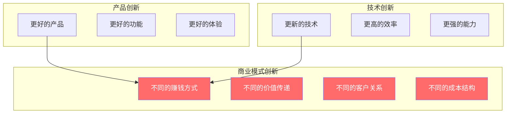
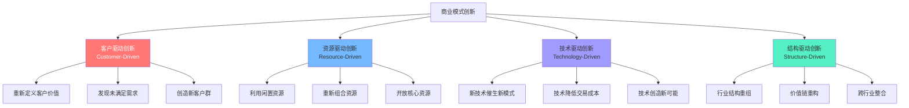
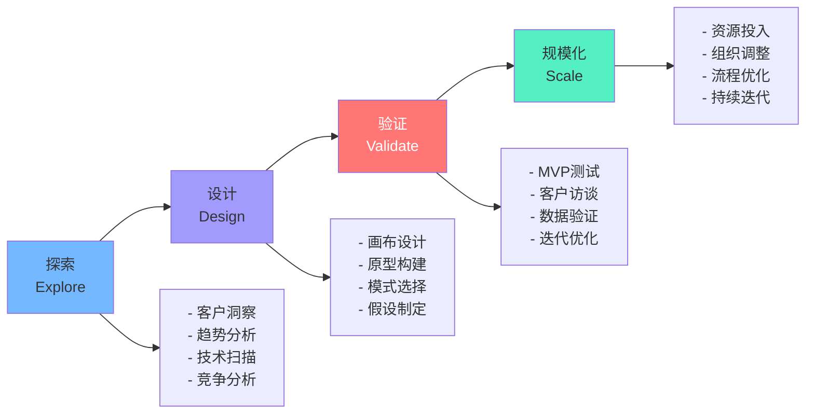

# 商业模式创新方法论

> 商业模式创新不是灵光一现的"天才想法"，而是一套**系统性的方法**——可以被学习、被实践、被复制的创新流程。

---

## 一、商业模式创新的本质

### 1.1 什么是商业模式创新

> [!defn] 商业模式创新
> 商业模式创新是指**对商业模式的一个或多个要素进行根本性变革**，从而创造新的价值创造、价值传递或价值捕获方式。它不是产品创新（更好的产品），也不是技术创新（更新的技术），而是改变"做生意的方式"。

> [!important] 关键区分
> - **产品创新**：iPhone 4 → iPhone 15（更好的产品）
> - **商业模式创新**：iPod → iTunes → iPhone → App Store → 服务订阅（不同的赚钱方式）
> - 苹果的真正魔力不在于产品创新，而在于**商业模式创新**——从一个卖硬件的公司，变成了一个经营生态的公司。

### 1.2 为什么商业模式创新如此重要

| 原因 | 说明 |
|------|------|
| 技术民主化 | 技术优势越来越容易被复制，商业模式成为真正的差异化 |
| 客户需求变化 | 从"拥有"到"使用"，从"产品"到"体验" |
| 竞争边界模糊 | 跨界打劫成为常态（如苹果做信用卡、特斯拉做保险） |
| 利润池迁移 | 行业利润从制造向服务、数据、生态迁移 |
| 技术催化 | 新技术（AI、区块链、IoT）催生新模式 |

---

## 二、商业模式创新的四种路径

### 2.1 创新路径总览

### 2.2 客户驱动创新

> [!defn] 客户驱动创新
> **从客户出发，重新定义价值**。不是"我们有什么"然后"卖给谁"，而是"客户需要什么"然后"我们如何满足"。

**经典案例**：

| 企业 | 客户洞察 | 创新方式 | 商业模式变化 |
|------|----------|----------|--------------|
| Netflix | "不想去录像店，不想付逾期费" | 从DVD邮寄到流媒体 | 从租赁到订阅 |
| Dollar Shave Club | "剃须刀太贵了，而且不需要那么多功能" | 简化产品+订阅配送 | 从零售到DTC订阅 |
| Warby Parker | "眼镜太贵，试戴不方便" | 线上试戴+直销 | 从渠道到DTC |
| 特斯拉 | "电动车不应该是'妥协的选择'" | 重新定义电动车体验 | 从卖车到卖能源生态 |

**客户驱动创新的方法**：

> [!tip] 客户驱动三问
> 1. **客户真正的Job to be Done是什么？**（不是买产品，而是"完成什么任务"）
> 2. **客户当前最大的痛点是什么？**（愿意为消除痛点付费）
> 3. **有没有被忽视的客户群？**（非消费者、过度服务者、低端市场）

### 2.3 资源驱动创新

> [!defn] 资源驱动创新
> **利用闲置或未被充分利用的资源创造新价值**。核心洞察：世界上存在大量闲置资源，连接它们就是价值。

**经典案例**：

| 企业 | 闲置资源 | 创新方式 | 商业模式变化 |
|------|----------|----------|--------------|
| Airbnb | 闲置房间/房屋 | 平台连接房东和房客 | 从"拥有酒店"到"连接空间" |
| Uber | 闲置车辆和司机时间 | 平台连接司机和乘客 | 从"拥有车队"到"连接出行" |
| 美团 | 餐厅闲置产能 | 外卖配送 | 从"堂食"到"到家" |
| WeWork | 闲置办公空间 | 灵活租赁 | 从"长期租赁"到"按需办公" |

**资源驱动创新的方法**：

> [!tip] 资源驱动三问
> 1. **哪些资源被闲置了？**（房屋、车辆、时间、技能、数据…）
> 2. **如何降低资源使用的门槛？**（分时租赁、共享、众包…）
> 3. **如何建立信任机制来连接资源？**（评价系统、保险、认证…）

### 2.4 技术驱动创新

> [!defn] 技术驱动创新
> **新技术创造了前所未有的商业可能性**。不是"技术更好"，而是"技术让以前不可能的事变得可能"。

**经典案例**：

| 技术 | 创新企业 | 商业模式创新 | 为什么以前不可能 |
|------|----------|--------------|------------------|
| 云计算 | Salesforce | SaaS订阅替代软件买断 | 以前需要本地部署，无法远程服务 |
| 移动互联网 | Uber | 实时匹配供需 | 以前没有智能手机和GPS |
| AI/推荐算法 | TikTok | 算法推荐替代社交关注 | 以前内容分发靠编辑或社交网络 |
| 大语言模型 | OpenAI | AI as a Service | 以前自然语言处理能力不足 |
| 区块链 | DeFi | 去中心化金融 | 以前需要银行作为信任中介 |

**技术驱动创新的方法**：

> [!tip] 技术驱动三问
> 1. **这项技术让什么"不可能"变成了"可能"？**
> 2. **这项技术如何降低交易成本？**（搜索、匹配、信任、执行）
> 3. **这项技术如何改变价值创造的方式？**（自动化、个性化、预测性）

### 2.5 结构驱动创新

> [!defn] 结构驱动创新
> **重新组织行业结构，改变价值创造和分配的方式**。核心洞察：行业结构不是给定的，而是可以被重新设计的。

**经典案例**：

| 企业 | 行业结构变化 | 创新方式 | 商业模式变化 |
|------|-------------|----------|--------------|
| 苹果 | 手机行业利润重新分配 | App Store让开发者赚钱 | 从卖硬件到生态运营 |
| 特斯拉 | 汽车销售模式变革 | 直销替代经销商 | 从经销商网络到DTC |
| 亚马逊 | 零售业价值链重构 | 平台+物流+云 | 从零售商到基础设施 |
| 拼多多 | 电商模式重构 | 社交裂变+C2M | 从"人找货"到"货找人" |

**结构驱动创新的方法**：

> [!tip] 结构驱动三问
> 1. **行业价值链中哪些环节利润过高？**（可以"去中介化"）
> 2. **行业中有哪些不必要的环节？**（可以简化或消除）
> 3. **跨行业的能力可以如何重新组合？**（跨界创新）

---

## 三、商业模式创新的流程

### 3.1 四阶段流程

### 3.2 阶段一：探索

**核心任务**：发现商业模式创新的机会

| 活动 | 工具 | 产出 |
|------|------|------|
| 客户洞察 | 客户访谈、JTBD、用户旅程图 | 客户痛点与需求 |
| 趋势分析 | PESTEL、技术雷达 | 外部机会与威胁 |
| 技术扫描 | 技术成熟度曲线、专利分析 | 技术可能性 |
| 竞争分析 | 波特五力、竞争对手画布 | 差异化空间 |

> [!tip] 探索阶段的关键问题
> 1. 客户最大的未被满足的需求是什么？
> 2. 行业中最"理所当然"的假设是什么？（可以打破的）
> 3. 什么技术正在变得可用？
> 4. 谁在跨界做类似的事情？

### 3.3 阶段二：设计

**核心任务**：设计新的商业模式方案

**工具：商业模式画布**

使用 [[04-商业与战略/商业模式设计与创新/01_商业模式画布：理解商业的九宫格]] 进行系统化设计：

1. 先确定**客户细分**和**价值主张**（核心）
2. 再设计**收入来源**和**成本结构**（经济可行性）
3. 最后补齐**基础设施**（核心资源、关键业务、重要伙伴）

**设计原则**：

> [!tip] 好的商业模式设计的特征
> 1. **一致性**：九个要素逻辑自洽
> 2. **差异化**：有明显不同于竞争对手的地方
> 3. **经济可行性**：收入能覆盖成本并有利润
> 4. **可规模化**：模式可以扩大而不会崩溃
> 5. **可防御性**：有护城河保护

### 3.4 阶段三：验证

**核心任务**：用最小的成本验证商业模式假设

**验证方法**：

| 方法 | 描述 | 适合验证什么 |
|------|------|-------------|
| 客户访谈 | 与目标客户深度对话 | 价值主张、客户痛点 |
| 着陆页测试 | 创建推广页面看转化率 | 市场需求、价值主张 |
| MVP测试 | 最小可行产品测试 | 产品可行性、使用行为 |
| 礼宾测试 | 人工模拟自动化服务 | 服务可行性、客户体验 |
| A/B测试 | 对比不同方案的效果 | 定价、功能、渠道 |
| 烟雾测试 | 收集购买意向 | 付费意愿 |

> [!warning] 验证的常见误区
> - **确认偏误**：只寻找支持自己想法的证据
> - **虚假正面**：客户说"会买"但不代表真会买
> - **错误样本**：问了错误的人（朋友、家人）
> - **过早规模化**：在验证不充分时就开始投入资源

### 3.5 阶段四：规模化

**核心任务**：将验证过的商业模式推向规模化

| 关键决策 | 考量因素 |
|----------|----------|
| 时机选择 | 市场准备好了吗？竞争格局如何？ |
| 资源投入 | 需要多少资金、人才、时间？ |
| 组织调整 | 现有组织能支撑新模式吗？需要调整吗？ |
| 风险控制 | 失败的最大代价是什么？如何降低风险？ |
| 增长策略 | 如何获取第一批客户？如何持续增长？ |

---

## 四、商业模式创新的常见陷阱

> [!warning] 陷阱一：为创新而创新
> 为了"创新"而改变商业模式，忽视了客户真正的需求。创新是手段，创造价值是目的。

> [!warning] 陷阱二：忽视现有业务的惯性
> 现有商业模式越成功，转型越困难。柯达、诺基亚的教训值得铭记。

> [!warning] 陷阱三：过早放弃
> 商业模式创新需要时间验证。过早放弃可能错过真正的机会。

> [!warning] 陷阱四：忽视组织能力
> 好的商业模式没有匹配的组织能力，最终无法落地。商业模式创新需要组织变革的配合。

> [!warning] 陷阱五：忽视利益相关者
> 商业模式创新可能损害现有合作伙伴的利益，需要平衡各方。

### 4.1 商业模式创新与组织变革

商业模式创新往往需要组织变革的配合。参考 [[02-AI趋势与素养/AI Native组织变革/00_MOC_AI Native组织变革中枢]]，理解组织如何适应新的商业模式：

- **从职能型到项目型**：新模式需要跨职能协作
- **从层级到扁平**：快速迭代需要决策权下放
- **从KPI到OKR**：创新需要目标对齐而非指标考核
- **从雇佣到生态**：新模式需要生态思维而非雇佣思维

### 4.2 商业模式创新案例：Netflix的三次转型

Netflix是商业模式持续创新的经典案例，它经历了三次重大转型：

| 转型 | 时间 | 从 | 到 | 驱动因素 |
|------|------|-----|-----|----------|
| 第一次 | 2007 | DVD邮寄租赁 | 流媒体 | 技术驱动（宽带普及） |
| 第二次 | 2013 | 内容分发 | 原创内容制作 | 客户驱动（独家内容需求） |
| 第三次 | 2016+ | 美国市场 | 全球市场 | 结构驱动（全球化扩张） |

> [!example] Netflix的启示
> Netflix的三次转型展示了商业模式创新的核心原则：
> 1. **在成功时就开始转型**：DVD租赁还是主业时就开始了流媒体转型
> 2. **数据驱动决策**：推荐算法数据指导内容投资决策
> 3. **持续迭代**：每次转型都是在上一次基础上的深化

---

## 五、延伸阅读

- [[04-商业与战略/商业模式设计与创新/00_MOC_商业模式设计与创新中枢]] — 知识库总览
- [[04-商业与战略/商业模式设计与创新/01_商业模式画布：理解商业的九宫格]] — 商业模式设计工具
- [[04-商业与战略/商业模式设计与创新/07_AI时代的商业模式创新]] — AI时代的新商业模式
- [[04-商业与战略/商业模式设计与创新/08_商业模式评估与选择]] — 评估你的商业模式创新
- [[04-商业与战略/战略分析工具与框架/00_MOC_战略分析工具与框架中枢]] — 波特五力、SWOT等战略工具
- *Business Model Generation* — Osterwalder & Pigneur
- *The Lean Startup* — Eric Ries

---

> [!quote]
> "商业模式创新不是一蹴而就的闪电，而是系统性的探索、设计、验证、迭代的过程。最好的创新者不是最聪明的人，而是最善于学习的人。"
>
> — 本知识库编纂者

---

*最后更新：2026-07-27*