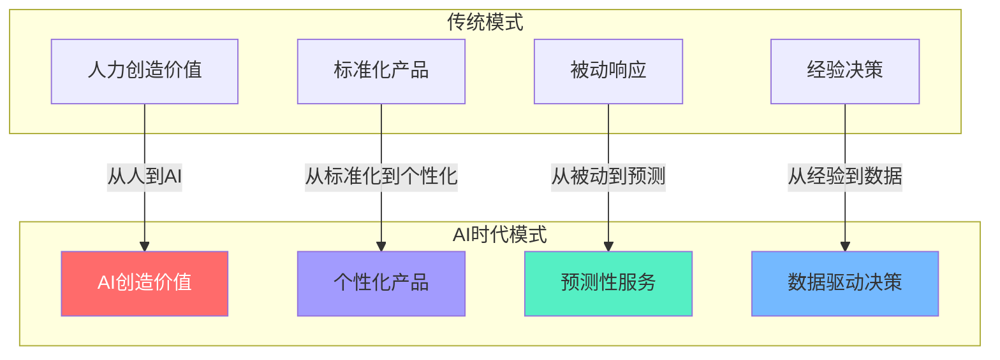
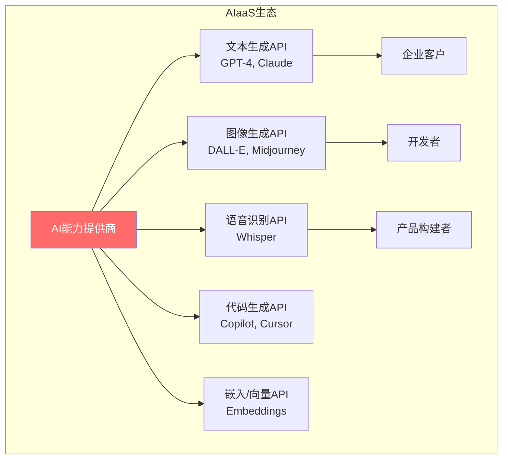
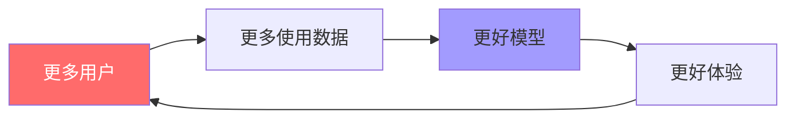
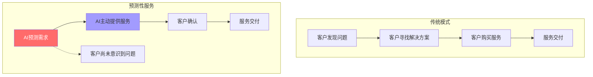
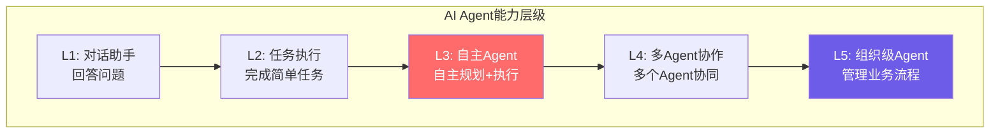

# AI时代的商业模式创新

> AI不仅是技术革命，更是**商业模式革命**。当AI从工具变成能力，从成本中心变成利润中心，从辅助决策变成自主决策，商业模式的底层逻辑正在被重写。

---

## 一、AI如何改变商业模式

### 1.1 核心变化

> [!defn] AI时代的商业模式创新
> AI时代的商业模式创新是指**利用AI技术从根本上改变价值创造、价值传递和价值捕获的方式**。它不是"在现有商业模式中加一个AI功能"，而是重新思考"有了AI，这个生意可以怎么做"。

> [!comment] 与AI应用发展阶段演进的区别
> [[02-AI趋势与素养/AI应用发展阶段演进/00_MOC_AI应用发展阶段演进中枢]] 讨论的是AI产品从工具到平台到生态的**产品演进路径**。本文聚焦的是**商业模式层面**——AI如何创造新的赚钱方式，不涉及产品功能和技术实现细节。

### 1.2 AI改变商业模式的五个维度

| 维度 | 传统模式 | AI时代模式 | 商业影响 |
|------|----------|------------|----------|
| 价值创造 | 人力驱动 | AI驱动 | 边际成本骤降，可规模化 |
| 个性化 | 标准化 | 千人千面 | 从"一刀切"到"一人一策" |
| 决策模式 | 事后分析 | 预测+实时 | 从"反应"到"预判" |
| 定价模式 | 固定定价 | 动态+个性化定价 | 价值捕获最大化 |
| 产品形态 | 工具 | 智能体（Agent） | 从"被使用"到"主动服务" |

---

## 二、AI as a Service (AIaaS)

### 2.1 什么是AIaaS

> [!defn] AI as a Service (AIaaS)
> AIaaS是将AI能力通过API或云服务形式提供给开发者和企业的商业模式。客户不需要自己训练模型、管理基础设施，只需调用API即可获得AI能力。

### 2.2 AIaaS的定价模式

| 定价模式 | 描述 | 代表 | 优势 | 劣势 |
|----------|------|------|------|------|
| 按Token/调用量 | 按使用量计费 | OpenAI API | 公平、灵活 | 收入不可预测 |
| 按订阅 | 月费/年费 | ChatGPT Plus | 收入可预测 | 大客户可能不划算 |
| 按结果 | 按AI产生的价值收费 | 部分AI Agent | 与价值对齐 | 难以衡量 |
| 混合模式 | 基础订阅+超量付费 | 很多SaaS | 平衡 | 复杂 |
| 按计算资源 | 按GPU/推理时间收费 | 云GPU服务 | 技术透明 | 对客户不友好 |

### 2.3 AIaaS的商业逻辑

> [!key] AIaaS的单位经济学
> - **核心成本**：模型训练 + 推理算力 + 数据获取
> - **边际成本**：每次推理调用的GPU成本（随着芯片进步持续下降）
> - **定价挑战**：模型成本下降快于定价下降，利润空间持续扩大
> - **护城河**：数据飞轮（更多用户→更多数据→更好模型→更多用户）

---

## 三、AI驱动的个性化定价

### 3.1 从固定定价到个性化定价

> [!defn] AI驱动的个性化定价
> 利用AI对每个客户的支付意愿、使用模式、价值感知进行实时分析，为每个客户提供**个性化价格**，最大化每个客户的价值捕获。

| 定价类型 | 传统方式 | AI驱动方式 |
|----------|----------|------------|
| 统一定价 | 所有人一个价 | 每个人一个价 |
| 分层定价 | 手动设置3-5档 | 动态生成N档 |
| 促销定价 | 批量折扣 | 个性化促销时机和力度 |
| 捆绑定价 | 固定套餐 | 动态组合推荐 |

### 3.2 个性化定价的应用场景

| 场景 | AI能力 | 案例 | 商业模式价值 |
|------|--------|------|-------------|
| 电商定价 | 预测每个用户的支付意愿 | 亚马逊动态定价 | 提升利润率5-15% |
| 保险定价 | 基于行为数据个性化定价 | 车险UBI | 风险定价更精准 |
| SaaS定价 | 基于使用模式的个性化方案 | 推荐合适的套餐 | 提升转化率 |
| 广告定价 | 实时竞价优化 | Google Ads | 最大化广告收入 |
| 航空/酒店 | 动态收益管理 | 机票价格优化 | 提升座位利用率 |

> [!warning] 个性化定价的伦理边界
> 个性化定价必须谨慎，避免：
> - **价格歧视**：基于敏感特征（种族、性别等）的差异化定价
> - **价格欺骗**：利用信息不对称进行不公平定价
> - **信任破坏**：客户发现被"个性化定价"后可能产生不信任

---

## 四、AI驱动的预测性服务

### 4.1 从"被动响应"到"预测性服务"

> [!defn] 预测性服务
> AI驱动的预测性服务是指在客户意识到需求之前，就**主动预测并提供服务**。这是从"客户来找我"到"我去找客户"的根本转变。

### 4.2 预测性服务的应用

| 领域 | 预测内容 | 商业模式创新 | 案例 |
|------|----------|--------------|------|
| 工业 | 设备故障预测 | 从"维修服务"到"零停机保障" | GE Predix |
| 医疗 | 疾病风险预测 | 从"治病"到"预防" | 健康险+AI预测 |
| 零售 | 补货需求预测 | 从"被动补货"到"自动补货" | Amazon预测发货 |
| 金融 | 违约风险预测 | 从"事后催收"到"事前风控" | 智能风控 |
| 能源 | 用电需求预测 | 从"发电"到"智能调度" | 智能电网 |

> [!example] 预测性维护的商业模式
> 传统模式：设备坏了 → 打电话叫维修 → 维修人员上门 → 收费
> 预测模式：AI持续监控设备 → 提前14天预测故障 → 主动安排维修 → 按"设备正常运行时间"收费
> **核心转变**：从"卖维修服务"到"卖正常运行保障"。

---

## 五、AI赋能的内容创作经济

### 5.1 内容创作经济的新模式

> [!defn] AI赋能内容创作经济
> AI大幅降低了内容创作的门槛和成本，使得**个人创作者的生产力飙升**，同时催生了新的内容商业模式。

| 内容类型 | AI赋能 | 新模式 | 案例 |
|----------|--------|--------|------|
| 文字 | AI辅助写作 | 个人媒体规模化 | AI写稿+人工编辑 |
| 图像 | AI生成图像 | 按需生成，无需库存 | Midjourney, DALL-E |
| 视频 | AI视频生成 | 个人视频工作室 | Sora, Runway |
| 音乐 | AI作曲 | 个性化音乐生成 | Suno, Udio |
| 代码 | AI编程 | 单人开发者生产力x10 | Cursor, Copilot |
| 翻译 | AI翻译 | 多语言内容一键分发 | AI配音+字幕 |

### 5.2 AI内容商业化的新模式

| 模式 | 描述 | 代表 | 特点 |
|------|------|------|------|
| AI工具订阅 | 提供AI创作工具 | Midjourney | 工具即服务 |
| AI内容平台 | AI生成内容的分发平台 | 抖音/TikTok | 算法分发+AI生成 |
| AI个性化内容 | 为每个用户生成个性化内容 | 个性化学习材料 | 一人一内容 |
| AI虚拟人 | AI驱动的虚拟主播/IP | 虚拟偶像 | 24/7内容生产 |
| AI版权新经济 | AI生成内容的版权和授权 | 需要法律框架 | 新兴领域 |

---

## 六、AI Agent的商业化模式

### 6.1 AI Agent：从工具到"数字员工"

> [!defn] AI Agent
> AI Agent是具有自主决策和执行能力的AI系统。它不只是"回答问题"，而是"自主完成任务"。这是AI商业化的下一个大浪潮。

### 6.2 AI Agent的商业模式

| 模式 | 描述 | 定价逻辑 | 代表 |
|------|------|----------|------|
| 按Agent订阅 | 按月租用AI Agent | $X/Agent/月 | Devin ($500/月) |
| 按任务付费 | 按完成的任务数量收费 | $X/任务 | 部分AI Agent |
| 按结果付费 | 按Agent创造的商业价值分成 | 价值分成 | 销售Agent |
| 平台抽成 | Agent平台撮合供需 | 交易佣金 | 未来Agent市场 |
| 开源+服务 | Agent框架开源，服务收费 | 服务费+托管费 | LangChain等 |

### 6.3 AI Agent商业化的关键挑战

> [!warning] 挑战一：可靠性
> AI Agent的决策错误可能导致严重后果。在完全可靠之前，关键决策需要人类监督。

> [!warning] 挑战二：责任归属
> 当AI Agent做出错误决策，谁负责？开发者？使用者？还是AI本身？

> [!warning] 挑战三：定价难题
> 如何衡量AI Agent创造的价值？按时间、按任务、按结果？每种方式都有挑战。

> [!warning] 挑战四：信任建立
> 客户愿意把任务交给"数字员工"吗？信任的建立需要时间。

### 6.4 AI Agent的未来展望

| 阶段 | 时间 | 特征 | 商业模式 |
|------|------|------|----------|
| 2024-2025 | 辅助阶段 | 人类主导，AI辅助 | 工具订阅 |
| 2026-2028 | 协作阶段 | 人类与AI Agent协作 | Agent订阅+任务计费 |
| 2029-2032 | 自主阶段 | AI Agent自主完成大部分任务 | 按结果付费 |
| 2033+ | 生态阶段 | 多Agent协作生态 | 生态平台模式 |

---

## 七、AI时代的商业模式创新总结

### 7.1 核心趋势

### 7.2 行动建议

> [!tip] 企业如何拥抱AI时代的商业模式创新
> 1. **从数据开始**：AI的基础是数据。先整理和标注你的数据资产
> 2. **从客户价值出发**：不要为了AI而AI，找到AI能创造客户价值的场景
> 3. **小步快跑**：从小的AI应用开始，验证价值后再扩展
> 4. **重构组织**：AI时代的商业模式需要AI Native的组织架构（参考 [[02-AI趋势与素养/AI Native组织变革/00_MOC_AI Native组织变革中枢]]）
> 5. **关注伦理**：AI商业化必须在伦理和合规的框架下进行

---

## 八、延伸阅读

- [[04-商业与战略/商业模式设计与创新/00_MOC_商业模式设计与创新中枢]] — 知识库总览
- [[04-商业与战略/商业模式设计与创新/02_订阅经济：从卖产品到卖服务]] — AI时代的订阅经济新形态
- [[04-商业与战略/商业模式设计与创新/04_免费增值：Freemium的艺术与科学]] — AI产品的Freemium策略
- [[04-商业与战略/商业模式设计与创新/06_商业模式创新方法论]] — 技术驱动创新方法论
- [[02-AI趋势与素养/AI应用发展阶段演进/00_MOC_AI应用发展阶段演进中枢]] — AI产品演进路径
- [[02-AI趋势与素养/AI Native组织变革/00_MOC_AI Native组织变革中枢]] — AI时代的组织变革

---

> [!quote]
> "AI不会取代商业模式，但会用AI的商业模式会取代不用AI的商业模式。未来的竞争不是AI技术的竞争，而是AI商业模式的竞争。"
>
> — 本知识库编纂者

---

*最后更新：2026-07-27*