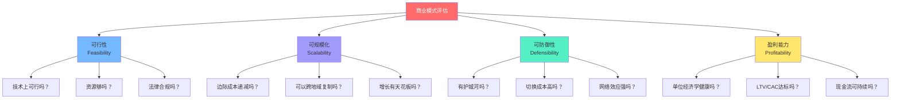
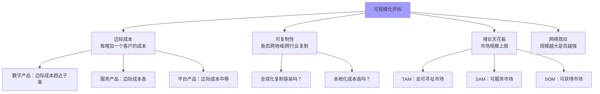
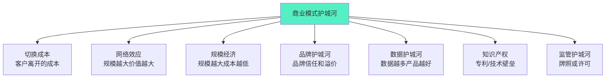
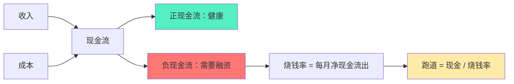
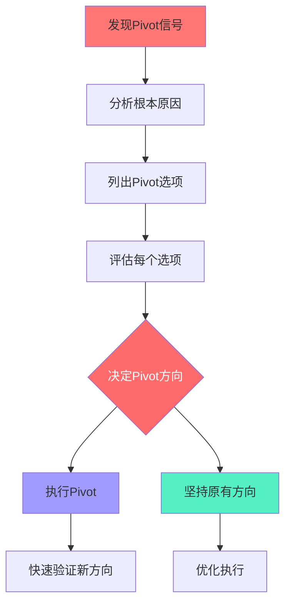

# 商业模式评估与选择

> 设计商业模式只是第一步，**评估和选择**才是决定生死的关键。一个好的商业模式设计，如果评估不充分、选择不果断，最终也只是一纸空文。

---

## 一、商业模式评估的四维框架

### 1.1 评估框架总览



> [!important] 四个维度缺一不可
> 一个成功的商业模式必须同时满足四个维度：
> 1. **可行**：做得出来
> 2. **可规模化**：做大不难
> 3. **可防御**：守得住
> 4. **能盈利**：赚得到钱
> 缺少任何一个维度，商业模式都难以持续。

---

## 二、可行性评估

### 2.1 技术可行性

| 评估维度 | 关键问题 | 评估方法 |
|----------|----------|----------|
| 技术成熟度 | 所需技术是否成熟可用？ | 技术成熟度曲线（TRL） |
| 技术能力 | 团队是否具备所需技术能力？ | 团队能力矩阵 |
| 技术风险 | 关键技术依赖是否可控？ | 技术依赖分析 |
| 技术债务 | 短期方案是否会产生长期技术债务？ | 技术决策评审 |

> [!tip] 技术可行性检查清单
> - [ ] 核心技术是否已经过验证（非"实验室阶段"）？
> - [ ] 是否有可靠的技术合作伙伴或供应商？
> - [ ] 团队是否有能力实现核心技术？
> - [ ] 技术方案是否可扩展？
> - [ ] 关键技术依赖是否可控（供应商风险、许可证风险）？

### 2.2 资源可行性

| 资源类型 | 评估问题 | 风险等级 |
|----------|----------|----------|
| 资金 | 需要多少启动资金？有足够的资金吗？ | 资金不足是高危风险 |
| 人才 | 能找到需要的人才吗？ | 关键人才缺失是高风险 |
| 关系 | 有必要的合作伙伴吗？ | 关键伙伴缺失是中风险 |
| 品牌 | 有品牌认知度吗？ | 新品牌需要时间积累 |
| 数据 | 有足够的数据吗？ | AI时代数据是核心资源 |

### 2.3 法律与合规可行性

| 风险领域 | 评估问题 | 案例 |
|----------|----------|------|
| 行业准入 | 需要哪些牌照/许可？ | 金融、医疗、教育 |
| 数据合规 | 符合GDPR/个人信息保护法吗？ | 欧盟市场 |
| 知识产权 | 有专利风险吗？ | 技术抄袭风险 |
| 反垄断 | 模式是否涉及垄断风险？ | 平台经济 |
| 劳动法规 | 用工模式合规吗？ | 零工经济 |

---

## 三、可规模化评估

### 3.1 规模化的核心指标



### 3.2 边际成本分析

> [!key] 边际成本决定可规模化程度
> 每增加一个客户，服务成本增加多少？这是决定商业模式能否规模化的核心。

| 商业模式 | 边际成本 | 可规模化 | 案例 |
|----------|----------|----------|------|
| 数字产品 | 接近零 | 极高 | SaaS、App、数字内容 |
| 平台 | 低 | 高 | 电商平台、社交平台 |
| 标准化服务 | 中等 | 中 | 连锁餐饮、教育 |
| 定制化服务 | 高 | 低 | 咨询、高端设计 |
| 手工制造 | 很高 | 极低 | 定制家具、手工皮具 |

### 3.3 市场规模评估

**TAM/SAM/SOM模型**：

```
TAM（Total Addressable Market）：总可寻址市场
↓
SAM（Serviceable Available Market）：可服务市场
↓
SOM（Serviceable Obtainable Market）：可获得市场
```

> [!example] 以在线教育平台为例
> - **TAM**：全球教育市场 = $7万亿
> - **SAM**：中国在线教育市场 = $500亿
> - **SOM**：第一年目标 = $5000万（1%市场份额）
> - **评估**：TAM足够大，但需要评估达到SOM的可行性和时间

---

## 四、可防御性评估

### 4.1 护城河理论

> [!defn] 商业模式护城河
> 护城河是指保护商业模式免受竞争侵蚀的**持久性优势**。一个好的商业模式必须有护城河——否则一旦成功，模仿者会迅速涌入，稀释利润。



### 4.2 护城河评估矩阵

| 护城河类型 | 强度 | 持久性 | 案例 | 评估方法 |
|------------|------|--------|------|----------|
| 切换成本 | 中高 | 高 | Salesforce（数据+流程锁定） | 如果客户今天离开，损失多少？ |
| 网络效应 | 极高 | 极高 | 微信、Facebook | 新用户选择平台的原因？ |
| 规模经济 | 中高 | 高 | 沃尔玛、亚马逊 | 规模扩大10倍，成本降低多少？ |
| 品牌护城河 | 中 | 中高 | 苹果、可口可乐 | 客户愿意为品牌付多少溢价？ |
| 数据护城河 | 中高 | 中 | Google、TikTok | 数据积累是否带来产品改善？ |
| 知识产权 | 中 | 中（专利到期） | 制药、芯片 | 核心专利还有多少年有效期？ |
| 监管护城河 | 高 | 不确定 | 银行、电信 | 监管政策变化的风险？ |

### 4.3 护城河评估检查清单

> [!tip] 护城河自测
> - [ ] 如果竞争对手今天复制你的产品，你需要多长时间建立防御？
> - [ ] 客户离开你的成本是什么？（金钱、时间、数据、关系）
> - [ ] 每增加一个客户，你的产品是否变得更好？（网络效应）
> - [ ] 每增加一个客户，你的单位成本是否下降？（规模经济）
> - [ ] 你有竞争对手无法轻易获取的数据吗？
> - [ ] 你有专利、商标或其他知识产权保护吗？
> - [ ] 你的护城河是在变宽还是变窄？

---

## 五、盈利能力评估

### 5.1 单位经济学

> [!key] 单位经济学的核心公式
> - **单位收入** = 每个客户带来的平均收入
> - **单位成本** = 每个客户的服务成本（COGS）
> - **单位毛利** = 单位收入 - 单位成本
> - **单位毛利率** = 单位毛利 / 单位收入

**健康基准**：

| 商业模式 | 健康毛利率 | 优秀毛利率 |
|----------|-----------|-----------|
| SaaS | > 70% | > 80% |
| 电商 | > 30% | > 40% |
| 平台 | > 60% | > 70% |
| 服务 | > 40% | > 50% |
| 硬件 | > 25% | > 35% |

### 5.2 LTV/CAC分析

详见 [[04-商业与战略/商业模式设计与创新/02_订阅经济：从卖产品到卖服务]] 中的详细分析。

| 指标 | 健康基准 | 行动建议 |
|------|----------|----------|
| LTV/CAC | > 3:1 | 加速增长 |
| LTV/CAC | 1-3:1 | 优化获客或留存 |
| LTV/CAC | < 1:1 | 商业模式不可持续，必须调整 |
| CAC回收期 | < 12个月 | 健康 |
| CAC回收期 | 12-18个月 | 需要关注 |
| CAC回收期 | > 18个月 | 高风险 |

### 5.3 现金流分析



---

## 六、商业模式的A/B测试

### 6.1 为什么需要A/B测试商业模式

> [!tip] 商业模式不是设计出来的，是测试出来的
> 再好的商业模式设计，到了真实市场也可能面临意外。A/B测试让商业模式验证从"拍脑袋"变成"看数据"。

### 6.2 可以A/B测试的商业模式要素

| 要素 | 可测试内容 | 测试方法 |
|------|-----------|----------|
| 定价 | 不同价格点、不同方案 | 价格A/B测试 |
| 价值主张 | 不同文案、不同卖点 | 着陆页A/B测试 |
| 客户细分 | 不同目标客户群 | 定向广告测试 |
| 渠道 | 不同获客渠道 | 渠道效果对比 |
| 收费模式 | 订阅 vs 一次性 vs 按用量 | 用户调研+小规模测试 |
| 免费策略 | 不同免费试用时长 | 免费试用A/B测试 |

### 6.3 A/B测试的注意事项

> [!warning] A/B测试的陷阱
> 1. **样本量不足**：测试结果可能不具统计显著性
> 2. **测试时间太短**：新方案的"新鲜感"可能带来虚假正面
> 3. **只看短期指标**：忽视长期影响（如低价方案吸引低质量客户）
> 4. **过度测试**：测试太多变量，无法确定因果关系
> 5. **忽视定性反馈**：只看数据，不理解客户的"为什么"

---

## 七、商业模式的Pivot（转型）

### 7.1 何时需要Pivot

> [!defn] Pivot
> Pivot是指商业模式在验证过程中发现重大问题后，进行的**根本性方向调整**。不是微调，而是改变商业模式的核心假设。

**Pivot的信号**：

| 信号 | 说明 | 案例 |
|------|------|------|
| 客户不买单 | 价值主张与客户需求不匹配 | 产品没人买 |
| 增长停滞 | 获客成本持续上升，转化率下降 | 增长触达天花板 |
| 留存极差 | 客户来了就走，Churn居高不下 | 月Churn > 10% |
| 单位经济学崩溃 | LTV/CAC < 1，越增长越亏损 | 烧钱模式不可持续 |
| 竞争格局剧变 | 巨头进入、技术变革、政策变化 | 被降维打击 |
| 市场不存在 | 目标市场太小或不存在 | TAM不够大 |

### 7.2 Pivot的类型

| Pivot类型 | 改变什么 | 案例 |
|-----------|----------|------|
| 客户细分Pivot | 改变目标客户 | Slack从游戏公司到企业协作 |
| 价值主张Pivot | 改变核心价值 | YouTube从视频约会到视频分享 |
| 渠道Pivot | 改变触达方式 | 从直销到合作伙伴 |
| 收入模式Pivot | 改变赚钱方式 | 从广告到订阅 |
| 技术Pivot | 改变技术方案 | 从自研到开源 |
| 平台Pivot | 从产品到平台 | 从应用开发商到平台 |

### 7.3 Pivot的决策框架



> [!tip] Pivot决策的关键问题
> 1. 问题是**致命**的吗？（不可修复 vs 可以修复）
> 2. 新的方向有**数据支撑**吗？（不只是直觉）
> 3. 团队有**能力**执行新方向吗？
> 4. 还有**足够的资源**（资金、时间）来Pivot吗？
> 5. 客户和投资者会**支持**这个Pivot吗？

---

## 八、商业模式选择决策矩阵

### 8.1 多方案对比工具

当有多个商业模式方案时，使用以下矩阵进行系统对比：

| 评估维度 | 权重 | 方案A | 方案B | 方案C |
|----------|------|-------|-------|-------|
| 可行性 | 25% | 8/10 | 7/10 | 6/10 |
| 可规模化 | 25% | 6/10 | 9/10 | 7/10 |
| 可防御性 | 20% | 7/10 | 6/10 | 9/10 |
| 盈利能力 | 30% | 7/10 | 8/10 | 6/10 |
| **加权总分** | 100% | **7.0** | **7.5** | **6.8** |

> [!tip] 使用说明
> 1. 根据业务阶段调整权重（早期更关注可行性，成熟期更关注盈利能力）
> 2. 每个维度用1-10打分
> 3. 计算加权总分
> 4. 结合定性判断做出最终决策

### 8.2 不同阶段的评估重点

| 阶段 | 优先评估维度 | 原因 |
|------|-------------|------|
| 种子期 | 可行性 > 盈利能力 > 可规模化 > 可防御性 | 先活下来，找到PMF |
| 成长期 | 可规模化 > 盈利能力 > 可防御性 > 可行性 | 快速扩张，抢占市场 |
| 成熟期 | 可防御性 > 盈利能力 > 可规模化 > 可行性 | 守住阵地，最大化利润 |
| 转型期 | 可行性 > 可规模化 > 盈利能力 > 可防御性 | 重新探索新模式 |

---

## 九、延伸阅读

- [[04-商业与战略/商业模式设计与创新/00_MOC_商业模式设计与创新中枢]] — 知识库总览
- [[04-商业与战略/商业模式设计与创新/01_商业模式画布：理解商业的九宫格]] — 商业模式设计工具
- [[04-商业与战略/商业模式设计与创新/02_订阅经济：从卖产品到卖服务]] — 订阅商业模式的评估指标
- [[04-商业与战略/商业模式设计与创新/06_商业模式创新方法论]] — 商业模式创新流程
- [[04-商业与战略/商业模式设计与创新/07_AI时代的商业模式创新]] — AI时代的新商业模式评估
- [[04-商业与战略/战略分析工具与框架/00_MOC_战略分析工具与框架中枢]] — 波特五力、SWOT等战略分析工具

---

> [!quote]
> "好的商业模式不是设计出来的，是评估和迭代出来的。评估不是一次性的工作，而是持续的过程——因为市场在变、技术在变、竞争在变，你的商业模式也必须随之进化。"
>
> — 本知识库编纂者

---

*最后更新：2026-07-27*