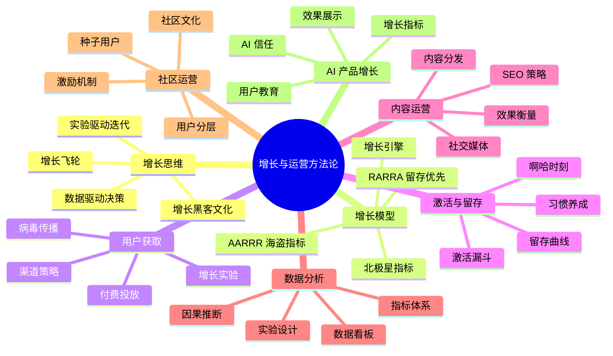
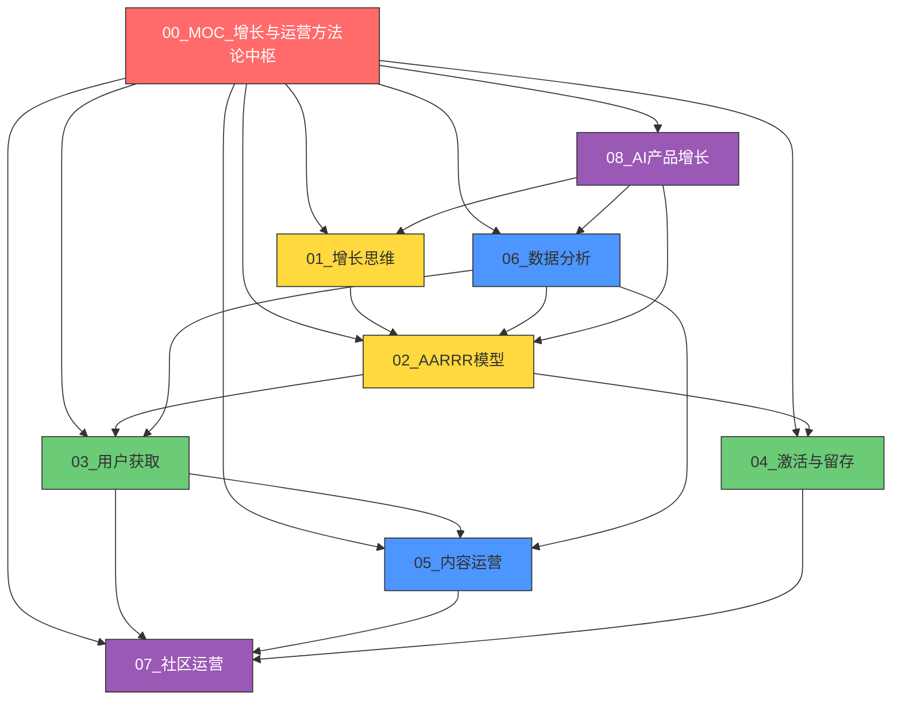
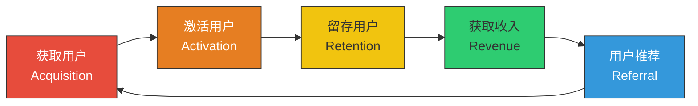
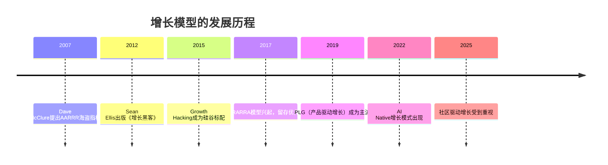
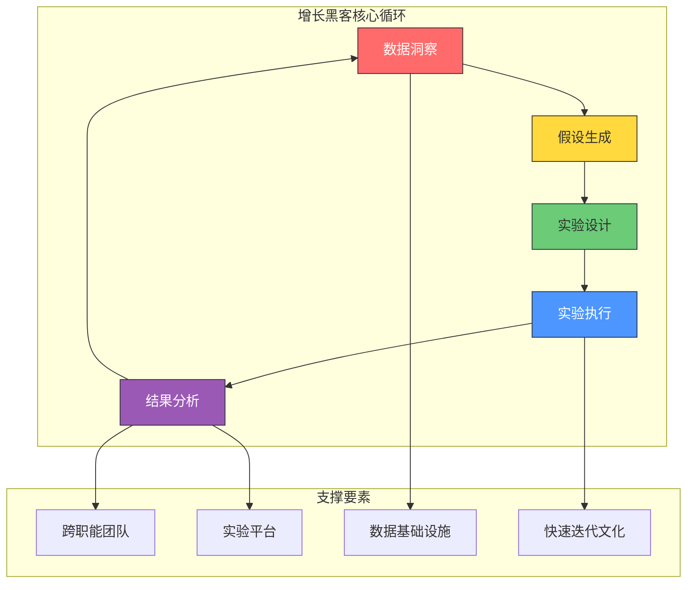
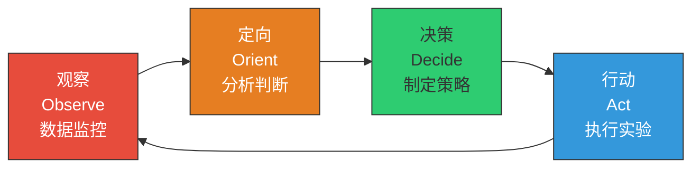
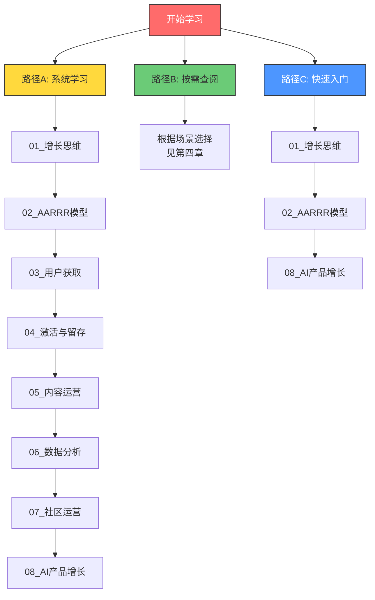

# 增长与运营方法论中枢

> 从 0 到 1 之后，如何从 1 到 10？这不是一道数学题，而是一道系统题。

---

## 一、这个知识库解决什么问题

这个知识库面向**产品开发者**——那些已经完成了产品从 0 到 1 的构建，正在思考如何让产品规模化增长的人。它不讨论"怎么做产品"，而是讨论"怎么让产品被更多人使用并持续产生价值"。

> [!important] 定位说明
> 本知识库是「增长与运营」的专门知识库，与以下知识库互补但不重复：
> - **[[05-产品与开发/AI产品经理方法论/00_MOC_AI产品经理方法论中枢]]**：聚焦 AI PM 的角色定位、能力模型和工作方法
> - **[[05-产品与开发/用户研究与需求洞察/00_MOC_用户研究与需求洞察中枢]]**：聚焦如何理解用户、发现需求、验证假设
> - **[[04-商业与战略/商业模式设计与创新/00_MOC_商业模式设计与创新中枢]]**：聚焦商业模型的设计、验证与创新
>
> 本知识库聚焦的是：**产品做出来之后，如何让它增长**。

---

## 二、知识库结构总览

### 文档清单与阅读路径

| 序号 | 文档 | 核心问题 | 适合人群 | 前置阅读 |
|------|------|----------|----------|----------|
| 01 | [[01_增长思维：从"做产品"到"做增长"]] | 增长的本质是什么？ | 所有产品开发者 | 无 |
| 02 | [[04-商业与战略/增长与运营方法论/02_AARRR模型：增长的全链路分析]] | 如何系统化分析增长？ | 增长负责人 | 01 |
| 03 | [[04-商业与战略/增长与运营方法论/03_用户获取：渠道策略与增长实验]] | 用户从哪里来？ | 增长运营 | 02 |
| 04 | [[04_用户激活与留存：让用户"留下来"]] | 用户为什么留下？ | 产品经理 | 02 |
| 05 | [[04-商业与战略/增长与运营方法论/05_内容运营：用内容驱动增长]] | 内容如何驱动增长？ | 内容运营 | 03 |
| 06 | [[04-商业与战略/增长与运营方法论/06_数据分析驱动增长]] | 数据如何指导决策？ | 数据分析师 | 02 |
| 07 | [[04-商业与战略/增长与运营方法论/07_社区运营与用户运营]] | 如何构建用户社区？ | 社区运营 | 04, 05 |
| 08 | [[04-商业与战略/增长与运营方法论/08_AI产品的增长特殊性]] | AI产品增长有何不同？ | AI产品经理 | 01, 02, 06 |

---

## 三、核心概念地图

### 3.1 增长飞轮全景

### 3.2 增长模型的演化

---

## 四、按场景的阅读指南

### 场景A：我是产品PM，刚开始负责增长

> [!tip] 推荐阅读路径
> 1. 先读 [[01_增长思维：从"做产品"到"做增长"]]，建立增长思维框架
> 2. 再读 [[04-商业与战略/增长与运营方法论/02_AARRR模型：增长的全链路分析]]，掌握系统化增长分析工具
> 3. 然后读 [[04-商业与战略/增长与运营方法论/06_数据分析驱动增长]]，学会用数据说话
> 4. 最后根据你的产品阶段，选择 [[04-商业与战略/增长与运营方法论/03_用户获取：渠道策略与增长实验]] 或 [[04_用户激活与留存：让用户"留下来"]]

### 场景B：产品已上线，用户增长遇到瓶颈

> [!tip] 推荐阅读路径
> 1. 先读 [[04-商业与战略/增长与运营方法论/02_AARRR模型：增长的全链路分析]]，诊断瓶颈在哪个环节
> 2. 如果获客瓶颈 → [[04-商业与战略/增长与运营方法论/03_用户获取：渠道策略与增长实验]]
> 3. 如果留存瓶颈 → [[04_用户激活与留存：让用户"留下来"]]
> 4. 配合 [[04-商业与战略/增长与运营方法论/06_数据分析驱动增长]] 建立数据监控体系
> 5. 考虑 [[04-商业与战略/增长与运营方法论/05_内容运营：用内容驱动增长]] 和 [[04-商业与战略/增长与运营方法论/07_社区运营与用户运营]] 作为增长杠杆

### 场景C：做AI产品，发现传统增长方法论不适用

> [!tip] 推荐阅读路径
> 1. 先读 [[01_增长思维：从"做产品"到"做增长"]]，建立基础框架
> 2. 再读 [[04-商业与战略/增长与运营方法论/08_AI产品的增长特殊性]]，理解AI产品的差异化
> 3. 结合 [[04-商业与战略/增长与运营方法论/02_AARRR模型：增长的全链路分析]] 和 [[04-商业与战略/增长与运营方法论/06_数据分析驱动增长]]，建立AI产品的增长体系
> 4. 参考 [[04_用户激活与留存：让用户"留下来"]] 中关于习惯养成的部分

### 场景D：从零搭建运营团队

> [!tip] 推荐阅读路径
> 1. [[01_增长思维：从"做产品"到"做增长"]] — 建立团队共识
> 2. [[04-商业与战略/增长与运营方法论/05_内容运营：用内容驱动增长]] — 内容团队的搭建
> 3. [[04-商业与战略/增长与运营方法论/07_社区运营与用户运营]] — 社区团队的基础
> 4. [[04-商业与战略/增长与运营方法论/06_数据分析驱动增长]] — 运营团队的数据能力
> 5. [[04-商业与战略/增长与运营方法论/03_用户获取：渠道策略与增长实验]] — 增长实验的能力

---

## 五、关键概念索引

### 5.1 增长思维

| 概念 | 说明 | 详见 |
|------|------|------|
| 增长黑客 | 以数据驱动、实验驱动为核心的增长方法论 | [[01_增长思维：从"做产品"到"做增长"]] |
| 增长飞轮 | 系统各环节相互促进的正向循环 | [[01_增长思维：从"做产品"到"做增长"]] |
| 北极星指标 | 衡量产品核心价值的关键指标 | [[04-商业与战略/增长与运营方法论/06_数据分析驱动增长]] |
| 增长团队 | 跨职能（产品/工程/数据/设计/运营）的增长组织 | [[01_增长思维：从"做产品"到"做增长"]] |
| PLG | 产品驱动增长，以产品本身作为获客引擎 | [[04-商业与战略/增长与运营方法论/03_用户获取：渠道策略与增长实验]] |

### 5.2 增长模型

| 概念 | 说明 | 详见 |
|------|------|------|
| AARRR | 海盗指标：获客-激活-留存-收入-推荐 | [[04-商业与战略/增长与运营方法论/02_AARRR模型：增长的全链路分析]] |
| RARRA | 留存优先的改进模型 | [[04-商业与战略/增长与运营方法论/02_AARRR模型：增长的全链路分析]] |
| 增长引擎 | 黏着式/病毒式/付费式增长引擎 | [[04-商业与战略/增长与运营方法论/02_AARRR模型：增长的全链路分析]] |
| 增长循环 | 内容-SEO-社交-付费的增长循环 | [[04-商业与战略/增长与运营方法论/03_用户获取：渠道策略与增长实验]] |

### 5.3 用户运营

| 概念 | 说明 | 详见 |
|------|------|------|
| 啊哈时刻 | 用户第一次感受到产品核心价值的时刻 | [[04_用户激活与留存：让用户"留下来"]] |
| 留存曲线 | 不同时间节点用户留存率的变化曲线 | [[04_用户激活与留存：让用户"留下来"]] |
| RFM模型 | 基于最近购买/频率/金额的用户分层模型 | [[04-商业与战略/增长与运营方法论/07_社区运营与用户运营]] |
| 用户生命周期 | 用户从获客到流失的完整旅程 | [[04-商业与战略/增长与运营方法论/07_社区运营与用户运营]] |
| 超级用户 | 高度活跃、贡献价值远超普通用户的群体 | [[04-商业与战略/增长与运营方法论/07_社区运营与用户运营]] |

### 5.4 内容与渠道

| 概念 | 说明 | 详见 |
|------|------|------|
| 内容营销 | 通过有价值的内容吸引和转化用户 | [[04-商业与战略/增长与运营方法论/05_内容运营：用内容驱动增长]] |
| SEO | 搜索引擎优化，有机获取流量的核心手段 | [[04-商业与战略/增长与运营方法论/05_内容运营：用内容驱动增长]] |
| CPM框架 | 渠道-产品匹配：受众、内容、投放方式 | [[04-商业与战略/增长与运营方法论/03_用户获取：渠道策略与增长实验]] |
| ICE评分 | 影响-信心-简易度的实验优先级排序法 | [[04-商业与战略/增长与运营方法论/03_用户获取：渠道策略与增长实验]] |

### 5.5 AI产品增长

| 概念 | 说明 | 详见 |
|------|------|------|
| AI使用深度 | 衡量用户对AI能力的使用程度 | [[04-商业与战略/增长与运营方法论/08_AI产品的增长特殊性]] |
| WoW效应 | 用户第一次体验到AI能力时的惊叹感 | [[04-商业与战略/增长与运营方法论/08_AI产品的增长特殊性]] |
| AI信任曲线 | 用户从怀疑到信任AI产品的过程 | [[04-商业与战略/增长与运营方法论/08_AI产品的增长特殊性]] |
| 用户教育成本 | 让用户理解AI产品能力所需投入 | [[04-商业与战略/增长与运营方法论/08_AI产品的增长特殊性]] |

---

## 六、核心思维框架

### 6.1 增长黑客的三板斧

### 6.2 增长决策的OODA循环

### 6.3 增长的系统观

> [!quote] 系统思考
> 增长不是单点优化，而是系统优化。每一个增长环节的改善，都会通过反馈回路影响其他环节。好的增长策略，是找到系统中杠杆效应最大的那个点。

增长系统包含以下子系统的相互作用：

1. **产品系统**：产品价值 = 用户获得的收益 - 用户付出的成本
2. **获客系统**：获客效率 = 新增用户 / 获客成本
3. **激活系统**：激活率 = 完成关键行为的用户 / 新用户
4. **留存系统**：留存率 = 持续使用的用户 / 总用户
5. **变现系统**：LTV = 用户生命周期价值
6. **推荐系统**：病毒系数 = 每个用户带来的新用户数

---

## 七、与外部知识库的关联

### 7.1 与 [[05-产品与开发/AI产品经理方法论/00_MOC_AI产品经理方法论中枢]] 的关系

| 关联点 | [[05-产品与开发/AI产品经理方法论/00_MOC_AI产品经理方法论中枢]] | 本知识库 |
|--------|---------------------|----------|
| 角色定位 | AI PM 的能力模型 | 增长PM的能力要求 |
| 工作方法 | AI产品设计方法 | 增长实验方法 |
| 评估体系 | AI产品评估指标 | 增长数据指标体系 |
| 团队协作 | AI团队构建 | 增长团队构建 |

### 7.2 与 [[05-产品与开发/用户研究与需求洞察/00_MOC_用户研究与需求洞察中枢]] 的关系

| 关联点 | [[05-产品与开发/用户研究与需求洞察/00_MOC_用户研究与需求洞察中枢]] | 本知识库 |
|--------|----------------------|----------|
| 用户理解 | 需求挖掘方法 | 用户分层与画像 |
| 研究方法 | 定性/定量研究 | 增长实验设计 |
| 用户旅程 | 用户体验地图 | 用户生命周期 |
| 痛点分析 | JTBD框架 | 啊哈时刻分析 |

### 7.3 与 [[04-商业与战略/商业模式设计与创新/00_MOC_商业模式设计与创新中枢]] 的关系

| 关联点 | [[04-商业与战略/商业模式设计与创新/00_MOC_商业模式设计与创新中枢]] | 本知识库 |
|--------|----------------------|----------|
| 变现模式 | 商业模式画布 | 收入环节优化 |
| 价值主张 | 价值主张设计 | 产品价值传递 |
| 成本结构 | 成本分析 | 获客成本控制 |
| 增长模式 | 商业增长策略 | 增长引擎选择 |

---

## 八、推荐阅读顺序

---

## 九、关键原则速查

> [!summary] 增长与运营的十大核心原则
> 1. **增长是产品的一部分**，不是市场部的专属工作
> 2. **数据驱动决策**，用实验验证假设，而非依赖直觉
> 3. **留存优先于获客**，先确保产品能留住人，再加大获客投入
> 4. **啊哈时刻是激活的关键**，越快让用户感受到价值，越容易留存
> 5. **内容是最持久的增长杠杆**，好的内容有复利效应
> 6. **社区是增长的护城河**，用户之间的关系网络是最难复制的壁垒
> 7. **不要只看虚荣指标**，关注能驱动行动的核心指标
> 8. **相关性不等于因果性**，数据分析要警惕各种偏差
> 9. **增长要系统化**，单点优化效果有限，系统性优化才能产生飞轮效应
> 10. **AI产品增长有特殊性**，用户教育、信任建立和效果展示是核心挑战

---

## 十、常用工具与资源

### 10.1 增长工具矩阵

| 类别 | 工具 | 用途 |
|------|------|------|
| 数据分析 | Amplitude, Mixpanel, Google Analytics | 用户行为分析 |
| A/B测试 | Optimizely, Google Optimize, LaunchDarkly | 实验平台 |
| 用户调研 | Hotjar, FullStory, UserTesting | 用户行为观察 |
| 内容管理 | WordPress, Notion, Ghost | 内容发布 |
| 邮件营销 | Mailchimp, ConvertKit, Substack | 邮件运营 |
| 社媒管理 | Buffer, Hootsuite, Later | 社交媒体 |
| 社区平台 | Discourse, Circle, Discord | 社区运营 |
| 归因分析 | AppsFlyer, Branch, Adjust | 渠道归因 |

### 10.2 推荐书单

1. 《增长黑客》 — Sean Ellis
2. 《精益数据分析》 — Alistair Croll & Benjamin Yoskovitz
3. 《上瘾》 — Nir Eyal
4. 《跨越鸿沟》 — Geoffrey Moore
5. 《创新者的窘境》 — Clayton Christensen
6. 《Hacking Growth》 — Sean Ellis & Morgan Brown

---

## 十一、版本记录

| 版本 | 日期 | 变更内容 | 作者 |
|------|------|----------|------|
| v1.0 | 2026-07-27 | 初始版本，创建MOC和8篇内容文档 | 产品开发者 |

---

> 本 MOC 将持续更新。如果你发现某个概念需要补充，或者某个章节需要深入，请随时回来更新这份中枢文档。增长本身就是迭代的过程，知识库也是如此。