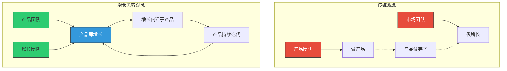
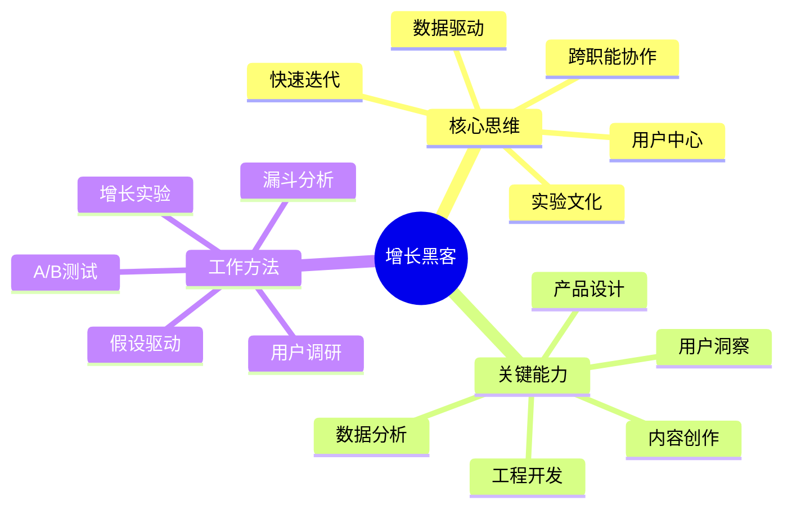
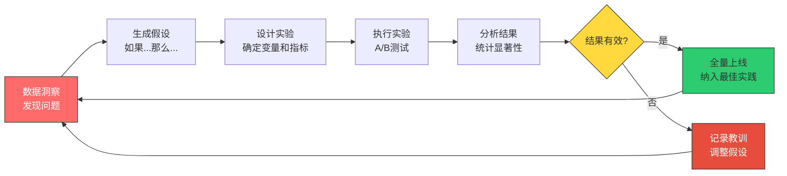
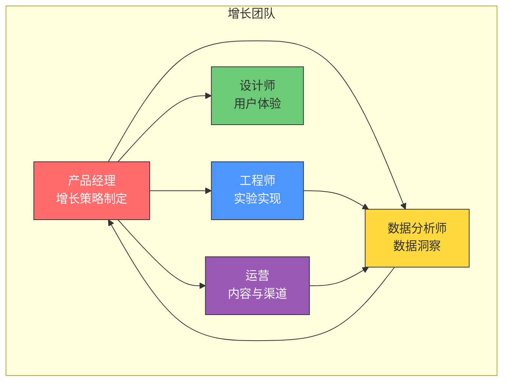
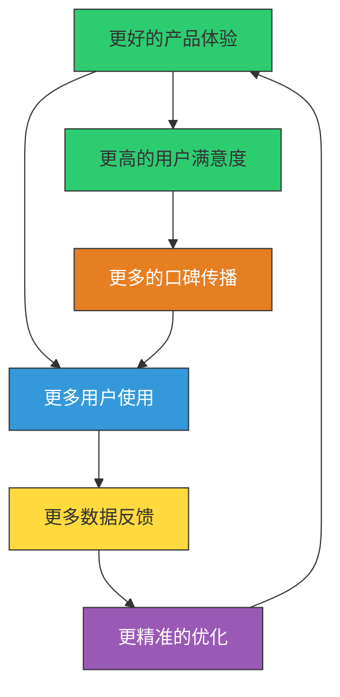
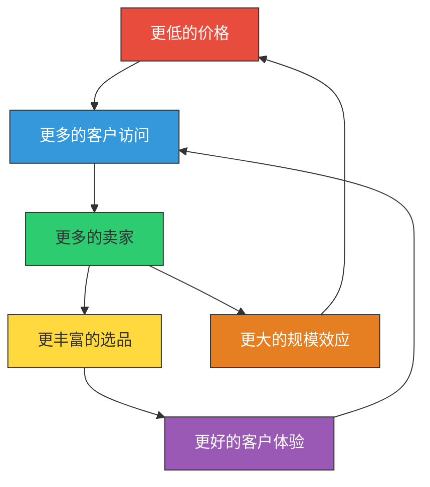
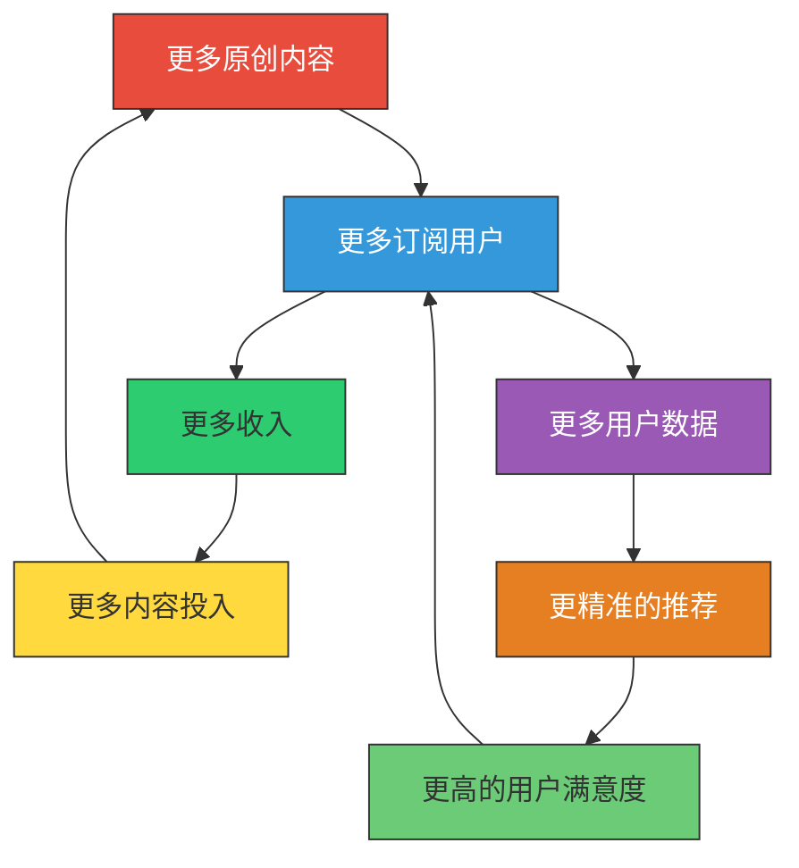
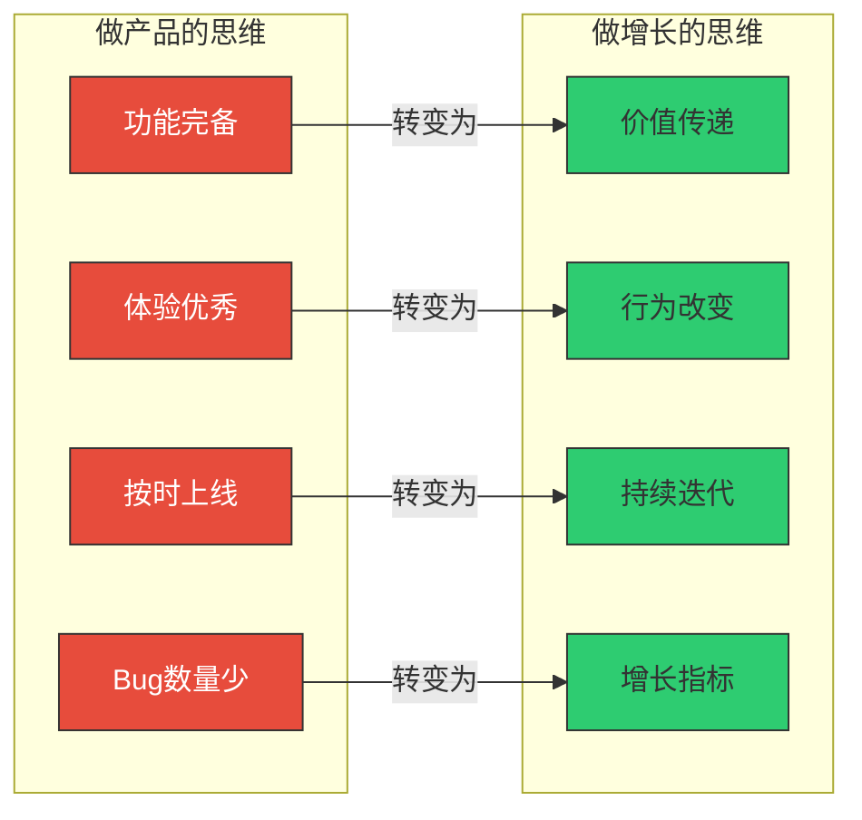
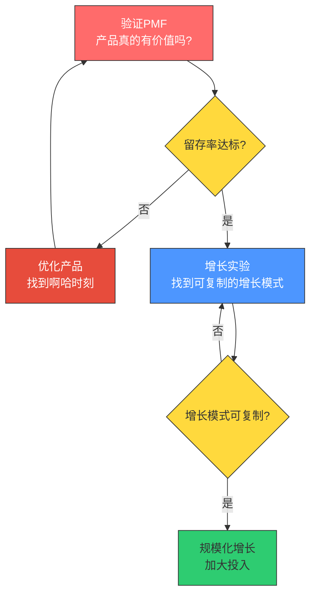

# 增长思维：从"做产品"到"做增长"

> 做出一个好产品，和让一个好产品被更多人使用，是两种完全不同的能力。

---

## 一、为什么增长是产品的一部分

### 1.1 传统观念的误区

很多产品开发者有一个根深蒂固的认知：**"我的工作是做出好产品，增长是市场部的事。"** 这个认知在产品从 0 到 1 的阶段或许可行，但当你需要从 1 到 10 时，它就会成为最大的障碍。

> [!warning] 传统分工的陷阱
> 当产品和增长分离时，你会发现：
> - 产品团队抱怨"市场部带来的用户质量太差"
> - 市场团队抱怨"产品体验太差，用户来了就走"
> - 用户来了，体验了一次，然后永远离开了
> - 没有人对"用户为什么离开"这个问题负责

### 1.2 增长是产品的一部分

增长黑客运动的核心主张之一就是：**增长不是市场部的专属工作，而是产品的一部分。** 增长应该被"内建"到产品中，而不是"外挂"在产品上。

> [!important] 核心认知转变
> | 从 | 到 |
> |----|----|
> | 增长 = 市场推广 | 增长 = 产品价值传递 |
> | 增长是"拉"用户 | 增长是"让产品自己说话" |
> | 增长靠创意和预算 | 增长靠数据和实验 |
> | 增长是一个部门的事 | 增长是跨职能团队的共同目标 |
> | 上线后再想增长 | 产品设计时就考虑增长 |

---

## 二、增长黑客的核心思维

### 2.1 什么是增长黑客

增长黑客（Growth Hacking）由 Sean Ellis 在 2010 年提出，其核心思想是：**用数据驱动的方式，通过快速实验找到最有效的增长手段。**

增长黑客不是"黑科技"，也不是"作弊技巧"，而是一套系统化的方法论。它融合了产品开发、数据分析、市场营销和工程能力，以跨职能团队的形式运作。

### 2.2 数据驱动决策

增长黑客最核心的思维方式是：**用数据说话，而不是凭直觉拍脑袋。**

> [!example] 数据驱动 vs 直觉驱动
> **直觉驱动**：我觉得把按钮改成红色会提高点击率。
> **数据驱动**：我们对10,000名用户做了A/B测试，红色按钮的点击率比蓝色按钮高15%，p值小于0.01，结果具有统计显著性。因此我们决定将按钮改为红色，并在全量用户中上线。

数据驱动决策的关键要素：

1. **可量化**：每一个决策都需要有可量化的指标来衡量
2. **可验证**：假设必须能够通过实验来验证
3. **可迭代**：基于数据结果持续优化
4. **可归因**：能够追溯到具体的变化原因

### 2.3 实验文化

增长黑客的另一个核心特征是**实验文化**。增长团队不是"做项目"，而是"跑实验"。

> [!tip] 增长实验的好习惯
> 1. **先写实验文档再动手**：明确假设、指标、样本量、预期结果
> 2. **一次只改一个变量**：确保结果的归因清晰
> 3. **达到统计显著性再下结论**：不要被小样本的波动误导
> 4. **记录每一个实验结果**：建立"实验知识库"，避免重复踩坑
> 5. **从失败中学习**：失败实验的价值不亚于成功实验

### 2.4 跨职能团队

增长黑客强调**跨职能团队**（Cross-functional Team），而不是单一部门负责增长。

> [!note] 增长团队 vs 传统团队
> 传统组织：产品经理提需求 → 工程师开发 → 上线 → 运营推广。每个环节是线性的、串行的。
> 增长团队：所有人围绕同一个增长目标，同步协作、并行推进。实验从提出到上线可能只需要几天。

---

## 三、增长飞轮：从单点优化到系统增长

### 3.1 什么是增长飞轮

增长飞轮（Growth Flywheel）是 Jim Collins 在《从优秀到卓越》中提出的概念，后被广泛应用到增长领域。其核心思想是：**系统中的各个环节相互促进，形成自我强化的正向循环。**

### 3.2 Amazon 的增长飞轮

Amazon 的增长飞轮是业界最经典的案例之一：

> [!quote] Jeff Bezos
> "我们的定价策略不是'因为成本低所以价格低'，而是'因为价格低所以客户多，因为客户多所以成本低'。这是一个飞轮。"

### 3.3 Netflix 的增长飞轮

Netflix 的增长飞轮展示了内容平台如何通过内容投入驱动增长：

### 3.4 如何设计你的增长飞轮

> [!tip] 增长飞轮设计四步法
> 1. **识别核心驱动因素**：什么因素能最有效地驱动用户增长？
> 2. **找到环节间的因果关系**：A 的增长是否能自然导致 B 的增长？
> 3. **验证飞轮的闭合性**：飞轮是否形成了完整的闭环？有没有断点？
> 4. **找到飞轮的"推动点"**：在哪个环节投入资源能产生最大的杠杆效应？

---

## 四、增长思维的实践框架

### 4.1 增长模型的选择

不同的产品类型，适合不同的增长模型：

| 产品类型 | 主导增长引擎 | 核心指标 | 案例 |
|----------|------------|---------|------|
| 社交产品 | 病毒式增长 | 病毒系数 K-factor | 微信、TikTok |
| 工具产品 | 黏着式增长 | 留存率 | Notion、Figma |
| 内容产品 | 内容驱动增长 | 内容消费深度 | 知乎、B站 |
| 交易平台 | 付费增长 + 网络效应 | GMV | 淘宝、美团 |
| SaaS产品 | PLG + 销售驱动 | NDR | Slack、Zoom |
| AI产品 | 效果驱动 + 口碑传播 | AI使用深度 | ChatGPT、Midjourney |

### 4.2 从"做产品"到"做增长"的四个转变

**转变一：从"功能完备"到"价值传递"**

做产品时，你关注的是"功能是否齐全"。做增长时，你关注的是"用户是否感受到了价值"。一个功能完备但用户感受不到价值的产品，增长会非常困难。

**转变二：从"体验优秀"到"行为改变"**

做产品时，你关注的是"体验是否流畅"。做增长时，你关注的是"用户行为是否发生了改变"。好的体验是手段，行为改变是目的。

**转变三：从"按时上线"到"持续迭代"**

做产品时，你关注的是"按时交付"。做增长时，你关注的是"持续优化"。增长是一个永无止境的迭代过程，没有"做完"的那一天。

**转变四：从"Bug数量少"到"增长指标"**

做产品时，你关注的是"质量指标"（Bug数量、加载速度等）。做增长时，你关注的是"增长指标"（DAU、留存率、LTV等）。质量指标是增长指标的前提，但不是全部。

---

## 五、增长思维在产品开发中的应用

### 5.1 产品设计时就要考虑增长

> [!important] 增长内建原则
> 增长不是产品上线后才开始考虑的事情，而是在产品设计时就应该内建的机制。这包括：
> - **邀请机制**：产品是否有自然的分享和邀请路径？
> - **病毒循环**：用户使用产品时是否能自然带来新用户？
> - **数据埋点**：是否在产品中内置了足够的数据采集点？
> - **实验能力**：产品架构是否支持快速A/B测试？

### 5.2 增长先于规模化

许多产品在 PMF（产品市场匹配）还没验证时就急于规模化获客，这是最常见的增长错误之一。

> [!warning] 常见错误
> 在产品留存率还没达到健康水平时，就大规模投放获客，结果就是"漏桶效应"——你花大价钱拉来的用户，很快都流失了。记住：**先修桶，再灌水。**

---

## 六、增长思维与 AI 产品

### 6.1 AI 产品增长的特殊性

AI 产品的增长有其特殊性，这在 [[04-商业与战略/增长与运营方法论/08_AI产品的增长特殊性]] 中有详细讨论。从增长思维的角度来看，AI 产品开发者需要特别关注：

1. **用户教育是增长的前置条件**：用户需要理解 AI 能做什么、不能做什么
2. **信任建立是增长的关键瓶颈**：用户对 AI 输出的信任需要时间积累
3. **效果展示是增长的核心杠杆**：让用户快速看到 AI 的价值

### 6.2 从 [[05-产品与开发/AI产品经理方法论/00_MOC_AI产品经理方法论中枢]] 到增长思维

[[05-产品与开发/AI产品经理方法论/00_MOC_AI产品经理方法论中枢]] 讨论了 AI PM 的角色和能力模型。增长思维是对 AI PM 能力的重要补充：

- AI PM 需要具备"做产品"的能力（需求定义、产品设计、项目管理）
- 也需要具备"做增长"的能力（数据分析、实验设计、用户获取）
- 二者的结合，才能真正实现 AI 产品的规模化增长

---

## 七、小结与实践建议

### 7.1 核心要点回顾

> [!summary] 增长思维的核心要点
> 1. **增长是产品的一部分**，不是市场部的专属工作
> 2. **数据驱动 > 直觉驱动**，用实验验证每一个假设
> 3. **增长飞轮 > 单点优化**，寻找系统中的杠杆点
> 4. **留存优先于获客**，先确保产品能留住人
> 5. **增长是持续迭代的过程**，没有"做完"的那一天

### 7.2 实践建议

1. **本周就可以做的**：梳理你的产品中已有的增长相关数据，看看哪些数据是你现在就能获取的
2. **本月可以做的**：设计并执行第一个增长实验，哪怕只是一个简单的A/B测试
3. **本季度可以做的**：建立增长团队或增长协作机制，将增长思维融入日常工作中

### 7.3 下一步阅读

- 想了解增长的系统化分析框架？阅读 [[04-商业与战略/增长与运营方法论/02_AARRR模型：增长的全链路分析]]
- 想了解如何获取用户？阅读 [[04-商业与战略/增长与运营方法论/03_用户获取：渠道策略与增长实验]]
- 想了解如何用数据驱动决策？阅读 [[04-商业与战略/增长与运营方法论/06_数据分析驱动增长]]
- 做 AI 产品？阅读 [[04-商业与战略/增长与运营方法论/08_AI产品的增长特殊性]]

---

> 增长思维不是一种"技巧"，而是一种"世界观"——它改变了你看待产品、用户和市场的方式。当你真正理解"增长是产品的一部分"，你就已经迈出了从 1 到 10 的第一步。