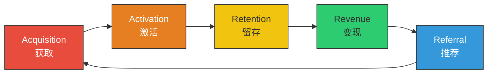
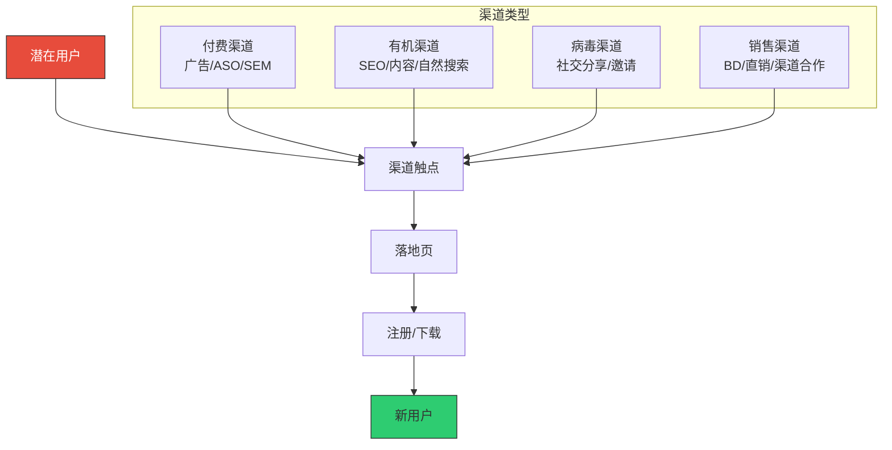
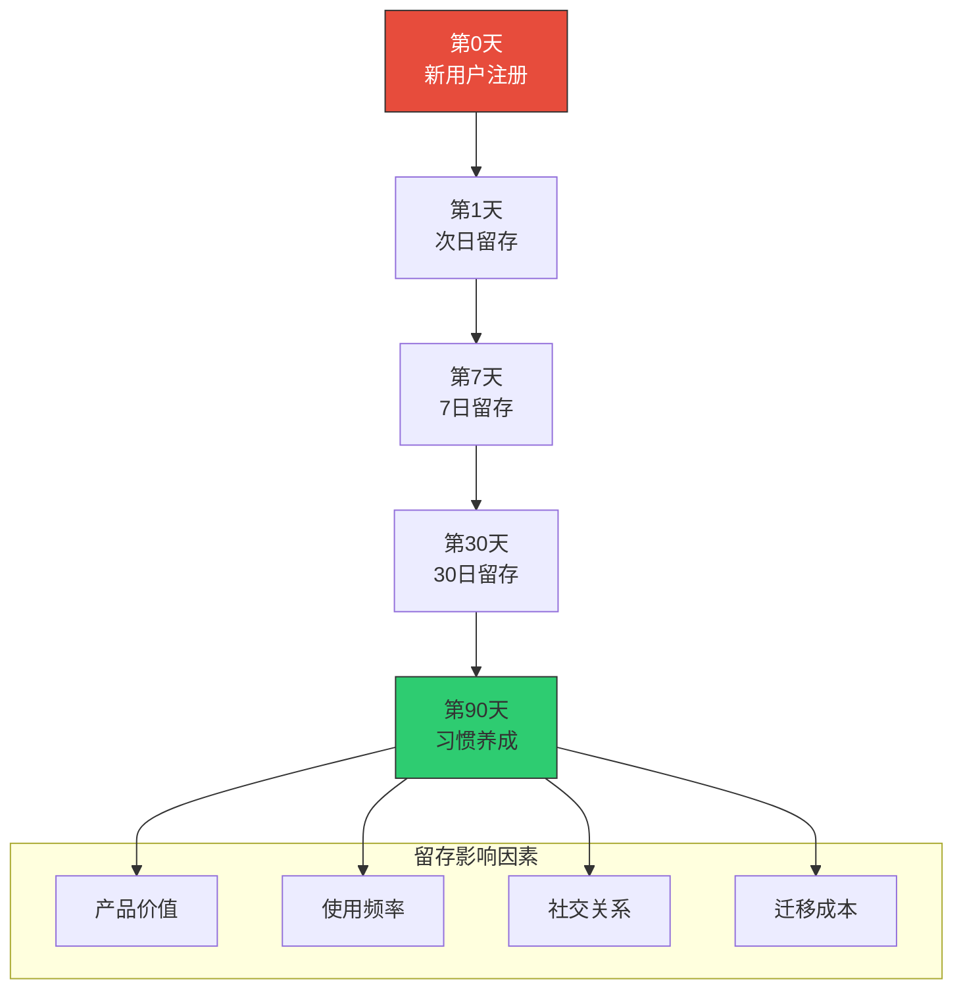
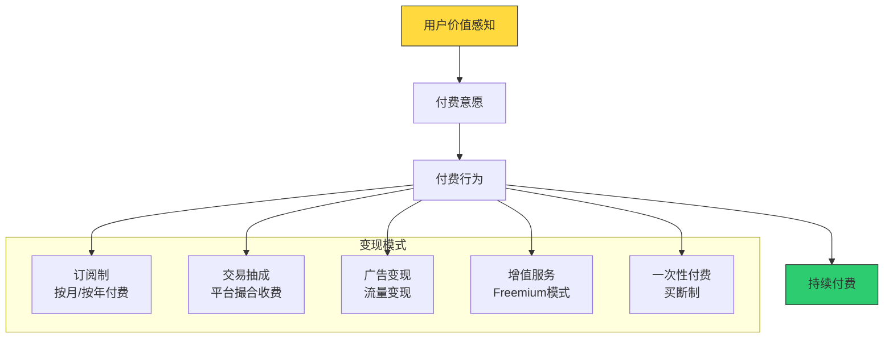
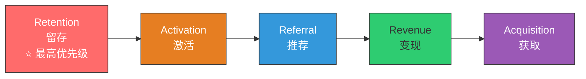
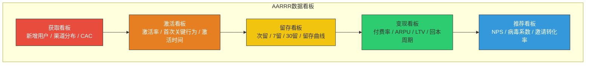

# AARRR模型：增长的全链路分析

> 增长不是靠运气，而是靠系统。AARRR 就是那个系统。

---

## 一、AARRR 模型概述

### 1.1 什么是 AARRR

AARRR 模型（又称"海盗指标"，Pirate Metrics）由 Dave McClure 在 2007 年提出，是增长领域最经典的分析框架。它将用户的生命周期分为五个阶段：

> [!note] 为什么叫"海盗指标"？
> AARRR 的发音与海盗的喊声"Aaarrr!"相似，因此得名。Dave McClure 本人也是一位以"海盗精神"著称的投资人，他鼓励创业者用海盗般的大胆和创造力来驱动增长。

### 1.2 五个环节的定义

| 环节 | 英文 | 核心问题 | 典型指标 |
|------|------|----------|----------|
| 获取 | Acquisition | 用户从哪里来？ | 新增用户数、CAC、渠道来源 |
| 激活 | Activation | 用户的第一次体验好吗？ | 激活率、首次关键行为完成率 |
| 留存 | Retention | 用户会回来吗？ | 次日/7日/30日留存率 |
| 变现 | Revenue | 如何从用户身上获得收入？ | ARPU、LTV、付费转化率 |
| 推荐 | Referral | 用户会告诉别人吗？ | NPS、病毒系数、邀请率 |

---

## 二、各环节深度解析

### 2.1 Acquisition（获取）

获取阶段的核心是：**让潜在用户发现你的产品。**

> [!tip] 获取阶段的优化重点
> 1. **渠道来源追踪**：每个用户来自哪个渠道，必须可追溯
> 2. **落地页优化**：落地页的转化率直接影响获客成本
> 3. **渠道-产品匹配**：不是所有渠道都适合你的产品（详见 [[04-商业与战略/增长与运营方法论/03_用户获取：渠道策略与增长实验]]）
> 4. **CAC（获客成本）控制**：确保获客成本在可承受范围内

### 2.2 Activation（激活）

激活阶段的核心是：**让新用户第一次体验到产品的核心价值。**

激活不等于注册。真正的激活是用户完成了"关键行为"——这个行为能让用户感受到产品的价值。

> [!important] 激活的关键问题
> 你的产品的"啊哈时刻"（Aha Moment）是什么？用户在哪个时刻会说"哇，这东西真有用"？
>
> - Facebook：10天内添加7个好友
> - Twitter：关注30个用户
> - Dropbox：上传第一个文件
> - Slack：团队发送2000条消息
> - Notion：创建第一个页面并添加内容

激活的优化策略包括：

1. **简化注册流程**：减少不必要的步骤，支持社交账号一键登录
2. **新手引导设计**：通过引导教程让用户快速上手
3. **快速价值展示**：在产品中预设内容（如模板、示例数据）
4. **个性化欢迎**：根据用户来源和特征提供个性化体验
5. **触发行为设计**：通过邮件、推送等方式引导用户完成关键行为

### 2.3 Retention（留存）

留存阶段的核心是：**让用户持续使用产品，形成习惯。**

留存是增长中最重要也最容易被忽视的环节。

> [!warning] 留存率的行业基准
> 不同产品的留存率差异很大，但有一些通用的参考：
> - **社交产品**：次日留存 60%+，7日留存 40%+，30日留存 30%+
> - **工具产品**：次日留存 40%+，7日留存 20%+，30日留存 15%+
> - **内容产品**：次日留存 30%+，7日留存 15%+，30日留存 10%+
> - **电商产品**：30日留存 5-10% 也属正常

留存优化的详细策略见 [[04-商业与战略/增长与运营方法论/04_用户激活与留存：让用户留下来]]。

### 2.4 Revenue（变现）

变现阶段的核心是：**将用户价值转化为商业价值。**

变现不是"收割"用户，而是"价值交换"——用户愿意为产品提供的价值付费。

### 2.5 Referral（推荐）

推荐阶段的核心是：**让用户成为产品的传播者。**

推荐是成本最低、质量最高的获客方式。一个满意的用户带来的新用户，往往比广告带来的用户质量更高。

> [!tip] 推荐机制的设计原则
> 1. **降低分享门槛**：让分享变得简单，一键分享比复制链接更容易
> 2. **提供分享动机**：让用户有动力分享（社交货币、实用价值、情感共鸣）
> 3. **设计激励机制**：双向奖励（邀请者和被邀请者都获益）
> 4. **在正确时机触发**：在用户最满意的时候弹出分享邀请
> 5. **追踪推荐链路**：每个推荐带来的用户要可追溯

---

## 三、AARRR 的局限与替代模型

### 3.1 AARRR 的局限性

AARRR 模型虽然经典，但在实践中也暴露出一些局限：

1. **线性思维**：AARRR 假设用户按线性顺序经历五个阶段，但实际上用户行为是复杂的、非线性的
2. **忽视留存优先**：AARRR 将留存放在第三个环节，但留存应该是最优先的
3. **缺乏反馈循环**：AARRR 只关注正向流动，忽视了各环节之间的反馈作用
4. **不适合所有产品**：对于某些产品（如B2B产品），AARRR 的适用性有限

### 3.2 RARRA：留存优先的改进模型

RARRA 模型是对 AARRR 的重要改进，它将留存（Retention）提到了最前面：

> [!important] RARRA 的核心逻辑
> 1. **Retention**：先确保产品有留存，用户愿意持续使用
> 2. **Activation**：优化激活流程，让更多新用户成为留存用户
> 3. **Referral**：利用留存用户的满意度驱动推荐
> 4. **Revenue**：在用户留存和推荐的基础上变现
> 5. **Acquisition**：最后才规模化获客，因为此时产品已经验证了留存

### 3.3 增长引擎模型

除了 AARRR 和 RARRA，还有增长引擎（Growth Engines）模型，将增长分为三种基本引擎：

| 增长引擎 | 驱动方式 | 核心指标 | 适用产品 |
|----------|----------|----------|----------|
| 黏着式引擎 | 用户离不开产品 | 留存率、流失率 | 工具产品、SaaS |
| 病毒式引擎 | 用户传播产品 | 病毒系数 K-factor | 社交产品、通讯工具 |
| 付费式引擎 | 花钱买用户 | CAC、LTV、ROI | 电商、游戏 |

---

## 四、AARRR 在实际中的应用

### 4.1 建立 AARRR 看板

### 4.2 诊断增长瓶颈

AARRR 模型最实用的价值之一是**诊断增长瓶颈**。当增长停滞时，你应该用 AARRR 来定位问题：

> [!example] 诊断流程
> 1. 看**获取**：新用户数量是否在增长？渠道效率如何？
> 2. 看**激活**：新用户激活率是否正常？有没有大量用户在激活前流失？
> 3. 看**留存**：用户留存率是否健康？哪个时间节点流失最严重？
> 4. 看**变现**：付费转化率是否合理？LTV是否大于CAC？
> 5. 看**推荐**：用户是否愿意推荐？病毒系数是否大于1？

### 4.3 各环节的优化策略矩阵

| 环节 | 常见问题 | 优化方向 | 相关文档 |
|------|----------|----------|----------|
| 获取 | 渠道效率低，CAC过高 | 渠道优化、内容营销、ASO/SEO | [[04-商业与战略/增长与运营方法论/03_用户获取：渠道策略与增长实验]] |
| 激活 | 注册后用户流失严重 | 新手引导、快速价值展示 | [[04-商业与战略/增长与运营方法论/04_用户激活与留存：让用户留下来]] |
| 留存 | 用户来了就走，留不住 | 习惯养成、社交关系、内容价值 | [[04-商业与战略/增长与运营方法论/04_用户激活与留存：让用户留下来]] |
| 变现 | 付费转化率低 | 定价策略、免费试用、价值传递 | [[04-商业与战略/商业模式设计与创新/00_MOC_商业模式设计与创新中枢]] |
| 推荐 | 用户不愿意分享 | 分享动机、推荐机制、激励机制 | [[04-商业与战略/增长与运营方法论/07_社区运营与用户运营]] |

---

## 五、AARRR 与 AI 产品

### 5.1 AI 产品中的 AARRR 特殊性

AI 产品在 AARRR 的每个环节都有其特殊性：

| 环节 | AI产品的特殊性 | 详见 |
|------|---------------|------|
| 获取 | 用户教育成本高，需要让用户理解AI能做什么 | [[04-商业与战略/增长与运营方法论/08_AI产品的增长特殊性]] |
| 激活 | WoW效应是关键，但真正的激活是持续使用 | [[04-商业与战略/增长与运营方法论/08_AI产品的增长特殊性]] |
| 留存 | AI输出不确定性影响留存，需要建立信任 | [[04-商业与战略/增长与运营方法论/08_AI产品的增长特殊性]] |
| 变现 | AI产品的定价模式多样（按次/按月/按量） | [[04-商业与战略/增长与运营方法论/08_AI产品的增长特殊性]] |
| 推荐 | 效果展示是最好的推荐，截图分享是自然行为 | [[04-商业与战略/增长与运营方法论/08_AI产品的增长特殊性]] |

### 5.2 AI 产品的北极星指标

对于 AI 产品，传统的 DAU/MAU 可能不够。需要考虑更能反映 AI 价值的指标：

- **AI 使用深度**：用户使用了多少种 AI 能力
- **AI 采纳率**：目标用户中使用 AI 功能的比例
- **AI 输出采纳率**：用户采纳 AI 建议的比例
- **AI 效率提升**：使用 AI 后用户完成任务的时间缩短比例

---

## 六、小结与实践建议

### 6.1 核心要点回顾

> [!summary] AARRR 模型的核心要点
> 1. **AARRR 是增长的系统化分析框架**，覆盖用户生命周期的五个阶段
> 2. **每个环节都有核心指标**，建立 AARRR 看板是增长的基础
> 3. **RARRA 是 AARRR 的重要改进**，强调留存优先
> 4. **增长瓶颈诊断**：用 AARRR 定位哪个环节出了问题
> 5. **AI 产品需要调整 AARRR**：关注 AI 使用深度等特殊指标

### 6.2 实践建议

1. **本周**：为你的产品建立 AARRR 看板，梳理每个环节的核心指标
2. **本月**：找到增长瓶颈最大的环节，制定优化计划
3. **本季度**：建立 RARRA 思维，将留存作为最优先的增长指标

### 6.3 下一步阅读

- 想了解具体的获客策略？阅读 [[04-商业与战略/增长与运营方法论/03_用户获取：渠道策略与增长实验]]
- 想了解激活和留存的优化方法？阅读 [[04-商业与战略/增长与运营方法论/04_用户激活与留存：让用户留下来]]
- 想了解如何用数据驱动增长？阅读 [[04-商业与战略/增长与运营方法论/06_数据分析驱动增长]]
- 做 AI 产品？阅读 [[04-商业与战略/增长与运营方法论/08_AI产品的增长特殊性]]

---

> AARRR 不是教条，而是思考框架。真正重要的是理解你的用户在每个阶段的行为和动机，然后用数据驱动的方式持续优化。