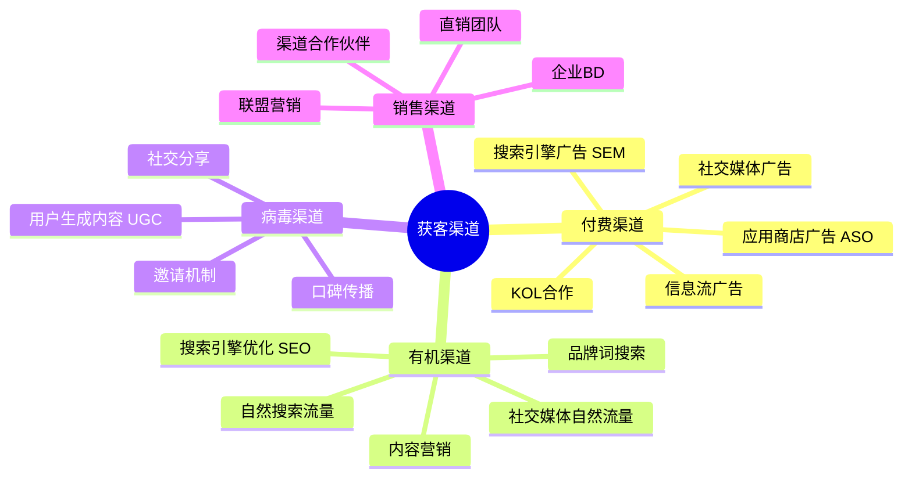
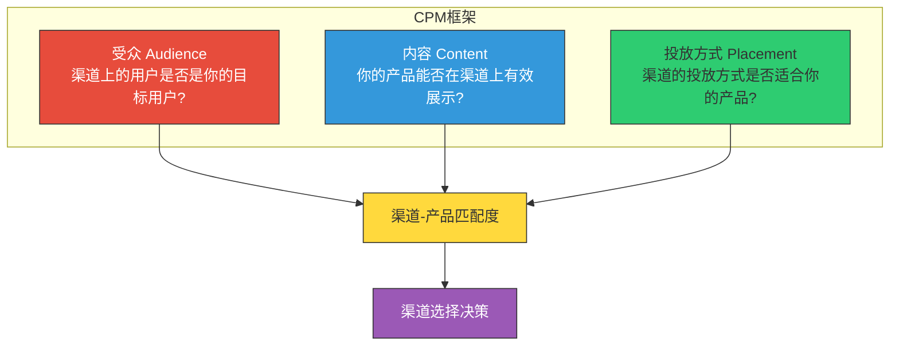
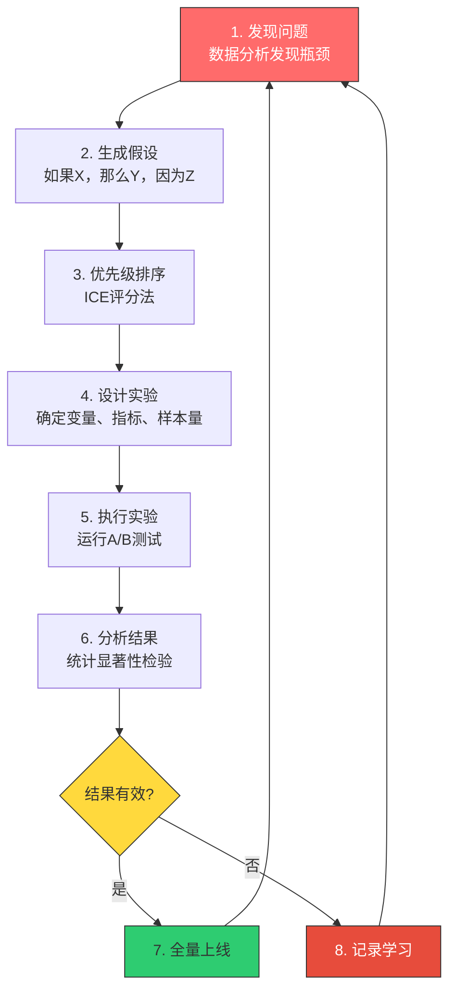
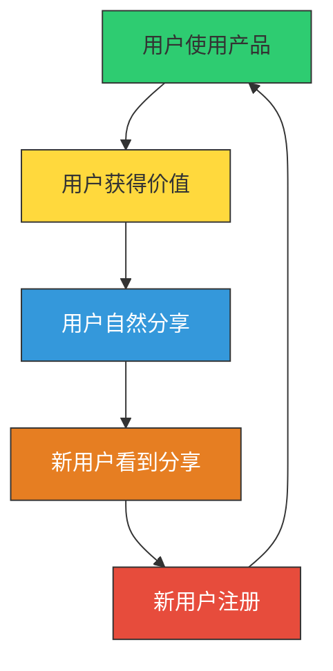
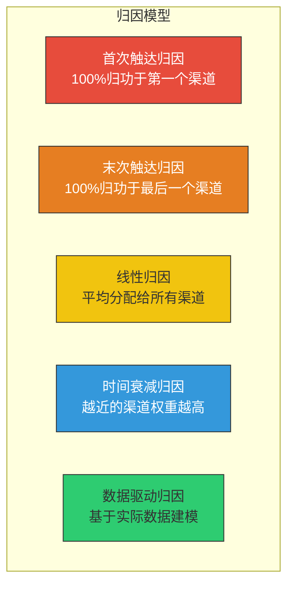
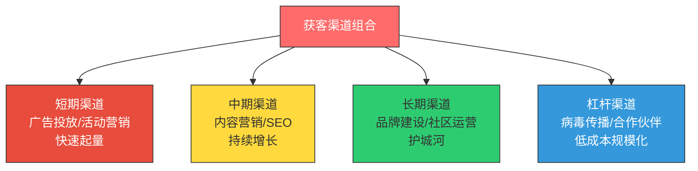

# 用户获取：渠道策略与增长实验

> 用户不会自己找上门。你需要设计一条"高速公路"，让他们能顺利地发现、理解和尝试你的产品。

---

## 一、获客渠道的类型与选择

### 1.1 获客渠道全景图

### 1.2 渠道-产品匹配框架（CPM）

渠道-产品匹配（Channel-Product Match，简称CPM框架）是 Brian Balfour 提出的获客渠道选择方法论。它包含三个维度：

> [!tip] CPM 框架的三个关键问题
> 1. **受众（Audience）**：这个渠道上的用户是我的目标用户吗？他们的画像匹配吗？
> 2. **内容（Content）**：我的产品价值能在这个渠道上有效展示吗？短视频适合展示视觉效果，博客适合深度内容。
> 3. **投放方式（Placement）**：这个渠道的投放方式适合我的产品吗？自助投放还是需要人工销售？

### 1.3 各渠道的特点与适用场景

| 渠道 | 成本 | 速度 | 规模 | 可持续性 | 适合产品 |
|------|------|------|------|----------|----------|
| SEO | 低 | 慢 | 中-高 | 高 | 内容型、工具型产品 |
| SEM | 高 | 快 | 高 | 低 | 高LTV产品 |
| 社交媒体广告 | 中-高 | 快 | 高 | 中 | 消费类产品 |
| 内容营销 | 低-中 | 慢 | 中 | 高 | B2B、知识型产品 |
| KOL合作 | 中-高 | 中 | 中-高 | 中 | 消费类、生活方式产品 |
| 病毒/邀请 | 低 | 中 | 取决于产品 | 取决于产品 | 社交产品、协作工具 |
| 直销 | 高 | 慢 | 低-中 | 中 | 企业级B2B产品 |
| ASO | 低 | 慢 | 中 | 高 | 移动应用 |

---

## 二、增长实验的设计与执行

### 2.1 什么是增长实验

增长实验是增长黑客的核心工作方法。它不是"试试看"，而是**有假设、有设计、有度量的科学实验**。

### 2.2 ICE 评分法：实验优先级排序

ICE 评分法是 Sean Ellis 提出的实验优先级排序方法，用于在众多实验想法中选择最有价值的来执行。

> [!important] ICE 评分法
> ICE = Impact（影响） x Confidence（信心） x Ease（简易度）
>
> 每个维度打分 1-10 分，最终得分 = I x C x E。
>
> - **Impact（影响）**：如果实验成功，对增长指标的影响有多大？
> - **Confidence（信心）**：你对这个实验会成功的信心有多大？（基于数据、用户研究、行业经验）
> - **Ease（简易度）**：这个实验实施起来有多容易？（时间、资源、技术难度）

> [!example] ICE 评分示例
> | 实验想法 | I | C | E | ICE得分 | 优先级 |
> |----------|---|---|---|---------|--------|
> | 优化注册页按钮文案 | 6 | 8 | 9 | 432 | 1 |
> | 增加社交分享功能 | 9 | 5 | 4 | 180 | 3 |
> | 优化新手引导流程 | 8 | 7 | 6 | 336 | 2 |
> | 投放Facebook广告 | 7 | 4 | 5 | 140 | 4 |

### 2.3 实验设计的关键要素

一个好的增长实验需要明确以下要素：

1. **实验假设**：用"如果...那么...因为..."的格式表述
2. **核心指标**：实验要改变什么指标？主要指标和辅助指标分别是什么？
3. **实验变量**：实验组和对照组之间的唯一区别是什么？
4. **样本量**：需要多少样本才能达到统计显著性？
5. **实验时长**：实验需要运行多久才能得到可靠结果？
6. **成功标准**：什么结果算"成功"？什么结果算"失败"？

> [!tip] 实验假设模板
> **如果** [我们做出某个改变]
> **那么** [某个指标会发生变化]
> **因为** [基于某种用户行为或心理的推理]
>
> 示例：如果我们把注册按钮从"注册"改为"免费开始使用"，那么注册转化率会提升，因为"免费开始使用"降低了用户的心理门槛，暗示使用产品不需要付费。

---

## 三、获客策略的深度实践

### 3.1 病毒式增长的机制设计

病毒式增长是获客成本最低的方式之一。其核心是设计一个**病毒循环**：

病毒系数（K-factor）是衡量病毒式增长的核心指标：

$$K = i \times c$$

- i = 每个用户发送的邀请数
- c = 邀请的转化率
- 当 K > 1 时，产品呈指数增长；当 K < 1 时，病毒传播会逐渐衰减

> [!warning] 病毒增长的陷阱
> 病毒式增长看起来很美好，但有几个常见的陷阱：
> 1. **病毒增长不可持续**：大多数产品的病毒系数会随时间衰减
> 2. **质量 vs 数量**：病毒带来的用户质量可能不如有机渠道
> 3. **产品必须本身有分享价值**：如果产品本身不好，病毒机制再强也白搭
> 4. **平台政策风险**：过度依赖社交平台传播可能受平台规则变化影响

### 3.2 内容驱动的获客策略

内容营销是一种"慢但持久"的获客方式。详见 [[04-商业与战略/增长与运营方法论/05_内容运营：用内容驱动增长]]。

内容驱动的获客优势：
- **复利效应**：好的内容会持续带来流量，不像广告一样投放一停流量就停
- **信任建立**：内容帮助建立专业形象和用户信任
- **SEO价值**：优质内容是SEO的基础
- **成本递减**：随着内容积累，单位获客成本持续下降

### 3.3 付费获客的优化

付费获客是一门"数学"：只要 LTV > CAC，就可以持续投入。

> [!important] 付费获客的优化维度
> 1. **精准定向**：找到最可能转化的用户群体
> 2. **创意优化**：持续测试不同的广告素材和文案
> 3. **落地页优化**：提高从点击到注册的转化率
> 4. **出价策略**：找到最优的出价，既不浪费预算也不损失流量
> 5. **再营销**：对曾经访问但未转化的用户进行二次触达

---

## 四、获客渠道的测量与归因

### 4.1 渠道归因模型

了解每个渠道对获客的贡献，需要建立归因模型：

> [!tip] 归因模型的选择建议
> - 早期产品：使用末次触达归因，简单直接
> - 成长期产品：使用时间衰减归因，更合理
> - 成熟产品：使用数据驱动归因，最准确但成本最高

### 4.2 关键获客指标

| 指标 | 计算公式 | 说明 |
|------|----------|------|
| CAC | 总获客成本 / 新增用户数 | 获取一个用户的平均成本 |
| 渠道CAC | 渠道总成本 / 该渠道新增用户 | 分渠道的获客成本 |
| LTV/CAC | LTV / CAC | 健康标准：> 3 |
| 回本周期 | CAC / 月均用户贡献收入 | 越快越好 |
| 转化率 | 完成转化用户数 / 渠道触达用户数 | 渠道效率 |
| 病毒系数 | 邀请数 x 邀请转化率 | 病毒传播效率 |

### 4.3 获客渠道的组合策略

在实际运营中，很少有产品只依赖单一渠道。最有效的获客策略通常是**多渠道组合**：

> [!tip] 渠道组合的原则
> 1. **用短期渠道快速验证**：先用付费渠道快速获取用户，验证产品价值和增长假设
> 2. **用中期渠道建立可持续增长**：在验证通过后，投入内容营销和SEO建立可持续的流量来源
> 3. **用长期渠道构建护城河**：品牌和社区需要时间积累，但一旦建立就是最强的壁垒
> 4. **用杠杆渠道放大效果**：当产品本身有传播性时，病毒传播和合作伙伴可以放大增长效果

### 4.4 获客的常见陷阱

> [!warning] 获客常见的五个陷阱
> 1. **过早规模化**：在PMF验证之前就大规模投入获客，导致大量资金浪费
> 2. **渠道单一依赖**：过度依赖某一个渠道，一旦渠道规则变化，增长就会断崖式下跌
> 3. **忽视获客质量**：只看新增用户数量，不看用户质量（激活率、留存率）
> 4. **CAC持续上升**：随着竞争加剧，获客成本自然上升，需要不断寻找新渠道
> 5. **归因错误**：错误地将转化归因给某个渠道，导致资源错配

---

## 五、小结与实践建议

### 5.1 核心要点回顾

> [!summary] 用户获取的核心要点
> 1. **获客渠道有四种类型**：付费、有机、病毒、销售，各有优劣
> 2. **CPM框架**帮助选择正确的渠道：受众、内容、投放方式
> 3. **增长实验是获客的核心方法**：假设驱动、ICE评分、A/B测试、数据分析
> 4. **病毒式增长需要精心设计**：病毒循环、病毒系数、激励机制
> 5. **渠道归因至关重要**：知道用户从哪里来，才能优化获客效率

### 5.2 实践建议

1. **本周**：梳理你当前的获客渠道，计算每个渠道的CAC和转化率
2. **本月**：用ICE评分法排序你的增长实验想法，执行得分最高的那个
3. **本季度**：建立渠道归因模型，开始系统化地优化获客效率

### 5.3 下一步阅读

- 想了解如何用内容驱动获客？阅读 [[04-商业与战略/增长与运营方法论/05_内容运营：用内容驱动增长]]
- 想了解如何让用户留下来？阅读 [[04-商业与战略/增长与运营方法论/04_用户激活与留存：让用户留下来]]
- 想了解如何用数据驱动实验？阅读 [[04-商业与战略/增长与运营方法论/06_数据分析驱动增长]]

---

> 获客不是"撒网捕鱼"，而是"精准钓鱼"。了解你的用户在哪里，用正确的方式触达他们，用科学的方法验证效果，这才是可持续的获客之道。