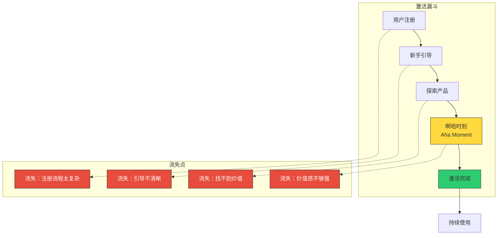
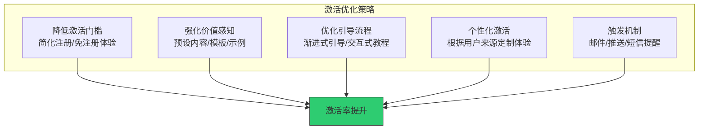
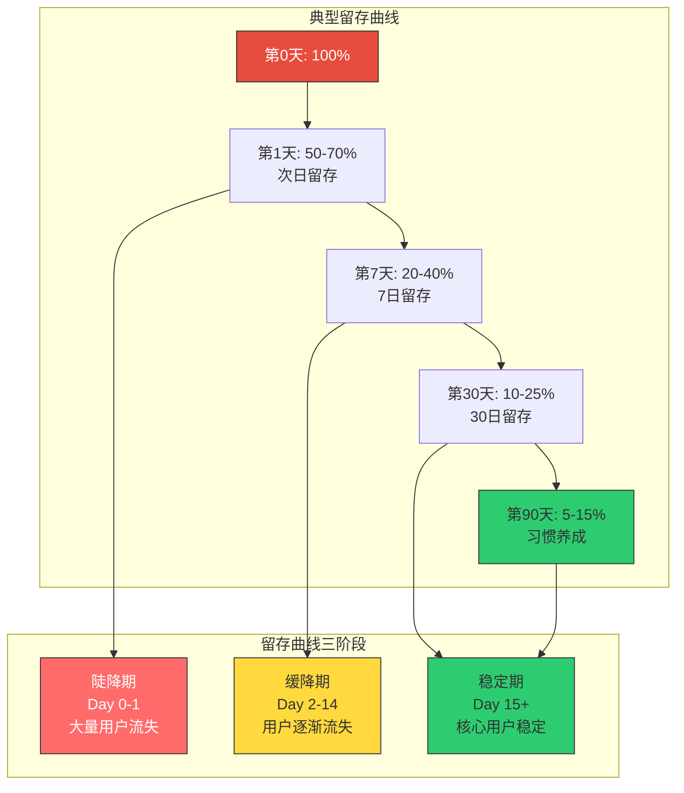
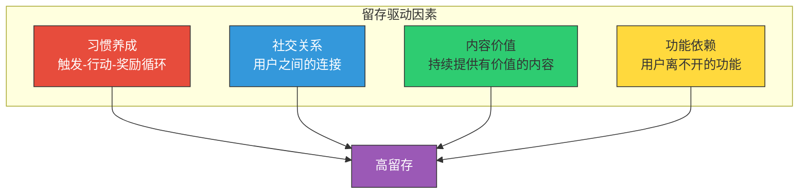
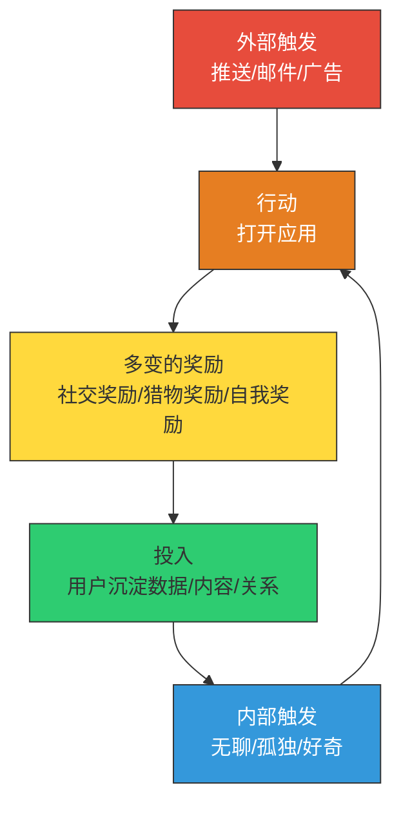

# 用户激活与留存：让用户"留下来"

> 获取用户只是开始，让他们留下来才是真正的挑战。

---

## 一、激活：让用户第一次感受到价值

### 1.1 什么是激活

激活（Activation）不是注册，不是登录，而是**用户第一次体验到产品核心价值的时刻**。这个时刻被称为"啊哈时刻"（Aha Moment）。

### 1.2 找到你的"啊哈时刻"

> [!important] 啊哈时刻的发现方法
> 1. **与高留存用户访谈**：问他们"你还记得第一次觉得这个产品有用是什么时候吗？"
> 2. **分析留存与行为的关系**：找到与高留存最相关的用户行为
> 3. **观察用户的使用过程**：看用户在使用产品的哪个时刻表情/情绪发生了变化
> 4. **定量分析**：找到最能区分留存用户和流失用户的关键行为

经典案例：
- **Facebook**：10天内添加7个好友
- **Twitter**：关注30个用户
- **Dropbox**：上传第一个文件
- **Slack**：团队发送2000条消息
- **Notion**：创建第一个页面并添加内容
- **Pinterest**：保存第一个Pin

### 1.3 激活率优化的策略

**策略一：降低激活门槛**

- 社交账号一键登录，减少注册摩擦
- 提供"免注册体验"或"游客模式"
- 减少必填信息，后续再引导补充

**策略二：强化价值感知**

- 预设内容：新用户进来就能看到有价值的内容
- 模板系统：提供开箱即用的模板
- 快速演示：30秒内展示核心功能

**策略三：优化引导流程**

- 渐进式引导：不要一次性展示所有功能
- 交互式教程：让用户边做边学
- 跳过选项：允许熟练用户跳过引导

**策略四：个性化激活**

- 根据用户来源（广告/推荐/自然搜索）定制欢迎页
- 根据用户画像推荐不同的初始设置
- 利用用户注册时提供的信息进行个性化

---

## 二、留存：让用户持续回来

### 2.1 留存曲线分析

留存曲线是理解用户行为最有力的工具之一。它展示了不同时间点用户的留存比例。

> [!tip] 如何分析留存曲线
> 1. **看陡降期的斜率**：斜率越陡，说明激活问题越严重
> 2. **看稳定期的水平**：稳定期越高，说明产品价值越强
> 3. **看曲线是否持续下降**：如果曲线持续下降不收敛，说明产品没有形成稳定的核心用户群
> 4. **分组对比**：按渠道、用户画像、行为特征分组，找到高留存用户群的共同特征

### 2.2 留存的四个驱动因素

#### 因素一：习惯养成 —— 上瘾模型

Nir Eyal 在《上瘾》中提出的 Hook Model 是理解用户习惯养成的核心框架：

> [!quote] Nir Eyal
> "习惯不是创造出来的，而是设计出来的。通过触发、行动、奖励和投入四个环节的精心设计，你可以让用户形成使用产品的习惯。"

#### 因素二：社交关系

社交关系是最强的留存驱动因素之一。当用户的产品中建立了社交连接，迁移成本就会大幅增加。

- 微信：你的所有朋友都在上面
- Slack：你的团队在上面协作
- Discord：你的游戏社区在上面
- Notion：你的团队文档在上面

#### 因素三：内容价值

持续提供有价值的内容是内容型产品留存的核心。

- 知乎：每天都有新的高质量回答
- B站：不断更新的视频内容
- 得到：持续更新的课程和音频
- 小红书：海量的生活方式内容

#### 因素四：功能依赖

当用户将某个功能融入日常工作流，就会产生功能依赖。

- Google Drive：文件存储和协作
- GitHub：代码托管和版本管理
- Figma：设计协作
- Notion：知识管理和文档

### 2.3 留存的优化策略

> [!tip] 留存优化的十个方向
> 1. **优化激活体验**：确保用户能快速到达啊哈时刻
> 2. **建立使用习惯**：通过触发-行动-奖励循环培养习惯
> 3. **加强社交连接**：帮助用户在产品中建立关系网络
> 4. **提升内容质量**：持续提供高质量、个性化的内容
> 5. **增加迁移成本**：用户沉淀的数据越多，越难离开
> 6. **定期唤醒机制**：邮件、推送、短信等触达方式
> 7. **流失预警**：识别有流失风险的用户，提前干预
> 8. **回流传动**：设计让流失用户回流的机制
> 9. **个性化体验**：根据用户行为提供差异化内容
> 10. **持续功能迭代**：保持产品的新鲜感和竞争力

---

## 三、激活与留存的度量

### 3.1 激活指标

| 指标 | 定义 | 计算方法 |
|------|------|----------|
| 激活率 | 完成关键行为的用户比例 | 完成关键行为用户 / 新用户总数 |
| 激活时间 | 从注册到激活的平均时间 | 激活时间戳 - 注册时间戳 |
| 激活漏斗转化率 | 激活流程各步骤的转化率 | 每步完成人数 / 上步完成人数 |
| 引导完成率 | 完成新手引导的用户比例 | 完成引导用户 / 开始引导用户 |

### 3.2 留存指标

| 指标 | 定义 | 计算方法 |
|------|------|----------|
| 次日留存 | 第1天回访的用户比例 | Day1活跃用户 / Day0新增用户 |
| 7日留存 | 第7天回访的用户比例 | Day7活跃用户 / Day0新增用户 |
| 30日留存 | 第30天回访的用户比例 | Day30活跃用户 / Day0新增用户 |
| 周活跃天数 | 用户每周平均活跃天数 | 周活跃总天数 / 周活跃用户数 |
| DAU/MAU | 日活占月活的比例 | DAU / MAU（反映黏性） |

---

## 四、与其它增长环节的关联

### 4.1 激活与获客的关系

激活和获客是紧密相连的。获客质量直接影响激活率：

- 精准获客 → 高激活率
- 泛获客 → 低激活率
- 获客渠道需要与激活流程匹配

### 4.2 留存与变现的关系

留存是变现的基础：

- 留存率每提升 5%，利润可能提升 25-95%（Bain & Company 研究）
- 高留存用户是高价值用户，LTV 远高于低留存用户
- 留存用户更可能转化为付费用户

### 4.3 留存与社区的关系

社区是提升留存的重要杠杆。详见 [[04-商业与战略/增长与运营方法论/07_社区运营与用户运营]]。

---

## 五、小结与实践建议

### 5.1 核心要点回顾

> [!summary] 激活与留存的核心要点
> 1. **激活 = 啊哈时刻**：用户第一次感受到产品核心价值的时刻
> 2. **激活率优化**：降低门槛、强化价值感知、优化引导、个性化体验
> 3. **留存曲线分析**：陡降期看激活，稳定期看价值
> 4. **四大留存驱动因素**：习惯养成、社交关系、内容价值、功能依赖
> 5. **留存是增长的基础**：先修桶，再灌水

### 5.2 实践建议

1. **本周**：定义你的产品的"啊哈时刻"和关键行为
2. **本月**：绘制激活漏斗，找到流失最大的步骤并优化
3. **本季度**：建立留存曲线监控，开始留存优化实验

### 5.3 下一步阅读

- 想了解如何用数据驱动增长？阅读 [[04-商业与战略/增长与运营方法论/06_数据分析驱动增长]]
- 想了解如何构建社区来提升留存？阅读 [[04-商业与战略/增长与运营方法论/07_社区运营与用户运营]]
- 想了解AI产品的激活与留存特殊性？阅读 [[04-商业与战略/增长与运营方法论/08_AI产品的增长特殊性]]

---

> 激活决定用户是否"来对了"，留存决定用户是否"留得住"。把这两个环节做好，你的增长就有了坚实的基础。