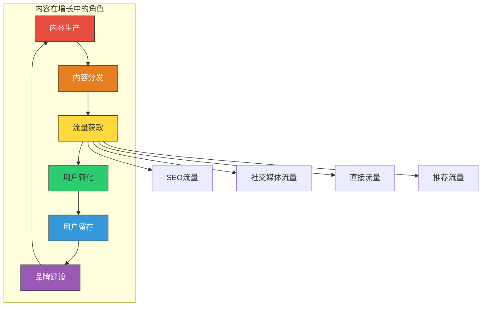
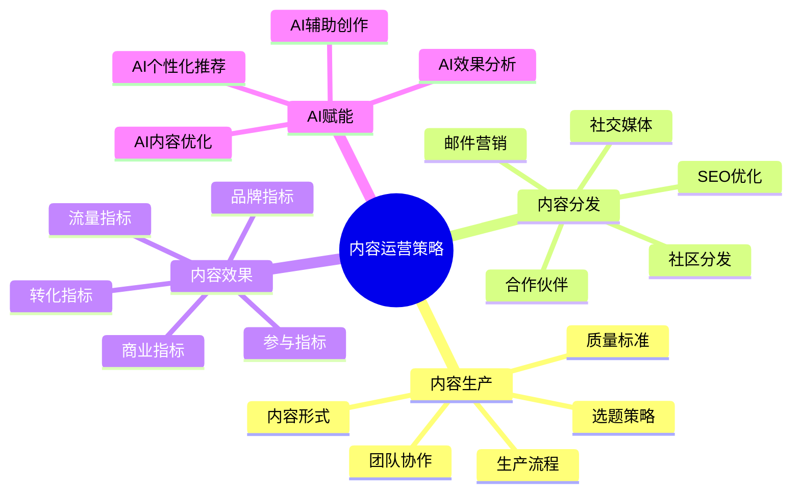
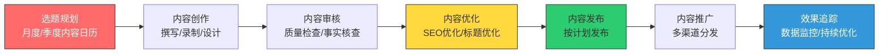
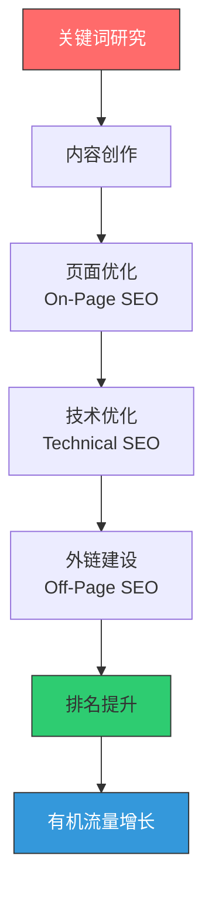
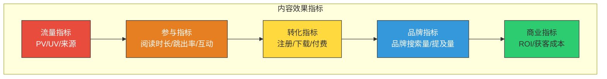
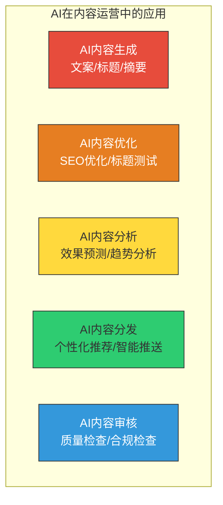

# 内容运营：用内容驱动增长

> 内容是增长中最持久的杠杆。广告停了流量就停，但一篇好文章可以持续带来用户。

---

## 一、内容运营的战略定位

### 1.1 内容在增长中的角色

内容运营不只是"写文章"，而是**通过生产和分发有价值的内容，吸引、转化和留存用户**的系统化工作。

> [!important] 内容运营的复利效应
> 内容运营最独特的价值在于**复利效应**：
> - 广告：投放一停，流量就停。线性增长。
> - 内容：积累越多，流量越大。指数增长。
> - 一篇好的SEO文章可能在未来几年持续带来流量
> - 一个爆款内容可以带来远超制作成本的回报

### 1.2 内容策略的核心框架

---

## 二、内容生产策略

### 2.1 选题策略：写什么

选题是内容运营的第一步，也是最关键的一步。好的选题 = 50% 的内容成功。

> [!tip] 选题的三个核心维度
> 1. **用户需求度**：用户真的在搜索/关注这个话题吗？
> 2. **竞争度**：这个话题的竞争激烈吗？你能否脱颖而出？
> 3. **商业价值**：这个话题能带来目标用户吗？能促进转化吗？

**选题方法论**：

1. **关键词研究**：通过SEO工具（如Google Keyword Planner、Ahrefs）找到用户搜索量大、竞争可控的关键词
2. **用户问题收集**：从客服、社区、用户反馈中收集高频问题
3. **竞品内容分析**：分析竞品哪些内容表现好，找到差异化切入点
4. **热点追踪**：结合行业热点快速产出内容
5. **长尾覆盖**：系统性地覆盖长尾关键词，建立内容壁垒

### 2.2 内容形式的选择

| 内容形式 | 优势 | 劣势 | 适合场景 |
|----------|------|------|----------|
| 博客文章 | SEO友好、生产成本低 | 竞争激烈、需要持续更新 | 知识分享、SEO获客 |
| 视频 | 传播力强、信息密度高 | 制作成本高、SEO弱 | 产品演示、教程 |
| 播客 | 用户粘性高、场景适应强 | 发现难度大、增长慢 | 深度讨论、品牌建设 |
| 信息图 | 传播性强、一目了然 | 制作成本高、SEO弱 | 数据可视化、社交媒体 |
| 案例研究 | 转化率高、说服力强 | 需要客户配合 | B2B获客 |
| 白皮书/电子书 | 权威感强、获取线索 | 制作成本高 | B2B线索获取 |
| 社交媒体帖子 | 传播快、互动性强 | 生命周期短 | 日常运营、品牌曝光 |
| 邮件通讯 | 直达用户、转化率高 | 需要用户订阅 | 用户留存、深度连接 |

### 2.3 内容生产流程

---

## 三、内容分发策略

### 3.1 SEO：搜索引擎优化

SEO 是内容运营最重要的流量来源之一，因为它是**免费、可持续、高意向**的流量。

> [!tip] SEO 内容优化的关键要素
> 1. **关键词优化**：标题、URL、H1、首段包含目标关键词
> 2. **内容质量**：E-E-A-T（经验、专业、权威、信任）——Google 最看重的四个维度
> 3. **内容结构**：清晰的H2/H3层级、目录、短段落、列表
> 4. **页面体验**：加载速度、移动端适配、可读性
> 5. **内部链接**：合理的内链结构，帮助搜索引擎理解内容关系
> 6. **外部链接**：获取高质量外链，提升域名权重

### 3.2 社交媒体分发

社交媒体是内容分发的重要渠道，但需要根据不同平台的特点定制内容：

| 平台 | 内容特点 | 适合类型 | 分发策略 |
|------|----------|----------|----------|
| 微信公众号 | 深度长文、信任关系 | 品牌故事、深度分析 | 定期推送、系列化内容 |
| 小红书 | 图文并茂、种草导向 | 产品体验、攻略教程 | 真实感、关键词优化 |
| 抖音/TikTok | 短视频、高传播性 | 产品演示、知识科普 | 前三秒抓眼球 |
| B站 | 中长视频、社区文化 | 深度教程、测评 | UP主合作、社区互动 |
| 知乎 | 深度问答、专业内容 | 专业知识、行业分析 | 回答高质量问题 |
| Twitter/X | 短文本、实时性 | 行业动态、观点分享 | 高频发布、互动 |
| LinkedIn | 职业内容、B2B | 行业洞察、案例研究 | 专业形象、人脉传播 |

### 3.3 邮件营销

邮件是转化率最高、最可控的分发渠道：

- 邮件列表是"自己的流量"，不受平台算法影响
- 邮件的转化率通常是社交媒体的 3-5 倍
- 邮件可以实现精准的个性化触达

---

## 四、内容效果的衡量

### 4.1 内容指标矩阵

> [!tip] 内容效果衡量的核心指标
> 1. **流量**：PV（页面浏览量）、UV（独立访客）、流量来源分布
> 2. **参与度**：平均阅读时长、跳出率、滚动深度、社交分享数
> 3. **转化**：CTA点击率、注册转化率、内容贡献的获客数
> 4. **增长**：内容的流量增长趋势、SEO排名变化
> 5. **商业价值**：内容贡献的LTV、内容获客的CAC

### 4.2 内容归因

将转化归因到具体内容，可以采用以下方法：

1. **UTM参数追踪**：为每个内容链接添加UTM参数
2. **落地页追踪**：为不同内容设置不同的落地页
3. **首次触达归因**：记录用户首次接触的内容
4. **辅助转化归因**：记录用户在转化路径中接触的所有内容

---

## 五、AI 在内容运营中的应用

### 5.1 AI 赋能内容运营全景

AI 正在深刻改变内容运营的方式。详见 [[04-商业与战略/增长与运营方法论/08_AI产品的增长特殊性]]。

### 5.2 AI 内容生成的实践

> [!important] AI 内容生成的使用原则
> 1. **AI 是助手，不是替代**：AI 帮你提高效率，但核心创意和判断仍需人来做
> 2. **人工审核必不可少**：AI 生成的内容需要人工审核事实准确性和语气适宜性
> 3. **差异化是关键**：当所有人都用 AI 生成内容时，差异化反而来自人的独特视角
> 4. **质量控制**：AI 生成的内容在发布前需要经过质量检查流程

AI 在内容运营中的具体应用场景：

1. **标题优化**：用 AI 生成多个标题候选，A/B测试选出最佳
2. **内容大纲**：AI 辅助生成内容大纲，提高创作效率
3. **初稿生成**：AI 生成初稿，人工优化和编辑
4. **SEO元数据**：AI 自动生成 meta description、alt text
5. **内容翻译/本地化**：AI 辅助多语言内容生产
6. **效果分析**：AI 分析内容表现，预测哪些内容可能成为爆款

### 5.3 内容运营的团队搭建

内容运营团队的搭建需要根据产品阶段和内容策略来确定：

| 阶段 | 团队配置 | 核心产出 |
|------|----------|----------|
| 初期（0-1） | 1-2名内容创作者 | 每周2-3篇高质量内容 |
| 成长期（1-10） | 内容负责人 + 创作者 + 编辑 | 每日1-2篇 + 多渠道分发 |
| 成熟期（10-100） | 内容团队 + SEO团队 + 视频团队 | 内容矩阵 + 品牌内容 |

> [!tip] 内容团队的核心能力
> 1. **选题能力**：能找到用户真正关心的话题
> 2. **写作能力**：能写出高质量、有吸引力的内容
> 3. **SEO能力**：理解搜索引擎的工作原理
> 4. **数据分析能力**：能用数据衡量内容效果
> 5. **AI工具使用能力**：能高效地使用AI工具提升内容生产效率

### 5.4 内容运营的常见误区

> [!warning] 内容运营常见误区
> 1. **盲目追求数量**：质量永远比数量重要。10篇平庸的内容不如1篇优秀的内容
> 2. **忽视分发**：好的内容如果不分发，就相当于没有。内容50%靠创作，50%靠分发
> 3. **缺乏持续投入**：内容运营是长期工程，需要持续投入，不能三天打鱼两天晒网
> 4. **只做SEO不做品牌**：SEO能带来流量，但品牌能带来信任和转化
> 5. **不看数据**：内容效果需要数据来衡量，不能凭感觉判断好坏

---

## 六、小结与实践建议

### 6.1 核心要点回顾

> [!summary] 内容运营的核心要点
> 1. **内容是最持久的增长杠杆**：具有复利效应，持续积累价值
> 2. **选题是成败的关键**：好的选题 = 50% 的内容成功
> 3. **SEO 是内容分发的基石**：免费、可持续、高意向的流量
> 4. **多渠道分发**：不同平台需要不同的内容形式和策略
> 5. **效果衡量**：建立内容指标矩阵，持续优化内容策略
> 6. **AI 赋能**：合理使用 AI 提高内容生产效率，但人工判断不可替代

### 6.2 实践建议

1. **本周**：梳理现有内容，建立内容清单和基本指标
2. **本月**：制定月度内容日历，规划选题和分发计划
3. **本季度**：建立内容效果衡量体系，开始用数据指导内容决策

### 6.3 下一步阅读

- 想了解如何用数据驱动内容决策？阅读 [[04-商业与战略/增长与运营方法论/06_数据分析驱动增长]]
- 想了解如何结合社区运营？阅读 [[04-商业与战略/增长与运营方法论/07_社区运营与用户运营]]
- 想了解AI对内容运营的深度影响？阅读 [[04-商业与战略/增长与运营方法论/08_AI产品的增长特殊性]]

---

> 内容运营不是一个"项目"，而是一种"基础设施"。好的内容会持续为你工作，在你睡觉的时候也在获取用户。这就是内容的复利。