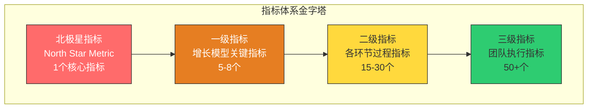
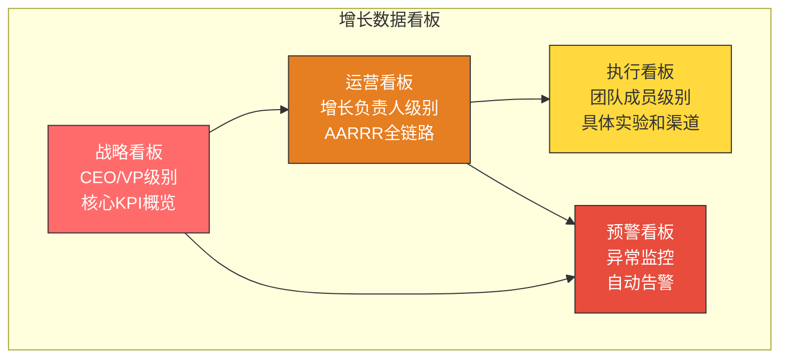
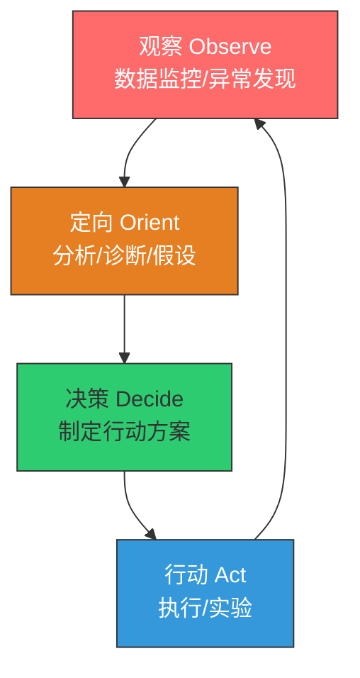
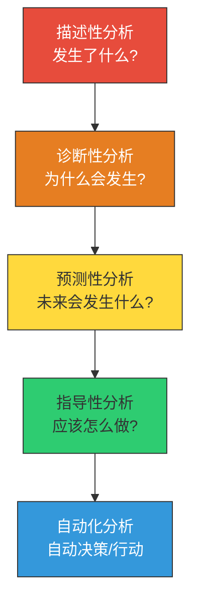
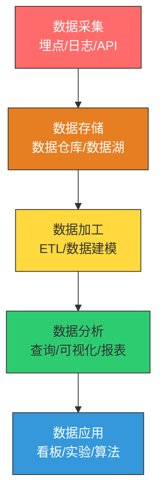
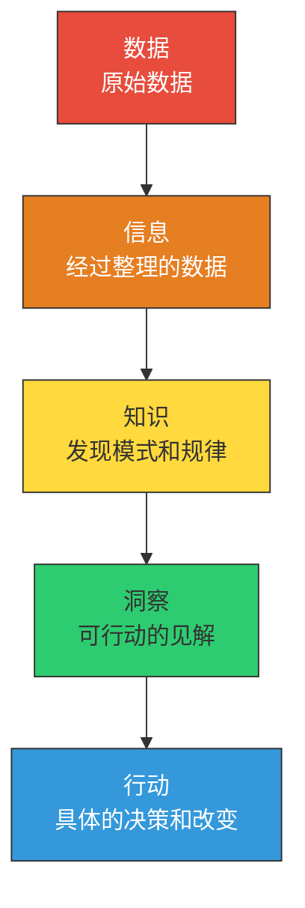

# 数据分析驱动增长

> 你不能管理你无法衡量的东西。你不能增长你无法管理的东西。

---

## 一、增长的数据指标体系设计

### 1.1 指标体系的分层设计

一个好的增长数据指标体系应该分层设计，从宏观到微观，从结果到过程：

**第一层：北极星指标（North Star Metric）**

北极星指标是衡量产品核心价值的唯一指标，是整个团队共同的目标。

> [!important] 好的北极星指标的特征
> 1. **反映产品核心价值**：用户在做什么能体现产品价值？
> 2. **可衡量**：能够被准确追踪和量化
> 3. **可行动**：团队能够通过行动影响这个指标
> 4. **先导性**：能够预测未来的商业结果
> 5. **简单易懂**：团队每个人都能理解和记住

经典的北极星指标案例：

| 产品 | 北极星指标 | 为什么 |
|------|-----------|--------|
| Spotify | 总收听时长 | 用户听音乐的时间越长，价值越大 |
| Airbnb | 预订夜晚数 | 核心交易行为的衡量 |
| WhatsApp | 发送消息数 | 通讯产品的核心价值 |
| Slack | 每周活跃团队数 | 团队协作的价值衡量 |
| Notion | 每周活跃用户数 | 知识管理工具的使用频率 |
| 知乎 | 高质量回答数 | 内容社区的核心价值 |

**第二层：一级指标（增长模型关键指标）**

基于 AARRR 模型，一级指标覆盖增长的全链路：

| 环节 | 一级指标 | 典型目标 |
|------|----------|----------|
| 获取 | 新增用户数、CAC | 月增20% |
| 激活 | 激活率、激活时间 | 激活率 > 40% |
| 留存 | 次日/7日/30日留存率 | 30日留存 > 20% |
| 变现 | ARPU、LTV、付费率 | LTV/CAC > 3 |
| 推荐 | NPS、病毒系数 | K-factor > 0.5 |

**第三层和第四层：过程和执行指标**

这些是团队日常使用的指标，用于监控具体的执行效果。例如：
- 注册页转化率
- 新手引导完成率
- 各渠道的CTR
- 内容页面的平均停留时间

### 1.2 指标设计的原则

> [!tip] 指标设计的四个原则
> 1. **MECE原则**：相互独立、完全穷尽，避免指标之间的重叠
> 2. **先导 vs 滞后**：关注先导指标而非滞后指标。DAU 是滞后指标，注册转化率是先导指标
> 3. **比率 vs 绝对值**：比率指标比绝对值更能反映趋势。增长率比绝对值重要
> 4. **避免虚荣指标**：关注能驱动行动的指标，而非"看起来好看"的指标

> [!warning] 常见的虚荣指标
> - **总注册用户数**：如果大部分是僵尸用户，这个数字毫无意义
> - **页面浏览量**：如果用户点进来就离开，PV再高也没用
> - **社交媒体粉丝数**：如果不能转化为用户，粉丝再多也是虚的
> - **App下载量**：如果大部分用户下载后不打开，下载量就是虚荣指标

---

## 二、数据看板的搭建

### 2.1 增长数据看板架构

### 2.2 看板设计原则

1. **一页纸原则**：重要的信息应该在一屏内展示
2. **趋势 > 快照**：展示趋势比展示单点数据更有价值
3. **对比 > 绝对值**：同比、环比比绝对值更重要
4. **异常突出**：用颜色和位置突出异常数据
5. **可下钻**：从宏观到微观，能够层层下钻到细节

### 2.3 工具选择

| 类别 | 工具 | 适用场景 |
|------|------|----------|
| 产品分析 | Amplitude, Mixpanel | 用户行为分析、漏斗分析 |
| 数据可视化 | Tableau, Metabase, Superset | 数据看板、报表 |
| 数据仓库 | Snowflake, BigQuery, Redshift | 数据存储和查询 |
| 数据管道 | Fivetran, Airbyte, dbt | 数据集成和转换 |
| A/B测试 | Optimizely, LaunchDarkly, Statsig | 实验平台 |
| 归因分析 | AppsFlyer, Branch, Adjust | 移动端渠道归因 |

---

## 三、数据驱动决策的流程

### 3.1 数据驱动决策的 OODA 循环

### 3.2 数据分析的五个层次

> [!tip] 从描述到指导的跃迁
> 大多数团队停留在"描述性分析"层面——知道发生了什么，但不知道为什么，也不知道该怎么做。成熟的增长团队应该能做到"指导性分析"——不仅知道发生了什么，还知道为什么发生，以及应该采取什么行动。

### 3.3 数据分析的常见方法

| 方法 | 用途 | 典型问题 |
|------|------|----------|
| 漏斗分析 | 分析转化路径 | 用户在哪个步骤流失最多？ |
| 同期群分析 | 按时间分组对比 | 1月注册的用户和2月注册的用户留存有什么不同？ |
| 细分分析 | 按维度拆分用户 | 付费用户和非付费用户的行为有什么差异？ |
| 相关性分析 | 发现变量关系 | 完成新手引导的用户留存率更高吗？ |
| A/B测试 | 因果验证 | 新版本的转化率真的比旧版本高吗？ |
| 路径分析 | 分析用户行为路径 | 用户从注册到付费的典型路径是什么？ |

---

## 四、数据分析的常见误区

### 4.1 相关性不等于因果性

> [!warning] 经典误区：相关性 vs 因果性
> 这是数据分析中最常见的错误之一。两个变量相关，不一定意味着一个导致了另一个。
>
> **经典案例**：夏天冰淇淋销量和溺水死亡人数高度相关。这能说明吃冰淇淋会导致溺水吗？当然不能。真正的原因是"夏天"这个混杂变量——天热了，人们更爱吃冰淇淋，也更爱游泳，所以溺水增加。
>
> **在增长中**：你发现"使用搜索功能的用户留存率更高"，这能说明搜索功能提高了留存吗？不一定。也可能是"高留存用户本身就是活跃用户，他们更可能使用搜索功能"。

要建立因果关系，需要进行**随机对照实验（A/B测试）**。

### 4.2 幸存者偏差

> [!warning] 经典误区：幸存者偏差
> 幸存者偏差是指只关注"幸存"的样本，而忽略了"失败"的样本，从而得出错误的结论。
>
> **经典案例**：二战时，盟军分析返回的飞机，发现机翼上的弹孔最多，于是决定加强机翼的装甲。但统计学家 Wald 指出：应该加强发动机的装甲，因为发动机被击中的飞机都没能飞回来。你看到的弹孔分布，恰恰说明了哪些部位被击中后飞机还能幸存。
>
> **在增长中**：你分析了"高留存用户"的特征，然后按照这些特征去获客。但可能的问题是：这些特征是"高留存的结果"而不是"高留存的原因"。

### 4.3 辛普森悖论

> [!warning] 经典误区：辛普森悖论
> 辛普森悖论是指：在分组比较中成立的趋势，在合并数据时可能反转。
>
> **在增长中**：你发现整体转化率在下降，但当你按渠道拆分后，发现每个渠道的转化率都在上升。这可能是因为低转化率渠道的流量占比增加了，拉低了整体转化率。

### 4.4 其他常见误区

| 误区 | 说明 | 防范方法 |
|------|------|----------|
| 小数定律 | 从小样本中得出过度结论 | 确保样本量足够大，计算置信区间 |
| 确认偏差 | 只关注支持自己假设的数据 | 主动寻找反证，做假设检验 |
| 数据挖掘 | 在大量数据中寻找偶然的"显著"结果 | 预先确定假设，避免事后分析 |
| 指标操纵 | 为了指标好看而做短期行为 | 建立平衡指标体系，关注长期指标 |
| 平均数的陷阱 | 平均值掩盖了分布差异 | 关注分布（中位数、分位数、方差） |

---

## 五、数据驱动增长的实践

### 5.1 建立数据文化

> [!important] 数据文化的核心要素
> 1. **数据民主化**：让每个人都能方便地获取数据，而不只是数据团队
> 2. **数据素养**：培养团队的数据分析能力，让每个人都能用数据说话
> 3. **数据驱动决策**：重要的决策必须有数据支撑
> 4. **实验文化**：鼓励用实验验证假设，容忍失败，从失败中学习
> 5. **数据伦理**：尊重用户隐私，负责任地使用数据

### 5.2 数据基础设施

### 5.3 数据驱动增长的实践案例

**案例一：Airbnb的增长实验**

Airbnb通过数据分析发现，有专业摄影照片的房源预订率比没有的高2-3倍。于是他们推出了免费专业摄影服务，并设计A/B测试验证：在相同条件下，有专业照片的房源预订率确实显著高于没有的。这个发现直接推动了Airbnb在早期的高速增长。

**案例二：Dropbox的病毒式增长**

Dropbox通过数据分析发现，用户看到朋友使用Dropbox是最有效的转化方式。他们设计了双向奖励的推荐机制：邀请者和被邀请者都获得额外存储空间。通过A/B测试不断优化推荐文案和奖励额度，最终实现了病毒式增长。

**案例三：Netflix的个性化推荐**

Netflix通过分析用户的观看行为数据，建立了强大的推荐算法。他们发现，用户在60-90秒内找不到想看的内容就会离开。通过持续优化推荐算法，Netflix将用户的内容发现时间大幅缩短，显著提升了留存率。

### 5.4 数据治理与合规

> [!important] 数据治理的核心原则
> 1. **数据质量**：确保数据的准确性、完整性、一致性、时效性
> 2. **数据安全**：保护用户数据，防止数据泄露和滥用
> 3. **数据合规**：遵守GDPR、CCPA等数据保护法规
> 4. **数据伦理**：负责任地使用数据，避免算法偏见和歧视
> 5. **数据生命周期管理**：从采集到销毁的完整数据生命周期管理

### 5.5 从数据到洞察：分析框架

数据分析的最终目的是产生可行动的洞察，而不仅仅是呈现数据。这里介绍一个从数据到洞察的实用框架：

> [!tip] 从数据到洞察的关键问题
> 1. **So What?** 这个数据意味着什么？
> 2. **Why?** 为什么会这样？
> 3. **What If?** 如果我们做出改变，会怎样？
> 4. **Now What?** 基于这个洞察，我们应该做什么？

---

## 六、小结与实践建议

### 6.1 核心要点回顾

> [!summary] 数据分析驱动增长的核心要点
> 1. **建立分层指标体系**：北极星指标 → 一级指标 → 过程指标 → 执行指标
> 2. **数据看板是决策的基础**：战略看板、运营看板、执行看板、预警看板
> 3. **数据分析有五个层次**：描述 → 诊断 → 预测 → 指导 → 自动化
> 4. **警惕常见误区**：相关性不等于因果性、幸存者偏差、辛普森悖论
> 5. **建立数据文化**：让数据驱动成为团队的工作方式

### 6.2 实践建议

1. **本周**：定义你的产品的北极星指标
2. **本月**：建立 AARRR 数据看板，将关键指标可视化
3. **本季度**：建立数据基础设施，确保数据采集的完整性和准确性

### 6.3 下一步阅读

- 想了解如何用数据驱动实验？阅读 [[04-商业与战略/增长与运营方法论/03_用户获取：渠道策略与增长实验]]
- 想了解AI产品的数据特殊性？阅读 [[04-商业与战略/增长与运营方法论/08_AI产品的增长特殊性]]
- 想了解用户研究中的数据分析？阅读 [[05-产品与开发/用户研究与需求洞察/00_MOC_用户研究与需求洞察中枢]]

---

> 数据不是目的，而是手段。数据的价值不在于"多"，而在于"能用"。一个好的数据体系，应该能让团队更快地做出更好的决策。