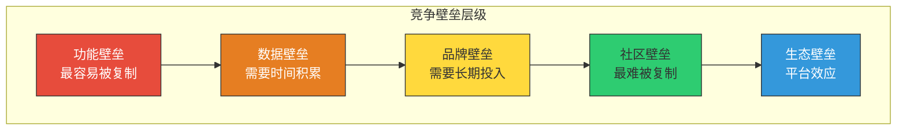
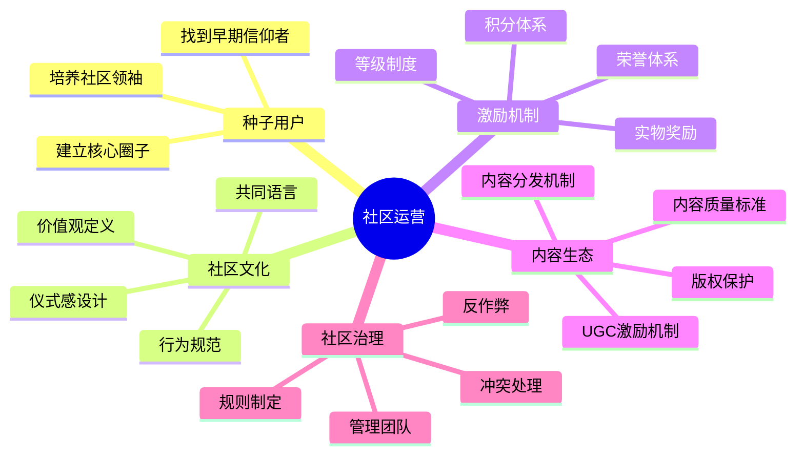
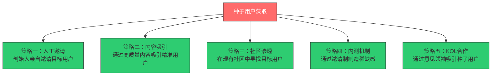
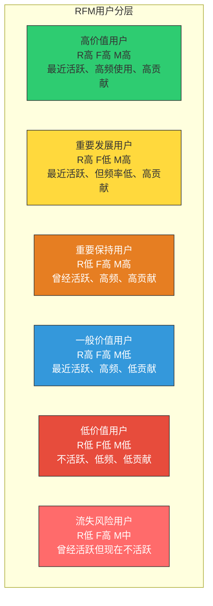
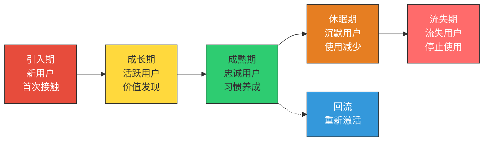
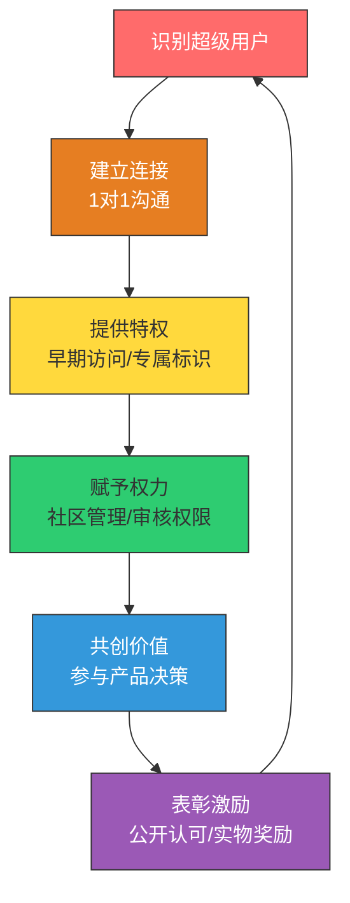
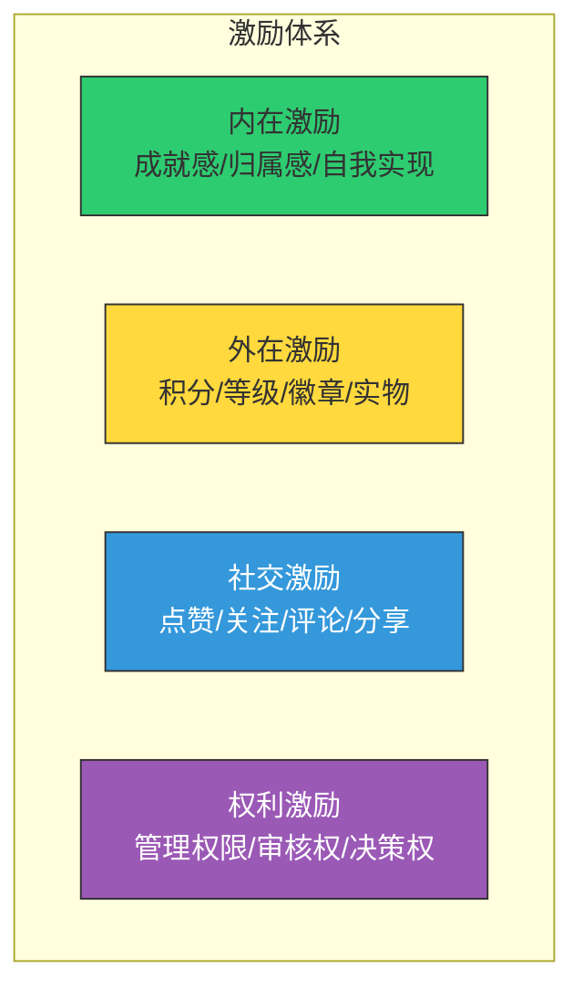

# 社区运营与用户运营

> 产品承载功能，社区承载关系。功能可以被复制，关系却很难。

---

## 一、社区运营的核心

### 1.1 为什么社区是增长的护城河

社区是增长中最难被复制的壁垒。你可以复制一个产品的功能，但你无法复制一个社区的文化和用户之间的关系网络。

> [!important] 社区的增长价值
> 1. **降低获客成本**：社区成员是自然的传播者
> 2. **提升留存率**：用户关系网络增加迁移成本
> 3. **获取用户洞察**：社区是用户反馈的富矿
> 4. **内容UGC**：用户生成内容降低内容生产成本
> 5. **品牌忠诚度**：社区归属感带来品牌忠诚

### 1.2 社区运营的核心要素

---

## 二、种子用户：社区的起点

### 2.1 什么是种子用户

种子用户是社区的第一批用户，他们决定了社区的基因和基调。

> [!tip] 好种子用户的特征
> 1. **对产品有真实需求**：不是"来看看"，而是"真的需要"
> 2. **愿意反馈**：能提供高质量的产品建议和问题反馈
> 3. **有影响力**：在目标用户群体中有一定影响力
> 4. **文化契合**：认同产品的价值观和愿景
> 5. **耐心**：能容忍早期产品的不完善

### 2.2 种子用户的获取策略

> [!example] 种子用户运营案例
> - **知乎**：早期采用邀请制，邀请各领域的专家和意见领袖作为种子用户，奠定了高质量内容的基调
> - **B站**：早期通过答题机制筛选二次元核心用户，保证了社区文化的纯度
> - **Product Hunt**：创始人亲自邀请硅谷的创业者和产品经理，建立了高质量的产品讨论社区

---

## 三、用户分层运营

### 3.1 RFM 模型：用户价值分层

RFM 模型是用户分层最经典的工具，基于三个维度：

- **R（Recency）**：最近一次使用/购买的时间
- **F（Frequency）**：使用/购买的频率
- **M（Monetary）**：消费金额/贡献价值

> [!tip] 不同分层的运营策略
> | 用户分层 | 运营策略 | 资源投入 |
> |----------|----------|----------|
> | 高价值用户 | 维护关系、深度服务、尊享特权 | 高 |
> | 重要发展用户 | 提升使用频率、交叉销售 | 中-高 |
> | 重要保持用户 | 唤醒召回、重新激活 | 中 |
> | 一般价值用户 | 培养习惯、提升价值感知 | 中 |
> | 低价值用户 | 自动运营、低成本触达 | 低 |
> | 流失风险用户 | 紧急干预、定向召回 | 中-高 |

### 3.2 用户分层的方法论

除了 RFM，还有多种用户分层方法：

| 方法 | 维度 | 适用场景 |
|------|------|----------|
| RFM | 最近、频率、金额 | 电商、交易型产品 |
| 生命周期 | 新用户、活跃用户、沉默用户、流失用户 | 所有产品 |
| 行为分层 | 使用深度、功能使用广度 | 工具型产品 |
| 价值分层 | LTV、付费意愿 | SaaS产品 |
| 角色分层 | 创建者、贡献者、消费者、旁观者 | 社区产品 |
| 需求分层 | 轻度用户、重度用户、专业用户 | 内容产品 |

---

## 四、用户生命周期管理

### 4.1 用户生命周期的五个阶段

### 4.2 各阶段的运营策略

**引入期（新用户）**

- 核心目标：让用户快速到达"啊哈时刻"
- 关键策略：新手引导、价值展示、快速激活
- 关键指标：激活率、激活时间
- 详见 [[04-商业与战略/增长与运营方法论/04_用户激活与留存：让用户留下来]]

**成长期（活跃用户）**

- 核心目标：培养使用习惯，提升使用深度
- 关键策略：功能引导、内容推荐、社交连接
- 关键指标：使用频率、功能使用广度

**成熟期（忠诚用户）**

- 核心目标：维持忠诚度，激发贡献
- 关键策略：社区参与、荣誉体系、共创机会
- 关键指标：NPS、推荐率、内容贡献率

**休眠期（沉默用户）**

- 核心目标：唤醒用户，重新激活
- 关键策略：定向推送、新功能告知、回归激励
- 关键指标：唤醒率、重新激活率

**流失期（流失用户）**

- 核心目标：了解流失原因，尝试召回
- 关键策略：流失调研、定向召回、产品改进
- 关键指标：流失率、召回率

---

## 五、超级用户：社区的核心资产

### 5.1 什么是超级用户

超级用户（Super User / Power User）是社区中贡献价值远超普通用户的核心群体。他们通常是：

- 内容的主要贡献者（UGC的核心来源）
- 社区文化的维护者（回答新人问题、维护社区规范）
- 产品的忠实传播者（自然的口碑传播）
- 需求洞察的来源（最了解产品痛点的用户）

> [!quote] 1%法则
> 在互联网社区中，90%的用户是"潜水者"（只看不参与），9%的用户偶尔参与，只有1%的用户是活跃的贡献者。这1%就是你的超级用户。

### 5.2 超级用户的运营策略

> [!tip] 超级用户运营的要点
> 1. **识别**：通过数据和行为识别超级用户
> 2. **连接**：建立1对1的沟通渠道，让超级用户感受到被重视
> 3. **赋能**：给超级用户提供工具和权限，让他们能更好地贡献
> 4. **激励**：设计合理的激励机制，让超级用户持续贡献
> 5. **成长**：为超级用户设计成长路径，从普通用户到社区领袖

---

## 六、激励机制设计

### 6.1 激励的类型

### 6.2 激励机制设计原则

> [!important] 激励机制设计原则
> 1. **内在激励优先**：外在激励（积分、奖品）短期有效，但内在激励（成就感、归属感）才能持久
> 2. **及时反馈**：用户的行为应该得到及时的反馈和认可
> 3. **公平透明**：激励规则要清晰透明，避免争议
> 4. **渐进式**：设计从易到难的成长路径，让用户有持续追求的目标
> 5. **防作弊**：确保激励体系不会被滥用

---

## 七、小结与实践建议

### 7.1 核心要点回顾

> [!summary] 社区运营与用户运营的核心要点
> 1. **社区是增长的护城河**：最难被复制的竞争壁垒
> 2. **种子用户决定社区基因**：选择比培养更重要
> 3. **用户分层是精细化运营的基础**：RFM模型、生命周期模型
> 4. **超级用户是社区的核心资产**：1%的用户贡献了大部分价值
> 5. **激励机制要内外结合**：内在激励为主，外在激励为辅

### 7.2 实践建议

1. **本周**：梳理你的产品的用户分层，找到你的超级用户
2. **本月**：建立种子用户运营机制，开始系统性维护核心用户关系
3. **本季度**：建立完整的用户生命周期管理体系

### 7.3 下一步阅读

- 想了解如何提升用户留存？阅读 [[04-商业与战略/增长与运营方法论/04_用户激活与留存：让用户留下来]]
- 想了解如何用内容驱动社区？阅读 [[04-商业与战略/增长与运营方法论/05_内容运营：用内容驱动增长]]
- 想了解用户研究方法？阅读 [[05-产品与开发/用户研究与需求洞察/00_MOC_用户研究与需求洞察中枢]]

---

> 社区运营的本质不是"管理用户"，而是"服务用户"。当你真心为用户创造价值，用户自然会回报你以忠诚、贡献和传播。