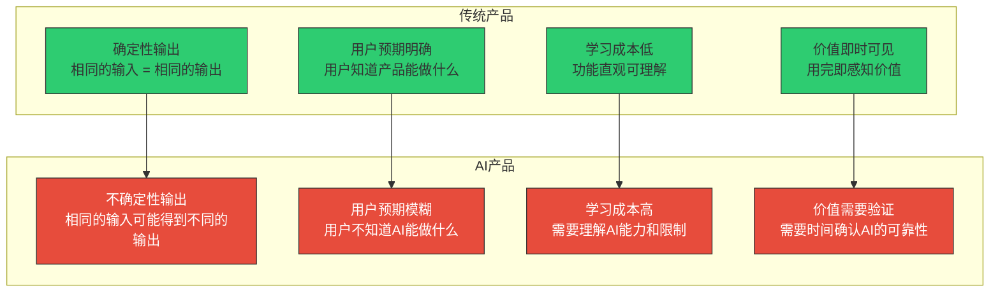
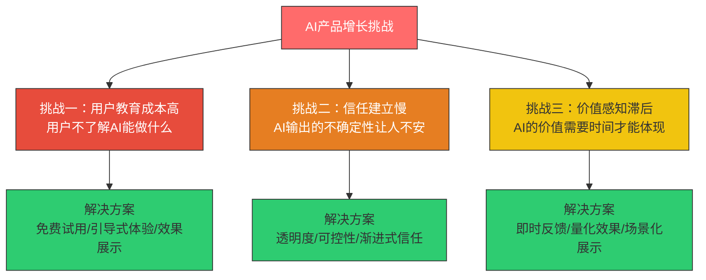
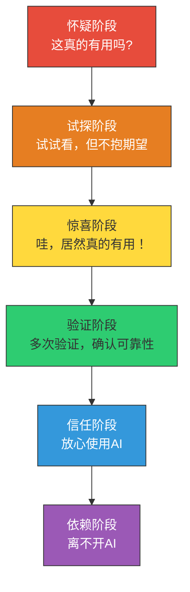
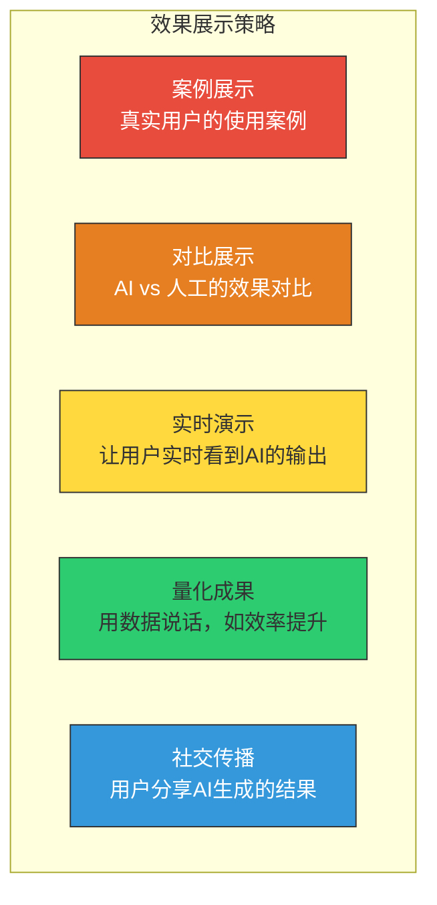
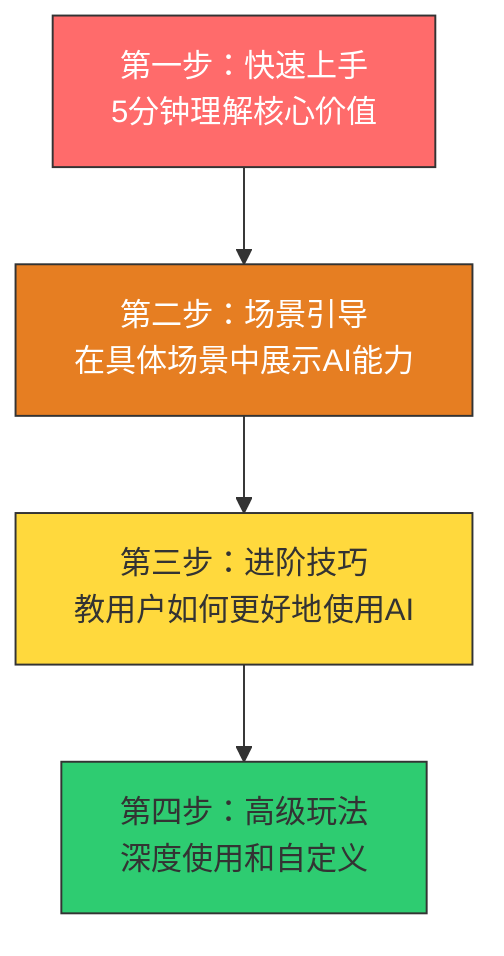
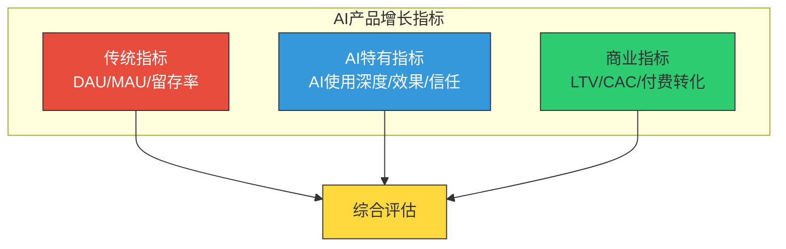
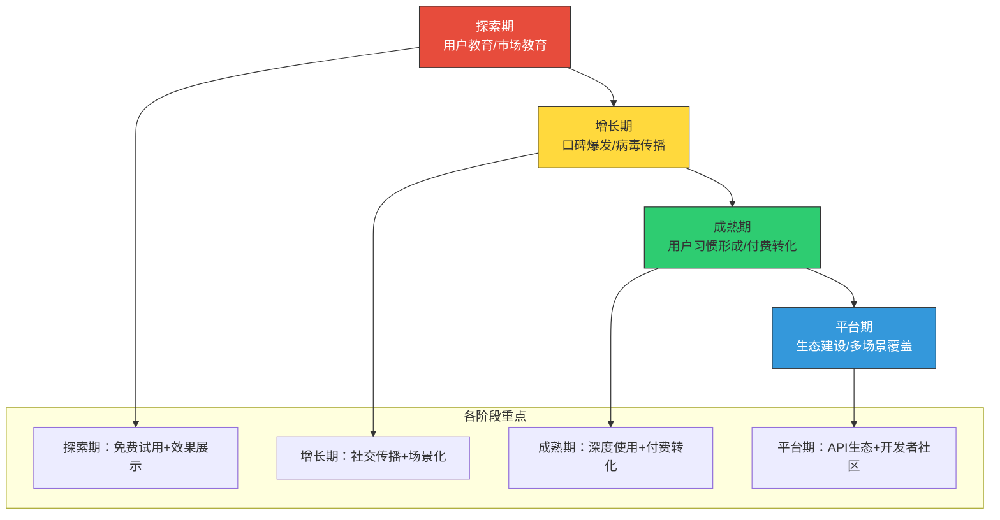
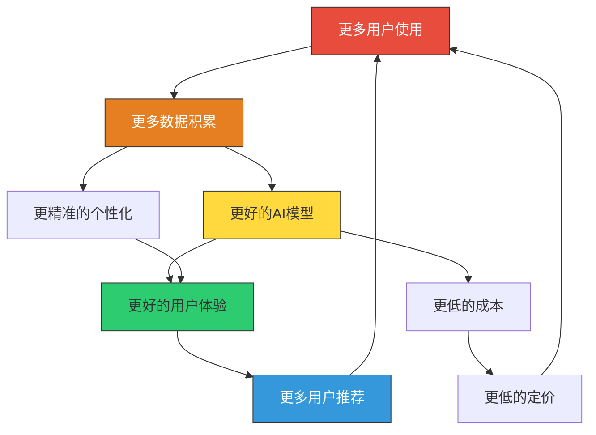

# AI产品的增长特殊性

> AI产品不是"加了AI功能的传统产品"，而是一种全新的产品品类。它们的增长逻辑也完全不同。

---

## 一、AI产品增长的特殊挑战

### 1.1 AI产品与传统产品的本质差异

### 1.2 AI产品增长的三大核心挑战

**挑战一：用户教育成本高**

AI产品最大的增长障碍不是技术，而是**用户不知道AI能做什么**。很多用户对AI的理解停留在"聊天机器人"或"生成图片"，不了解AI在专业领域的应用能力。

> [!example] 用户教育成本的表现
> - 用户注册后不知道如何使用AI功能
> - 用户用了一次，觉得"好像没什么用"，就放弃了
> - 用户用AI的方式不对，得不到好的结果，认为是AI不行
> - 用户不理解AI的限制，产生不切实际的期望

**挑战二：信任建立慢**

AI输出的不确定性让用户产生不信任感。用户需要多次验证才能建立对AI的信任。

**挑战三：价值感知滞后**

AI产品的价值往往不是一次性体验就能感知的，而是需要用户持续使用、不断验证才能体现。

---

## 二、AI产品的增长策略

### 2.1 免费试用：让用户零成本体验AI

免费试用是AI产品最有效的增长策略之一。原因很简单：**只有让用户用过，他们才知道AI有多好用。**

> [!tip] 免费试用的设计要点
> 1. **免费额度够用**：试用额度要足够让用户达到"啊哈时刻"
> 2. **体验完整功能**：试用期应该开放核心功能，而不是阉割版
> 3. **明确的价值展示**：让用户在使用过程中清楚地看到AI带来的价值
> 4. **自然的转化路径**：从免费到付费的过渡要自然，不要突然中断
> 5. **使用量而非时间限制**：按使用量（如：免费生成100次）比按时间（免费7天）更合理

### 2.2 效果展示：让用户看到AI的能力

效果展示是AI产品最有力的增长杠杆。用户看到AI的真实效果，自然会产生使用欲望。

> [!important] WoW效应：AI产品增长的第一推动力
> WoW效应（Wow Effect）是指用户第一次体验到AI能力时产生的惊叹感。这个时刻是AI产品增长的关键节点。
>
> - **ChatGPT**：第一次生成一段流畅的代码或文章
> - **Midjourney**：第一次生成一张惊艳的图片
> - **Notion AI**：第一次用AI自动生成会议纪要
> - **Cursor**：第一次用AI补全复杂代码
>
> 让用户尽快到达WoW时刻，是AI产品激活和增长的核心目标。

### 2.3 社交传播：让用户成为传播者

AI产品的社交传播通常有两个驱动力：

1. **展示效果**：用户炫耀AI生成的结果（"看，这是AI帮我做的！"）
2. **分享价值**：用户分享AI帮助他们解决的问题（"用这个AI工具，我节省了3小时"）

> [!tip] 促进社交传播的设计
> 1. **一键分享**：让用户能方便地分享AI生成的结果
> 2. **水印/标识**：分享内容带有产品标识，形成品牌传播
> 3. **分享激励**：邀请好友获得额外使用额度
> 4. **内容模板**：提供适合分享的模板和格式

### 2.4 渐进式用户教育

---

## 三、AI产品的增长指标体系

### 3.1 不仅仅是DAU：AI产品的特殊指标

AI产品的增长不能只看传统的DAU/MAU，还需要关注能反映AI使用深度和效果的指标。

### 3.2 AI使用深度指标

| 指标 | 定义 | 为什么重要 |
|------|------|-----------|
| AI功能使用率 | 使用AI功能的用户比例 | 反映AI功能对用户的吸引力 |
| AI功能使用广度 | 用户使用了多少种AI能力 | 反映用户对AI能力的全面探索 |
| AI交互次数 | 用户与AI的交互频率 | 反映用户对AI的依赖程度 |
| AI输出采纳率 | 用户采纳AI输出的比例 | 反映AI输出的质量和用户信任 |
| AI会话时长 | 用户与AI交互的时长 | 反映用户的使用深度 |
| AI任务完成率 | 用户使用AI完成任务的比率 | 反映AI的实际效用 |

### 3.3 AI效果指标

| 指标 | 定义 | 衡量方法 |
|------|------|----------|
| 效率提升 | 使用AI后完成任务的效率提升 | 对比使用前后时间 |
| 质量提升 | 使用AI后输出质量的提升 | 用户评分/专家评估 |
| 满意度 | 用户对AI输出的满意度 | 赞/踩比率、用户评分 |
| 错误率 | AI输出被用户拒绝/修改的比例 | 拒绝率、修改率 |
| 学习曲线 | 用户从新手到熟练使用的时间 | 首次使用到高效使用的时间差 |

### 3.4 AI信任指标

| 指标 | 定义 | 衡量方法 |
|------|------|----------|
| 首日信任度 | 用户首次使用后的信任评分 | 用户调研 |
| 信任建立时间 | 从怀疑到信任的平均时间 | 用户行为分析 |
| 信任衰减率 | 用户因AI错误而降低信任的比例 | 错误后的行为变化 |
| 推荐意愿 | 用户是否愿意推荐AI产品 | NPS |

---

## 四、AI产品增长的不同阶段

### 4.1 AI产品增长曲线

### 4.2 各阶段的增长策略

**探索期**
- 核心目标：让用户理解AI能做什么
- 核心策略：免费试用、效果展示、引导式体验
- 关键指标：激活率、WoW时刻达成率

**增长期**
- 核心目标：通过口碑传播快速获客
- 核心策略：社交传播、KOL合作、内容营销
- 关键指标：病毒系数、自然新增占比

**成熟期**
- 核心目标：提升用户使用深度和付费转化
- 核心策略：进阶功能、付费墙设计、企业版
- 关键指标：AI使用深度、付费转化率、LTV

**平台期**
- 核心目标：构建生态，成为基础设施
- 核心策略：API开放、开发者社区、合作伙伴
- 关键指标：API调用量、生态伙伴数量、市场份额

---

## 五、AI产品增长 vs 传统产品增长

### 5.1 关键差异对比

| 维度 | 传统产品 | AI产品 |
|------|----------|--------|
| 增长驱动力 | 功能、体验、网络效应 | 效果、智能、WoW效应 |
| 获客方式 | 广告、SEO、口碑 | 效果展示、免费试用、社交传播 |
| 激活关键 | 完成关键行为 | 达到WoW时刻 |
| 留存驱动 | 习惯、社交、内容 | 效果、信任、深度使用 |
| 变现模式 | 订阅、广告、交易 | 按量、按次、订阅 |
| 推荐动机 | 社交货币、价值 | 效果炫耀、效率提升 |
| 竞争壁垒 | 网络效应、数据 | AI模型能力、数据飞轮 |
| 用户教育 | 相对简单 | 复杂且关键 |

### 5.2 AI产品的数据飞轮

AI产品有一个独特的增长优势：**数据飞轮**。

> [!important] 数据飞轮的关键
> 数据飞轮是AI产品最强大的增长引擎，但它有一个前提：**产品必须能够从用户使用中获取训练数据**。并不是所有AI产品都有数据飞轮——如果AI模型是固定的、不基于用户数据持续优化的，那就不存在数据飞轮。

---

## 六、与其它知识库的交叉

### 6.1 与 [[05-产品与开发/AI产品经理方法论/00_MOC_AI产品经理方法论中枢]] 的关系

[[05-产品与开发/AI产品经理方法论/00_MOC_AI产品经理方法论中枢]] 讨论了AI PM的角色和能力模型。本知识库补充了AI产品在增长维度的特殊性：

- AI PM 需要理解AI产品的增长特殊性
- 增长指标的设计需要考虑AI的特性
- 用户教育和信任建立是AI PM的核心工作之一

### 6.2 与 [[05-产品与开发/用户研究与需求洞察/00_MOC_用户研究与需求洞察中枢]] 的关系

AI产品的用户研究有其特殊性：

- 用户对AI的期望和恐惧需要深入理解
- WoW时刻的发现需要用户研究
- 信任建立的过程需要持续的用户反馈

---

## 七、小结与实践建议

### 7.1 核心要点回顾

> [!summary] AI产品增长特殊性的核心要点
> 1. **三大核心挑战**：用户教育成本高、信任建立慢、价值感知滞后
> 2. **四大增长策略**：免费试用、效果展示、社交传播、渐进式教育
> 3. **WoW效应是AI产品增长的第一推动力**：让用户尽快体验AI的惊艳能力
> 4. **AI增长指标要超越DAU**：关注AI使用深度、AI输出采纳率、AI信任度
> 5. **数据飞轮是AI产品的独特优势**：但需要产品设计支持数据反馈

### 7.2 实践建议

1. **本周**：定义你的AI产品的"WoW时刻"，设计让用户快速到达WoW时刻的路径
2. **本月**：建立AI使用深度指标体系，开始追踪AI特有的增长指标
3. **本季度**：设计AI产品的数据飞轮，确保产品能从用户使用中持续学习和优化

### 7.3 下一步阅读

- 想回顾增长基础？阅读 [[04-商业与战略/增长与运营方法论/01_增长思维：从做产品到做增长]]
- 想了解AARRR在AI产品中的应用？阅读 [[04-商业与战略/增长与运营方法论/02_AARRR模型：增长的全链路分析]]
- 想了解AI产品数据驱动增长？阅读 [[04-商业与战略/增长与运营方法论/06_数据分析驱动增长]]
- 想了解AI PM的角色？阅读 [[05-产品与开发/AI产品经理方法论/00_MOC_AI产品经理方法论中枢]]

---

> AI产品的增长，本质上是一场关于"信任"和"价值"的长期博弈。用户不会因为你的AI有多先进而使用你，而是因为你的AI真的帮他们解决了问题。记住：AI只是手段，价值才是目的。