# 战略知识库

> 场景驱动的战略思维与实战。与"战略分析工具与框架"互补——那边是工具箱，这边是实战手册。每篇文档从一个真实困境开场，落脚于"现在你应该怎么做"。

---

## 模块速览

```mermaid
flowchart TD
    START[战略知识库] --> A[思维篇]
    START --> B[决策篇]
    START --> C[竞争篇]
    START --> D[增长篇]
    START --> E[执行篇]
    START --> F[危机篇]
    START --> G[案例篇]
    START --> H[场景实战篇]

    A --> A1[["01-思维篇/01_好战略与坏战略 ⭐先看"]]
    A --> A2[["01-思维篇/02_第一性原理"]]
    A --> A3[["01-思维篇/03_系统思维"]]
    A --> A4[["01-思维篇/04_取舍思维"]]
    A --> A5[["01-思维篇/05_概率思维"]]

    B --> B1[["02-决策篇/01_信息不完整时的决策"]]
    B --> B2[["02-决策篇/02_群体决策与战略共识"]]
    B --> B3[["02-决策篇/03_战略决策的认知偏误"]]
    B --> B4[["02-决策篇/04_情景规划"]]
    B --> B5[["02-决策篇/05_战略推演与沙盘"]]

    C --> C1[["03-竞争篇/01_红海突围"]]
    C --> C2[["03-竞争篇/02_颠覆者vs在位者"]]
    C --> C3[["03-竞争篇/03_平台战争"]]
    C --> C4[["03-竞争篇/04_跨界竞争"]]
    C --> C5[["03-竞争篇/05_竞争情报"]]

    D --> D1[["04-增长篇/01_市场渗透"]]
    D --> D2[["04-增长篇/02_市场扩张"]]
    D --> D3[["04-增长篇/03_第二曲线 ⭐"]]
    D --> D4[["04-增长篇/04_产品多元化"]]
    D --> D5[["04-增长篇/05_增长的天花板"]]

    E --> E1[["05-执行篇/01_战略翻译"]]
    E --> E2[["05-执行篇/02_资源分配"]]
    E --> E3[["05-执行篇/03_节奏与时机"]]
    E --> E4[["05-执行篇/04_战略复盘"]]
    E --> E5[["05-执行篇/05_战略沟通"]]

    F --> F1[["06-危机篇/01_黑天鹅应对"]]
    F --> F2[["06-危机篇/02_衰退期的战略"]]
    F --> F3[["06-危机篇/03_品牌危机管理"]]
    F --> F4[["06-危机篇/04_技术颠覆应对"]]
    F --> F5[["06-危机篇/05_战略撤退"]]

    G --> G1[["07-案例篇/01_经典案例"]]
    G --> G2[["07-案例篇/02_中国案例"]]
    G --> G3[["07-案例篇/03_失败案例"]]
    G --> G4[["07-案例篇/04_AI时代案例"]]
    G --> G5[["07-案例篇/05_小公司案例"]]

    H --> H1[["08-场景实战篇/01_你的AI产品竞争战略 ⭐你的"]]
    H --> H2[["08-场景实战篇/02_面试中的战略思维展现"]]
    H --> H3[["08-场景实战篇/03_独立开发者的产品战略"]]
    H --> H4[["08-场景实战篇/04_职业发展的战略规划"]]
    H --> H5[["08-场景实战篇/05_资源有限下的增长策略"]]
```

| 模块 | 笔记数 | 核心定位 | 建设进度 |
|------|--------|---------|---------|
| 思维篇 | 5 篇 | 战略思考的底层能力：好战略vs坏战略、第一性原理、系统思维、取舍、概率 | 🔨 建设中 |
| 决策篇 | 5 篇 | 在迷雾中做选择：信息不完整、群体决策、认知偏误、情景规划、沙盘推演 | 🔨 建设中 |
| 竞争篇 | 5 篇 | 在博弈中取胜：红海突围、颠覆者、平台战争、跨界竞争、竞争情报 | ⏳ 待建 |
| 增长篇 | 5 篇 | 找到增长的引擎：市场渗透、市场扩张、第二曲线、多元化、天花板 | ⏳ 待建 |
| 执行篇 | 5 篇 | 从战略到结果：战略翻译、资源分配、节奏时机、复盘、沟通 | ⏳ 待建 |
| 危机篇 | 5 篇 | 在逆境中生存：黑天鹅、衰退期、品牌危机、技术颠覆、战略撤退 | ⏳ 待建 |
| 案例篇 | 5 篇 | 真实世界的战略故事：经典、中国、失败、AI时代、小公司 | ⏳ 待建 |
| 场景实战篇 | 5 篇 | 你的真实战略问题：AI产品竞争、面试、独立开发者、职业规划、增长 | ⏳ 待建 |

---

## 使用指南

| 你的状态 | 打开什么 |
|---------|---------|
| 刚接触战略，想知道什么是真正的战略 | 思维篇 → [[04-商业与战略/战略/01-思维篇/01_好战略与坏战略]] |
| 面对一个具体决策，不知道怎么选 | 决策篇 → 按你的困境选择对应文档 |
| 正在和竞争对手激烈交战 | 竞争篇 → 按你的竞争格局选择对应文档 |
| 产品增长遇到瓶颈 | 增长篇 → [[04-商业与战略/战略/04-增长篇/05_增长的天花板]] |
| 制定了战略但团队执行不下去 | 执行篇 → [[04-商业与战略/战略/05-执行篇/01_战略翻译]] |
| 面临突发事件或危机 | 危机篇 → 按危机类型选择对应文档 |
| 想从别人的经验中学习 | 案例篇 → 按你的兴趣选择 |
| 想解决你自己的真实战略问题 | 场景实战篇 → 按你的场景选择对应文档 |

---

## 阅读路径推荐

**如果你希望系统建立战略思维**：
1. 思维篇全部 → 决策篇全部 → 然后在竞争/增长/执行中选你最关心的模块

**如果你正在面临具体问题**：
- 直接跳到对应模块，需要工具时通过双链跳转到"战略分析工具与框架"

**如果你在准备面试**：
- 思维篇 01、04 → 案例篇 01、02、03 → 场景实战篇 02

---

## 关键原则

> [!tip] 战略的六条底层法则
> 1. **战略是选择，不是清单** — 决定做什么是战术，决定不做什么才是战略
> 2. **好战略有"症结"** — 找到那个最关键、最可解的问题，集中资源打穿它
> 3. **分析是手段，决策是目的** — 框架帮你缩小选项，但最终你需要在不完美信息下做取舍
> 4. **战略制定只占10%，执行占90%** — 平庸但执行到位的战略，胜过天才但无法落地的战略
> 5. **在不确定中找"鲁棒性"** — 不要追求"最优"，追求"在所有可能情景下都不太差"
> 6. **你的问题是最好的案例** — 场景实战篇不是别人的故事，是你的决策工具

---

## 关联知识库

- [[04-商业与战略/战略分析工具与框架/00_MOC_战略分析工具与框架中枢]] — 经典战略工具详解（波特五力、SWOT、蓝海战略等）
- [[04-商业与战略/商业模式设计与创新/00_MOC_商业模式设计与创新中枢]] — 商业模式设计方法论
- [[05-产品与开发/AI产品经理方法论/00_MOC_AI产品经理方法论中枢]] — 产品战略视角
- [[03-HR人事/HR管培生备战/00_MOC_HR管培生备战中枢]] — 面试中展现战略思维
- [[02-AI趋势与素养/AI应用发展阶段演进/00_MOC_AI应用发展阶段演进中枢]] — 第二曲线与阶段跃迁