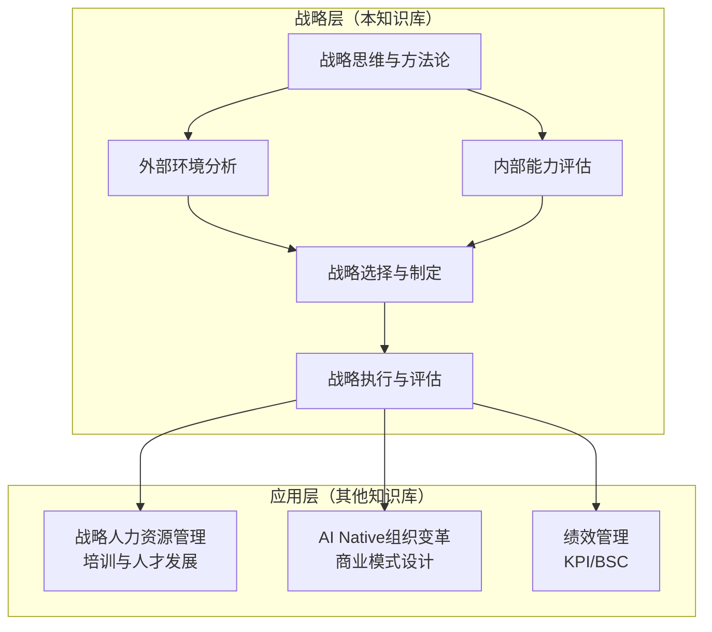
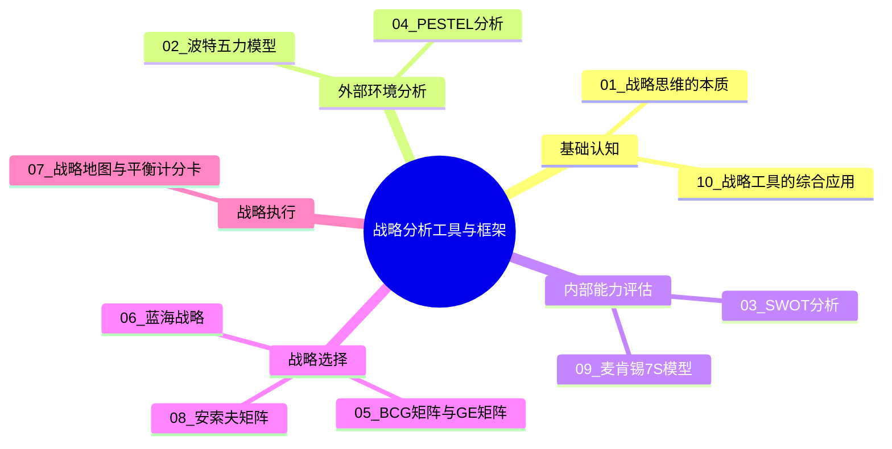
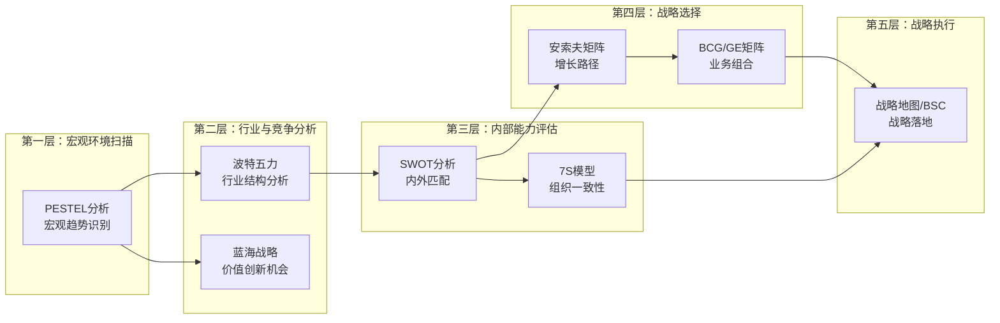

# 战略分析工具与框架中枢

> 本知识库是"战略分析工具与框架"的系统化整理，定位为**战略方法论本身**的深度研究——经典战略分析工具的标准用法、对比、适用场景。

---

## 一、知识库定位与边界

### 1.1 为什么需要这个知识库

在"战略+HR+AI"的知识体系中，[[03-HR人事/培训与人才发展/培训与人才发展_知识库建设方案]] 下的"战略视角"部分（如 [[企业生命周期]]、[[战略人力资源]]、[[不同战略下的人才发展策略]]）是从**HR角度应用战略**。而本知识库聚焦于**战略方法论本身**——即"战略"部分的基础。

### 1.2 知识库边界

| 维度 | 本知识库覆盖 | 不覆盖（由其他知识库负责） |
|------|-------------|--------------------------|
| 战略分析 | 波特五力、PESTEL、SWOT等 | HR角度的战略应用 |
| 战略选择 | 蓝海战略、安索夫矩阵、BCG矩阵 | 具体的人才发展策略 |
| 战略执行 | 战略地图、BSC、7S模型 | 绩效管理操作细节 |
| 方法论 | 工具的标准用法、对比、适用场景 | 组织变革的具体实施 |

### 1.3 核心视角

本知识库坚持三个核心视角：

- **战略视角**：聚焦战略方法论本身，而非某个职能领域的应用
- **HR视角**：关注战略工具如何为HR决策提供依据（如战略人力规划、组织设计）
- **AI视角**：探讨AI时代对这些经典工具的挑战与重塑

---

## 二、知识库结构总览

### 2.1 文档地图

### 2.2 文档清单与学习路径

| 序号 | 文档 | 类型 | 建议阅读顺序 | 核心问题 |
|------|------|------|-------------|---------|
| 00 | [[04-商业与战略/战略分析工具与框架/00_MOC_战略分析工具与框架中枢]] | MOC | 起点 | 这个知识库是什么？ |
| 01 | [[04-商业与战略/战略分析工具与框架/01_战略思维的本质：从做什么到不做什么|战略思维的本质]] | 基础认知 | 第1篇 | 战略到底是什么？ |
| 02 | [[04-商业与战略/战略分析工具与框架/02_波特五力模型：行业结构的分析框架]] | 外部分析 | 第2篇 | 行业吸引力如何？ |
| 03 | [[04-商业与战略/战略分析工具与框架/03_SWOT分析：最被滥用的战略工具]] | 综合分析 | 第3篇 | 我们的优劣势和机会威胁？ |
| 04 | [[04-商业与战略/战略分析工具与框架/04_PESTEL分析：宏观环境的系统扫描]] | 外部分析 | 第4篇 | 宏观环境有哪些趋势？ |
| 05 | [[04-商业与战略/战略分析工具与框架/05_BCG矩阵与GE矩阵：业务组合管理]] | 战略选择 | 第5篇 | 如何管理业务组合？ |
| 06 | [[04-商业与战略/战略分析工具与框架/06_蓝海战略：创造无竞争的市场空间]] | 战略选择 | 第6篇 | 如何找到新市场？ |
| 07 | [[04-商业与战略/战略分析工具与框架/07_战略地图与平衡计分卡：从战略到执行]] | 战略执行 | 第7篇 | 如何将战略落地？ |
| 08 | [[04-商业与战略/战略分析工具与框架/08_安索夫矩阵：增长战略的四种路径]] | 战略选择 | 第8篇 | 如何实现增长？ |
| 09 | [[04-商业与战略/战略分析工具与框架/09_麦肯锡7S模型：组织一致性的诊断框架]] | 内部评估 | 第9篇 | 组织各要素是否一致？ |
| 10 | [[04-商业与战略/战略分析工具与框架/10_战略工具的综合应用：从分析到决策]] | 综合应用 | 第10篇 | 如何组合使用这些工具？ |

---

## 三、战略分析的整体框架

### 3.1 战略分析的"漏斗"模型

战略分析遵循从宏观到微观、从外部到内部、从分析到决策的逻辑流程：

### 3.2 工具的分类矩阵

按分析维度对工具进行分类：

| 工具 | 外部/内部 | 宏观/微观 | 定性/定量 | 战略阶段 |
|------|----------|----------|----------|---------|
| PESTEL | 外部 | 宏观 | 定性为主 | 环境分析 |
| 波特五力 | 外部 | 中观（行业） | 定性+定量 | 行业分析 |
| SWOT | 内外结合 | 综合分析 | 定性为主 | 综合分析 |
| BCG矩阵 | 内部 | 微观（业务） | 定量 | 业务组合 |
| GE矩阵 | 内部 | 微观（业务） | 定量 | 业务组合 |
| 蓝海战略 | 外部 | 中观 | 定性为主 | 战略创新 |
| 安索夫矩阵 | 内外结合 | 综合分析 | 定性为主 | 增长战略 |
| 7S模型 | 内部 | 微观（组织） | 定性为主 | 组织诊断 |
| 战略地图/BSC | 内部 | 微观（组织） | 定量 | 战略执行 |

---

## 四、各工具快速导航

### 4.1 [[04-商业与战略/战略分析工具与框架/01_战略思维的本质：从做什么到不做什么|战略思维的本质]]

**一句话总结**：战略不是"计划"，而是"选择"——选择在哪个战场竞争、如何取胜。

**核心概念**：
- 战略的三层定义：公司战略、业务战略、职能战略
- Richard Rumelt的"好战略"核心理念：诊断、指导方针、协调行动
- 战略与运营的区别：战略是"做正确的事"，运营是"正确地做事"

**与HR的关联**：战略思维决定了HR战略的定位——作为业务伙伴，HR需要理解业务战略才能制定有效的人才战略。

**与AI的关联**：AI正在改变战略决策的方式——从经验驱动到数据驱动，但战略判断力仍是人类的核心优势。

### 4.2 [[04-商业与战略/战略分析工具与框架/02_波特五力模型：行业结构的分析框架]]

**一句话总结**：五种竞争力量共同决定一个行业的利润潜力。

**核心概念**：
- 供应商议价能力、买方议价能力、新进入者威胁、替代品威胁、现有竞争者
- 五力越强，行业利润越低；五力越弱，行业利润越高
- 第六力（互补品）的争议

**与HR的关联**：行业结构决定了人才市场的竞争格局——在五力强的行业，人才获取和保留是关键竞争要素。

**与AI的关联**：AI降低了某些行业的进入壁垒（如AI写作工具对内容行业的冲击），同时增强了替代品威胁。

### 4.3 [[04-商业与战略/战略分析工具与框架/03_SWOT分析：最被滥用的战略工具]]

**一句话总结**：SWOT的核心不是"列四个清单"，而是"交叉分析"——将内部因素与外部因素匹配，生成战略选项。

**核心概念**：
- SO策略（利用优势抓住机会）、WO策略（克服劣势抓住机会）
- ST策略（利用优势规避威胁）、WT策略（减少劣势规避威胁）
- 常见误区：主观、无优先级、缺乏行动导向

**与HR的关联**：SWOT可用于个人职业发展、团队能力诊断、组织人才盘点。

**与AI的关联**：AI可以辅助SWOT分析的数据收集和模式识别，减少主观性。

### 4.4 [[04-商业与战略/战略分析工具与框架/04_PESTEL分析：宏观环境的系统扫描]]

**一句话总结**：PESTEL是对宏观环境六大维度的系统扫描，识别影响组织的关键趋势和驱动因素。

**核心概念**：
- 政治（Political）、经济（Economic）、社会（Social）
- 技术（Technological）、环境（Environmental）、法律（Legal）
- 从"趋势识别"到"情景规划"的进阶应用

**与HR的关联**：PESTEL中的社会趋势（人口结构、工作价值观）和技术趋势（远程办公、自动化）直接影响HR战略。

**与AI的关联**：AI本身就是PESTEL中"T（技术）"维度的核心变量，同时也在影响其他五个维度。

### 4.5 [[04-商业与战略/战略分析工具与框架/05_BCG矩阵与GE矩阵：业务组合管理]]

**一句话总结**：BCG矩阵和GE矩阵是企业级业务组合管理的两大经典工具，帮助组织在多业务间分配资源。

**核心概念**：
- BCG：市场增长率 x 相对市场份额 → 明星/金牛/问题/瘦狗
- GE：行业吸引力 x 业务竞争力 → 九宫格矩阵
- 战略决策：投资/维持/收割/剥离

**与HR的关联**：不同的业务类型需要不同的人才策略——金牛业务需要效率型人才，问题业务需要创新型人才。

**与AI的关联**：AI可以帮助实时评估业务组合，动态调整资源配置。

### 4.6 [[04-商业与战略/战略分析工具与框架/06_蓝海战略：创造无竞争的市场空间]]

**一句话总结**：蓝海战略不是"在现有市场中竞争"，而是"创造新的市场空间，使竞争变得无关紧要"。

**核心概念**：
- 价值曲线（Value Curve）与ERRC四步动作框架
- 消除（Eliminate）、减少（Reduce）、提升（Raise）、创造（Create）
- 六项原则：重建市场边界、注重全局、超越现有需求、遵循合理的战略顺序、克服关键组织障碍、将执行纳入战略

**与HR的关联**：蓝海战略要求组织具备不同的人才组合和能力模型——需要"创业者"而非"管理者"。

**与AI的关联**：AI领域是蓝海战略的典型应用场景——AI产品如何通过价值创新开辟新市场。

### 4.7 [[04-商业与战略/战略分析工具与框架/07_战略地图与平衡计分卡：从战略到执行]]

**一句话总结**：战略地图将战略目标转化为四个维度的因果链，平衡计分卡将其量化为可衡量的KPI。

**核心概念**：
- 战略地图四维度：财务、客户、内部流程、学习与成长
- 因果链：学习与成长 → 内部流程 → 客户 → 财务
- BSC的四个视角的平衡：财务与非财务、短期与长期、领先与滞后、内部与外部

**与HR的关联**：BSC中"学习与成长"维度直接对应人力资源管理——员工能力、信息系统、组织氛围。本知识库从战略角度而非绩效角度写BSC，与 [[03-HR人事/绩效管理/00_MOC_绩效管理中枢]] 中的BSC内容形成互补。

**与AI的关联**：AI可以自动化BSC的数据收集、分析与预警，提高战略执行的透明度。

### 4.8 [[04-商业与战略/战略分析工具与框架/08_安索夫矩阵：增长战略的四种路径]]

**一句话总结**：安索夫矩阵以"产品-市场"两个维度，定义了四种增长战略路径。

**核心概念**：
- 市场渗透（现有产品 × 现有市场）
- 市场开发（现有产品 × 新市场）
- 产品开发（新产品 × 现有市场）
- 多元化（新产品 × 新市场）

**与HR的关联**：不同的增长路径需要不同的组织能力——市场渗透需要效率，多元化需要并购整合能力。

**与AI的关联**：AI产品如何选择增长路径——AI+传统行业是"产品开发"还是"多元化"？

### 4.9 [[04-商业与战略/战略分析工具与框架/09_麦肯锡7S模型：组织一致性的诊断框架]]

**一句话总结**：7S模型强调组织的有效性取决于七个要素之间的"一致性"（alignment），而非单个要素的优劣。

**核心概念**：
- 硬要素：战略（Strategy）、结构（Structure）、制度（Systems）
- 软要素：风格（Style）、人员（Staff）、技能（Skills）、共同价值观（Shared Values）
- 共同价值观是核心，连接所有其他要素

**与HR的关联**：7S中的"人员"和"技能"要素直接对应HR职能——招聘、培训、人才发展。

**与AI的关联**：AI组织变革需要7S各要素的协调一致——技术引入（硬要素）需要文化变革（软要素）的配合。

### 4.10 [[04-商业与战略/战略分析工具与框架/10_战略工具的综合应用：从分析到决策]]

**一句话总结**：单一工具无法完整回答战略问题，需要组合使用多个工具，形成从分析到决策的完整流程。

**核心概念**：
- 战略分析的"漏斗"模型：PESTEL → 五力 → SWOT → 战略选择
- 战略决策的常见偏见：确认偏误、过度自信、锚定效应、从众效应
- 工具组合的原则：互补性、时序性、适用性

**与HR的关联**：战略分析的结果是HR战略制定的输入——HR需要根据业务战略选择配套的人才策略。

**与AI的关联**：AI如何辅助战略分析——数据收集、模式识别、情景模拟、偏见检测。

---

## 五、跨文档主题索引

### 5.1 按战略阶段索引

| 战略阶段 | 相关文档 |
|---------|---------|
| 环境分析 | [[04-商业与战略/战略分析工具与框架/04_PESTEL分析：宏观环境的系统扫描]]、[[04-商业与战略/战略分析工具与框架/02_波特五力模型：行业结构的分析框架]] |
| 内部评估 | [[04-商业与战略/战略分析工具与框架/03_SWOT分析：最被滥用的战略工具]]、[[04-商业与战略/战略分析工具与框架/09_麦肯锡7S模型：组织一致性的诊断框架]] |
| 战略制定 | [[04-商业与战略/战略分析工具与框架/06_蓝海战略：创造无竞争的市场空间]]、[[04-商业与战略/战略分析工具与框架/08_安索夫矩阵：增长战略的四种路径]] |
| 业务组合 | [[04-商业与战略/战略分析工具与框架/05_BCG矩阵与GE矩阵：业务组合管理]] |
| 战略执行 | [[04-商业与战略/战略分析工具与框架/07_战略地图与平衡计分卡：从战略到执行]] |
| 综合 | [[04-商业与战略/战略分析工具与框架/01_战略思维的本质：从做什么到不做什么|战略思维的本质]]、[[04-商业与战略/战略分析工具与框架/10_战略工具的综合应用：从分析到决策]] |

### 5.2 按分析维度索引

| 分析维度 | 相关文档 |
|---------|---------|
| 外部环境 | [[04-商业与战略/战略分析工具与框架/04_PESTEL分析：宏观环境的系统扫描]]、[[04-商业与战略/战略分析工具与框架/02_波特五力模型：行业结构的分析框架]] |
| 内部能力 | [[04-商业与战略/战略分析工具与框架/09_麦肯锡7S模型：组织一致性的诊断框架]] |
| 内外结合 | [[04-商业与战略/战略分析工具与框架/03_SWOT分析：最被滥用的战略工具]] |
| 创新与突破 | [[04-商业与战略/战略分析工具与框架/06_蓝海战略：创造无竞争的市场空间]] |
| 增长与组合 | [[04-商业与战略/战略分析工具与框架/08_安索夫矩阵：增长战略的四种路径]]、[[04-商业与战略/战略分析工具与框架/05_BCG矩阵与GE矩阵：业务组合管理]] |
| 战略落地 | [[04-商业与战略/战略分析工具与框架/07_战略地图与平衡计分卡：从战略到执行]] |

### 5.3 跨知识库链接

| 关联知识库 | 关联内容 | 相关文档 |
|-----------|---------|---------|
| [[03-HR人事/培训与人才发展/培训与人才发展_知识库建设方案]] | 战略视角下的HR策略 | 01、03、07、09 |
| [[02-AI趋势与素养/AI Native组织变革/00_MOC_AI Native组织变革中枢]] | AI时代组织变革方法论 | 02、06、08、10 |
| [[04-商业与战略/商业模式设计与创新/00_MOC_商业模式设计与创新中枢]] | 商业模式与战略的交叉 | 06、08、10 |
| [[03-HR人事/绩效管理/00_MOC_绩效管理中枢]] | BSC从战略视角而非绩效视角 | 07 |
| [[组织发展]] | 组织诊断与变革 | 09 |

---

## 六、使用指南

### 6.1 不同角色的阅读路径

**战略分析师**：
1. [[04-商业与战略/战略分析工具与框架/01_战略思维的本质：从做什么到不做什么|战略思维的本质]] → 建立战略思维
2. [[04-商业与战略/战略分析工具与框架/04_PESTEL分析：宏观环境的系统扫描]] → 宏观扫描
3. [[04-商业与战略/战略分析工具与框架/02_波特五力模型：行业结构的分析框架]] → 行业分析
4. [[04-商业与战略/战略分析工具与框架/03_SWOT分析：最被滥用的战略工具]] → 综合分析
5. [[04-商业与战略/战略分析工具与框架/10_战略工具的综合应用：从分析到决策]] → 工具组合

**HR战略伙伴**：
1. [[04-商业与战略/战略分析工具与框架/01_战略思维的本质：从做什么到不做什么|战略思维的本质]] → 理解战略语言
2. [[04-商业与战略/战略分析工具与框架/03_SWOT分析：最被滥用的战略工具]] → 人才盘点
3. [[04-商业与战略/战略分析工具与框架/09_麦肯锡7S模型：组织一致性的诊断框架]] → 组织诊断
4. [[04-商业与战略/战略分析工具与框架/07_战略地图与平衡计分卡：从战略到执行]] → 战略人力规划
5. [[04-商业与战略/战略分析工具与框架/10_战略工具的综合应用：从分析到决策]] → 综合应用

**创业者/产品经理**：
1. [[04-商业与战略/战略分析工具与框架/01_战略思维的本质：从做什么到不做什么|战略思维的本质]] → 战略选择
2. [[04-商业与战略/战略分析工具与框架/02_波特五力模型：行业结构的分析框架]] → 竞争分析
3. [[04-商业与战略/战略分析工具与框架/06_蓝海战略：创造无竞争的市场空间]] → 价值创新
4. [[04-商业与战略/战略分析工具与框架/08_安索夫矩阵：增长战略的四种路径]] → 增长路径
5. [[04-商业与战略/战略分析工具与框架/10_战略工具的综合应用：从分析到决策]] → 战略决策

### 6.2 常见问题速查

> [!question]- 想快速了解行业竞争格局，应该看哪个工具？
> 首先阅读 [[04-商业与战略/战略分析工具与框架/02_波特五力模型：行业结构的分析框架]]，了解行业结构分析框架。如果行业边界模糊，可以补充 [[04-商业与战略/战略分析工具与框架/06_蓝海战略：创造无竞争的市场空间]] 的视角。

> [!question]- 公司要做年度战略规划，应该按什么顺序使用这些工具？
> 参考 [[04-商业与战略/战略分析工具与框架/10_战略工具的综合应用：从分析到决策]] 中的"漏斗模型"：PESTEL → 五力 → SWOT → 安索夫/BCG → 战略地图/BSC。

> [!question]- SWOT和五力都是分析工具，有什么区别？
> SWOT是内外结合的综合分析，五力专注外部行业结构。详细对比见 [[04-商业与战略/战略分析工具与框架/03_SWOT分析：最被滥用的战略工具]] 和 [[04-商业与战略/战略分析工具与框架/02_波特五力模型：行业结构的分析框架]]。

> [!question]- 蓝海战略和波特五力矛盾吗？
> 不矛盾。五力描述"现有竞争格局"，蓝海战略提供"跳出竞争"的方法论。两者互补，详见 [[04-商业与战略/战略分析工具与框架/06_蓝海战略：创造无竞争的市场空间]]。

> [!question]- BSC和OKR有什么区别？
> BSC是战略执行框架，OKR是目标管理工具。BSC确保"做正确的事"，OKR确保"正确地做事"。参见 [[04-商业与战略/战略分析工具与框架/07_战略地图与平衡计分卡：从战略到执行]]。

> [!question]- 这些工具在AI时代还适用吗？
> 核心逻辑仍然适用，但应用方式和数据基础发生了变化。每个文档的"AI时代适用性"部分有详细讨论。综合视角见 [[04-商业与战略/战略分析工具与框架/10_战略工具的综合应用：从分析到决策]]。

---

## 七、维护日志

| 日期 | 更新内容 | 更新人 |
|------|---------|--------|
| 2026-07-27 | 创建MOC中枢，定义知识库结构 | - |
| 2026-07-27 | 创建全部10篇内容文档 | - |

---

## 八、待扩展主题

> [!info]- 未来可扩展的战略主题
> - **核心竞争力理论**（Prahalad & Hamel）：从资源基础观（RBV）到动态能力
> - **颠覆性创新理论**（Christensen）：低端颠覆与新市场颠覆
> - **平台战略**：网络效应、多边市场、平台生态系统
> - **情景规划**（Scenario Planning）：不确定环境下的战略选择
> - **战略节奏理论**：战略与市场节奏的匹配
> - **商业模式画布**（Business Model Canvas）：战略与商业模式的连接
> - **OKR与战略执行**：目标管理如何支撑战略落地
> - **设计思维与战略创新**：以用户为中心的战略设计

---

> [!quote] 核心引用
> "战略的本质是选择——选择做什么，更重要的是选择不做什么。" —— Michael Porter
>
> "好战略不是目标清单，而是一套协调的行动方案。" —— Richard Rumelt
>
> "战略不是规划未来，而是规划现在的行动以创造未来。" —— Peter Drucker