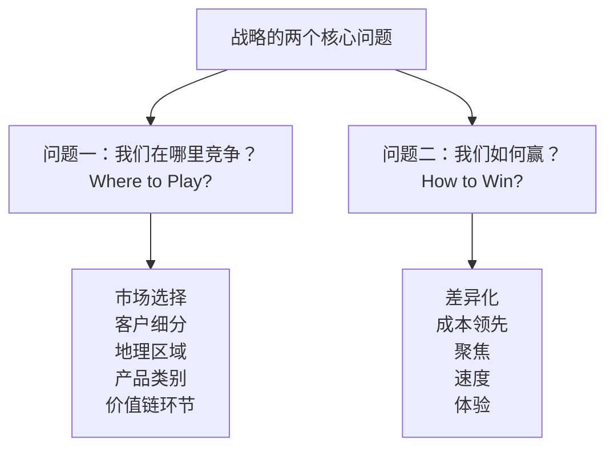
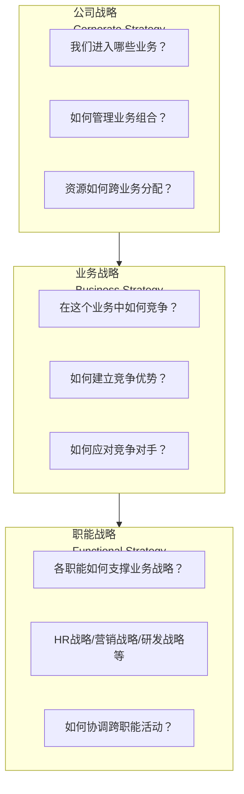
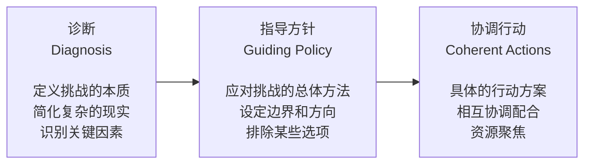
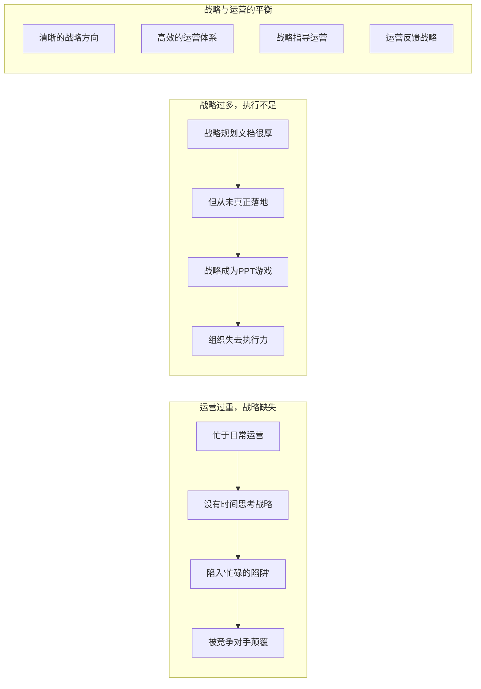
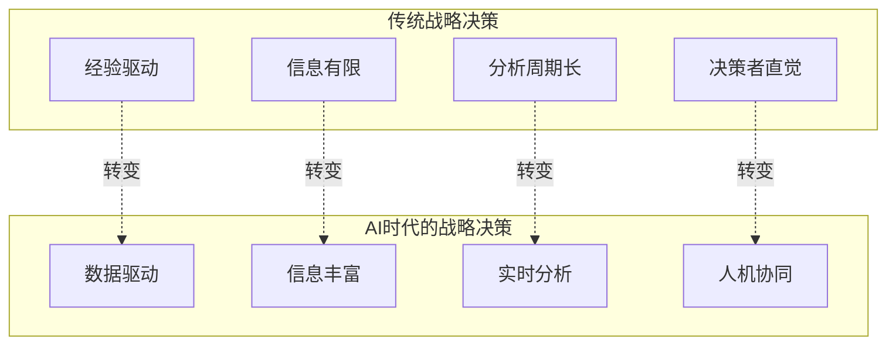

# 战略思维的本质：从"做什么"到"不做什么"

> 战略不是"计划"，而是"选择"——选择在哪个战场竞争，选择如何取胜，更重要的是选择不做什么。

---

## 一、引子：为什么我们需要重新理解"战略"

### 1.1 "战略"这个词已经被用滥了

在商业世界中，"战略"可能是被滥用最严重的词之一。我们看到：

- "我们的战略是今年增长30%" —— 这是目标，不是战略
- "我们的战略是提升客户满意度" —— 这是愿景，不是战略
- "我们的战略是数字化转型" —— 这是举措，不是战略
- "我们的战略是降本增效" —— 这是运营优化，不是战略

> [!warning] 战略不是......
> - **战略不是目标**：目标是"我们要到达哪里"，战略是"我们如何到达那里"
> - **战略不是愿景**：愿景是"我们想成为什么"，战略是"我们选择怎么做"
> - **战略不是运营**：运营是"正确地做事"，战略是"做正确的事"
> - **战略不是计划清单**：战略不是"要做的事情列表"，而是"一套协调的行动方案"

### 1.2 战略的核心问题

战略回答两个根本问题：

这两个问题看似简单，但大多数组织在战略制定时，第一个问题（"哪里竞争"）往往被跳过，直接进入第二个问题（"如何赢"）。而实际上，**选择战场往往比选择战术更重要**。

---

## 二、战略的层次：从公司到职能

### 2.1 战略的三个层次

### 2.2 三层战略的详细说明

#### 公司战略（Corporate Strategy）

公司战略回答"我们是谁"和"我们做什么业务"的问题。

**核心决策**：
- 业务组合选择：进入哪些行业，退出哪些行业
- 资源配置：资金、人才、管理注意力如何分配
- 协同效应：不同业务之间如何创造价值（如共享客户、技术、品牌）
- 公司边界：哪些活动自己做，哪些外包

**典型工具**：[[04-商业与战略/战略分析工具与框架/05_BCG矩阵与GE矩阵：业务组合管理]]、[[04-商业与战略/战略分析工具与框架/08_安索夫矩阵：增长战略的四种路径]]

#### 业务战略（Business Strategy）

业务战略回答"在特定业务中如何竞争并取胜"的问题。

**核心决策**：
- 竞争定位：成本领先、差异化还是聚焦
- 目标客户：服务哪些客户，不服务哪些客户
- 价值主张：我们提供什么独特价值
- 核心活动：价值链上的关键活动是什么

**典型工具**：[[04-商业与战略/战略分析工具与框架/02_波特五力模型：行业结构的分析框架]]、[[04-商业与战略/战略分析工具与框架/06_蓝海战略：创造无竞争的市场空间]]

#### 职能战略（Functional Strategy）

职能战略回答"各职能如何支撑业务战略"的问题。

**核心决策**：
- HR战略：如何获取、发展和保留支撑战略的人才
- 营销战略：品牌定位、渠道策略、定价策略
- 研发战略：技术路线、创新方向、研发投入
- 运营战略：供应链、生产、质量、效率

**与HR战略的关联**：参见 [[03-HR人事/培训与人才发展/培训与人才发展_知识库建设方案]] 中的"战略视角"部分，包括 [[战略人力资源]]、[[不同战略下的人才发展策略]]。

### 2.3 战略层次的一致性

> [!important] 战略一致性的关键原则
> 三层战略必须保持**一致性**（Alignment）和**连贯性**（Coherence）。如果公司战略说"要成为创新领导者"，但业务战略选择"成本领先"，职能战略又强调"流程标准化"，那么战略就是不一致的，注定失败。

---

## 三、好战略与坏战略：Rumelt的经典框架

### 3.1 Richard Rumelt与《好战略，坏战略》

Richard Rumelt是UCLA Anderson管理学院教授，被誉为"战略大师中的战略大师"。他的著作《Good Strategy, Bad Strategy》（《好战略，坏战略》）是战略领域最重要的当代著作之一。

### 3.2 坏战略的四个特征

Rumelt指出，坏战略不是"没有战略"，而是具有以下四个特征：

| 特征 | 说明 | 示例 |
|------|------|------|
| **空话**（Fluff） | 用华丽的辞藻掩盖缺乏实质内容 | "我们的战略是成为世界一流的XX企业" |
| **不能直面挑战**（Failure to Face the Challenge） | 没有识别和定义真正的战略问题 | 把"需要增长"定为战略，但没分析为什么增长停滞 |
| **把目标误认为战略**（Mistaking Goals for Strategy） | 列出一堆目标，但没有达成目标的路径 | "我们要成为市场第一、客户满意度第一、员工满意度第一" |
| **糟糕的战略目标**（Bad Strategic Objectives） | 目标要么不切实际，要么无法指导行动 | 把"提升市场份额"作为唯一目标，不考虑利润 |

> [!warning] 坏战略的典型信号
> 当你听到以下表述时，很可能遇到了坏战略：
> - "我们要成为行业领导者"（然后呢？怎么做到？）
> - "我们的战略是数字化转型"（所有公司都在数字化，这不算战略）
> - "我们的战略是降本增效"（这是运营，不是战略）
> - "我们要做ABCDEFG......"（什么都想做，等于什么都没选）

### 3.3 好战略的"核心理念"（Kernel）

Rumelt提出，好战略包含三个核心要素，他称之为"核心理念"（The Kernel of Good Strategy）：

#### 要素一：诊断（Diagnosis）

诊断是对组织面临的挑战的清晰定义。一个好的诊断：

- **简化复杂的现实**：不是罗列所有问题，而是识别最关键的那个
- **定义挑战的本质**：不是现象描述，而是根因分析
- **提供行动方向**：好的诊断本身就暗示了解决方向

**示例**：
- 坏诊断："我们面临激烈的市场竞争"
- 好诊断："我们的核心问题是产品同质化——客户无法区分我们和竞争对手，导致价格战和利润侵蚀"

#### 要素二：指导方针（Guiding Policy）

指导方针是应对挑战的总体方法和原则。一个好的指导方针：

- **设定方向**：明确我们朝哪个方向走
- **设定边界**：明确我们不做什么（这和"做什么"同样重要）
- **创造优势**：不是"努力做得更好"，而是"用不同的方式做"

**示例**：
- 坏指导方针："我们要通过创新和客户服务来实现增长"
- 好指导方针："我们将聚焦于中小企业市场，通过极简的SaaS产品替代复杂的本地部署方案，让客户在5分钟内完成上手"

#### 要素三：协调行动（Coherent Actions）

协调行动是将指导方针转化为具体的、相互配合的行动方案。好的协调行动：

- **具体可执行**：不是"加强研发"，而是"在Q3前完成X产品的Y功能"
- **相互协调**：不同行动之间不是孤立的，而是形成合力
- **资源聚焦**：不是分散资源，而是集中力量办大事

> [!tip] 好战略的检验标准
> 问自己三个问题：
> 1. 如果换一个人/团队，他们能根据这个战略做出同样的日常决策吗？
> 2. 这个战略能帮助团队对某些机会说"不"吗？
> 3. 这个战略指明了我们"不做什么"吗？

### 3.4 好战略的"聚焦"原则

Rumelt特别强调"聚焦"（Focus）的重要性。好战略不是"做更多"，而是"做更少但更好"。

> [!quote]
> "好战略的核心是聚焦——用有限的资源在最关键的地方创造不对称优势。" —— Richard Rumelt

**聚焦的三层含义**：
1. **资源聚焦**：不把资源均匀分配，而是在关键点集中投入
2. **决策聚焦**：不是"什么都可以做"，而是明确"什么不做"
3. **行动聚焦**：不是多个独立行动，而是一套协调的行动

---

## 四、战略与运营的区别

### 4.1 战略与运营的核心区别

| 维度 | 战略 | 运营 |
|------|------|------|
| 核心问题 | 做正确的事 | 正确地做事 |
| 时间视野 | 中长期（3-5年及以上） | 短期（1年以内） |
| 关注点 | 有效性（Effectiveness） | 效率（Efficiency） |
| 决策类型 | 不可逆的重大决策 | 可逆的日常决策 |
| 风险 | 战略性风险（选错方向） | 运营性风险（执行不到位） |
| 衡量标准 | 竞争优势、市场份额、利润率 | 成本、效率、质量、速度 |
| 变化频率 | 低频（几年一次） | 高频（持续改进） |

### 4.2 战略与运营的"跷跷板"

许多组织在战略和运营之间存在失衡：

### 4.3 战略必须通过运营实现

> [!important] 战略与运营的关系
> 战略和运营不是对立的，而是互补的。战略决定"做什么"，运营确保"做到位"。没有战略的运营是盲目的，没有运营的战略是空洞的。

这就是为什么 [[04-商业与战略/战略分析工具与框架/07_战略地图与平衡计分卡：从战略到执行]] 如此重要——它提供了连接战略与运营的桥梁。

---

## 五、战略思维在HR领域的应用

### 5.1 从"HR战略"到"战略HR"

在 [[03-HR人事/培训与人才发展/培训与人才发展_知识库建设方案]] 和 [[战略人力资源]] 中，我们讨论了HR如何支持业务战略。这里从相反角度思考：**战略思维如何重塑HR工作**。

| 传统HR思维 | 战略HR思维 |
|-----------|-----------|
| "我们需要招聘多少人" | "我们需要什么样的人来支撑战略" |
| "培训需求是什么" | "什么能力差距阻碍了战略执行" |
| "员工满意度如何" | "员工能力与战略要求匹配吗" |
| "薪酬是否有竞争力" | "我们的激励体系是否驱动了正确的行为" |

### 5.2 战略思维在人才发展中的应用

参照 [[不同战略下的人才发展策略]]，不同战略需要不同的人才策略：

| 战略类型 | 人才需求 | 发展策略 |
|---------|---------|---------|
| 成本领先 | 效率型人才 | 流程优化、标准化培训 |
| 差异化 | 创新型人才 | 创造力培养、跨领域学习 |
| 聚焦 | 专家型人才 | 深度专业发展、领域深耕 |
| 蓝海战略 | 创业型人才 | 探索能力、容错文化 |

---

## 六、AI时代的战略思维

### 6.1 AI如何改变战略决策

### 6.2 AI在战略分析中的角色

| AI的能力 | 对战略思维的增强 | 局限 |
|---------|----------------|------|
| 海量数据处理 | 识别人类难以发现的模式 | 数据质量决定分析质量 |
| 情景模拟 | 快速测试多种战略假设 | 模型假设可能偏离现实 |
| 趋势预测 | 基于数据的趋势外推 | 无法预测黑天鹅事件 |
| 模式识别 | 发现竞争格局变化信号 | 相关不等于因果 |
| 自动化分析 | 将分析师从重复劳动中解放 | 战略判断力仍需人类 |

> [!important] 战略判断力仍是人类的核心优势
> AI可以增强战略分析的数据基础，但**战略判断力**——在不确定环境中做出选择、在相互冲突的价值观中权衡、在信息不完整时做出决策——仍然是人类的核心优势。AI是战略分析的工具，不是战略决策的替代者。

### 6.3 与相关主题的关联

- [[02-AI趋势与素养/AI Native组织变革/00_MOC_AI Native组织变革中枢]]：AI如何重塑组织的战略制定方式
- [[04-商业与战略/商业模式设计与创新/00_MOC_商业模式设计与创新中枢]]：AI如何创造新的商业模式和战略选择
- [[04-商业与战略/战略分析工具与框架/10_战略工具的综合应用：从分析到决策]]：AI如何辅助战略分析全流程

---

## 七、常见误区与澄清

> [!warning]- 误区一：战略就是长期规划
> 在快速变化的环境中，长期规划越来越不可靠。战略不是"预测未来"，而是"为不确定的未来做准备"。好的战略应该包含灵活性和适应性，而非僵化的五年计划。

> [!warning]- 误区二：战略就是SWOT+五力分析
> 战略工具是分析手段，不是战略本身。很多组织做了详细的SWOT和五力分析，但最终生成的"战略"只是一堆分析的总结，缺乏真正的选择和聚焦。

> [!warning]- 误区三：战略是高层的事，与执行层无关
> 战略如果只停留在董事会，就只是纸上谈兵。战略需要被翻译为每个层级、每个团队的具体行动。参见 [[04-商业与战略/战略分析工具与框架/07_战略地图与平衡计分卡：从战略到执行]]。

> [!warning]- 误区四：好战略=好结果
> 战略和结果之间存在太多变量（执行、运气、环境变化）。评判战略好坏的标准是"决策过程是否严谨"，而非"结果是否理想"。好战略可能因为不可控因素而失败，坏战略可能因为运气好而成功。

---

## 八、总结：战略思维的五个核心原则

1. **选择优先于计划**：战略首先是一系列选择（在哪里竞争、如何赢、不做什么），其次才是计划

2. **聚焦优先于全面**：好战略不是"什么都做"，而是"在关键点集中资源，创造不对称优势"

3. **诊断优先于方案**：在提解决方案之前，先确保真正理解了问题的本质

4. **一致性优先于最优性**：战略的各要素必须相互协调一致，比单个要素的最优更重要

5. **行动优先于文档**：战略的价值在于指导行动，而非成为漂亮的PPT

---

## 九、延伸阅读

- [[04-商业与战略/战略分析工具与框架/00_MOC_战略分析工具与框架中枢]]：返回知识库中枢
- [[04-商业与战略/战略分析工具与框架/02_波特五力模型：行业结构的分析框架]]：理解行业竞争结构
- [[04-商业与战略/战略分析工具与框架/03_SWOT分析：最被滥用的战略工具]]：SWOT的正确用法
- [[04-商业与战略/战略分析工具与框架/10_战略工具的综合应用：从分析到决策]]：如何组合使用战略工具
- Rumelt, R. (2011). *Good Strategy, Bad Strategy: The Difference and Why It Matters*. Crown Business.
- Porter, M. (1996). "What Is Strategy?" *Harvard Business Review*.

---

> [!quote] 核心引用
> "战略的本质是选择——选择做什么，更重要的是选择不做什么。" —— Michael Porter
>
> "好战略的核心是聚焦——用有限的资源在最关键的地方创造不对称优势。" —— Richard Rumelt