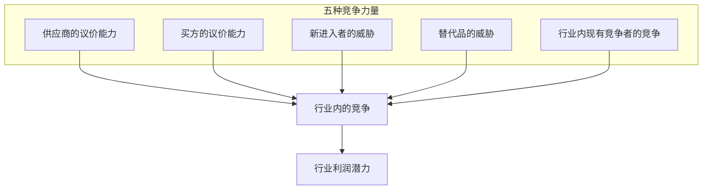
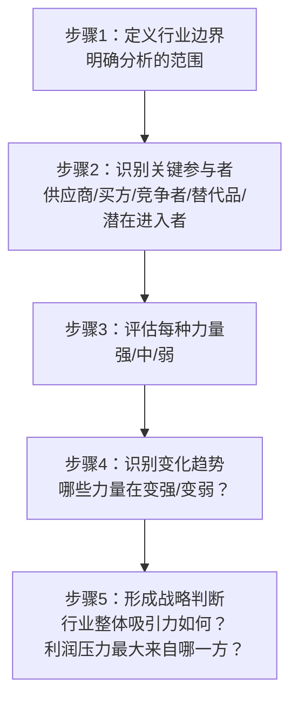
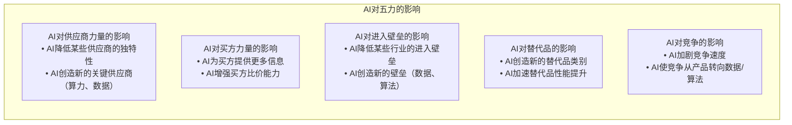

# 波特五力模型：行业结构的分析框架

> 五种竞争力量共同决定一个行业的利润潜力——五力越强，行业利润越低；五力越弱，行业利润越高。

---

## 一、引子：为什么行业利润差异如此巨大

### 1.1 一个核心问题

为什么航空业全球总利润长期低于可口可乐一家的利润？为什么软件行业的利润率远高于制造业？

Michael Porter在1979年提出的五力模型给出了答案：**行业结构决定行业利润**。不是"好公司"和"坏公司"的区别，而是"好行业"和"坏行业"的区别。

### 1.2 五力模型的核心逻辑

> [!important] 核心命题
> 行业结构决定了谁能获取价值。五力模型的本质是**价值分配**分析——行业创造的总价值中，有多少被供应商拿走，多少被买方拿走，多少被竞争者"竞争掉"，多少留给行业内的企业。

---

## 二、五力详解

### 2.1 第一力：供应商的议价能力（Bargaining Power of Suppliers）

**核心问题**：供应商能否抬高价格或降低质量，从而挤压行业利润？

**供应商议价能力强的条件**：

| 条件 | 说明 | 示例 |
|------|------|------|
| 供应商集中度高 | 少数供应商主导市场 | 芯片制造（台积电）、操作系统（微软） |
| 转换成本高 | 更换供应商代价大 | 企业软件（SAP）、航空发动机 |
| 供应商可以前向整合 | 供应商可能进入你的行业 | 大型零售商推出自有品牌 |
| 产品差异化强 | 供应商产品独特，难以替代 | 专利药品、品牌组件 |
| 行业不是供应商的重要客户 | 供应商不在乎失去你这个客户 | 小型食品企业vs大型超市 |

**应对策略**：
- 后向整合（自己生产原材料）
- 多元化供应商
- 标准化采购规格，降低转换成本
- 与供应商建立战略合作关系

### 2.2 第二力：买方的议价能力（Bargaining Power of Buyers）

**核心问题**：买方能否压低价格或要求更高品质，从而挤压行业利润？

**买方议价能力强的条件**：

| 条件 | 说明 | 示例 |
|------|------|------|
| 买方集中度高 | 少数大客户占很大比例 | 车企对零部件供应商 |
| 产品标准化 | 买方可以轻易找到替代品 | 大宗商品、标准件 |
| 转换成本低 | 买方可以轻松换供应商 | 快消品、标准化服务 |
| 买方可以后向整合 | 买方可能自己生产 | 大型零售商推出自有品牌 |
| 买方对价格敏感 | 产品占买方成本比例大 | 原材料采购 |

**应对策略**：
- 差异化产品，降低可替代性
- 提高转换成本（如会员体系、生态锁定）
- 拓展客户群，降低单一客户依赖
- 前向整合（自己接触终端客户）

### 2.3 第三力：新进入者的威胁（Threat of New Entrants）

**核心问题**：新企业能否轻易进入行业，增加竞争，降低利润？

**进入壁垒的高低决定新进入者威胁的大小**：

| 进入壁垒 | 说明 | 示例 |
|---------|------|------|
| 规模经济 | 新进入者需要大规模才能有成本优势 | 汽车制造、半导体 |
| 产品差异化 | 现有品牌已经建立了客户忠诚度 | 奢侈品、饮料 |
| 资本需求 | 进入需要大量初始投资 | 航空、电信、能源 |
| 转换成本 | 客户转向新供应商的成本 | 企业软件、银行 |
| 分销渠道获取 | 已有渠道被现有企业占据 | 零售货架、应用商店 |
| 政府政策 | 牌照、专利、法规限制 | 制药、金融、电信 |
| 与规模无关的成本优势 | 学习曲线、专有技术、地理位置 | 精密制造、矿产资源 |

> [!tip] 进入壁垒的动态性
> 进入壁垒不是一成不变的。技术变革（如云计算降低了IT创业的资本需求）、监管变化（如行业开放）、商业模式创新（如共享经济绕过传统壁垒）都可能改变进入壁垒的高度。

### 2.4 第四力：替代品的威胁（Threat of Substitutes）

**核心问题**：其他行业的产品或服务能否替代本行业的产品，从而限制行业定价？

**替代品威胁的两个关键维度**：

1. **相对性价比**：替代品的性能-价格比是否优于本行业产品
2. **转换倾向**：买方转向替代品的意愿和能力

**判断替代品威胁的要点**：

| 高威胁情景 | 低威胁情景 |
|-----------|-----------|
| 替代品性能接近，价格更低 | 替代品性能明显不足 |
| 转换成本低 | 转换成本高 |
| 替代品行业利润率高，有降价空间 | 替代品行业利润微薄 |
| 替代品正在快速改进 | 替代品改进缓慢 |

**经典案例**：
- 视频会议对商务旅行的替代（Zoom vs 航空）
- 流媒体对有线电视的替代（Netflix vs 传统电视）
- 电子书对纸质书的替代（Kindle vs 印刷）

> [!important] 替代品与竞争者的区别
> 替代品来自**不同行业**，但它们满足的是**相同的客户需求**。分析替代品的关键不是看"产品是否相似"，而是看"是否解决同一个问题"。

### 2.5 第五力：行业内现有竞争者的竞争（Rivalry Among Existing Competitors）

**核心问题**：现有企业之间的竞争有多激烈？竞争的形式是什么？

**竞争激烈的条件**：

| 条件 | 说明 |
|------|------|
| 竞争者众多且势均力敌 | 没有明确的领导者，竞争无序 |
| 行业增长缓慢 | 增长只能来自抢夺对手份额 |
| 固定成本高 | 企业被迫满负荷运转，容易引发价格战 |
| 产品缺乏差异化 | 客户主要基于价格选择 |
| 退出壁垒高 | 企业无法轻易退出，被迫继续竞争 |
| 产能大幅增加 | 供过于求，价格下行 |

**竞争的形式**：
- 价格竞争（最破坏利润的形式）
- 广告战
- 产品创新
- 服务改善
- 客户体验升级

> [!warning] 价格竞争是最危险的竞争形式
> 价格竞争直接侵蚀利润，而且很容易被竞争对手模仿。非价格竞争（创新、服务、品牌）虽然也需要投入，但能创造更持久的竞争优势。

---

## 三、五力模型的应用方法

### 3.1 标准分析流程

### 3.2 五力评估表

| 力量 | 强度评估 | 关键驱动因素 | 趋势（变强/变弱） |
|------|---------|-------------|-----------------|
| 供应商议价能力 | 强/中/弱 | | |
| 买方议价能力 | 强/中/弱 | | |
| 新进入者威胁 | 高/中/低 | | |
| 替代品威胁 | 高/中/低 | | |
| 现有竞争 | 激烈/中等/温和 | | |

### 3.3 五力分析的战略启示

| 五力状况 | 战略含义 |
|---------|---------|
| 供应商强 | 考虑后向整合、多元化供应、建立战略合作 |
| 买方强 | 差异化产品、提高转换成本、选择有利的买方 |
| 进入壁垒低 | 构建壁垒、利用先发优势、规模经济 |
| 替代品威胁高 | 提高性能/降低价格、拥抱替代技术 |
| 竞争激烈 | 差异化、并购整合、寻找利基市场 |

---

## 四、五力模型的局限

### 4.1 六大主要局限

> [!warning]- 局限一：静态分析
> 五力模型是某一时点的"快照"，但行业结构是动态变化的。技术、政策、消费者偏好的变化可能迅速改变行业格局。

> [!warning]- 局限二：假设行业边界清晰
> 在平台经济、跨界竞争、生态竞争的今天，行业边界越来越模糊。一个社交平台可能同时是媒体公司、广告公司、支付公司。

> [!warning]- 局限三：忽视合作与互补
> 五力模型假设零和博弈，但实际上行业参与者之间也存在合作。互补品（如软件之于硬件）的角色被低估。

> [!warning]- 局限四：忽视内部差异
> 五力模型分析的是行业平均利润率，但同一行业内不同企业的利润差异可能很大。战略定位和执行力同样重要。

> [!warning]- 局限五：忽视创新与颠覆
> 五力模型擅长分析现有竞争格局，但不擅长预测颠覆性创新。Netflix、Airbnb、Uber在传统五力分析中可能被低估。

> [!warning]- 局限六：第六力的争议
> 许多学者提出应加入"互补品"（Complementors）作为第六力。互补品的存在可以增加行业价值，但其缺失也可能限制行业发展。

### 4.2 弥补五力局限的补充工具

| 五力局限 | 补充工具 | 参考文档 |
|---------|---------|---------|
| 静态分析 | 情景规划、动态竞争分析 | [[04-商业与战略/战略分析工具与框架/04_PESTEL分析：宏观环境的系统扫描]] |
| 行业边界模糊 | 蓝海战略、生态系统分析 | [[04-商业与战略/战略分析工具与框架/06_蓝海战略：创造无竞争的市场空间]] |
| 忽视内部差异 | SWOT分析、资源基础观 | [[04-商业与战略/战略分析工具与框架/03_SWOT分析：最被滥用的战略工具]] |
| 忽视创新 | 颠覆性创新理论 | [[04-商业与战略/战略分析工具与框架/10_战略工具的综合应用：从分析到决策]] |

---

## 五、五力模型在AI时代的适用性

### 5.1 AI如何改变五力格局

### 5.2 AI时代的行业结构变化

| 五力 | 传统行业 | AI时代的行业 |
|------|---------|-------------|
| 供应商 | 原材料、劳动力 | 数据、算力、算法人才 |
| 买方 | 价格敏感、信息不对称 | 信息透明、个性化需求 |
| 进入壁垒 | 规模经济、资本 | 数据网络效应、算法壁垒 |
| 替代品 | 物理替代品 | AI驱动的数字替代品 |
| 竞争 | 基于价格和产品 | 基于数据和生态系统 |

### 5.3 与相关主题的关联

- [[02-AI趋势与素养/AI Native组织变革/00_MOC_AI Native组织变革中枢]]：AI如何重塑行业结构和组织形态
- [[04-商业与战略/战略分析工具与框架/06_蓝海战略：创造无竞争的市场空间]]：AI创造新市场空间的机会
- [[04-商业与战略/战略分析工具与框架/10_战略工具的综合应用：从分析到决策]]：AI辅助五力分析

---

## 六、常见误区

> [!warning]- 误区一：五力=行业分析的全部
> 五力是行业结构分析的工具，但不是行业分析的全部。还要考虑行业生命周期、技术进步、监管环境等因素。参见 [[04-商业与战略/战略分析工具与框架/04_PESTEL分析：宏观环境的系统扫描]]。

> [!warning]- 误区二：五力弱=好行业，五力强=坏行业
> 五力强弱是相对的，还要看企业自身的应对能力。在一个五力强的行业，拥有独特竞争优势的企业仍能获得超额利润。

> [!warning]- 误区三：五力分析做一次就够了
> 行业结构是动态的，五力分析应该定期更新。尤其是技术变革、监管变化、新进入者出现的时期。

---

## 七、总结

波特五力模型的核心价值在于提供一个**结构化的行业分析框架**，帮助战略制定者：

1. **理解利润来源**：不是"我们做得好不好"，而是"这个行业能不能赚钱"
2. **识别关键压力**：五种力量中，哪一种是行业利润的最大威胁
3. **制定应对策略**：如何改变行业结构，或选择有利的定位
4. **预测行业演变**：哪些力量在变强/变弱，行业利润趋势如何

---

## 八、延伸阅读

- [[04-商业与战略/战略分析工具与框架/00_MOC_战略分析工具与框架中枢]]：返回知识库中枢
- [[04-商业与战略/战略分析工具与框架/03_SWOT分析：最被滥用的战略工具]]：内外结合的综合分析
- [[04-商业与战略/战略分析工具与框架/04_PESTEL分析：宏观环境的系统扫描]]：宏观环境扫描
- [[04-商业与战略/战略分析工具与框架/06_蓝海战略：创造无竞争的市场空间]]：跳出竞争，创造新市场
- Porter, M. (1979). "How Competitive Forces Shape Strategy." *Harvard Business Review*.
- Porter, M. (1980). *Competitive Strategy: Techniques for Analyzing Industries and Competitors*. Free Press.

---

> [!quote] 核心引用
> "五种竞争力量的合力决定了行业长期的利润潜力。" —— Michael Porter
>
> "战略定位的本质是选择与竞争对手不同的活动，以提供独特的价值组合。" —— Michael Porter

---

## 九、实战案例：用五力分析电商行业

### 9.1 电商行业五力分析

以中国电商行业为例，演示五力模型的实际应用：

| 力量 | 强度 | 关键驱动因素 |
|------|------|-------------|
| 供应商议价能力 | 中-弱 | 供应商分散，平台占据流量入口，但头部品牌有一定议价权 |
| 买方议价能力 | 强 | 比价成本极低，转换成本几乎为零，消费者价格敏感度高 |
| 新进入者威胁 | 中 | 平台侧进入壁垒高（网络效应+资本），但垂直领域有空间 |
| 替代品威胁 | 中-强 | 社交电商、直播电商、线下零售、品牌DTC都在替代传统电商 |
| 现有竞争 | 极强 | 价格战常态化，补贴竞争激烈，市场份额争夺白热化 |

### 9.2 五力分析的战略启示

从电商行业五力分析可以得出：

1. **行业利润被严重压缩**：买方强+竞争激烈+替代品多，导致平台利润率承压
2. **差异化是出路**：单纯的价格战无法持续，需要通过会员体系、内容生态、供应链优势建立壁垒
3. **纵向整合降低供应商力量**：大型平台通过自有品牌、C2M模式削弱供应商议价能力
4. **提高转换成本**：通过会员体系、积分系统、生态捆绑降低买方议价能力

---

## 十、五力分析的自检清单

进行五力分析时，请逐项确认：

- [ ] 行业边界是否定义清晰？是否考虑了跨界竞争？
- [ ] 每种力量的分析是否有数据支撑，而非仅凭直觉？
- [ ] 是否识别了每种力量中的关键驱动因素？
- [ ] 是否评估了各力量的动态变化趋势（变强/变弱）？
- [ ] 是否考虑了互补品（第六力）的影响？
- [ ] 分析结果是否转化为具体的战略行动建议？
- [ ] 是否与其他工具（PESTEL、SWOT）联动使用？

> [!tip] 五力分析的质量标准
> 一个好的五力分析应该能够回答："如果我是这个行业的CEO，我会把最担心哪一种力量？为什么？我打算如何应对？"