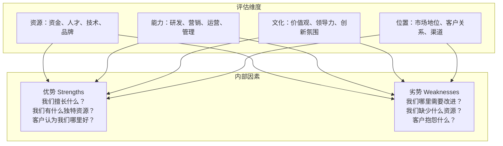
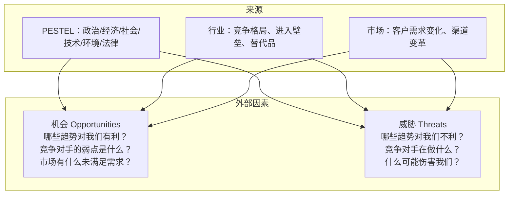
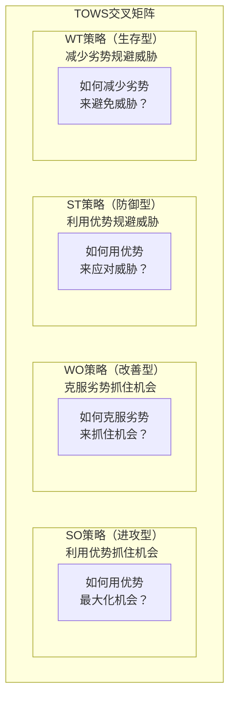
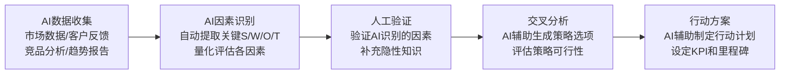
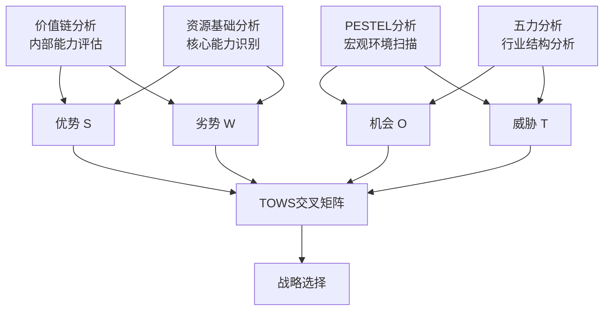

# SWOT分析：最被滥用的战略工具

> SWOT的核心不是"列四个清单"，而是"交叉分析"——将内部因素与外部因素匹配，生成战略选项。

---

## 一、引子：SWOT为什么被滥用

### 1.1 SWOT的"普及"与"滥用"

SWOT分析可能是全球使用最广泛的战略工具，也是最被滥用的工具。很多组织做过SWOT分析，但大多数只是"列四个清单"：

> **典型的"坏SWOT"**：
> - S（优势）：品牌知名度高、团队经验丰富、技术能力强
> - W（劣势）：预算有限、流程不够完善、人才梯队薄弱
> - O（机会）：市场增长迅速、政策利好、新技术出现
> - T（威胁）：竞争加剧、成本上升、人才流失

> 然后呢？没有然后了。这就是"坏SWOT"——四个清单列完，工作就结束了。

### 1.2 SWOT的正确打开方式

> [!important] SWOT的核心是"交叉分析"
> SWOT的价值不在于"列出四要素"，而在于**将内部因素（S/W）与外部因素（O/T）进行交叉匹配**，生成四种战略选项：
> - **SO策略**：利用优势抓住机会（进攻型）
> - **WO策略**：克服劣势抓住机会（改善型）
> - **ST策略**：利用优势规避威胁（防御型）
> - **WT策略**：减少劣势规避威胁（生存型）

---

## 二、SWOT的四要素详解

### 2.1 内部因素：优势（Strengths）与劣势（Weaknesses）

**评估内部因素的关键原则**：

1. **相对于竞争对手**：优势不是"我们有什么"，而是"我们比竞争对手好在哪里"
2. **基于事实而非感觉**：用数据说话，不要主观臆断
3. **聚焦关键因素**：不是所有因素都同等重要，找出3-5个关键因素

### 2.2 外部因素：机会（Opportunities）与威胁（Threats）

**评估外部因素的关键原则**：

1. **区分趋势与事件**：趋势是长期的、方向性的（如人口老龄化），事件是一次性的（如某个竞争对手倒闭）
2. **评估概率与影响**：不是所有机会和威胁都同等重要
3. **与PESTEL和五力联动**：外部因素通常来自PESTEL和五力分析，参见 [[04-商业与战略/战略分析工具与框架/04_PESTEL分析：宏观环境的系统扫描]] 和 [[04-商业与战略/战略分析工具与框架/02_波特五力模型：行业结构的分析框架]]

---

## 三、SWOT的核心：交叉分析（TOWS矩阵）

### 3.1 交叉分析的逻辑

SWOT的真正价值在于将四个要素两两组合，生成四种战略方向：

### 3.2 四种策略的详细说明

#### SO策略（优势-机会）：进攻型

**核心逻辑**：利用内部优势抓住外部机会，是最理想的战略方向。

**关键问题**：
- 我们的哪些优势可以让我们最大化地利用这个机会？
- 如何将资源集中在优势与机会的交叉点上？

**示例**：
- 优势：拥有行业领先的AI研发团队
- 机会：AI应用市场快速增长
- SO策略：规模化推出AI产品线，抢占市场先机

#### WO策略（劣势-机会）：改善型

**核心逻辑**：克服内部劣势以抓住外部机会。

**关键问题**：
- 我们的哪些劣势阻碍了我们抓住机会？
- 如何通过合作、外包、招聘来弥补劣势？

**示例**：
- 劣势：缺乏销售渠道
- 机会：海外市场需求旺盛
- WO策略：与当地分销商建立战略合作，或招聘海外销售团队

#### ST策略（优势-威胁）：防御型

**核心逻辑**：利用内部优势来规避或应对外部威胁。

**关键问题**：
- 我们的哪些优势可以帮助我们抵御威胁？
- 如何用优势化解或转化威胁？

**示例**：
- 优势：品牌忠诚度高
- 威胁：低价竞争者进入市场
- ST策略：强化品牌差异化，推出会员忠诚计划，而非跟随降价

#### WT策略（劣势-威胁）：生存型

**核心逻辑**：减少内部劣势以避免外部威胁的伤害。这是最保守、最防御性的策略。

**关键问题**：
- 我们的哪些劣势在威胁面前最脆弱？
- 如何减少劣势，或退出威胁最大的领域？

**示例**：
- 劣势：成本结构高
- 威胁：行业价格战加剧
- WT策略：剥离非核心业务，聚焦高利润细分市场，或寻求合并

### 3.3 从交叉分析到行动方案

> [!tip] 将交叉分析转化为行动方案的步骤
> 1. 完成SWOT四要素的识别（每个要素3-5个关键因素）
> 2. 按照优先级排列各因素（不是所有因素同等重要）
> 3. 进行交叉分析，生成SO/WO/ST/WT策略选项
> 4. 评估各策略选项的可行性、资源需求、风险
> 5. 选择2-3个核心策略方向，制定具体行动计划

---

## 四、SWOT的常见误区

### 4.1 十大误区

| 误区 | 表现 | 改进方法 |
|------|------|---------|
| **主观臆断** | 优势/劣势基于感觉而非事实 | 收集数据、客户反馈、竞品对比 |
| **无优先级** | 列出20个S和20个W，没有重点 | 只保留3-5个最关键的因素 |
| **缺乏行动** | 分析完成就结束，没有策略生成 | 必须完成交叉分析，生成行动方案 |
| **静态分析** | 一次性分析，不更新 | 定期更新（至少年度），重大变化时更新 |
| **内部视角** | 只从内部看优势和劣势 | 从客户和竞争对手的视角审视 |
| **混淆内外部** | 把外部因素当作内部因素 | 内部=可控，外部=不可控 |
| **过于笼统** | "品牌知名度高"太宽泛 | 具体化："在25-35岁女性中品牌认知度达85%" |
| **忽视相对性** | 不跟竞争对手比 | 每个S/W都要问"和谁比？" |
| **群体思维** | 团队讨论时，强势者主导 | 先独立填写，再汇总讨论 |
| **只做一次** | 把SWOT当作一次性工作 | 战略制定初期做SWOT，执行中定期回顾 |

### 4.2 好的SWOT vs 坏的SWOT

| 维度 | 坏的SWOT | 好的SWOT |
|------|---------|---------|
| 因素数量 | 每个维度10+个 | 每个维度3-5个关键因素 |
| 因素质量 | 笼统、主观、无法验证 | 具体、基于数据、可验证 |
| 分析方式 | 列出四个清单即结束 | 完成交叉分析，生成策略 |
| 输出 | 一份SWOT表格 | 3-5个战略方向+行动计划 |
| 频率 | 一次性的战略规划工作 | 定期更新，动态调整 |

---

## 五、SWOT在个人发展中的应用

### 5.1 个人SWOT分析

SWOT不仅适用于组织，也适用于个人职业发展，这在 [[03-HR人事/培训与人才发展/培训与人才发展_知识库建设方案]] 中有重要应用。

| 个人SWOT | 内容 |
|---------|------|
| S（优势） | 专业能力、性格特质、经验、人脉、学历 |
| W（劣势） | 技能短板、经验不足、性格弱点、资源缺失 |
| O（机会） | 行业趋势、职位空缺、新兴技术、导师资源 |
| T（威胁） | 行业衰退、技术替代、竞争加剧、年龄因素 |

### 5.2 个人发展的交叉策略

| 策略 | 个人应用示例 |
|------|-------------|
| SO | 利用你的技术优势（S）抓住AI行业快速发展（O）的机会 |
| WO | 通过在线学习（弥补W）来获得新兴领域的知识（抓住O） |
| ST | 利用你的沟通能力（S）来应对远程办公趋势（T）下的协作挑战 |
| WT | 如果你的岗位正在被AI替代（T），而你的技能难以迁移（W），考虑转行 |

---

## 六、AI时代的SWOT分析

### 6.1 AI如何改进SWOT分析

| SWOT的痛点 | AI的解决方案 |
|-----------|-------------|
| 主观性强 | AI分析客户反馈、竞争对手数据，提供客观输入 |
| 信息不完整 | AI从海量数据中提取关键趋势和信号 |
| 静态分析 | AI实时监控外部环境变化，动态更新SWOT |
| 优先级不清 | AI量化评估各因素的重要性 |
| 行动缺乏 | AI根据SWOT结果推荐战略选项和行动方案 |

### 6.2 AI辅助SWOT的流程

> [!important] 人机协同
> AI可以提供数据驱动的SWOT输入，但最终的判断和选择仍需要人类的战略思维。AI提供"what"，人类决定"so what"。

---

## 七、SWOT与其他战略工具的关系

### 7.1 SWOT作为综合分析工具

SWOT是连接外部分析和内部分析的桥梁：

### 7.2 工具对比

| 对比维度 | SWOT | 波特五力 | PESTEL |
|---------|------|---------|--------|
| 分析范围 | 内外结合 | 外部（行业） | 外部（宏观） |
| 分析层次 | 综合 | 中观 | 宏观 |
| 输出 | 战略选项 | 行业吸引力评估 | 趋势识别 |
| 方法 | 定性为主 | 定性+定量 | 定性为主 |
| 易用性 | 高 | 中 | 中 |

---

## 八、总结

SWOT分析的正确使用方法是：

1. **基于事实**：每个S/W/O/T都应该有数据支撑
2. **聚焦关键**：每个维度只保留3-5个最关键的因素
3. **交叉分析**：这是SWOT的核心——TOWS矩阵
4. **生成行动**：SWOT的输出不是四象限表格，而是可执行的战略选项
5. **动态更新**：战略环境变化时，SWOT应该同步更新

---

## 九、延伸阅读

- [[04-商业与战略/战略分析工具与框架/00_MOC_战略分析工具与框架中枢]]：返回知识库中枢
- [[04-商业与战略/战略分析工具与框架/02_波特五力模型：行业结构的分析框架]]：行业外部环境分析
- [[04-商业与战略/战略分析工具与框架/04_PESTEL分析：宏观环境的系统扫描]]：宏观环境扫描
- [[04-商业与战略/战略分析工具与框架/10_战略工具的综合应用：从分析到决策]]：SWOT在综合框架中的位置
- [[03-HR人事/培训与人才发展/培训与人才发展_知识库建设方案]]：SWOT在个人发展中的应用
- Weihrich, H. (1982). "The TOWS Matrix: A Tool for Situational Analysis." *Long Range Planning*.

---

> [!quote] 核心引用
> "SWOT分析的价值不在于列出四个清单，而在于将内部因素与外部因素进行交叉匹配，生成战略选项。" —— Heinz Weihrich
>
> "最好的SWOT分析是那些能导出具体行动的分析。" —— 管理实践总结